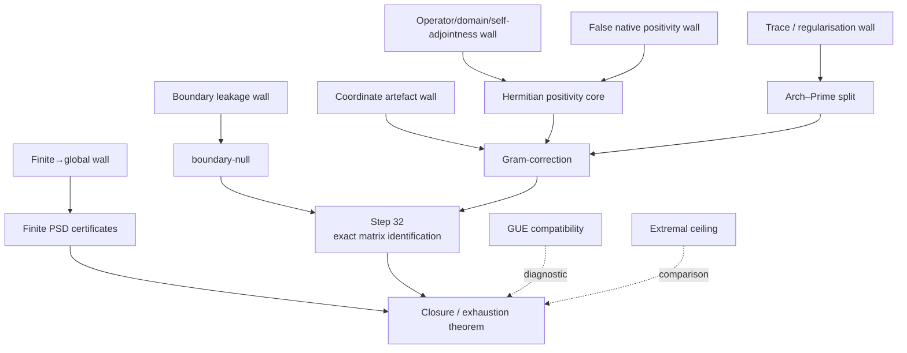
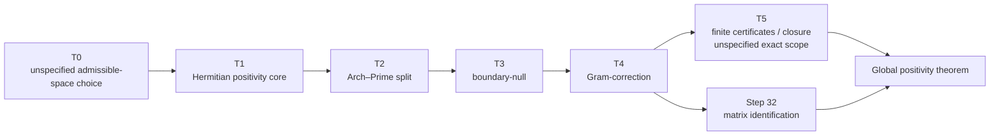

# Ы Q3 Obstruction Atlas for the Riemann Hypothesis Project

## Executive summary

The literature on the entity["scientific_concept","Riemann Hypothesis","zeros of the zeta function lie on the critical line"] does not show a random graveyard of unrelated attempts. It shows a fairly stable **obstruction topology**. The same walls recur under different disguises: failure to produce an exact **self-adjoint** or otherwise spectrally legitimate object; failure to make **positivity** structural rather than postulated; failure to match the **prime-side** and **spectral-side** terms without artefacts; and failure to pass from **local**, **finite**, or **regularised** statements to a genuinely global theorem. The explicit-formula line going back to entity["people","Bernhard Riemann","German mathematician"] and entity["people","André Weil","French mathematician"] is especially important because it isolates the sign problem exactly: **Weil positivity** is equivalent to RH, but the historical difficulty is to realise that positivity in a space where it becomes automatic rather than miraculous. citeturn12view0turn31search1turn33view4

On that background, your Q3 architecture is well targeted in spirit. A **Hermitian positivity core** is the right kind of response to the old **scalar-mirror** and **sign** failures; an **Arch–Prime split** is a plausible response to attempts that try to force all local and global contributions through one monolithic operator; **boundary-null** and **Gram-correction** are exactly the sort of devices one would introduce after seeing how computational or coordinate artefacts contaminate spectral heuristics; and **finite PSD certificates** are a sensible machine-checkable layer on top of an analytic form. Methodologically, that puts Q3 closer to the **explicit-formula / positivity / cohomological** tradition than to brute-force operator guessing. citeturn12view0turn24view0turn29view1turn32search0

The decisive caveat is brutal and simple. On the information available here, the main unresolved wall is still **Step 32**, which I interpret as the exact **matrix-identification theorem**: proving that the Gram-corrected finite/incremental matrix being certified is exactly the intended analytic form, not merely a numerically convincing surrogate. The second decisive wall is **finite-to-global closure**: a suite of finite **positive semidefinite** checks does not by itself imply positivity of the global quadratic form unless you have a rigorous directed-family or closure theorem. In other words, Q3 looks like a serious obstruction-aware programme, but unless **Step 32** and the **closure bridge** are nailed down, it is still an architecture rather than a completed proof. This diagnosis is an inference from the literature’s recurrent failure modes and from the project labels you supplied, not an audit of your current Lean state. citeturn24view0turn26view0turn33view3turn33view4

A useful way to operationalise the atlas is therefore this. Treat each historical programme not as “right” or “wrong”, but as a map of one obstruction class. Then force every Q3 step to answer three questions: **what exact wall does this step neutralise; is it a tactical patch or a strategic change of category; and what theorem remains that would stop an adversarial reviewer from saying the certified matrix is the wrong matrix**? That is the organising principle of the report below. citeturn21search6turn31search10turn33view4

## Scope and source base

The mapping from **T0→T5** to concrete mathematical steps is **not fully specified** in the request, and I was **not able to retrieve an authoritative internal definition** from connected sources during this pass. Accordingly, any T-step labels below are **provisional atlas labels**, built only from the named components you gave: **Hermitian positivity core**, **Arch–Prime**, **boundary-null**, **Gram-correction**, **finite PSD certificates**, and **Step 32**. The tables should therefore be read as a rigorous **research management document**, not as a verified status readout of your codebase.

For the atlas itself, the most useful anchor texts are the original memoir by entity["people","Bernhard Riemann","German mathematician"], the explicit-formula papers of entity["people","André Weil","French mathematician"], the original trace-formula paper of entity["people","Atle Selberg","Norwegian mathematician"], the pair-correlation theorem of entity["people","Hugh Montgomery","American mathematician"], the numerical work of entity["people","Andrew Odlyzko","American mathematician"], the noncommutative/adelic work of entity["people","Alain Connes","French mathematician"] and entity["people","Ralf Meyer","German mathematician"], the entire-function programme of entity["people","Louis de Branges","American mathematician"], the quantum-chaos line of entity["people","Michael Berry","British physicist"] and entity["people","Jonathan Keating","British mathematician"], the cohomological formalism of entity["people","Christopher Deninger","German mathematician"], and the extremal-function survey of entity["people","Jeffrey Vaaler","American mathematician"]. A compact pathfinder is: urlRiemann’s 1859 manuscript and translationturn38search6; urlWeil’s 1952 explicit-formula paperturn37search1; urlSelberg’s 1956 trace-formula paperturn36search0; urlMontgomery’s pair-correlation paperturn1search0; urlOdlyzko’s spacing computationsturn14search5; urlConnes’s trace-formula paperturn2search6; urlMeyer’s spectral interpretationturn28search0; urlde Branges’s 1986 paperturn23search2; urlBerry–Keating’s SIAM Review articleturn16search3; urlDeninger’s Hilbert–Pólya strategy noteturn32search2; urlVaaler’s extremal-functions surveyturn19search3; urlSarnak’s Clay surveyturn31search10; urlConrey’s surveyturn21search6. For Russian-/English-language classical background, keep at hand urlKaratsuba–Voronin, The Riemann Zeta-Functionturn35search0 and urlKaratsuba’s Russian Mathematical Surveys article on the zeta function and its zerosturn35search1.

The **traffic-light** semantics used below are these: **🟢** means the Q3 architecture appears conceptually aligned with the historical wall; **🟡** means the wall is partly targeted but major proof obligations remain; **🔴** means it is a decisive open dependency; **⚪** means it is not yet explicitly native to the pipeline and should be treated as an external diagnostic.

## Chronological obstruction catalogue

Before the catalogue, it helps to name the programmes explicitly. The major lines relevant to Q3 are the **spectral-operator heuristic** associated with entity["people","David Hilbert","German mathematician"] and entity["people","George Pólya","Hungarian mathematician"]; the **explicit-formula / positivity** line of entity["people","André Weil","French mathematician"]; the **trace-formula** analogy stemming from entity["people","Atle Selberg","Norwegian mathematician"]; the **closure/approximation** criterion of Nyman–Beurling and Báez-Duarte; the **entire-function Hilbert space** route of entity["people","Louis de Branges","American mathematician"]; the **pair-correlation / random-matrix** route of entity["people","Hugh Montgomery","American mathematician"] and entity["people","Andrew Odlyzko","American mathematician"]; the **quantum-chaos** route of entity["people","Michael Berry","British physicist"] and entity["people","Jonathan Keating","British mathematician"]; the **adelic/noncommutative** route of entity["people","Alain Connes","French mathematician"] and entity["people","Ralf Meyer","German mathematician"]; and the **Grothendieck-style cohomological** line of entity["people","Christopher Deninger","German mathematician"]. The point of the atlas is not nostalgia. It is to isolate the exact **failure locus** of each. citeturn22view1turn24view0turn29view1turn32search0

| Era | Programme label | Core move | Precise technical failure locus | Why the wall matters for Q3 | Literature anchor |
|---|---|---|---|---|---|
| 1859–1952 | **Explicit-formula / positivity** | Express prime information and zero information in a single **explicit formula**, then recast RH as positivity of a quadratic form. | This is not a failed idea so much as an exact equivalence whose burden is displaced: one must prove positivity for an entire admissible test-function class. The historical gap is the absence of a natural ambient space where that positivity is automatic rather than equivalent-to-RH by fiat. | Q3’s **Hermitian positivity core** is meaningful only if it really realises this form, not a proxy. | citeturn12view0turn31search1 |
| Early–current | **Spectral-operator heuristic** | Find a **self-adjoint operator** whose spectrum is the imaginary parts of the nontrivial zeros. | No canonical operator with the exact zero spectrum, correct domain, and valid boundary conditions is known. Even recent operator proposals openly note that the hard part is not just eigenvalue matching but proving self-adjointness on the imposed domain. | Q3’s strategic benefit is that it can try to replace a guessed operator with a structurally positive form. | citeturn22view2turn22view4 |
| 1950s onward | **Nyman–Beurling closure criterion** | Reformulate RH as a **density / closure** problem in an \(L^2\)-type space generated by dilations of the fractional-part function. | It is an exact criterion, but still “only” an equivalence: the hard part becomes proving density of the required span. Closure never becomes formal for free. | This is directly relevant to Q3’s **finite-to-global closure** risk: finite approximants need a global limit theorem. | citeturn34search6turn34search1 |
| 1956 onward | **Trace-formula analogy** | Use a **Selberg-type trace formula** to interpret zeros spectrally via a Laplacian/automorphic model. | The most famous apparent appearance of zeta ordinates in the spectral list turned out to be a computational artefact from **pseudo cusp forms**. More fundamentally, no genuine trace formula has been produced whose geometric side is the primes and whose spectral side is exactly the zeta zeros. | Q3 should treat all matrix or trace identities as guilty until proven exact; artefacts are historically common. | citeturn24view0turn33view1 |
| 1973–1987 onward | **Pair correlation / GUE statistics** | Use local zero statistics and entity["scientific_concept","Gaussian Unitary Ensemble","random matrix ensemble"] heuristics to constrain any plausible spectral model. | Montgomery’s theorem is conditional on RH and initially support-limited; Odlyzko’s numerics are powerful evidence, not proof. Local statistics do not force every zero onto the line, nor do they supply a positivity theorem. | Q3 must be **compatible** with GUE-like local statistics, but GUE cannot replace Step 32 or global positivity. | citeturn13view0turn13view1turn14search5turn29view2 |
| 1980s onward | **Entire-function Hilbert spaces** | Use **de Branges spaces** and positivity of kernel/shift operators to force zeros onto a line. | Conrey’s survey gives a concrete obstruction: the natural candidate \(E(z)=\xi(1-iz)\) is **not** a de Branges structure function, and Sarnak notes that the positivity condition pursued in later attempts is in fact false. | Q3’s **Hermitian** design is promising precisely because it should not assume the naive de Branges positivity that already fails. | citeturn24view0turn29view1turn30search0 |
| 1980s–2010s | **Extremal majorants/minorants** | Use **Beurling–Selberg** extremal functions to optimise explicit-formula inequalities. | The class is already extremal: Beurling majorants/minorants minimise the \(L^1\) distance within the prescribed bandlimit. The method is superb for sharp bounds, but it has an intrinsic ceiling unless one changes the class or the target functional. | Q3 must demonstrate that its positivity mechanism is not just a reparameterised extremal bound in disguise. | citeturn20view3 |
| 1990s onward | **Quantum-chaos / \(xp\) dynamics** | Model the zeros as energy levels of a quantised chaotic Hamiltonian, especially \(H=xp\). | The line captures the right **mean** spectral density semi-classically, but exact operator realisation and self-adjoint boundary conditions remain unresolved. Conrey states the naive boundary condition one wants is not self-adjoint. | Q3 avoids this by not asking a guessed Hamiltonian to do all the work from the start. | citeturn16search3turn26view0 |
| 1999–2004 onward | **Adelic / noncommutative spectral interpretation** | Interpret zeros as an **absorption spectrum** of an idele-class action and recover the explicit formula as a trace formula. | Connes’s own paper says the original regular representation is not **trace class** and must be regularised; Conrey and Sarnak both stress that positivity/new arithmetic consequences remain unclear. Meyer enlarges the space and gets all zeros into the spectrum, but “spectral interpretation” still does not by itself prove RH. | Q3’s **Arch–Prime** and finite-layer/cutoff logic are relevant here, but only if the regularised finite object is shown to converge to the intended global form. | citeturn33view2turn33view3turn29view1turn26view0 |
| 1990s–2010s onward | **Cohomological / arithmetic-geometry formalism** | Build a Weil-like cohomology over \(\mathrm{Spec}\,\mathbb Z\) so that RH becomes a structural theorem, as over finite fields. | Deninger’s papers are overtly conjectural on this point: for arithmetic schemes over \(\mathbb Z\), the needed cohomology theory with the right positivity and trace properties has not been constructed. | This is the closest large-scale methodological ancestor of a “change the category so positivity is structural” strategy. | citeturn32search0turn32search3 |

Look at the table sideways rather than vertically and the pattern gets cleaner. The historical failures collapse into four recurring wall classes: **identity walls** (is this really the right operator/form?), **sign walls** (where does positivity actually come from?), **regularisation walls** (is the trace/spectrum even legitimate on the chosen space?), and **closure walls** (does finite or local evidence globalise?). If Q3 becomes a durable programme, it will be because it explicitly solves those four classes in that order. citeturn24view0turn33view3turn29view1


The timeline above is not claiming linear dependence; it is showing where the dominant **obstruction vocabularies** enter the story: **closure**, **positivity**, **trace**, **statistics**, **entire-function kernels**, **operator/domain problems**, and **cohomological change of category**. citeturn12view0turn24view0turn29view2turn32search0

## Bypass architecture for the Q3 pipeline

Because the exact T-step definitions were not supplied, the cleanest way to atlas Q3 is to attach the names you gave to provisional roles:

- **T0**: admissible-space choice — **unspecified**.
- **T1**: **Hermitian positivity core** — make non-negativity structural.
- **T2**: **Arch–Prime split** — separate archimedean and prime/local contributions.
- **T3**: **boundary-null** — factor out or annihilate boundary artefacts.
- **T4**: **Gram-correction** — remove coordinate/basis distortions.
- **T5**: finite certification and/or globalisation — **unspecified**.
- **Step 32**: exact **matrix identification** between the certified object and the intended analytic form.

That reading is provisional, but it is already enough to build a serious wall-by-wall dashboard.

| Wall | Historical failure locus | Q3 bypass mechanism | Tactical / strategic | Status | Open task that decides the row | Literature basis |
|---|---|---|---|---|---|---|
| **Magic-operator wall** | Classical spectral heuristics fail at exact operator construction, domain control, or self-adjointness. | Replace “guess the operator” by a **Hermitian positivity core** whose sign is built in before operator reconstruction. | **Strategic** | 🟢 | Show that the positive form really is the intended Weil/Hermitian form, not merely a convenient surrogate. | citeturn22view2turn22view4 |
| **Trace / regularisation wall** | In trace-formula and adelic approaches, the natural action is not immediately **trace class**, so one regularises and then must justify the limit. | **Arch–Prime split** plus finite or companion cutoffs can keep the dangerous pieces explicit instead of hidden. | Tactical turning strategic if globalised | 🟡 | Prove that every cutoff error is controlled uniformly enough to pass to the global form. | citeturn33view3turn29view1 |
| **False native positivity wall** | de Branges-style “obvious” positivity conditions can simply be false for the natural zeta object. | Use an explicitly **Hermitian** construction rather than a scalar or one-sided positivity ansatz. | **Strategic** | 🟢 | Formal theorem that the core is non-negative on the full admissible test class. | citeturn24view0turn30search0 |
| **Prime-side imbalance wall** | Explicit-formula programmes often fail because the prime/local contribution is the uncontrolled part. | **Arch–Prime split** isolates prime penalties, truncation terms, and archimedean compensation explicitly. | Tactical | 🟡 | State and prove exact truncation, Lipschitz, or penalty bounds for the prime side; these are still unspecified here. | citeturn12view0turn33view2 |
| **Boundary leakage wall** | Boundary conditions or residual terms create fake spectral behaviour or destroy operator legitimacy. | **boundary-null** aims to project out or annihilate the dangerous boundary component. | Tactical | 🟡 | Prove that the null space is the *exact* boundary obstruction and that no wanted mass is removed with it. | citeturn26view0turn33view3 |
| **Coordinate artefact wall** | Selberg-style pseudo-eigenvalues and many numerical models show that the wrong coordinate realisation can look convincing. | **Gram-correction** is the right first defence against basis artefacts. | Tactical | 🟡 | Prove basis invariance and certify that Gram-correction commutes with the analytic form, not only with numerics. | citeturn24view0turn33view1 |
| **Matrix-identification wall** | If the certified matrix is not proved equal to the target analytic form, all PSD evidence is evidence for the wrong object. | **Step 32** should be the exact theorem identifying the corrected matrix with the analytic Weil/Hermitian form. | **Strategic** | 🔴 | This is the main missing theorem on the information available here. It must be stated and formalised as a named lemma/theorem, not left implicit. | Historical warning from pseudo-cusp artefacts and false positivity: citeturn24view0turn33view4 |
| **Finite-to-global wall** | Finite principal minors, finite cutoffs, or bounded-support tests do not automatically imply global positivity. | **finite PSD certificates** are valuable only if paired with a **directed-family** or closure theorem. | Strategic | 🔴 | Prove monotone exhaustion / closability / continuity so that finite PSD implies positivity of the full quadratic form. | citeturn31search1turn33view3 |
| **GUE compatibility wall** | Local zero statistics are a real constraint on any spectral surrogate. | External audit against **GUE**-type diagnostics. | Diagnostic, not a proof step | ⚪ | Build an explicit statistical compatibility test suite. | citeturn13view1turn14search5turn29view2 |
| **Extremal ceiling wall** | The classical Beurling–Selberg class is already optimal for its \(L^1\) objective/support constraint. | Show that the Q3 core changes the objective class — **positivity**, not mere extremality. | Strategic if proved, otherwise none | ⚪ | Produce a formal comparison theorem saying “Q3 positivity is not reducible to a Beurling–Selberg extremal bound”. | citeturn20view3 |
| **Sociological validation wall** | Novel RH programmes fail socially unless the validation burden is moved from authority to artefact. | Public atlas, reproducible numerics, independent readers, and formalisation in urlmathlib / Lean documentationturn27search0. | Deployment strategy | 🟡 | Tie every wall to named Lean lemmas and reproducible notebooks so reviewers can audit objects, not prose. | citeturn27search5turn27search13turn27search17 |

The strong structural suggestion from this dashboard is that **Gram-correction** and **Step 32** should not be kept mentally separate. **Gram-correction** is the **tactical** answer to coordinate dependence; **Step 32** is the **strategic** theorem that proves the corrected coordinates still represent the right analytic object. Historically, when those two are not coupled, the literature produces false positives, pseudo-spectra, or positivity claims for the wrong kernel. citeturn24view0turn33view4



The diagram shows the real topological shape of the programme. **Step 32** is not merely one item in a checklist; it is the node where **Hermitianity**, **boundary handling**, and **coordinate correction** all have to terminate in one exact identity. If that node fails, downstream **finite PSD** work becomes untrustworthy. If it succeeds, Q3 gains a genuinely novel strategic profile. citeturn24view0turn33view3

## Additional obstructions and validation risks

The first extra wall that deserves explicit elevation is **GUE compatibility**. The local bulk statistics of high zeta zeros are strongly consistent with the **Montgomery–Odlyzko law**, and Sarnak’s summary is blunt: high-zero local fluctuations behave like those of the **Gaussian Unitary Ensemble**. At the same time, later surveys stress that lower-order corrections are **arithmetic**, not universal random-matrix noise. So the right lesson for Q3 is not “derive RH from GUE” — that is fake — but “do not build a surrogate spectral object whose unfolded spacing statistics are violently incompatible with GUE/CUE expectations once finite-size effects are discounted”. This is a **compatibility** obligation, not a proof avenue. citeturn13view1turn14search5turn17view0turn29view2

The second extra wall is the **Selberg–Beurling extremal ceiling**. The relevant fact is not vague. In the classical bandlimited class, Beurling’s majorants/minorants are already **optimal** for the sign function, and Selberg’s interval majorants/minorants inherit that extremality. Modern explicit-formula bounds for \(S(t)\), \(\log |\zeta(1/2+it)|\), and pair-correlation quantities exploit precisely that optimality. So if Q3 claims a stronger positivity certificate than these methods, it must say exactly *where the problem class has changed*: different function space, different objective, stronger symmetry, or a genuinely different positivity notion. Otherwise a decent reviewer will conclude that the argument is still trapped inside the old extremal box. citeturn20view3

The third extra wall is the one you already suspected: **coordinate wall** and **matrix-identification wall** are better treated as **one obstruction with two layers**. The tactical layer is **coordinate invariance**: Gram-correct the basis so positivity is not an artefact of a poor coordinate choice. The strategic layer is **analytic identity**: prove that the corrected matrix is still the right matrix. Historically, Selberg-style pseudo-eigenvalue incidents and false native positivity in de Branges-type directions are warnings against separating these two too casually. Q3 should therefore name the wall explicitly as **Coordinate / Matrix Identification**, with **Gram-correction** as the tactical bypass and **Step 32** as the strategic bypass. citeturn24view0turn33view4

The fourth extra wall is **finite-to-global closure risk**, and it is not optional. Any route that leans on finitely many principal minors, truncated prime sets, finite-rank matrices, or bounded-support test families must prove the closure theorem that globalises them. The analogy with Connes is instructive: the natural representation is not trace class, so the theory proceeds through regularised cutoffs and then must justify the passage to the limit. Q3 should assume from day one that a reviewer will ask: “Which topology? Which exhaustion? Which continuity estimate? Which compactness or monotone-convergence theorem?” Until that is written as a theorem, every finite PSD success remains local evidence. citeturn33view3turn31search1

The fifth extra wall is **sociological validation**. This is not mathematics in the narrow sense, but ignoring it is amateur hour. The antidote is excellent, though: convert a social-trust problem into an artefact-trust problem. The current formal-maths ecosystem already supports large-scale, computer-verifiable mathematics, and the whole point of **Lean** plus **mathlib** is to make complex proof objects auditable at scale. For Q3 that means: every wall gets a named note, every bypass gets a named theorem, every numerical diagnostic gets a reproducible script, and every “we believe” sentence gets either a proof obligation or a benchmark. citeturn27search1turn27search5turn27search13turn27search17

## Markdown scaffold for the atlas

The atlas should live as a small **knowledge graph**, not as one heroic monolith. Since you want it ready for an urlObsidianhttps://obsidian.md vault, the right pattern is an index note, one note per wall, one note per pipeline step, and one dashboard note that rolls the statuses up.

### Recommended vault layout

```text
Q3-Atlas/
  Atlas Index.md
  Dashboard.md
  Timeline.md
  Obstruction Topology.md
  Pipeline Flow.md
  Walls/
    Magic Operator Wall.md
    Trace Regularisation Wall.md
    False Native Positivity Wall.md
    Prime Side Wall.md
    Boundary Leakage Wall.md
    Coordinate Matrix Identification Wall.md
    Finite to Global Closure Wall.md
    GUE Compatibility Wall.md
    Extremal Ceiling Wall.md
    Sociological Validation Wall.md
  Steps/
    T0 Admissible Space.md
    T1 Hermitian Positivity Core.md
    T2 Arch Prime Split.md
    T3 Boundary Null.md
    T4 Gram Correction.md
    T5 Finite Certificates and Closure.md
    Step 32 Matrix Identification.md
  Lean/
    Lemma Index.md
    HermitianSquare_nonneg.md
    ArchPrime_split.md
    BoundaryNull_projection.md
    GramCorrection_basis_invariant.md
    FinitePSD_principal_minor.md
    DirectedFamily_limit_psd.md
    Step32_matrix_identification.md
  Numerics/
    GUE Diagnostics.md
    Extremal Comparisons.md
    Gram Stability.md
    Prime Truncation Error.md
```

### Wall-note template

```markdown
---
title: "{{wall_name}}"
aliases:
  - "Q3/{{short_id}}"
tags:
  - q3
  - obstruction
  - rh
  - atlas
status: red | yellow | green | white
priority: P0 | P1 | P2
owner: "{{owner}}"
eta: "{{eta}}"
last_reviewed: "{{yyyy-mm-dd}}"
pipeline_steps:
  - [[T1 Hermitian Positivity Core]]
  - [[T2 Arch Prime Split]]
  - [[T3 Boundary Null]]
  - [[T4 Gram Correction]]
  - [[T5 Finite Certificates and Closure]]
  - [[Step 32 Matrix Identification]]
lean_links:
  - [[Lean/HermitianSquare_nonneg]]
  - [[Lean/Step32_matrix_identification]]
numeric_links:
  - [[Numerics/Gram Stability]]
  - [[Numerics/GUE Diagnostics]]
---

# {{wall_name}}

## Description
One-paragraph explanation of the wall in plain English.
What breaks, and why a reviewer should care.

## Failure locus
- Exact theorem / construction / identity where the historical programme stalls.
- Whether the failure is:
  - **identity**
  - **positivity**
  - **regularisation**
  - **closure**
  - **statistics**
  - **social validation**

## Historical programmes affected
- [[Spectral operator heuristic]]
- [[Trace-formula analogy]]
- [[Entire-function Hilbert spaces]]
- [[Adelic spectral interpretation]]
- [[Extremal majorants and minorants]]

## Q3 bypass
### Tactical bypass
What patch or local mechanism addresses the symptom.

### Strategic bypass
What theorem changes the category so the wall disappears structurally.

## Evidence
### Literature
- Key primary papers
- Best survey references
- One-sentence takeaway from each

### Internal maths
- Statement of the project theorem meant to neutralise the wall
- Dependencies
- Hidden assumptions

### Numerics
- What was tested
- What passed
- What remains fragile

## Lean artefacts
- [[Lean/HermitianSquare_nonneg]]
- [[Lean/BoundaryNull_projection]]
- [[Lean/GramCorrection_basis_invariant]]
- [[Lean/Step32_matrix_identification]]

## Open tasks
- [ ] Write exact theorem statement
- [ ] Prove finite version
- [ ] Prove basis invariance
- [ ] Prove limit / closure theorem
- [ ] Add numerical regression tests
- [ ] Add reviewer-facing explanation

## Failure signal
What observation would show the bypass is not actually working.

## Decision
Keep / redesign / split the wall / merge with another wall.
```

### Dashboard template

```markdown
---
title: "Q3 Dashboard"
tags: [q3, dashboard, atlas]
---

# Q3 Dashboard

## Traffic light legend
- 🟢 conceptually aligned and theorem path is clear
- 🟡 partly addressed, proof obligations remain
- 🔴 decisive open dependency
- ⚪ external audit item, not yet native to pipeline

## Current wall table
| Wall | Status | Strategic theorem | Tactical theorem | Review note |
|---|---|---|---|---|
| [[Magic Operator Wall]] | 🟢 | [[T1 Hermitian Positivity Core]] | [[T4 Gram Correction]] | Sign moved from guessed operator to Hermitian form |
| [[Trace Regularisation Wall]] | 🟡 | [[T2 Arch Prime Split]] | [[T5 Finite Certificates and Closure]] | Need cutoff → global theorem |
| [[Coordinate Matrix Identification Wall]] | 🔴 | [[Step 32 Matrix Identification]] | [[T4 Gram Correction]] | Main current risk |
| [[Finite to Global Closure Wall]] | 🔴 | [[T5 Finite Certificates and Closure]] | [[Lean/DirectedFamily_limit_psd]] | Certificates still finite |
| [[GUE Compatibility Wall]] | ⚪ | [[Numerics/GUE Diagnostics]] | [[Numerics/GUE Diagnostics]] | Diagnostic only |

## Weekly review
- What turned greener this week?
- What new hidden assumption appeared?
- Which note changed from tactical to strategic?
```

### Pipeline-index template

```markdown
# Step 32 Matrix Identification

## Statement
Exact theorem identifying the Gram-corrected matrix with the intended analytic Weil/Hermitian form.

## Inputs
- [[T1 Hermitian Positivity Core]]
- [[T2 Arch Prime Split]]
- [[T3 Boundary Null]]
- [[T4 Gram Correction]]

## Outputs
- equality of matrix models
- basis invariance
- ready-for-PSD certificate object

## Lean artefacts
- [[Lean/Step32_matrix_identification]]
- [[Lean/GramCorrection_basis_invariant]]

## Open questions
- Which function class?
- Which topology?
- Which normalisation?
- Which truncation/exhaustion?
```

The key discipline here is that every wall note must end with a **failure signal**. If you do not write down what falsifies the bypass, the atlas degenerates into self-congratulation. The whole point is to build a **threat model** for the proof architecture. That is exactly the right genre. 



The pipeline figure should be stored twice: once in the main atlas and once in the dashboard note. The reason is simple. If the logical dependency graph changes, that is itself project news.

## Recommended experiments and visualisations

The experiments below are not cosmetic. Each one is attached to a specific historical wall.

| Experiment / analysis | Question it answers | Success condition | Failure signal | Historical wall addressed |
|---|---|---|---|---|
| **Step 32 residual audit** | Does the certified matrix equal the intended analytic matrix entrywise? | Residuals decay to numerical noise across bases, cutoffs, and normalisations. | Residuals stabilise away from zero or depend on basis choice. | Coordinate / matrix identification |
| **Gram-stability diagnostics** | Is positivity stable under basis change, orthonormalisation, and truncation? | Eigenvalue signs are invariant under reasonable basis changes; condition numbers stay controlled. | PSD appears only in one coordinate frame or collapses under mild perturbation. | Coordinate artefacts |
| **Finite-to-global convergence study** | Do finite PSD certificates converge along a directed family to a global positive form? | Minimal eigenvalue lower bounds are monotone or converge with proved error bars. | Certificates oscillate, drift negative, or depend unpredictably on exhaustion route. | Closure wall |
| **Arch–Prime balance tests** | Are archimedean and prime/local contributions separately controlled? | Truncation tails and penalty terms obey rigorous asymptotic/error bounds. | Prime-side error is of the same size as the claimed positivity margin. | Prime-side wall |
| **GUE compatibility suite** | Does the candidate spectral/formal object contradict bulk zero statistics? | Unfolded nearest-neighbour spacing, pair correlation, and number variance are consistent with GUE after finite-size correction. | Strong persistent deviation unexplained by arithmetic corrections or finite height. | GUE wall |
| **Extremal-function comparison** | Is the Q3 core genuinely stronger than classical Beurling–Selberg machinery? | A precise theorem or experiment shows the positivity certificate is not reducible to an extremal majorant/minorant in the same class. | The “new” mechanism numerically reproduces only classical extremal bounds. | Extremal ceiling |
| **Boundary-null ablation test** | Is boundary-null removing only poison, not substance? | Removing the boundary component improves stability without shifting the intended form. | Essential mass or key identities disappear with the boundary-null projection. | Boundary leakage |
| **Lean milestone ladder** | Which proof obligations are formalised and which remain prose? | Theorems are formalised in dependency order with no hidden “axiom islands”. | Core claims rely on unchecked assumptions or isolated wrappers. | Sociological validation |

The **GUE** suite should include at least **nearest-neighbour spacing**, **pair correlation**, and **number variance** on the unfolded spectrum or on the matrix surrogate if that is what Q3 naturally produces. The point is not to prove RH statistically; the point is to test whether your candidate object even lives in the right universality class. That requirement is motivated by the classical theorem of Montgomery, the numerical work of Odlyzko, and the later synthesis by Sarnak and Bourgade–Keating. citeturn13view1turn14search5turn17view0turn29view2

The **extremal-function** comparison should be explicit and somewhat ruthless. Take the same support constraints and the same objective functional used in the classical Beurling–Selberg setting, then compare the Q3 certificate against the known extremisers. If your certificate only matches what the classical extremiser already attains, the story is not “new positivity”; it is “old extremality in new clothes”. The literature practically begs you to make this comparison because it already tells you the old class is optimal. citeturn20view3

The **formal Lean milestone** sequence should be short, strict, and dependency-driven. A sensible order is: first formalise the **Hermitian-square non-negativity** theorem; then the **Arch–Prime decomposition**; then **boundary-null exactness**; then **Gram basis-invariance**; then the finite **PSD** criterion; then the directed-family or closure theorem; and only then the full **Step 32 matrix-identification theorem**. Do not allow Step 32 to remain a narrative bridge while the rest is formalised. In this atlas, Step 32 is the bridge. citeturn27search0turn27search5turn27search17

The most useful visualisations are not decorative plots but **failure-sensitive diagnostics**: a **traffic-light dashboard** for walls and steps; a **residual heatmap** for matrix-identification errors; a **condition-number versus cutoff** plot for Gram stability; a **minimal eigenvalue versus exhaustion level** plot for finite-to-global closure; a three-panel **GUE diagnostic board** for spacing, pair correlation, and number variance; and a **dependency DAG** showing which Lean lemmas gate which walls. These visualisations convert vague progress into reviewer-legible progress. They also make it harder to lie to yourself, which is the entire point of an obstruction atlas.