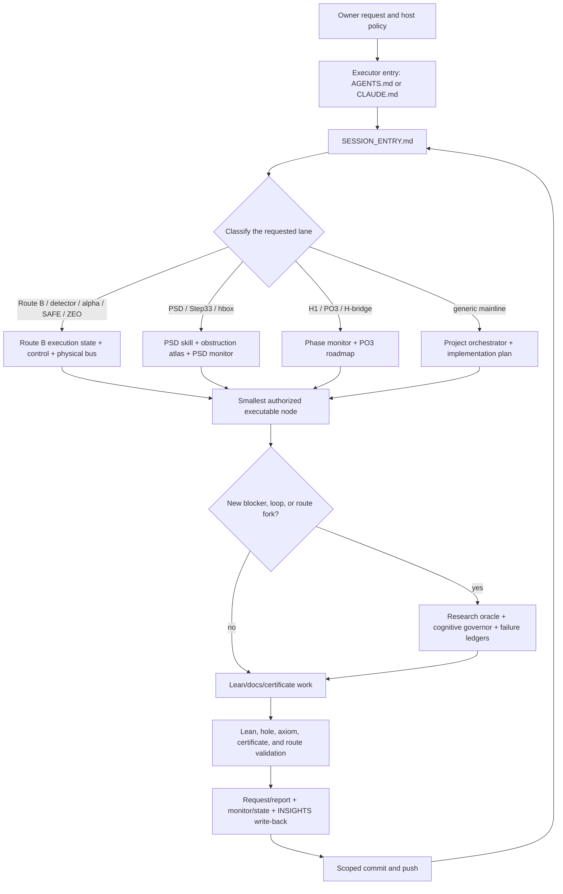

# Codex Session Bootstrap and Control-Plane Contour for Mythos

Date: 2026-08-04 (Europe/Berlin)

## Verdict

`CODEX_SESSION_CONTOUR_MATERIALIZED`

The Q3 session loop is not one prompt and not one state file.  It is a layered,
file-addressed control plane.  The reproducible part is now mapped below.

This document inventories every file family that can select work, constrain a
proof transaction, preserve learned failures, validate a result, or receive
canonical write-back.  It intentionally does **not** enumerate every Lean
source file or generated numerical payload; those are task inputs selected by
the current request node.

Host safety policy, the current Codex plan/cursor, UI state, and local Codex
memory are outside Git.  They may constrain execution or help continuity, but
they are not mathematical or Route B authority.  No hidden model state is
needed to recover the project from disk.

## One-screen topology



## Authority order

The same file can be useful without being allowed to select the next action.
Use this order when two documents appear to disagree.

1. The owner's current request and host safety rules define authorization and
   the outer task boundary.  They are not proof evidence.
2. `AGENTS.md` is the Codex repo instruction surface.  `CLAUDE.md` is the
   parallel Mythos/Claude entry surface.  Both route into the same project
   control plane.
3. `SESSION_ENTRY.md` is the single session entry.  It is a symlink to
   `q3.lean.aristotle/ACTIVE/SESSION_ENTRY.md`.
4. A scope-specific execution selector outranks generic monitors for that
   scope:
   - Route B: execution JSON, execution control, physical bus, and checker;
   - PSD Step33: PSD monitor and its current request;
   - H1/PO3: phase monitor and PO3 roadmap;
   - otherwise: project orchestrator and root implementation queue.
5. `q3.lean.aristotle/PROJECT_ORCHESTRATOR.md` decides global gate state and
   keeps Route B classified as `CHALLENGER / NOT_RH`.
6. Lean-checked declarations decide formal theorem truth.  A prose verdict,
   green build, numerical experiment, Proshka answer, or database row cannot
   replace statement inspection and an axiom/hole audit.
7. Generated graphs, metrics, embeddings, and local memories are advisory and
   may lag.  Their timestamps must be checked before use.

For Route B specifically, disk wins.  A physical unanswered numbered bus goal
preempts non-bus work.  The checker and live execution state must agree before
any state claim is made.

## Exact new-session cycle

### 0. Establish the checkout without mutating it

- Canonical macOS root: `/Users/emalam/GitHub/rh_lean_01_2026`.
- Confirm branch, HEAD, upstream relation, and `git status`.
- Preserve unrelated and untracked files.  `untracked` means only “not tracked
  by Git”; it does not mean disposable or foreign.
- Resolve compatibility paths:
  - `SESSION_ENTRY.md -> q3.lean.aristotle/ACTIVE/SESSION_ENTRY.md` through the
    root `ACTIVE` symlink;
  - `full/q3.lean.aristotle -> q3.lean.aristotle`.

### 1. Load the executor and session entries

Codex reads:

1. `AGENTS.md`;
2. `SESSION_ENTRY.md`;
3. any triggered repo skill under `.agents/skills/`.

Mythos/Claude reads `CLAUDE.md`, then the same `SESSION_ENTRY.md`.  This is why
the two executor bodies can share one disk protocol without sharing runtime
memory.

### 2. Classify the task before opening a generic monitor

#### Route B selector

If the request mentions Route B, detector, alpha/SAFE, ZEO, the two-level
spectral ladder, or the Lamport roof campaign, read in this order:

1. `q3.lean.aristotle/ACTIVE/requests/routeB_twolevel_spectral_ladder/ROUTE_B_EXECUTION_STATE.json`
2. `q3.lean.aristotle/ACTIVE/requests/routeB_twolevel_spectral_ladder/ROUTE_B_EXECUTION_CONTROL.md`
3. `q3.lean.aristotle/ACTIVE/requests/routeB_twolevel_spectral_ladder/ROUTE_B_STATE.md`
4. `q3.lean.aristotle/ACTIVE/requests/routeB_twolevel_spectral_ladder/bus/BUS_PROTOCOL.md`
5. the physical `.../bus/` directory
6. `python3 .../routeb_status.py --check`

Selection rule:

- execute the smallest physical `NNN_*.goal.md` without a matching answer;
- if none exists, obey the live execution state and scheduler contract;
- `OWNER_AUTHORIZED_AUTORUN` permits only an eligible leaf already present in
  `ACTIVE/requests/routeB_lamport_rh_closure/`; it does not authorize Codex to
  mint the next numbered bus goal;
- a current explicit pause/stop code still blocks selection until its named
  actor or transaction acts;
- Bus `010` remains VOID unless the owner/Mythos creates a valid physical goal.

#### PSD Step33 selector

If the request mentions PSD-pd, Step32/33, B-splines, entry hboxes, or finite
certificates, read:

1. `.agents/skills/q3-psdpd-step33-bootstrap/SKILL.md`;
2. `Q3_OBSTRUCTION_ATLAS.md`;
3. `q3.lean.aristotle/ACTIVE/PSD_STEP33_MONITOR.md`;
4. `q3.lean.aristotle/ACTIVE/requests/step33_bootstrap/node.md`;
5. its report and the latest Step33 entries in `docs/INSIGHTS.md`.

The compatibility skill `.agents/skills/q3-step32-lean/SKILL.md` redirects old
Step32 language to this live Step33 path.  It prevents reopening closed
Arch-integrability work or entering the row-by-row scalar replay swamp.

#### H1/PO3 selector

If the request explicitly concerns H1, PO3, H-bridge, or route-kill work, use:

1. `q3.lean.aristotle/ACTIVE/PHASE_MONITOR.md` if active;
2. `q3.lean.aristotle/docs/PO3_MAINLINE_ROADMAP.md`;
3. `q3.lean.aristotle/ACTIVE/graphs/ROUTE_KILL_REGISTRY.md`;
4. the current request/report named by the monitor.

`PHASE_MONITOR.md` is currently `PARKED`; it must not steal a Route B or PSD
task merely because it contains an old `current_step_id`.

#### Sprint and generic fallback

Use `q3.lean.aristotle/ACTIVE/SPRINT_MONITOR.md` only when it is `ACTIVE` and no
higher-priority scoped selector applies.  It is currently `DONE`.

For generic mainline work, use:

1. `q3.lean.aristotle/PROJECT_ORCHESTRATOR.md`;
2. `IMPLEMENTATION_PLAN.md`;
3. `q3.lean.aristotle/docs/PAPER_MAINLINE_TRACKER.md`;
4. `q3.lean.aristotle/docs/INSIGHTS.md`.

### 3. Resolve the exact executable object

Before proof work:

- name the exact theorem, axiom, certificate, or documentation contract;
- locate every direct consumer and the route gate it feeds;
- read the current request node and only its listed supporting files;
- fix write ownership and the write-back target;
- inspect the current source statement instead of trusting a status label;
- register any auxiliary object before running cases when K6 applies.

This is where the file-based request/report protocol prevents chat context from
silently changing the theorem.

### 4. Run the research and anti-loop layer only when triggered

For a new blocker, the required sequence is:

1. 3–5 local semantic queries through
   `q3.lean.aristotle/scripts/research_oracle.py` against `q3_docs` (and
   `math_papers`/`zotero_lib` when relevant);
2. a short primary-source web check;
3. a 5–10 line theorem-shaped synthesis with exact file/lemma pointers;
4. write the synthesis to `q3.lean.aristotle/docs/INSIGHTS.md` before
   implementation.

If a loop stalls, a theorem shape forks, or repeated work is not shrinking the
unknown, additionally read:

- `q3.lean.aristotle/COGNITIVE_KERNEL.md`;
- `q3.lean.aristotle/COGNITIVE_OPERATORS.md`;
- `q3.lean.aristotle/ACTIVE/COGNITIVE_GOVERNOR.md`;
- `q3.lean.aristotle/ACTIVE/FAILED_STRATEGIES.yaml`.

The governor is advisory.  Its Proshka/UI snapshots can be stale; its durable
value is the progress audit, escape operators, and rule against repeating a
killed strategy.

### 5. Implement the smallest node

- Lean work remains inside the request's declared files and route boundary.
- Documentation-only goals do not authorize Lean or route-state changes.
- Numerical work may falsify, calibrate, or certify its finite claim, never
  occupy an unproved universal quantifier.
- External reviewers propose theorem shapes or attack them; they do not write
  proof truth into the mainline.

### 6. Validate in proportion to the claim

For a touched Lean file:

1. `lake env lean <file>` from `q3.lean.aristotle/`;
2. `scripts/q3_check.sh <file>` from repo root;
3. `rg -n 'sorry|exact\?|admit' <file>`;
4. inspect `#print axioms` for the exact exported theorem;
5. run a target or full `lake build` when the dependency risk warrants it.

For the main chain, `q3.lean.aristotle/scripts/check_axioms.sh` performs the
larger philosophy/audit suite.  For Route B, also rerun
`routeb_status.py --check`.  Certificate goals additionally require exact
hash, endpoint, and independent-replay checks specified by their goal.

### 7. Write back in authority order

The canonical order is:

1. Lean/certificate or exact answer artifact;
2. canonical request report or `NNN_*.answer.md`;
3. required mirror under `docs/routeB_bus/`;
4. active scoped monitor/execution state if and only if the gate changed;
5. `ROUTE_B_STATE.md` last for Route B ledger updates;
6. `docs/INSIGHTS.md` synthesis and route-kill/failure entries;
7. global orchestrator/plan only if the global stage actually changed.

“Keep `EXECUTION_STATE` in sync at every gate” means every semantic scheduler
transition must be reflected before handoff.  It does **not** mean mutating
execution state for a read-only inventory whose contract explicitly preserves
route state.  Goal 054 is such a case.

Canon and mirror are committed together.  Commit messages use the checked OS
and branch prefix, for example `[MacOS][rh_clean][Docs] ...`.  Push only after
the staged diff contains exactly the intended files.

## File inventory by layer

### A. Bootstrap and invariant policy

| File | Function | Authority |
| --- | --- | --- |
| `AGENTS.md` | Codex repo bootstrap, route selectors, validation, style, safety | operational policy |
| `CLAUDE.md` | Mythos/Claude bootstrap into the same control plane | operational policy for that executor |
| `SESSION_ENTRY.md` | single session router; symlink to active entry | startup authority |
| `q3.lean.aristotle/ACTIVE/SESSION_ENTRY.md` | canonical session-entry content | startup authority |
| `q3.lean.aristotle/PROJECT_WORKFLOW.md` | request/report, Aristotle, Proshka, validation, and commit workflow | operational protocol |
| `q3.lean.aristotle/PHILOSOPHY_OF_PROOF.md` | allowed claim and axiom classification | proof-policy authority |
| `Q3_OBSTRUCTION_ATLAS.md` | current PSD walls and anti-swamp rules | scoped guidance |
| `.agents/skills/q3-psdpd-step33-bootstrap/SKILL.md` | active PSD Step33 bootstrap recipe | triggered scoped policy |
| `.agents/skills/q3-step32-lean/SKILL.md` | legacy Step32 redirect | compatibility policy |
| `.codex/config.toml` | native subagent depth/thread limits | local agent configuration |
| `.codex/agents/q3-worker.toml` | narrow execution-worker role | delegated worker policy |
| `.codex/agents/q3-researcher.toml` | one-blocker research role | delegated worker policy |
| `.codex/agents/q3-lean-worker.toml` | Lean/Aristotle integration role | delegated worker policy |
| `q3.lean.aristotle/ACTIVE/AGENT_PROTOCOL.md` | request → worker → report → ingest contract | multi-agent coordination |

### B. Global architecture and human-readable state

| File | Function | Authority |
| --- | --- | --- |
| `q3.lean.aristotle/PROJECT_ORCHESTRATOR.md` | global gate state, frontier, blockers, precedence | global project source of truth |
| `IMPLEMENTATION_PLAN.md` | one active execution item plus bounded queue | generic queue only |
| `q3.lean.aristotle/docs/PO3_MAINLINE_ROADMAP.md` | canonical status-aware PO3 ladder | H-bridge scoped authority |
| `q3.lean.aristotle/docs/PAPER_MAINLINE_TRACKER.md` | manuscript typing and dependency crosswalk | manuscript authority |
| `q3.lean.aristotle/PROJECT_ASCII.md` | compact diagram/status view | derived summary |
| `q3.lean.aristotle/docs/INSIGHTS.md` | reviewed accumulated synthesis | knowledge ledger, non-selector |
| `q3.lean.aristotle/TRICKS_LIBRARY.md` | reusable Lean patterns and pitfalls | advisory technique memory |
| `q3.lean.aristotle/FORMALIZATION_STATS.md` | generated metrics snapshot | metrics only; may be stale |

### C. Route B scheduler, proof DAG, and mirror

| File/family | Function | Authority |
| --- | --- | --- |
| `.../ROUTE_B_EXECUTION_STATE.json` | live Route B scheduler state and stop code | scoped execution authority |
| `.../ROUTE_B_EXECUTION_CONTROL.md` | allowed transitions and current control contract | scoped transition authority |
| `.../ROUTE_B_STATE.md` | verified Route B facts/history/arsenal ledger | state ledger |
| `.../bus/BUS_PROTOCOL.md` | bus selection and autorun rules | scheduler protocol |
| `.../bus/NNN_*.goal.md` and answers | immutable physical bus transactions | executable bus authority |
| `.../routeb_status.py` | read-only reconciliation of state and disk | consistency checker |
| `.../loop_state.json` | legacy compatibility mirror | never selects a gate |
| `q3.lean.aristotle/docs/ROUTE_B_THEOREM_CONTRACT_v2.md` | canonical Route B target DAG contract | theorem-contract authority |
| `ACTIVE/requests/routeB_lamport_rh_closure/MASTER_GOAL.md` | canonical-roof master objective | master-DAG contract |
| `ACTIVE/requests/routeB_lamport_rh_closure/*.goal.md` / `*.answer.md` | authorized non-bus Lamport leaves and evidence | leaf contracts/results |
| `ACTIVE/requests/routeB_lamport_rh_closure/ROUTE_B_DATA_MANIFEST.md` | source/certificate inventory | provenance ledger |
| `docs/routeB_bus/` | public mirror and reviewer handoff surface | mirror, not selector |

The `...` prefix in the first seven rows is
`q3.lean.aristotle/ACTIVE/requests/routeB_twolevel_spectral_ladder`.

### D. PSD, H-bridge, and sprint monitors

| File/family | Function | Authority |
| --- | --- | --- |
| `ACTIVE/PSD_STEP33_MONITOR.md` | live PSD Step33 `current_step_id`, request, blockers | PSD operational truth |
| `ACTIVE/requests/step33_bootstrap/node.md` | exact current PSD task contract | PSD executable node |
| `ACTIVE/requests/step33_bootstrap/report.md` | canonical PSD worker/result ingest | PSD result ledger |
| `ACTIVE/PHASE_MONITOR.md` | H1/PO3 phase state | only when `ACTIVE` or explicitly selected |
| `ACTIVE/SPRINT_MONITOR.md` | sprint state | only when `ACTIVE` and no scoped override |
| `ACTIVE/graphs/ROUTE_KILL_REGISTRY.md` | killed theorem shapes and rollback points | canonical route-death ledger |

All `ACTIVE/...` paths in this table are below `q3.lean.aristotle/`.

### E. Cognitive, arsenal, and “do not repeat” memory

| File | Function |
| --- | --- |
| `q3.lean.aristotle/COGNITIVE_KERNEL.md` | progress audit and EscapeLoop trigger |
| `q3.lean.aristotle/COGNITIVE_OPERATORS.md` | representation, receiver, certificate, and bisection escape operators |
| `q3.lean.aristotle/ACTIVE/COGNITIVE_GOVERNOR.md` | active watchdog; advisory snapshots must be freshness-checked |
| `q3.lean.aristotle/ACTIVE/FAILED_STRATEGIES.yaml` | structured registry of killed/avoided strategies, causes, and next moves |
| `q3.lean.aristotle/ACTIVE/pipeline/FAILURE_ATLAS.json` | graph-facing failure metadata |
| `q3.lean.aristotle/ACTIVE/pipeline/ALTERNATIVE_PATHS.json` | registered alternatives for specific gaps |
| `q3.lean.aristotle/ACTIVE/pipeline/RISK_MODEL.json` | taint/risk weights and kill threshold |
| `docs/EXECUTOR_ARSENAL_ADDENDUM_2026-08-04.md` | thin executor rules: card ID, autopsy, pre-commit, ledger |
| `q3.lean.aristotle/docs/PROJECT_INSTRUCTIONS_v3_arsenal.md` | K1–K9 reasoning/rigor kernel |
| `q3.lean.aristotle/docs/ARSENAL_CARDS_v1.md` | reusable proof-mechanism card deck |
| `docs/routeB_bus/proshka/ARSENAL_MANDATE_2026-08-04.md` | Proshka breaker/arsenal mandate |

### F. Research, embeddings, and external-claim quarantine

| File/family | Function |
| --- | --- |
| `q3.lean.aristotle/ACTIVE/pipeline/PIPELINE_GUIDE.md` | discovery → taint/risk → proof workflow |
| `.../RESEARCH_ORACLE.md` and `RESEARCH_ORACLE.json` | semantic-search procedure and collection config |
| `.../oracle_questions/INDEX.md` | addressed query registry |
| `.../oracle_questions/BY_ADDRESS.md` | proof-tree address lookup |
| `.../oracle_questions/TEMPLATE.md` | new query contract |
| `.../oracle_questions/VOCAB_MAP.md` | generated strong/empty/false association vocabulary by proof-tree address |
| `.../PAPER_INDEX.json` | external source provenance registry |
| `.../EQUIVALENCE_GRAPH.json` | external claims/relations; speculative until formal gate |
| `.../ALIGNMENT_MAP.json` | external-to-Lean target alignments |
| `.../EXTERNAL_GRAPH_SCHEMA.md` | schema for external claims and status |
| `.../EXTERNAL_PIPELINE.md` | formal DAG plus literature DAG loop |
| `.../TAINT_ANALYSIS.md` | propagation/risk model explanation |
| `.../ALTERNATIVE_PATHS.md` | human-readable alternative-route view |
| `.../HEADER_TEMPLATE.md` | standard link-first header for active documents |
| `.../PROSHKA_REASONING_TIME_LOG.md` | measured Proshka send-to-complete durations and `Answer now` observations |
| `.../ZOTERO_MISSING_CACHE.md` | generated missing-full-text snapshot; freshness must be checked |
| `.../codex_agent_loop_notes.md` | explanatory note on the generic inference/tool/compaction loop, not project state |
| `.../PROBLEM_SOLVER_PROMPT_RU.md` and `.../problem_solver_prompt.md` | duplicate legacy problem-solver prompts with stale entry paths; never current selectors |
| `q3.lean.aristotle/docs/EMBEDDING_INGEST_WORKFLOW.md` | incoming → reviewed → canonical memory promotion |
| `q3.lean.aristotle/docs/incoming_notes/` | raw, untrusted note inbox |
| `q3.lean.aristotle/docs/reviewed_notes/` | reviewed notes eligible for embeddings |
| `q3.lean.aristotle/docs/insights/` | route-specific canonical syntheses |

The `...` prefix in this table is `q3.lean.aristotle/ACTIVE/pipeline`.
External graph edges are usable by the planner only after their status is
promoted through the formal Lean gate; `speculative` is metadata, not proof.
Task payloads stored beside the pipeline, such as
`po3_gamma_gap_witness_2026_04_19.json`, are opened only when a live request
names them; they are not session-bootstrap inputs.

### G. Formal graphs, databases, and validation

| File/tool | Function | Caveat |
| --- | --- | --- |
| `ACTIVE/graphs/PROOF_GRAPH.{json,md}` | generated formal dependency view | timestamped derived data |
| `ACTIVE/graphs/SORRY_FRONTIER.{json,md}` | generated hole scan | rerun before current claims |
| `ACTIVE/graphs/TAINT_GRAPH.{json,md}` | import/taint propagation | generated snapshot |
| `ACTIVE/graphs/TAINT_SOURCES.{json,md}` | roots of taint | generated snapshot |
| `ACTIVE/graphs/NUMERIC_CHECKS*.json` | numeric-check registry | finite evidence only |
| `q3.lean.aristotle/aristotle_db/aristotle_proofs.db` | parsed Aristotle proof/lemma inventory | database metadata, not kernel truth |
| `q3.lean.aristotle/aristotle_db/parse_lean.py` | refreshes the Aristotle DB from Lean files | parser is heuristic |
| `scripts/q3_check.sh` | direct Lean + hole + new-axiom diff check | preferred touched-file gate |
| `q3.lean.aristotle/scripts/check_axioms.sh` | main-chain build/link/invariant/axiom audit | larger philosophy gate |
| `q3.lean.aristotle/scripts/research_oracle.py` | local semantic query/ingest | knowledge retrieval only |

All `ACTIVE/graphs/...` paths in this table are below
`q3.lean.aristotle/`.

### H. Aristotle and external reviewers

| Surface | Function | Authority boundary |
| --- | --- | --- |
| `q3.lean.aristotle/ACTIVE/aristotle/ARISTOTLE_WORKFLOW.md` | canonical Aristotle CLI/API/integration loop | generated output remains draft until audited |
| `q3.lean.aristotle/aristotle_input/ARISTOTLE_PROMPT_GUIDELINES.md` | prompt and tactic policy | request policy |
| `~/.codex/skills/aristotle/SKILL.md` | machine-local current Aristotle tool recipe | outside Git; operational only |
| `~/.codex/skills/oracle/SKILL.md` | external reviewer packaging recipe | outside Git; advisory only |
| `~/.codex/skills/proshka-brief/SKILL.md` | high-recall Proshka context-pack recipe | outside Git; transport only |
| ChatGPT Q3 project / Proshka chat | theorem-shape judge and adversarial reviewer | never proof or route-state authority by itself |

Every Aristotle result is hole-scanned, integrated narrowly, compiled, and
axiom-audited.  Proshka/Oracle output becomes project knowledge only after it
is reviewed and materialized in the relevant report/insight; it becomes proof
truth only through verified mathematics or Lean.

## Proshka transaction protocol

The durable rules are in `q3.lean.aristotle/PROJECT_WORKFLOW.md` and the
runtime contour.  For each substantive transaction:

1. use a fresh Proshka chat in the same Q3 project when beginning a new proof
   transaction;
2. first inspect whether the target chat is already generating;
3. never type or send into a busy chat;
4. send a high-recall, source-locked context pack;
5. include `Respond in English only.`;
6. start the timer at send and stop only on the complete response;
7. never click `Answer now`;
8. log duration and whether `Answer now` appeared in
   `q3.lean.aristotle/ACTIVE/pipeline/PROSHKA_REASONING_TIME_LOG.md`;
9. audit the answer against source, Lean, and route state before acceptance.

User-created side branches remain independent until the user explicitly hands
their result back into this contour.

## Runtime-only and non-Git state

These objects exist outside the repository:

- current Codex goal status, execution plan, and progress cursor;
- commentary/tool-call state and in-flight terminal processes;
- in-app browser tabs and any in-flight Proshka answer;
- `~/.codex/memories/` continuity notes;
- installed machine-local skills and connector state.

They can improve persistence or execution, but they cannot create a theorem,
select a Route B gate against disk, promote a route, or claim RH.

The exact long-running standing goal is no longer uniquely runtime-only:
`docs/routeB_bus/CODEX_RUNTIME_CONTOUR_FOR_MYTHOS_2026-08-04.md` preserves its
verbatim text in Git.  On recovery, treat it as a persistence envelope and
reconcile it with the current execution state before doing work.

## Current snapshot and freshness repairs

At this document's audit:

```text
HEAD before this document: 5a86342e
Route checker: CHECK OK
Route B: IDLE_AWAITING_EXPLICIT_PROSHKA_MATHEMATICAL_TARGET
Architecture: ALPHA_ROUTE_REMAINS_CHALLENGER / NOT_RH
Physical bus: 001..009 closed; active NONE; next number 010; Bus 010 VOID
PSD monitor: ACTIVE
H1 phase monitor: PARKED
Sprint monitor: DONE
```

Goal 054 is no longer chat-only:

- goal commit: `9e26c4fe`;
- answer commit: `5a86342e`;
- verdict: `RECEIVER_PARTIAL`;
- canon and mirror exist on disk and are pushed;
- the goal was read-only, so its closure intentionally did not mutate Route B
  scheduler state.

The earlier runtime contour is a timestamped audit.  Its statements that Goal
054 was absent and the standing objective was not in Git describe the moment
before those artifacts were committed; they must not be reused as current
state.

Several generated graph/statistics files are older snapshots.  `PHASE_MONITOR`
and root `IMPLEMENTATION_PLAN.md` preserve the parked global H-bridge lane and
must not override the Route B scoped selector.  This is designed precedence,
not an instruction to rewrite them on every challenger transaction.  The
pipeline's duplicate `PROBLEM_SOLVER_PROMPT_RU.md` / `problem_solver_prompt.md`
files also contain historical `ACTIVE/*` entry names and are retained only as
legacy prompts; they do not override `SESSION_ENTRY.md` or the current scoped
selectors.

## Cold-start recovery checklist for Mythos

1. Open the canonical repo and read `CLAUDE.md` plus `SESSION_ENTRY.md`.
2. Classify the user request before reading a generic monitor.
3. For Route B, run the six-step selector and record the exact checker output.
4. Confirm `CHALLENGER / NOT_RH`, route-promotion false, and Bus 010 VOID.
5. Inspect the smallest authorized goal and its matching answer by filename and
   content SHA; do not infer materialization from chat.
6. Read only the supporting files named by that goal/request.
7. If the node is new or stuck, run the research/cognitive loop and consult
   the failed-strategy/route-kill ledgers.
8. Require source, theorem-shape, hole, axiom, and build evidence appropriate
   to the result.
9. Write canon+mirror atomically, synchronize changed state at the gate, then
   commit and push the exact diff.
10. Resume from disk, not from a remembered chat conclusion.

## Standing invariants

```text
exactly four canonical-roof fronts: G2/H2a, G3/H2b, G5/S1, G6/S2
CHALLENGER / NOT_RH
Bus 010 VOID
no route promotion
no RH claim
M1 != H2b closure
Proshka is advisory until audited and materialized
Lean/source/certificate evidence outranks status prose
```
