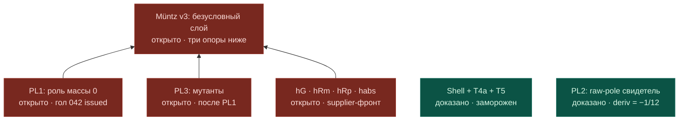

# Front map — Müntz v3 plant layer (2026-07-31)

Author: Mythos (chat canvas) · Snapshot relayed by owner, materialized by conductor-CLI.
PNG snapshot: `2026-07-31_muntz_v3_plant_front.png` (verbatim as rendered in the Mythos chat).
State as of: PL2 byte-audited green; Goal 042 (PL1) issued, in execution.

Legend: green = доказано (байт-аудит) · red = открыто.

Convention: maps are immutable dated snapshots (`YYYY-MM-DD_slug.png` + same-name `.md`
with the Mermaid source). A state change = a NEW dated pair, never an edit of an old
one — the front history stays browsable. Mermaid renders directly on GitHub, so the
map is viewable from any machine with browser access.
