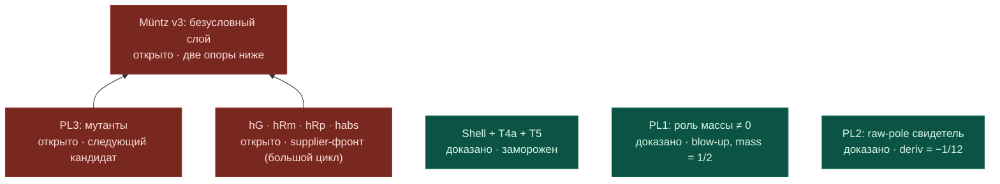

# Front map — Müntz v3 plant layer (2026-07-31, post-042)

Author of layout: Mythos · State update: conductor-CLI after Goal 042 closure.
Supersedes: `2026-07-31_muntz_v3_plant_front.md` (kept immutable).
PNG snapshot: pending next Mythos canvas render (Mermaid below is authoritative
for this state).
State as of: Goal 042 closed, PL1_MASS_BLOWUP_WITNESS_PROVED (byte-audit by
conductor: SHA match, taint 0, canon=mirror; Lean build per answer 8031 jobs PASS).

Legend: green = доказано (байт-аудит) · red = открыто.
Contrast pair complete: PL2 (mass 0 ⇒ finite mismatch) + PL1 (mass ≠ 0 ⇒ blow-up)
certify zero mass as exactly the removability mechanism.
