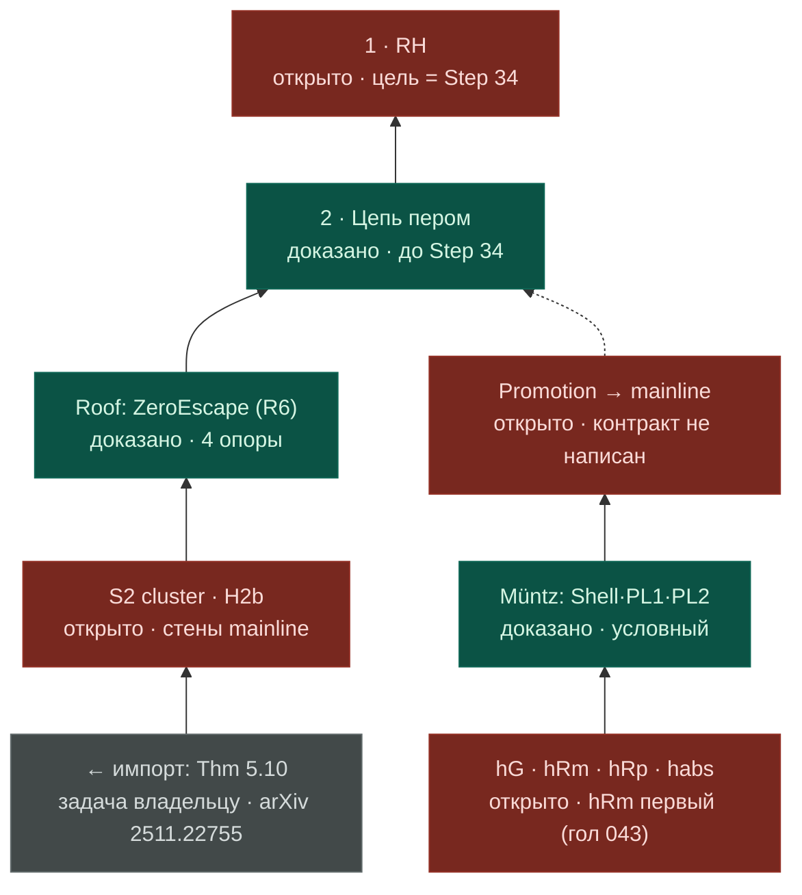

# Front map — two lanes to RH (2026-07-31)

Author: Mythos (chat canvas, dispatch answer to packet 2) · Materialized by conductor-CLI.
PNG snapshot: `2026-07-31_two_lane_rh_map.png` (verbatim canvas render).
Key structural finding encoded here: the challenger lane has NO written promotion
contract into the mainline chain — the dashed edge is the main hole of the map (K8).

Legend: green = доказано · red = открыто · grey = импорт · пунктир = мост без контракта.
