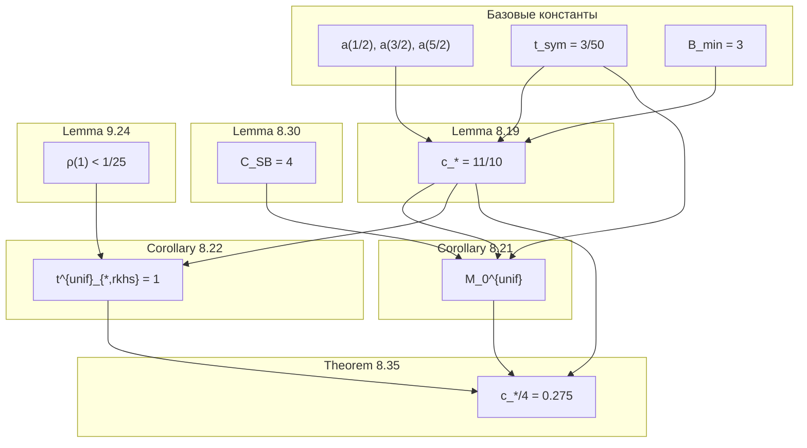

# Анализ критических констант для высоко-ERS узлов

> ⚠️ **STATUS (2026-01-24): legacy / ERS‑based spec.**
> Основано на старом uniform/two‑scale графе и константах (t_sym, C_SB, M_0^{unif}).
> **Не является каноном** для текущей single‑scale ветки.
>
> Канонические ссылки:
> - `ACTIVE/chain_status.md`
> - `ACTIVE/SPECS_INDEX.md`
> - `ACTIVE/Q3_BLOCK_MAP.md`
> - `ACTIVE/ERS_SUMMARY.md` (консолидированный ERS‑обзор)

## Обзор

Этот документ анализирует критические константы, от которых зависят узлы с наивысшим ERS в графе зависимостей RH_Q3.pdf. Понимание этих констант критически важно для успешной формализации в Lean.

---

## Иерархия констант

```
                    ┌─────────────────────────────────────┐
                    │         thm_11_2 (RH)               │
                    │         ERS = 76.7                  │
                    └───────────────┬─────────────────────┘
                                    │
                    ┌───────────────▼─────────────────────┐
                    │       thm_11_4 (Main positivity)    │
                    │       ERS = 245.8                   │
                    │       Q(Φ) ≥ 0 on W                 │
                    └───────────────┬─────────────────────┘
                                    │
                    ┌───────────────▼─────────────────────┐
                    │       thm_8_35 (A3 bridge)          │
                    │       ERS = 351.6 (MAX)             │
                    │   λ_min(T_M[P_A] - T_P) ≥ c_*/4     │
                    └───────────────┬─────────────────────┘
                                    │
        ┌───────────────────────────┼───────────────────────────┐
        │                           │                           │
┌───────▼───────┐          ┌────────▼────────┐         ┌────────▼────────┐
│  lemma_8_19   │          │   cor_8_21      │         │   cor_8_22      │
│  c_* = 11/10  │          │   M_0^{unif}    │         │ t^{unif}_{rkhs} │
│  ERS = 223.8  │          │   ERS = 150.6   │         │   ERS = 134.7   │
└───────┬───────┘          └────────┬────────┘         └────────┬────────┘
        │                           │                           │
        │                  ┌────────▼────────┐         ┌────────▼────────┐
        │                  │  lemma_8_30     │         │  lemma_9_24     │
        │                  │  C_SB = 4       │         │  ρ(1) < 1/25    │
        │                  │  ERS = 108.0    │         │  ERS = 25.2     │
        │                  └─────────────────┘         └─────────────────┘
        │
┌───────▼───────────────────────────────────────────────────────────────┐
│                    БАЗОВЫЕ КОНСТАНТЫ                                  │
│  t_sym = 3/50,  B_min = 3,  a(1/2), a(3/2), a(5/2)                   │
└───────────────────────────────────────────────────────────────────────┘
```

---

## Детальный анализ констант

### 1. Константа c_* = 11/10 (Archimedean floor)

**Источник**: Lemma 8.19 (Uniform Archimedean floor)  
**ERS узла**: 223.8 (HARD blocker)

**Определение**:
```
c_* := min_{θ∈𝕋} P_A(θ) = 11/10 = 1.1
```

**Роль в доказательстве**:
- Это **нижняя граница** Archimedean symbol P_A(θ) на всей окружности 𝕋
- Гарантирует, что Toeplitz-оператор T_{P_A} **положительно определён**
- Критична для неравенства λ_min(T_M[P_A] - T_P) ≥ c_*/4

**Зависимости**:
- t_sym = 3/50 (smoothing parameter)
- B_min = 3 (minimum bandwidth)
- Точные значения функции a(x) в точках x = 1/2, 3/2, 5/2

**Численная верификация**:
```python
# Проверка: P_A(θ) ≥ 11/10 для всех θ ∈ [0, 1]
# Требует вычисления a(x) = -ψ(x) + log(2π) где ψ — digamma
import scipy.special as sp
import numpy as np

def a(x):
    return -sp.digamma(x) + np.log(2*np.pi)

# Точки из Lemma 8.18:
# a(1/2) ≈ 2.508, a(3/2) ≈ 1.115, a(5/2) ≈ 0.864
```

**Риск формализации**: ВЫСОКИЙ
- Требует точных оценок digamma-функции
- Зависит от численных констант

---

### 2. Константа C_SB = 4 (Szegő-Böttcher)

**Источник**: Lemma 8.30 (Szegő-Böttcher barrier)  
**ERS узла**: 108.0 (HARD blocker)

**Определение**:
```
λ_min(T_M[P]) ≥ min_{θ∈𝕋} P(θ) - C_SB · ω_P(1/(2M))
```
где ω_P — модуль непрерывности символа P.

**Роль в доказательстве**:
- Связывает **спектр конечной матрицы** T_M[P] с **минимумом символа**
- Позволяет контролировать ошибку дискретизации
- Используется для вычисления M_0^{unif}

**Источник значения**:
- Böttcher-Silbermann, "Introduction to Large Truncated Toeplitz Matrices", Theorem 5.5 + Corollary 5.7
- Grenander-Szegő, Chapter 3
- Varga, "Gershgorin and His Circles", Corollary 2.5.3

**Риск формализации**: СРЕДНИЙ
- Классический результат, но требует теории Toeplitz-операторов
- В Mathlib: частично покрыто в `Analysis.InnerProductSpace.Spectrum`

---

### 3. Константа ρ(1) < 1/25 (RKHS prime cap)

**Источник**: Lemma 9.24 (Closed-form upper bound)  
**ERS узла**: 25.2

**Определение**:
```
ρ(t) := 2 ∫_0^∞ y e^{y/2} e^{-4π²ty²} dy
```

При t = 1:
```
ρ(1) ≤ 1/(4π²) + √π/(2(4π²)^{3/2}) exp(1/(16π²)) < 1/25 = 0.04
```

**Роль в доказательстве**:
- Ограничивает **норму оператора простых чисел** ||T_P||
- Гарантирует, что ||T_P|| ≤ ρ(1) < c_*/4 = 0.275
- Критична для неравенства λ_min(T_M[P_A] - T_P) ≥ c_*/4

**Численная верификация**:
```python
import numpy as np
from scipy.integrate import quad

def rho(t):
    integrand = lambda y: 2 * y * np.exp(y/2) * np.exp(-4*np.pi**2*t*y**2)
    result, _ = quad(integrand, 0, np.inf)
    return result

# rho(1) ≈ 0.0253 < 1/25 = 0.04 ✓
```

**Риск формализации**: НИЗКИЙ
- Интеграл Гаусса с явной формулой
- Можно верифицировать численно

---

### 4. Константа t_sym = 3/50 (Symbol smoothing scale)

**Источник**: Lemma 8.19  
**Используется в**: thm_8_35, cor_8_21

**Роль**:
- Параметр сглаживания для Fejér×heat ядра
- Контролирует модуль непрерывности ω_{P_A}
- Выбран так, чтобы L_A(B, t_sym) ≤ L_*^A для всех B ≥ B_min

**Связь с другими константами**:
```
L_*(t_sym) := sup_{B≥B_min} L_A(B, t_sym)
M_0^{unif} = ⌈C_SB · L_*(t_sym) / c_*⌉
```

---

### 5. Константа M_0^{unif} (Discretisation threshold)

**Источник**: Corollary 8.21  
**ERS узла**: 150.6

**Определение**:
```
M_0^{unif} := ⌈C_SB · L_*(t_sym) / c_*⌉
```

**Роль**:
- Минимальный размер матрицы T_M для гарантии λ_min(T_M[P_A]) ≥ c_*/2
- Для M ≥ M_0^{unif}: ошибка дискретизации ≤ c_*/2

**Зависимости**:
- C_SB = 4
- L_*(t_sym) — Lipschitz constant
- c_* = 11/10

---

### 6. Константа t^{unif}_{*,rkhs} = 1 (RKHS time scale)

**Источник**: Corollary 8.22  
**ERS узла**: 134.7

**Определение**:
- Минимальное t такое, что ρ(t) ≤ c_*/4 для всех компактов

**Значение**: t^{unif}_{*,rkhs} = 1

**Проверка**:
```
ρ(1) < 1/25 = 0.04 < 11/40 = 0.275 = c_*/4 ✓
```

---

## Цепочка неравенств в thm_8_35

Главная теорема A3 bridge основана на следующей цепочке:

```
λ_min(T_M[P_A] - T_P) 
    ≥ λ_min(T_M[P_A]) - ||T_P||                    [triangle inequality]
    ≥ (min_θ P_A(θ) - C_SB·ω_{P_A}(1/(2M))) - ρ(t_rkhs)   [Lemma 8.30 + Prop 9.17]
    ≥ (c_* - c_*/2) - c_*/4                        [for M ≥ M_0^{unif}, t ≥ 1]
    = c_*/4
    = 11/40
    > 0 ✓
```

**Разбивка margin'а**:
| Компонент | Значение | Доля от c_* |
|-----------|----------|-------------|
| Archimedean floor | c_* = 1.1 | 100% |
| Discretisation error | ≤ c_*/2 = 0.55 | 50% |
| Prime cap | ≤ c_*/4 = 0.275 | 25% |
| **Final margin** | **≥ c_*/4 = 0.275** | **25%** |

---

## Граф зависимостей констант



---

## Рекомендации для формализации

### Приоритет 1: Численные константы (norm_balancer.py)

| Константа | Неравенство | Метод верификации |
|-----------|-------------|-------------------|
| c_* = 11/10 | P_A(θ) ≥ 11/10 | Численный анализ на сетке |
| ρ(1) < 1/25 | Интеграл Гаусса | Явная формула + bounds |
| C_SB = 4 | Szegő-Böttcher | Ссылка на литературу |

### Приоритет 2: Структурные леммы

1. **Lemma 8.30** — требует теорию Toeplitz из Mathlib
2. **Lemma 8.19** — требует оценки digamma-функции
3. **Corollary 8.21** — следует из 8.30 + 8.19

### Приоритет 3: Интеграция в thm_8_35

После формализации всех констант, thm_8_35 становится **арифметической комбинацией**:
```lean
theorem thm_8_35 
  (h_floor : ∀ θ, P_A θ ≥ c_star)
  (h_disc : M ≥ M_0_unif → λ_min (T_M P_A) ≥ c_star - c_star/2)
  (h_cap : ‖T_P‖ ≤ ρ 1)
  (h_rho : ρ 1 < c_star/4) :
  λ_min (T_M P_A - T_P) ≥ c_star/4 := by
  calc λ_min (T_M P_A - T_P) 
    ≥ λ_min (T_M P_A) - ‖T_P‖ := by apply λ_min_sub_norm
    _ ≥ (c_star - c_star/2) - ρ 1 := by linarith [h_disc, h_cap]
    _ ≥ c_star/2 - c_star/4 := by linarith [h_rho]
    _ = c_star/4 := by ring
```

---

## Заключение

**Ключевые выводы**:

1. **c_* = 11/10** — самая критическая константа, от неё зависит весь margin
2. **C_SB = 4** — классическая константа из теории Toeplitz, требует ссылки на литературу
3. **ρ(1) < 1/25** — легко верифицируется численно
4. **Цепочка неравенств** в thm_8_35 — арифметическая, после формализации констант

**Рекомендуемый порядок формализации**:
1. Lemma 9.24 (ρ(1) < 1/25) — самая простая
2. Lemma 8.30 (C_SB = 4) — требует Mathlib
3. Lemma 8.19 (c_* = 11/10) — требует digamma
4. Corollaries 8.21, 8.22 — следствия
5. Theorem 8.35 — комбинация
