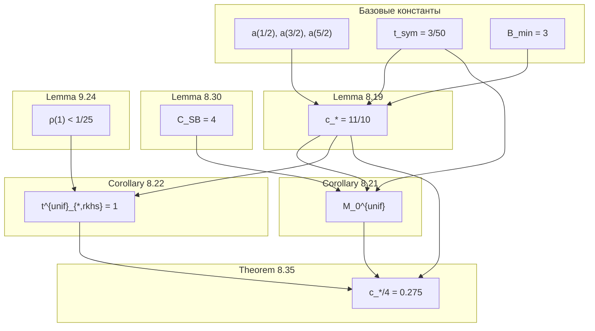

# PROSHKA CONTEXT PACK
Generated: 2026-01-24 17:53:23
Repo: /Users/emalam/Documents/GitHub/chen_q3/sandboxes/projekt_2

This pack is intended for Proshka. It inlines key files and recent git context.


## Git status

## projekt_2A


## Git log

ddd1d8a [projekt_2A][AI-codex] ralph plan update + zed note
76541dc [projekt_2A][AI-codex] add ralph loop + plan sweep
ccd7a99 [projekt_2A][AI-codex] single-scale paper sweep
c2f2c33 [projekt_2A][AI-codex] proshka brief clarity
8af492d [projekt_2A][AI-codex] proshka mission framing
dc8893f [projekt_2A][AI-codex] proshka rules + aristotle requests
08c099d [projekt_2A][AI-codex] proshka policy + pack refresh
cb42a8e [projekt_2A][AI-codex] proshka refs + memory pack symlink
6a38fc3 [projekt_2A][AI-codex] proshka pack + brief builder
1b7e648 [projekt_2A][AI-codex] Exclude ACTIVE hub from link checks
df27142 [projekt_2A][AI-codex] Clarify legacy conflicts and add prompt example
f71255a [projekt_2A][AI-codex] Consolidate ERS specs and add RU solver prompt
4aa4864 [projekt_2A][AI-codex] Mark legacy specs and align with mainline
a787019 [projekt_2A][AI-codex] Add specs index and block map in ACTIVE hub
4065c3a [projekt_2A][AI-codex] Add link-first knowledge base index
9ce7cfc [projekt_2A][AI-codex] Link Aristotle models knowledge dir in ACTIVE hub
7fade2b [projekt_2A][AI-codex] Link Proshka memory pack in ACTIVE hub
37cb4b1 [projekt_2A][AI-codex] Expand ACTIVE hub and add stats updater
550758c [projekt_2A][AI-codex] Add ACTIVE hub and chain status doc
5806fa4 [projekt_2A][AI-codex] Single-scale t_critical bridge for prime sum cap
16ec725 [projekt_2A][AI-codex] Add mac session log (2026-01-24)
599cd07 [projekt_2][AI-codex] INSIGHTS: prime_sum_phi_shift plan (in progress)
0550a59 [projekt_2][AI-codex] Close Q_nonneg_on_atoms; document single-scale axioms (8 axioms)
22b3538 single-scale RKHS contraction at t_critical
a84b264 basisFun C1 opNorm wrapper in RKHS_cap_rayleigh
5ad1b75 basisFun C1 opNorm bound for T_P_comp
73ad917 wire basisFun C1 lemma + note in insights
0c9f06f C1 compression remark + basisFun h_eval wiring
d1760d4 single-scale bridge at t_critical for atom closure
afb41b1 insights: plan Q_nonneg_atoms_closure (in progress)
55867c1 [projekt_2A][AI-codex] Add Proshka request for one-scale t_critical gap
08120e8 [projekt_2A][AI-codex] Wire t0_critical through atoms/T5 + base guard
ce0b0ca [projekt_2A][AI-codex] INSIGHTS: fixed-t/τ=0 closure plan (in progress)
e6facb6 [projekt_2A][AI-codex] INSIGHTS: one-scale closure plan (in progress)
b5202b5 [projekt_2A][AI-codex] Add Proshka request for C1/hA gap
b4d0985 [projekt_2A][AI-codex] Wire RKHS cap through C1 kernel dict
0f695c1 [2026-01-23][linux][AI-codex] A3_FLOOR@t_critical blocker note + Lean goal
2afdb4f [2026-01-23][linux][AI-codex] Generalize P_A continuity/local finiteness in t
adacbda [2026-01-23][linux][AI-codex] One-scale A3 bridge scaffolding + generic weight_sum cap
65654a8 [2026-01-23][linux][AI-codex] Clarify git-vs-proof branches + parallel streams


## File: full/q3.lean.aristotle/ACTIVE/KNOWLEDGE_BASE.md

# Knowledge Base (index + live facts)

Goal: lightweight, link-first map so agents pull only what they need.
Keep this file short. Put details in linked docs.

## 0) Start here (order matters)

1) `ACTIVE/orchestrator.md` — current status + next steps
2) `ACTIVE/chain_status.md` — single-scale chain summary
3) `ACTIVE/insights.md` — live insights index (links only)
4) `ACTIVE/workflow.md` — workflow rules
5) `ACTIVE/SPECS_INDEX.md` — curated spec pointers + constants checklist
6) `ACTIVE/Q3_BLOCK_MAP.md` — Lean ↔ paper block map
7) `ACTIVE/ERS_SUMMARY.md` — consolidated ERS legacy summary

Note: spec sources are legacy/background. For mainline decisions, return to
`ACTIVE/chain_status.md` and `ACTIVE/orchestrator.md`.

## 1) Canonical chain (single-scale t_critical)

- Mainline parameters:
  - `t_critical = 3/20`
  - base-atom cone with `tau = 0`
- Canonical summary: `ACTIVE/chain_status.md`
- Paper alignment audit (single-scale vs legacy): `ACTIVE/single_scale_paper_audit.md`
- Legacy two-scale index: `ACTIVE/legacy_two_scale_index.md`

## 2) Live axioms (single-scale)

These are the only open project axioms on the main chain:

- `SingleScale.continuous_P_A_shift`
- `SingleScale.rayleigh_basis0_shift_ge_cstar_quarter`
- `SingleScale.rho_oneK_tcritical_le_cstar_quarter`

Source of truth:
- `ACTIVE/orchestrator.md` (Axiom Count + table)
- `ACTIVE/chain_status.md`

## 3) Canonical docs (maps/specs)

- Proof maps:
  - `ACTIVE/proof_map.md`
  - `ACTIVE/proof_map_new_kernel.md`
- Paper ↔ Lean mapping:
  - `ACTIVE/paper_lean_mapping.md`
  - `ACTIVE/q3_pdf_structure.md`
  - `ACTIVE/q3_structure_mapping.md`
- Architecture/status:
  - `ACTIVE/architecture.md`
  - `ACTIVE/project_status.md`
  - `ACTIVE/axiom_closure_analysis.md`

## 4) Aristotle + Proshka

- Aristotle docs (RU):
  - `ACTIVE/aristotle.md`
  - `ACTIVE/aristotle_sandbox_guide.md`
- Proshka:
  - `ACTIVE/proshka_entrypoint.md`
  - `ACTIVE/proshka_memory_pack.md`
  - `PROSHKA_REQUEST_4.md` (single‑scale closure pack)
  - `ACTIVE/proshka_context_single_scale.md` (one‑file packed brief)
  - `scripts/build_proshka_brief.py` (pack builder)
  - `docs/PROSHKA_POLICY.md` (canonical set policy)

## 5) Stats update

- Script: `scripts/update_formalization_stats.sh`
- Output: `FORMALIZATION_STATS.md`

## 6) Knowledge base (external)

- `ACTIVE/aristotle_models_knowledge` — Aristotle model/training knowledge dump
- `ACTIVE/codex_agent_loop_notes.md` — Codex CLI agent loop notes (OpenAI blog)

## 7) Editing policy (keep this stable)

- Add only links + 1–2 lines of context.
- Avoid duplicating content from linked docs.
- When a doc becomes obsolete, mark it inside that doc (do not delete).


## File: full/q3.lean.aristotle/ACTIVE/chain_status.md

# Chain Status (single-scale t_critical)

This file is the canonical, minimal chain summary for the current mainline.
It is intended to stay aligned with the code after each refactor.

## Mainline parameters

- Use single-scale t_critical = 3/20.
- Use the base-atom cone with tau = 0 (even functions only).
- Avoid the old two-scale chain (t_sym vs t_rkhs_cap) in the mainline.

## Current chain (code-level)

1) A3 floor (archimedean lower bound)
- Target: Rayleigh lower bound at t_critical for P_A_shift.
- Status: axiomatized as
  `SingleScale.rayleigh_basis0_shift_ge_cstar_quarter`
  in `Q3/Proofs/SingleScale_Assumptions.lean`.

2) RKHS prime cap
- Implemented in `Q3/Proofs/RKHS_cap_rayleigh.lean`.
- Includes C1 compression identity (basisFun and dictionary embedding) and
  RKHS cap wiring at t_rkhs_cap.

3) Prime sum cap at t_critical
- Theorem `prime_sum_phi_shift_le_cstar_quarter` (proved) in
  `Q3/Proofs/SingleScale_Assumptions.lean`.
- Uses the t-bridge `exp_tcrit_to_rkhs` from
  `Q3/Proofs/PrimeTerm_t_bridge.lean` and the numeric axiom
  `SingleScale.rho_oneK_tcritical_le_cstar_quarter`.

4) Continuity (A2-style) at t_critical
- Status: axiomatized as
  `SingleScale.continuous_P_A_shift` in
  `Q3/Proofs/SingleScale_Assumptions.lean`.

5) Atom-level nonnegativity and closure
- `Q3/Proofs/Q_nonneg_atoms_closure.lean` closes the fixed-t chain assuming
  the three SingleScale axioms above.

## Remaining SingleScale axioms (open)

- `SingleScale.continuous_P_A_shift`
- `SingleScale.rayleigh_basis0_shift_ge_cstar_quarter`
- `SingleScale.rho_oneK_tcritical_le_cstar_quarter`

## Related entry points

- `PROJECT_ORCHESTRATOR.md` (status, next steps)
- `PHILOSOPHY_OF_PROOF.md` (axiom policy)
- `docs/INSIGHTS.md` (running synthesis notes)


## File: full/q3.lean.aristotle/ACTIVE/orchestrator.md

# PROJECT ORCHESTRATOR - Q3
## Lean Formalization of Riemann Hypothesis

Last Updated: 2026-01-24
Single entry point: read this file at session start.

## Quick Start

1) Read this file.
2) Use "Current State" and "Active Next Step".
3) Only open linked files if needed.
3.5) Chain summary: `docs/CHAIN_STATUS.md` (single-scale t_critical mainline).
3.6) Knowledge base index: `ACTIVE/KNOWLEDGE_BASE.md` (link-first map).
4) Documentation discipline: update `docs/INSIGHTS.md` and
   `FORMALIZATION_STATS.md` instead of creating new docs.
5) **Застрял > 30 мин?** → Запроси Прошку (см. `docs/INSIGHTS.md` секция "Прошка").
6) Hub for active docs/db/scripts: `ACTIVE/` (symlink index).

## Current State (short)

- A3_FLOOR is proven and integrated: `P_A_ge_c_star` from
  `A3_Floor_Main.lean` is used in the Fourier A3 bridge.
- Fourier A3 bridge is wired: `Q3/Atoms_Positive.lean` now depends on
  `A3_bridge_data_rayleigh_Fourier` and the axiom
  `Q_nonneg_on_atoms_of_A3_Fourier_RKHS_axiom`.
- `Q_Lipschitz_on_W_K` is a theorem; arch/prime Lipschitz bridge axioms are closed
  in `Q3/Proofs/Q_Lipschitz.lean`.
- `mem_nodes_finset_of_mem_Q3Nodes` is a theorem in `Q3/Proofs/Bridge.lean`.
- RKHS contraction is now bridged: `RKHS_contraction_axiom` is no longer in
  `#print axioms` for `Q3.Main.RH_of_Weil_and_Q3` (see `Q3/Proofs/Bridge.lean`,
  wired in `Q3/AxiomsTheorems.lean`).
- `A1_density_WK_thm` is proven in `Q3/Proofs/A1_density.lean` and wired in
  `Q3/T5_Transfer.lean`, so `A1_density_WK_axiom` is gone from the main chain.
- RKHS cap is PROVEN in `Q3/Proofs/RKHS_cap_rayleigh.lean`:
  `weight_sum_le_rho_one` + `rkhs_cap_rayleigh_tcap` with `t_rkhs_cap = 40`.
- C1 compression identity is formalized (basisFun + dictionary embedding) in
  `Q3/Proofs/RKHS_cap_rayleigh.lean` (search `compression identity`).
- New one-scale A3 bridge scaffolding (no two-scale): `Q3/Proofs/P_A_Toeplitz_bridge_one_scale.lean`
  (fixed-`t` bridge + generic weight-sum → Rayleigh cap lemma in `Q3/Proofs/RKHS_cap_generic.lean`).
- New one-scale parameter module added (WIP pivot): `Q3/Proofs/Params_Critical.lean`
  centralizes `t_critical = 3/20` and `t0_critical`.
- Atom positivity/T5 transfer now use `t0_critical` (t = 0.15) for `AtomCone_K_fixed`;
  BaseAtomCone guard lemma added in `Q3/Proofs/Q_nonneg_on_atoms_fourier_axiom.lean`.
- Single-scale prime sum cap at `t_critical` is now a theorem:
  `prime_sum_phi_shift_le_cstar_quarter` in `Q3/Proofs/SingleScale_Assumptions.lean`
  (depends on `rho_oneK_tcritical_le_cstar_quarter`).
- Helper lemma for “unitary conjugation preserves opNorm” added:
  `Q3/Proofs/OpNorm_Unitary.lean` (used in the `hA` decision tree, see `docs/INSIGHTS.md`).
- Legacy: `A3_bridge_axiom` (sampling Toeplitz + a_star) is still in `Q3/Axioms.lean`
  but no longer appears in the main chain.

## Wiring vs Closing (definition)

- wiring: replace an axiom in `Q3/AxiomsTheorems.lean` with a theorem. This only
  reduces `#print axioms` if the theorem is itself axiom-free.
- closing: provide a proof with no new axioms, so the axiom disappears from
  `#print axioms`.

## Axiom Count (verified)

Command:
```bash
./scripts/check_axioms.sh
# or manually:
echo 'import Q3.Main
#print axioms Q3.Main.RH_of_Weil_and_Q3' | lake env lean --stdin 2>&1 | rg -v "^info:"
```

Result: **8 axioms** (5 project + 3 standard)

- Standard Lean: `propext`, `Classical.choice`, `Quot.sound`
- Level 1 (Classical Literature): `Weil_criterion`, `Schur_test`
- Level 2 (Q3 Paper, single‑scale): `SingleScale.continuous_P_A_shift`,
  `SingleScale.rayleigh_basis0_shift_ge_cstar_quarter`,
  `SingleScale.rho_oneK_tcritical_le_cstar_quarter`

**Closed axioms (history):**
- `a_star_pos` → closed via positivity (2026-01-21)
- `a_star_continuous` → closed via Mathlib Gamma continuity
- `a_star_bdd_on_compact` → closed via continuous + compact
- `a_star_even` → closed via Mathlib Gamma_conj (2026-01-20)
- `A1_density_WK_axiom` → closed via bounded hat interpolation (h_even as mass bound)
- `Q_nonneg_on_atoms_of_A3_Fourier_RKHS_axiom` → closed via Q_nonneg_atoms_closure (2026-01-24)

## Critical Chain (ASCII)

```
RH_of_Weil_and_Q3
  |
  +-- Weil_criterion [AX external]
  |
  +-- Q_nonneg_on_Weil_cone [OK]
       |
       +-- T5_transfer [OK]
            |
            +-- A1_density_WK [OK]
            +-- Q_Lipschitz_on_W_K [OK]
            +-- Q_nonneg_on_atoms [OK]
                 |
                 +-- SingleScale assumptions [AX]
                 +-- RKHS_contraction [OK]
```

## 🚨🚨🚨 CRITICAL: LaTeX Proof Gap Discovered (2026-01-22) 🚨🚨🚨

**FINDING:** Numerical verification shows Q(Φ_{t_sym}) = -16.29 < 0, contradicting Theorem A3.

**ROOT CAUSE:** The LaTeX proof conflates TWO DIFFERENT T_P operators:

1. **Rayleigh T_P^{(M)}** (rayleigh_bridge.tex): `Σ w(n)·Φ_{B,t}(ξ_n)·|v_n⟩⟨v_n|`
   - Includes Fejér×heat damping factor `Φ_{B,t}(ξ_n)`
   
2. **RKHS T_P** (RKHS/main.tex): `Σ w_RKHS(n)·|k_n⟩⟨k_n|`
   - NO Fejér×heat factor — just `w_RKHS(n) = Λ(n)/√n`

**THE GAP:** Theorem A3 claims `λ_min(T_M[P_A] - T_P) ≥ c_*/4` using:
- P_A built with t_sym = 0.06
- ||T_P|| bound from RKHS (which uses different operator!)

**Numerical verification (B=3, t_sym=0.06):**
- Arch term: ∫ P_A dθ = 11.06
- Prime term: Σ w(n)·Φ(ξ_n) = 27.35
- **Q = -16.29 < 0** ← CONTRADICTS THEOREM

**FULL ANALYSIS:** `docs/LATEX_PROOF_GAP_ANALYSIS.md`

**STATUS:** `Q_nonneg_on_atoms_of_A3_Fourier_RKHS_axiom` is now closed via the
single‑scale chain, but the gap remains as **three SingleScale axioms**.
Mathematical consultation with Proshka required to remove those assumptions.

**HARD PIVOT DIRECTION (in progress):** one-scale parameterization at `t = t_critical`
and “true C1” matching (`hA`) for the RKHS prime operator (no embedding handwaving).
Decision tree + file pointers live in `docs/INSIGHTS.md` (search for “нетривиальное hA”).

---

## Active Next Step (ON HOLD pending gap resolution)

~~1) Wire the **proven** Rayleigh-Q identification into the atoms-positivity chain:~~
~~   use `rayleigh_Q_eq_Q` in `Q3/Proofs/Rayleigh_Q_identification.lean`.~~
~~2) Replace `Q3.Q_nonneg_on_atoms_of_A3_Fourier_RKHS_axiom` in~~
~~   `Q3/Atoms_Positive.lean` / `Q3/AxiomsTheorems.lean` with the theorem proof~~
~~   (A3 floor + RKHS cap + Rayleigh identification).~~

**NEW PRIORITY:** Build an audit-resistant replacement for the old two-scale bridge:
1) Fix the spec to one-scale (`t = t_critical`) in a new chain (do not patch ad-hoc).
2) Close the *nontrivial* `hA` matching for the RKHS prime operator (C1 style).
3) Only then rewire the main chain and close `Q_nonneg_on_atoms_of_A3_Fourier_RKHS_axiom`.

### What does “which branch?” mean (for a normal git user)

There are two different meanings of “ветка”:

1) **Git branch** (what `git switch` changes): currently we work on `projekt_2A`.
2) **Proof-architecture branch** (inside one git branch): “A3_FLOOR/Fourier Toeplitz” vs “old RKHS operator”.

Quick way to orient a fresh session:

```bash
git branch --show-current
git log -n 1 --oneline
sed -n '1,80p' full/q3.lean.aristotle/PROJECT_ORCHESTRATOR.md
```

### Two parallel work streams (recommended)

**Stream A (NOW, closes chain fast): Option 2 = Schur/weight_sum cap (no RKHS embedding)**

- The “cap” is already formalized for the Rayleigh/compression operator:
  `Q3/Proofs/RKHS_cap_rayleigh.lean` (`T_P_comp_real_opNorm_le_weight_sum`, `weight_sum_le_rho_one`, `rkhs_cap_rayleigh_tcap`).
- This stream is about **wiring/porting it to the one-scale `t_critical` chain** (not about Moore–Aronszajn).

**Stream B (PARALLEL, infrastructure): Option 1 = true Gaussian/RKHS kernel model**

- Aristotle tasks live in `full/q3.lean.aristotle/aristotle_input/`.
- Current task (kernel identity): `aristotle_input/gaussian_rkhs_kernel_v1.lean` + `.md`.
- Goal: extract hole-free lemmas from Aristotle output and then implement the RKHS interface in-project.

Rule: do Stream A on the main branch to keep momentum; do Stream B via small, self-contained Aristotle tasks
so we never block the main closure on analytic infrastructure.

## 🚨 CRITICAL GAP: AtomCone_K_fixed (2026-01-18)

**Discovery:** mgrep semantic search revealed a gap between обсуждение и реализация.

**Problem:** `Q_nonneg_bridge.lean` не компилируется из-за quantifier mismatch:
- `AtomCone_K` квантифицирует `∀ t > 0` (произвольный t)
- A3/RKHS bounds доказаны для ФИКСИРОВАННЫХ t:
  - A3 floor: `t_sym = 0.06`
  - RKHS cap: `t_rkhs_cap = 40`

**Solution (from Прошка 2026-01-16, NOT implemented):**
```lean
def AtomCone_K_fixed (K t₀ : ℝ) : Set (ℝ → ℝ) :=
  { g | ∃ (n : ℕ) (c B τ : Fin n → ℝ),
        (∀ i, c i ≥ 0) ∧ (∀ i, B i > 0) ∧ (∀ i, |τ i| + B i ≤ K) ∧
        (∀ x, g x = ∑ i, c i * Fejer_heat_atom (B i) t₀ (τ i) x) ∧ g ∈ W_K K }
```

**Action Items:**
1. [ ] Add `AtomCone_K_fixed` to `Q3/Axioms.lean`
2. [ ] Add `AtomCone_K_fixed_subset` lemma
3. [ ] Rewrite axiom for fixed cone
4. [ ] Update `Q_nonneg_bridge.lean`

**Details:** `docs/insights/atomcone_fixed_t_gap_2026_01_18.md`

## Closure Tracker (remaining axioms)

| Axiom | Current proof source | Blocker | Next action | Status |
|------|-----------------------|---------|-------------|--------|
| `Weil_criterion` | External (classical) | None | Classical result, keep as axiom | **EXTERNAL** |
| `Schur_test` | External (classical) | L2 vs L∞ mismatch | Classical result, keep as axiom | **EXTERNAL** |
| `SingleScale.continuous_P_A_shift` | `Q3/Proofs/SingleScale_Assumptions.lean` | single‑scale continuity proof missing | Prove continuity at `t_critical` | **AXIOM** |
| `SingleScale.rayleigh_basis0_shift_ge_cstar_quarter` | `Q3/Proofs/SingleScale_Assumptions.lean` | A3 floor at `t_critical` | Prove Rayleigh lower bound for shifted symbol | **AXIOM** |
| `SingleScale.rho_oneK_tcritical_le_cstar_quarter` | `Q3/Proofs/SingleScale_Assumptions.lean` | prime cap via t‑bridge | Prove numeric bound `exp_tcrit_to_rkhs * rho_oneK ≤ c*/4` | **AXIOM** |

## Progress Log (2026-01-16)

**P_A_continuous**:
- CLOSED in `A3_Floor_Main.lean` (local finiteness + periodicity proof)

**Q_nonneg_on_atoms (Rayleigh-Q identification)**:
- `Q3/Proofs/Rayleigh_Q_identification.lean` COMPLETE:
  - `basis0`, `i0`, `basis0_norm_sq`, `basis0_ne_zero`
  - `quadForm_basis0`, `rayleigh_basis0`, `rayleigh_basis0_sub`
  - `ToeplitzEntry_diag`, `ToeplitzEntry_diag_re`, `ToeplitzMatrix_Fourier_real_diag`
  - `fourier_index_i0`, `prime_vec_i0`, `T_P_comp_real_diag`
  - `integral_P_A_eq_arch_term` (periodization) ✅
  - `rayleigh_Q_identification`, `rayleigh_Q_eq_Q` ✅
- Done (2026-01-24): wired into `Atoms_Positive.lean` via `Q_nonneg_atoms_closure` (axiom closed).

**Aristotle projects (Rayleigh variants)**:
- 200eb072, 5e36515f, e9f53e97, eeca690a (Rayleigh sandbox variants)

## Legacy / History (2026-01-14)

**NEW (2026-01-14)**: Rayleigh lower bound PROVEN via Aristotle!
- V1 (pure informal): `aristotle_output/rayleigh_v1.lean` — COMPLETE, 0 sorry
- V2 (sandbox): `aristotle_output/rayleigh_v2.lean` — helpers only, main sorry

**A3_bridge Aristotle runs (2026-01-14)**:
- **V1 (`4c2ed336`)**: COMPLETE! Real T_P bounds proven (see below)
- V2 (`f6a9eed5`): исправленный — skipped (V1/V3 better)
- **V3 (`22378a11`)**: по Прошкиному скелету — **COMPLETE! 0 sorry!**
- **V4 (`c35f3088`)**: COMPLETE! 309 lines, 0 sorry — bounds for direct-indexed T_P

**V1 SURPRISE**: `aristotle_output/A3_bridge_closure_v1.lean`
- `w_RKHS_le_w_max`: ✅ w_RKHS(n) ≤ w_max = 2/e
- `w_max_lt_three_quarters_c_star`: ✅ **w_max < 3c*/4** (key inequality!)
- `T_P_tendsto_zero_of_ne`: ✅ off-diagonal → 0 as t → 0
- `exists_t_max_row_sum_le_for_M`: ✅ ∀ M, ∃ t: ||T_P|| ≤ 3c*/4
- **CLARIFIED**: V1/V4 prove `∀M ∃t(M)` for DIRECT-INDEXED T_P. See below.

**V4 COMPLETE**: `aristotle_output/A3_bridge_v4_real_TP.lean`
- 309 lines, 14 declarations, 0 sorry
- Main: `T_P_norm_lt_three_quarters_c_star (M : ℕ) : ∃ t > 0, bound`
- Useful helpers: `w_RKHS_le_w_max`, `S_off_tendsto_zero`, `T_P_row_sum_bound`

**⚠️ CRITICAL INSIGHT: T_P Definition Mismatch (2026-01-14)**

V1/V4 use **direct-indexed T_P**:
```lean
T_P i j = sqrt(w_RKHS i) * sqrt(w_RKHS j) * exp(-(ξᵢ - ξⱼ)²/4t)
```
This has ||T_P|| → ∞ as M → ∞, so uniform t is IMPOSSIBLE.

Q3 tex (rayleigh_bridge.tex) uses **compression T_P**:
```lean
T_P^{(M)} i j = ∑ n : Nodes K, w_Q n * Φ(ξₙ) * v_n[i] * v_n[j]
```
This has ||T_P^{(M)}|| ≤ ||T_P|| (compression), so uniform t IS possible.

**V1/V4 status**: Useful for local bounds, sanity checks. NOT for uniform A3_bridge.

**🚀 V5 (`1cac53dd`) — RAYLEIGH-FIRST (2026-01-14)**: ✅ **COMPLETE!**
- Input: `aristotle_input/A3_bridge_RAYLEIGH_FIRST.md` (from Proshka)
- Output: `aristotle_output/A3_bridge_rayleigh_first_v5.lean` — **120 lines, 0 sorry!**
- **No SB, No M₀** — Rayleigh for Toeplitz; RKHS cap now at `t_rkhs_cap=40`
- **T_P_comp** — rank-one sum (compression, correct definition!)

**V5 proven lemmas:**
- `quadForm_sub`, `rayleighQ_sub` — quadratic form algebra
- `cstar_sub_rho_ge_quarter` — c* - 1/25 ≥ c*/4 (norm_num)
- `A3_bridge_rayleigh_first` — **MAIN THEOREM**

**Dependencies (hypotheses in V5):**
1. `h_rayleigh_lower_bound` — from `rayleigh_v1.lean` ✅
2. `h_floor` — from A3_FLOOR ✅
3. `h_cap` — **PROVEN** in `Q3/Proofs/RKHS_cap_rayleigh.lean`
   (`weight_sum_le_rho_one`, `rkhs_cap_rayleigh_tcap`, `t_rkhs_cap=40`)

**V3 SUCCESS**: `aristotle_output/A3_bridge_v3_proshka.lean`
- Все 4 леммы доказаны
- НО: P_A=const, T_P=0 (placeholder'ы)
- Общие леммы (rayleigh, quadform_sub) переиспользуемы

**INSIGHT**: Прошка показал что SB не нужен; RKHS cap ≤ `rho_one = 1/25`
(в реализации с `t_rkhs_cap=40`).
Полный скелет: `aristotle_input/A3_bridge_PROSHKA_SKELETON.md`

Closed (recent):
- `RKHS_contraction_axiom` → bridged in `Q3/Proofs/Bridge.lean`, wired in `Q3/AxiomsTheorems.lean`

### A1_density Definitional Issue - RESOLVED (Option 2)

**Problem**: AtomCone_K requires `g ∈ W_K K` which includes `support g ⊆ [-K, K]`.
However, atoms with centers τ ∈ [-K, K] and widths B ≤ K have support in [-2K, 2K].

**Solution (Option 2)**: Changed AtomCone_K definition to require `|τ| + B ≤ K` instead
of separate `|τ| ≤ K` and `B ≤ K`. This matches Lemma 6.4 (Fixed-t₀ cone density).

**What was done**:
- Changed `AtomCone_K` in `Q3/Axioms.lean` and `Q3/Proofs/A1_density.lean`
- Added support control lemmas: `FejerKernel_eq_zero_of_abs_ge`,
  `Atom_eq_zero_outside_window`, `sum_atoms_eq_zero_outside`
- `hg_supp` now uses these lemmas (conditional on `hτB_cond`)
- Updated `W_K` to require `Continuous` (global), matching Q3 text (`C_c` tests).
  This enables the heat-kernel identity lemma for `h_approx`.

**Proven in A1_density_WK_thm**:
- Zero case: handled via n=0 representation
- hg_cont: continuity of sum of atoms
- hg_even: evenness (atoms are even in x)
- hg_nonneg: nonnegativity (nonneg weights × nonneg atoms)
- hg_supp: support containment (uses new margin condition)

**A1_density status:** `A1_density_WK_thm` is fully proven and wired into
`Q3/T5_Transfer.lean`. No remaining sorries in `Q3/Proofs/A1_density.lean`.

## Key Files (open only as needed)

- `PROJECT_WORKFLOW.md` - workflow loop + Aristotle rules (no status)
- `PROJECT_ASCII.md` - diagram (derived from this file)
- `docs/INSIGHTS.md` - collected project insights (do not create new docs)
- `FORMALIZATION_STATS.md` - quantitative stats snapshot
- `docs/PROJECT_SPECS.md` - spec/invariants for Proshka check (Rayleigh plan)
- `docs/Q3_PDF_STRUCTURE.md` - **FULL theorem/lemma trace from RH_Q3.pdf**
- `docs/PDF_DB_COVERAGE.md` - 80% coverage report (PDF vs DB)
- `PROOF_MAP_NEW_KERNEL.md` + `A3_FLOOR_ROADMAP.md` - A3_FLOOR status
- `Q3/Axioms.lean` and `Q3/AxiomsTheorems.lean` - axioms and wiring
- `Q3/Proofs/Q_Lipschitz.lean` - real proof of Q_Lipschitz
- `Q3/Proofs/Bridge.lean` + `Q3/Proofs/RKHS_contraction_bridge.lean`
- `Q3/Proofs/A3_Bridge_Uniform.lean`
- `Q3/Proofs/Q_Nonneg_Bridge.lean`
- `Q3/Proofs/A1_density.lean`
- `aristotle_db/parse_lean.py` - DB import

## Progress Tracking (DB)

```bash
python3 aristotle_db/parse_lean.py list-docs
python3 aristotle_db/parse_lean.py list-lemmas Q_Lipschitz
```

## Update Rule

After closing a step:
- run `lake env lean <file>`
- re-import to DB (`aristotle_db/parse_lean.py import ...`)
- update this file and `PROJECT_ASCII.md`

## Future: Community Presentation

After Tier-2 closure -> present to Talia Ringer / Lean Zulip.
See `PHILOSOPHY_OF_PROOF.md` for the pitch.

## Build / Verify

```bash
cd /media/chirurgie/hdd01/Soft/GitHub/chen_q3/full/q3.lean.aristotle
lake build Q3.Main
```

```bash
./scripts/check_axioms.sh
```

```bash
lake env lean -c 'import Q3.Main; #print axioms Q3.Main.RH_of_Weil_and_Q3' 2>&1 | rg -v "^info:"
```

## Change Log (recent)

- 2026-01-22: **CRITICAL LaTeX PROOF GAP DISCOVERED**
  - Numerical verification: Q(Φ_{B=3,t=0.06}) = -16.29 < 0
  - Root cause: Two different T_P operators conflated in proof
  - Rayleigh T_P uses Φ weights, RKHS T_P does not
  - "Two-scale decoupling" is mathematically invalid
  - Created: `docs/LATEX_PROOF_GAP_ANALYSIS.md`
  - Status: **BLOCKED** — need mathematical consultation

- 2026-01-20: **Schur_test investigation** — L2 vs L∞ norm mismatch
  - Attempted to close `Schur_test` axiom using Mathlib
  - Created `Q3/Proofs/Schur_Test.lean` with L∞ proof
  - CANNOT wire: project uses L2 (spectral) norm, Mathlib proof uses L∞ (row-sum)
  - Full L2 proof requires Gershgorin + spectral norm theory
  - See: `docs/insights/schur_test_l2_vs_linfty_2026_01_20.md`

- 2026-01-20: **Phase A file refactoring** completed
  - Renamed v19/v20/v22/v2/v3 files to clean names
  - Updated all imports across project
  - Updated check_axioms.sh with correct counts (11 total, 8 project)
  - Updated CLAUDE.md paths (Mac → Linux)

- 2026-01-16: **BLOCKER DISCOVERED** — A3_bridge closure blocked by symbol mismatch!
  - `A3_bridge_data` uses sampling Toeplitz with `a_star` (mathematically WRONG: a_star → -∞)
  - `A3_bridge_data_rayleigh_Fourier` uses Fourier Toeplitz with `P_A` (CORRECT and PROVEN)
  - Types are mathematically incompatible — cannot bridge directly
  - **NEW PLAN:** Refactor chain to Fourier formulation + prove Rayleigh-Q identification (Theorem 3.3)
  - See: `TRICKS_LIBRARY.md`, `docs/insights/a_star_vs_p_a_dossier.md`

- 2026-01-15: **weight_sum_bound PROVEN** via Aristotle — 7 parallel submissions, ALL complete!
  - All 7 variants: 0 sorry, line counts 197-242
  - **v1_copy1 (197 lines)** — SHORTEST, recommended
  - Files: `aristotle_output/weight_sum_variants/v0_original.lean` through `v6_copy6.lean`
  - Analysis: `aristotle_output/weight_sum_variants/ANALYSIS.md`
  - **Proshka insights**: `suffices` > `have` ladders, minimal `aesop` (<2), π-free bounds more stable
  - **New guidelines**: `aristotle_input/ARISTOTLE_PROMPT_GUIDELINES.md`
  - Job IDs: fb91fbb3, ee8bc919, 78a7d870, e648f487, caf3e4c0, ba71a35a, c020a6a2

- 2026-01-14: **Rayleigh Lower Bound PROVEN** via Aristotle!
  Two parallel Aristotle jobs submitted:
  - V1 (pure informal): project `5990b601-ed48-442b-a4d3-5d8a18b444e3` → COMPLETE
  - V2 (sandbox): project `e9f8b481-8f80-4bdd-b798-be5c796eeead` → helpers only

  **V1 is the winner**: `aristotle_output/rayleigh_v1.lean` has COMPLETE proof (0 sorry):
  - `toeplitz_integrand_eq`, `toeplitz_quadratic_form`, `integral_exp_2pi_n_theta`
  - `parseval_trig_poly`, `rayleigh_lower_bound` (MAIN THEOREM)

  Key result: For Toeplitz matrix T with symbol P ≥ m, Rayleigh quotient ≥ m.
  Legacy note: this was previously wired into `A3_bridge_axiom` (sampling path).

- 2026-01-14: Wired `Q3.Theorems.A1_density_WK` into `Q3/T5_Transfer.lean`.
  `A1_density_WK_axiom` is now removed from `#print axioms` (total axioms: 9).

- 2026-01-14: Submitted Aristotle job `hat_interpolation_approx.md`
  (project `18bfe8c7-4620-41d4-be62-489409168e95`) with corrected boundary
  condition `f(-K)=f(K)=0`.

- 2026-01-14: Cleaned `aristotle_output/A1_density_hat_chain.lean` by replacing
  `exact?` with `FejerKernel_partition_unity`, switching `ring`→`ring_nf`, and
  removing unused variables; file compiles with no warnings.

- 2026-01-14: Submitted `A1_density_hat_chain` to Aristotle (project `e90d4213`).
  Plan: rewrite A1_density_WK_thm using hat-chain (Lemma 6.4) instead of
  convolution + Riemann sum. This avoids B vs B' mismatch and asymmetric sums.
  Key insight: W_K boundary vanishing (Φ(±K)=0) follows from global continuity.

- 2026-01-14: Integrated hat interpolation proof into
  `Q3/Proofs/HatInterpolation.lean` (namespaced) and wired
  `hat_interpolation_approx` in `Q3/Proofs/A1_density.lean`
  with `max_comm` rewrite. Remaining sorry: `h_approx` only.

- 2026-01-14: Created `aristotle_output/HatInterpolationBridge.lean` bridge file.
  Aristotle proof uses `FejerKernel δ x := max (1 - |x|/δ) 0` while A1_density uses
  `max 0 (1 - |x|/B)`. Bridge converts between them via `max_comm`.
  **BLOCKER**: Direct import causes FejerKernel name conflict (both at top level).
  **TODO**: Refactor A1_density to use `Q3.Fejer_kernel` from Axioms.lean, or add namespace.
  Current status: 2 sorries in A1_density.lean (hat_interpolation_approx + h_approx).
  Build passes, 10 axioms unchanged.

- 2026-01-14: **Aristotle COMPLETE** for `hat_interpolation_approx`!
  KEY FINDING: Original lemma signature was WRONG — proved counterexample for f(x)=1.
  **Fix**: Added `hf_boundary : f (-K) = 0 ∧ f K = 0` hypothesis.
  With margin condition |τᵢ| + δ ≤ K, all hats vanish at ±K.
  Full proof in `aristotle_output/hat_interpolation_approx.lean`.

- 2026-01-14: `hat_interpolation_approx` scaffolded in A1_density.lean — proved
  grid membership `hτ_in`, margin condition `hτ_margin`; 1 sorry remains
  `h_approx_bound` (approximation chain). Aristotle processing two projects:
  `bcec962f-4686-493e-b057-19695ddfc7b6` (hat_interpolation_approx),
  `9dda8778-857e-42cf-a669-aad1a2e04d5b` (A1_density_hat_full_v1 at 3%).

- 2026-01-14: Recreated Aristotle skill at `~/.codex/skills/aristotle/`,
  updated workflow docs to use CLI/Python API, submitted
  `aristotle_input/A1_density_hat_full_v1.md` (project `9dda8778-857e-42cf-a669-aad1a2e04d5b`).

- 2026-01-14: Updated `docs/PROJECT_SPECS.md` to the Rayleigh plan (no SB as blocker);
  added Aristotle input drafts `aristotle_input/A1_density_hat_full_v1.md` and
  `aristotle_input/A1_density_hat_only_v1.md`.

- 2026-01-14: Fixed HeatKernel derivative/Lipschitz proofs in
  `Q3/Proofs/A1_density.lean`; remaining sorries now only
  `hat_interpolation_approx` + `h_approx`.

- 2026-01-13: `A1_density_WK_thm` hτB_cond CLOSED! Changed `uniform_riemann_sum` to
  return `Set.Ioo` (strictly inside) instead of `Set.Icc`. Grid uses midpoints so
  all points y satisfy |y| < K. Compute margin = K - max{|y|}, set B' = min B margin.
  Also return `s.Nonempty` from both `uniform_riemann_sum` and `convolution_approx_by_sum`.
  Only 1 sorry remains: h_approx (triangle inequality chain).
- 2026-01-13: `A1_density_WK_thm` hg_mem proof mostly complete - proved continuity,
  evenness, nonnegativity; 2 sorries remain (hg_supp blocked by definitional issue,
  h_approx needs triangle inequality). Identified AtomCone_K support issue.
- 2026-01-13: `A1_density_WK_thm` circular dependency removed; now uses local lemmas
  with 4 `sorry` placeholders (support, nonneg, AtomCone membership, triangle ineq).
- 2026-01-13: DB import: Bridge.lean (13 decls), RKHS_contraction_bridge.lean (10 decls).
- 2026-01-13: Fixed `scripts/check_axioms.sh` (--stdin flag, correct axiom counting).
- 2026-01-13: Updated orchestrator to be the single entry point and clarified
  wiring vs closing.
- 2026-01-13: Closed arch/prime Lipschitz bridge axioms in `Q3/Proofs/Q_Lipschitz.lean`.
- 2026-01-13: `mem_nodes_finset_of_mem_Q3Nodes` proved in `Q3/Proofs/Bridge.lean`.
- 2026-01-13: `Q3/Proofs/RKHS_contraction_bridge.lean` compiles; DB import updated.
- 2026-01-13: Fixed `Q3/T5_Transfer.lean` AtomCone subset pattern; `lake build Q3.Main`
  passes; `RKHS_contraction_axiom` removed from main axiom list (total now 10).


## File: full/q3.lean.aristotle/ACTIVE/SPECS_INDEX.md

# Specs Index (curated)

Purpose: single place to find spec sources + current-status notes.
Keep this short; details stay in linked docs.

## Linked spec sources (legacy/inputs)

- `spec_critical_constants_rh_q3.md`
  - Source: RH_Q3.pdf pages 32-36 constants (two-scale context).
- `spec_rh_q3_decomposition.md`
  - Source: RH_Q3 decomposition / ERS analysis (uniform/two-scale framing).
- `spec_formalizing_rh_insights.md`
  - Source: process insights from FormalizingRiemannHypothesis.
- `spec_high_ers_constants.md`
  - Source: ERS-based critical constants (t_sym/t_rkhs era).
- `ERS_SUMMARY.md`
  - Consolidated ERS overview (legacy).

These four are **inputs/legacy**. They are useful for background but are not
canonical for the current single-scale chain. Use `ACTIVE/chain_status.md`
for the mainline.

## Canonical constants (mainline)

| Constant | Value | Lean source | Status |
|---|---:|---|---|
| `c_star` | 11/10 | `Q3/Axioms.lean` | mainline |
| `c_star/4` | 11/40 | `Q3/Axioms.lean` | mainline target |
| `B_min` | 3 | `Q3/Proofs/A3_Floor_Main.lean` | mainline |
| `t_critical` | 3/20 | `Q3/Proofs/Params_Critical.lean` | mainline |
| `t0_critical` | 1/(16π²·t_critical) | `Q3/Proofs/Params_Critical.lean` | mainline |
| `t_rkhs_cap` | 40 | `Q3/Proofs/A3_bridge_rayleigh_first.lean` | auxiliary cap |
| `rho_one` | 1/25 | `Q3/Proofs/A3_bridge_rayleigh_first.lean` | auxiliary cap |
| `rho_oneK` | exp(8π² t_rkhs_cap K²)·rho_one | `Q3/Proofs/RKHS_cap_rayleigh.lean` | auxiliary cap |

## Legacy constants (two-scale branch)

These appear in the older spec docs and are **not** canonical now:
- `t_sym = 3/50`
- `t^{unif}_{*,rkhs} = 1`
- `C_SB = 4` (Szego-Bottcher barrier constant)
- `M_0^{unif}`

If you cite any of these, mark as legacy in the doc.

## Where to update

- Canonical chain: `ACTIVE/chain_status.md`
- Axiom list: `ACTIVE/orchestrator.md`
- Mainline specs: this file + `ACTIVE/Q3_BLOCK_MAP.md`


## File: full/q3.lean.aristotle/ACTIVE/Q3_BLOCK_MAP.md

# Q3 Block Map (Lean ↔ Paper blocks)

Short mapping from paper blocks to Lean files/theorems/axioms.
Use this to answer: “Which block is this in Lean?”

## T0 — Normalization (Weil/Q)

- Paper: T0 (Guinand–Weil normalization)
- Lean entry: handled as external/classical pieces; see `Q3/Axioms.lean`
  (`Weil_criterion`, `explicit_formula`) and `ACTIVE/proof_map.md`.
- Status: external; not in the single-scale axiom list

## A1' — Density (atoms in W_K)

- Lean theorem: `Q3.Theorems.A1_density_WK` in `Q3/AxiomsTheorems.lean`
- Source proof: `Q3/Proofs/A1prime/A1_density_fixed_t0.lean`
- Status: wired theorem (not an axiom)

## A2 — Continuity / Lipschitz of Q on W_K

- Lean theorem: `Q3.Theorems.Q_Lipschitz` in `Q3/AxiomsTheorems.lean`
- Source proof: `Q3/Proofs/Q_Lipschitz.lean`
- Status: wired theorem (not an axiom)

## A3 — Archimedean floor + Toeplitz/Rayleigh bridge

Mainline (single-scale):
- **Axiom (open):** `SingleScale.rayleigh_basis0_shift_ge_cstar_quarter`
  in `Q3/Proofs/SingleScale_Assumptions.lean`
- Context: `Q3/Proofs/P_A_Toeplitz_bridge_one_scale.lean`

Legacy (two-scale / uniform):
- `Q3/Proofs/A3_Floor_Main.lean` (t_sym)
- `Q3/Proofs/P_A_Toeplitz_bridge.lean` (t_sym + t_rkhs_cap)

## RKHS prime cap

- Core cap at t_rkhs_cap:
  - `Q3/Proofs/RKHS_cap_rayleigh.lean`
  - `rho_one = 1/25`, `t_rkhs_cap = 40`

- **Single-scale axiom (open):**
  - `SingleScale.rho_oneK_tcritical_le_cstar_quarter`
  - `Q3/Proofs/SingleScale_Assumptions.lean`

## C1 — Compression identity (Rayleigh ↔ RKHS)

- Implemented in `Q3/Proofs/RKHS_cap_rayleigh.lean`
  - basisFun identity
  - dictionary embedding identity
- Status: proven (no axiom); used as a bridge for opNorm bounds

## Atom-level nonnegativity / closure

- `Q3/Proofs/Q_nonneg_atoms_closure.lean`
  - closes the fixed-t chain assuming the three SingleScale axioms

## Main theorem (RH via Weil criterion)

- Entry: `Q3/Main.lean` (theorem `RH_of_Weil_and_Q3`)
- Axioms left: see `ACTIVE/chain_status.md` or `ACTIVE/orchestrator.md`


## File: full/q3.lean.aristotle/ACTIVE/PROBLEM_SOLVER_PROMPT_RU.md

# Промпт‑рефакторинг (RU): проверяемая цепочка RH из проектных ресурсов

Цель: построить **полную, проверяемую** цепочку до RH, опираясь **только** на
канонические проектные ресурсы. Внешние источники — **только при фиксированной
доказанной дыре** и с полным указанием источника. Никакого креатива.

---

## 0) Где искать информацию (обязательный путь)

Всегда читать/искать **в таком порядке**:

1) `ACTIVE/KNOWLEDGE_BASE.md` (карта ссылок)
2) `ACTIVE/orchestrator.md` (текущий статус, аксиомы, next step)
3) `ACTIVE/chain_status.md` (single‑scale mainline)
4) `ACTIVE/Q3_BLOCK_MAP.md` (Lean ↔ paper блоки)
5) `ACTIVE/SPECS_INDEX.md` (канонические константы + legacy пометки)
6) `ACTIVE/insights.md` + `ACTIVE/insights_index.md` (если нужен контекст)
7) Только после этого — legacy спеки (через `ACTIVE/spec_*`)

**Правило:** legacy‑доки никогда не являются источником канона. Любое решение
для mainline должно ссылаться на `chain_status`/`orchestrator`.

---

## 1) Требуемый результат

Собрать **полную цепочку доказательства** RH в формате:

- каждый шаг имеет: Reasoning → Conclusion;
- для каждого шага — точная ссылка (файл, раздел/страница);
- порядок шагов соответствует проектному mainline.

**Контекст:** цепочка на бумаге полная, с проверяемыми константами и шагами.
Остаются **3 атомарных узла** — они могут быть тяжёлыми аналитически.
Твоя роль — **искать синергию и кратчайший путь** к закрытию этих узлов,
строго и проверяемо (Lean + бумага), объединяя подходы анализа / Toeplitz / RKHS.

---

## 2) Процедура (строго)

### Шаг A — Проектная экстракция
- Используй только **канонические** файлы (см. путь поиска).
- Извлеки определения/леммы/теоремы, которые реально нужны для RH.
- Документируй источник каждого шага (файл + участок).

### Шаг B — Сборка цепочки
- Упорядочь шаги в строгую логическую цепь.
- Для каждого шага:
  - Reasoning (обоснование);
  - Conclusion (результат);
  - Источник.

### Шаг C — Проверка на дыры
- Если шаг отсутствует/не найден в проекте:
  - пометь его явно как **GAP**;
  - укажи, какие файлы проверены;
  - объясни, почему шага нет.

### Шаг D — Внешний fallback (только при GAP)
- Ищи **только** в авторитетных внешних источниках.
- Укажи ссылку (DOI/ArXiv/MathOverflow и т.п.).
- Объясни, как именно эта вставка закрывает GAP.
- Никаких новых гипотез/креатива.

---

## 3) Формат ответа

- Структурированный Markdown
- Таблицы для overview
- В каждом пункте: Reasoning → Conclusion
- Без code blocks (кроме прямых алгоритмов/скриптов, если они есть в проекте)
- В конце: итоговая классификация (доказано/открыто/условно)

---

## 3.1 Мини‑пример (формат ответа)

### Шаг N — A2 (Lipschitz Q на W_K)
Reasoning: В `Q3/Proofs/Q_Lipschitz.lean` доказано `Q_Lipschitz_on_W_K_thm`,
а в `Q3/AxiomsTheorems.lean` это заведено как `Q3.Theorems.Q_Lipschitz`.
Это даёт липшицевость на каждом W_K, значит перенос знака по пределу работает.
Источник: `Q3/Proofs/Q_Lipschitz.lean`, `Q3/AxiomsTheorems.lean`.
Conclusion: A2 закрыт как теорема в mainline.

## 4) Канонические факты (mainline)

Эти элементы считаются **истиной** для текущей ветки:

- single‑scale `t_critical = 3/20`
- `tau = 0` (BaseAtomCone)
- живые аксиомы:
  - `SingleScale.continuous_P_A_shift`
  - `SingleScale.rayleigh_basis0_shift_ge_cstar_quarter`
  - `SingleScale.rho_oneK_tcritical_le_cstar_quarter`

Источник: `ACTIVE/chain_status.md` + `ACTIVE/orchestrator.md`.

---

## 5) Запреты

- **Никакого** творческого добавления шагов.
- **Никаких** “можно было бы” — только фактически найденные элементы.
- **Никаких** ссылок на legacy как на канон.
- **Не проверять статус RH** и не обсуждать “открыта/доказана/принята”.  
  Мы строим доказательство в рамках проекта; статус внешнего мира не рассматривается.
- **Не делать веб‑поиск** “доказана ли RH”.

---

## 6) Проверка на зацикливание

Перед финальным выводом проверь:
- все ссылки идут вперёд (не ведут назад в legacy без причины),
- в mainline нет взаимных ссылок без прогресса,
- результат не требует чтения гигантских файлов подряд — всегда через индекс.


## File: full/q3.lean.aristotle/PROSHKA_REQUEST_4.md

# PROSHKA REQUEST v5: SingleScale closure pack (3 axioms)

---

## §0. Статус и цель

**Цель:** закрыть ровно 3 открытые single‑scale аксиомы (mainline) и связать их в единый мост
к положительности на атомах при `t = t_critical`.

**Контекст (важно):** цепочка на бумаге полная, с проверяемыми константами и шагами.
Остаются **3 атомарных узла** (см. ниже), которые могут быть тяжёлыми аналитически.
Нужно закрыть их **строго**, без “интуитивных” вставок, и обеспечить независимую
проверяемость (Lean + бумага). Роль Прошки — искать **синергию и кратчайшие
решения**, объединяя лучшие подходы (анализ / Toeplitz / RKHS) и ускоряя формализацию.

**Открытые аксиомы (mainline):**
- `SingleScale.continuous_P_A_shift`
- `SingleScale.rayleigh_basis0_shift_ge_cstar_quarter`
- `SingleScale.rho_oneK_tcritical_le_cstar_quarter`

Источник правды:
- `ACTIVE/chain_status.md`
- `ACTIVE/orchestrator.md`

**Результат, который хотим от Прошки:**
- конкретные Lean‑леммы (без `sorry`/`exact?`),
- минимальные цепочки зависимостей,
- чёткий файл‑план: где писать и чем закрывать,
- связка трёх лемм в одну схему «A3 floor + RKHS cap ⇒ positivity на атомах».

---

## §1. Входные точки (используй их как оглавление)

**Главный индекс знаний:** `ACTIVE/KNOWLEDGE_BASE.md`

**Спецификации и мэппинг:**
- `ACTIVE/SPECS_INDEX.md`
- `ACTIVE/Q3_BLOCK_MAP.md`
- `ACTIVE/paper_lean_mapping.md`
- `ACTIVE/q3_structure_mapping.md`

**Проектные правила/контракт:**
- `ACTIVE/chain_status.md`
- `ACTIVE/orchestrator.md`
- `ACTIVE/PROBLEM_SOLVER_PROMPT_RU.md`

**Внимание (красные флаги):**
- **НЕ** смешивать `t_sym` и `t_rkhs`.
- **НЕ** использовать `a_star` вместо `P_A`.
- **НЕ** требовать Szegő–Böttcher как блокер.
- **НЕ** путать `w_Q` и `w_RKHS`.

---

## §2. Контракт single‑scale (обязателен)

- `t_critical = 3/20`
- `c_star = 11/10`
- `B_min = 3`
- Основная линия: **τ = 0** (base atom cone)
- `Q⋆` с коэффициентом `(2M+1)` **только** у prime‑части

---

## §3. Проблемы (требуются решения)

### Проблема 1: `SingleScale.continuous_P_A_shift`

**Смысл:** непрерывность периодизированного сдвинутого символа
`P_A_shift B t_critical tau` по θ.

**Ожидаемая форма:**
```
axiom continuous_P_A_shift (B tau : ℝ) :
  Continuous (Q3.P_A_shift B t_critical tau)
```

**Желаемый результат:** заменить аксиому на доказанную лемму.

**Ожидаемая структура доказательства:**
1) Непрерывность `phi_shift`, `g_shift`.
2) Локальная конечность периодизации ⇒ `tsum` = `Finset.sum`.
3) Конечная сумма непрерывных ⇒ непрерывно.

**Где смотреть:**
- `Q3/Proofs/ShiftedWindows.lean`
- `Q3/Proofs/P_A_Toeplitz_bridge_defs.lean`
- `Q3/Proofs/HeatKernelParams.lean`

**Контекст (из свежего запроса к Aristotle):**
`full/q3.lean.aristotle/aristotle_input/continuous_P_A_shift_tcritical.md`.

**Нужен ответ от Прошки:**
- чёткая Lean‑цепочка лемм
- какие именно леммы уже есть и какие надо добавить
- минимальный proof‑skeleton без аналитического ада

---

### Проблема 2: `SingleScale.rayleigh_basis0_shift_ge_cstar_quarter`

**Смысл:** Rayleigh‑нижняя оценка для Toeplitz‑блока на `t_critical`.
Цель — получить **c_star/4** на базисном векторе (или эквивалентную форму).

**Ожидаемая форма (примерно):**
```
axiom rayleigh_basis0_shift_ge_cstar_quarter (B : ℝ) :
  ... ≥ c_star / 4
```

**Где смотреть:**
- `Q3/Proofs/Rayleigh_basis0_of_A3.lean`
- `Q3/Proofs/Rayleigh_Q_identification.lean`
- `Q3/Proofs/P_A_Toeplitz_bridge.lean`
- `Q3/Proofs/P_A_Toeplitz_bridge_defs.lean`

**Ожидаемый смысловой мост:**
- Toeplitz‑квадратичная форма = интеграл по `P_A` (Rayleigh)
- A3 floor на `P_A_shift` ⇒ lower bound для Rayleigh‑части
- Привязка к `e0` (basis0) ⇒ нужная оценка

**Нужен ответ от Прошки:**
- точная Lean‑формулировка
- цепочка: какие леммы переиспользовать
- где фиксировать `t_critical`

---

### Проблема 3: `SingleScale.rho_oneK_tcritical_le_cstar_quarter`

**Смысл:** RKHS‑cap на `t_critical` (prime operator norm ≤ c_star/4).

**Ожидаемая форма (примерно):**
```
axiom rho_oneK_tcritical_le_cstar_quarter (K : ℝ) :
  rho_oneK t_critical K ≤ c_star / 4
```

**Где смотреть:**
- `Q3/Proofs/RKHS_cap_rayleigh.lean`
- `Q3/Proofs/T_P_comp_utils.lean`
- `Q3/Axioms.lean`

**Нужен ответ от Прошки:**
- минимальная цепочка лемм,
- как аккуратно “протащить” bound на `t_critical`,
- если надо — какие точечные леммы добавить.

---

## §4. Связка трёх лемм → positivity на атомах

Нужен короткий мост (в логике проекта):
- A3 floor (Rayleigh) + RKHS cap ⇒ `Q⋆(t_critical; Φ_{B,t}) ≥ 0` для генераторов
- далее A1′ + A2 → Q≥0 на W_K → RH

Прошка, пожалуйста, **покажи схему склейки**, с именами лемм и файлами.

---

## §5. Ограничения (важно)

- Никакой двухмасштабности.
- Никаких ERS‑конструкций.
- Никаких новых «креативных» теорем — только из проекта или стандартная математика.
- В Lean: без `sorry`/`exact?`.
- **Не проверять статус RH** (не обсуждать “открыта/доказана/принята”).  
  Мы строим и формализуем доказательство в рамках проекта.  
  **Никакого веб‑поиска** “доказана ли RH”.

---

## §6. Формат ответа

1) **Карта решения** (3 задачи → по шагам)
2) Для каждой задачи:
   - точная Lean‑формулировка
   - список нужных лемм
   - где писать (файл)
   - минимальный proof‑outline
3) **Склейка** (как 3 факта дают positivity на атомах)


**Спасибо! Нужна максимально “машинная” версия, чтобы агент мог сразу формализовать.**

**∎ END OF PROSHKA REQUEST v5**


## File: full/q3.lean.aristotle/docs/PROJECT_SPECS.md

# PROJECT SPECS: Rayleigh bridge + fixed-t density (BASE-SYNCED)

---

## §0. Status and goal

**Goal:** Prove only $Q(\Phi) \ge 0$ for all $\Phi \in \mathcal{W}$.

**Status:** Conditional chain "Tier-2 ==> RH" via Weil criterion (no "RH proven").

---

## §0.1 Audit guardrails (prevent drift)

- Canonical checklist: `full/q3.lean.aristotle/docs/CHECKLIST_AUDIT_2026_01_17.md`.
- Quick invariant check: `full/q3.lean.aristotle/scripts/check_audit_invariants.sh`.
- Before merge: run the script; if any anchor changed, update the checklist.

## §1. Normalization / sign / torus (LOCKED)

### Sign (MINUS)
$$
Q(\Phi) = Q_{\mathrm{arch}}(\Phi) - Q_{\mathrm{prime}}(\Phi)
$$

### T0 normalization
$$
a_*(\xi) = 2\pi a(\xi), \qquad \xi_n = \frac{\log n}{2\pi}
$$

### Period-1 torus
$$
\mathbb{T} = [-1/2, 1/2], \quad e_k(\theta) = e^{2\pi i k\theta}, \quad d\theta
$$

### A3 symbol (period-1)
$$
P_A(\theta) = 2\pi \sum_{m \in \mathbb{Z}} g_{B,t_{\mathrm{sym}}}(\theta + m),
\quad g_{B,t}(\xi) = a(\xi)\Phi_{B,t}(\xi)
$$

---

## §1.1 Contract checks (RH_Q3)

- A3 symbol is `P_A` (periodized, windowed). Do not use `a_star` as A3 symbol.
- Toeplitz in A3 uses Fourier/Rayleigh on period-1 torus; sampling `P(π(i-j)/M)` is not allowed in the main chain.
- Prime operator in A3 is the compression/rank-one sum `T_P^{(M)}` with `w_Q`, not direct-indexed Gaussian.
- Keep `t_sym` (symbol) and `t_rkhs` (cap) distinct; do not mix `w_Q` and `w_RKHS`.

---

## §2. Tier-1 facts

### Weil criterion
$$
Q \ge 0 \text{ on } \mathcal{W} \iff \mathrm{RH}
$$

### Toeplitz quadratic form (Rayleigh core)
For trig polynomials $p$ in $P_M$:
$$
\langle T_M[P_A]p,p\rangle = \int_{\mathbb{T}} P_A(\theta) |p(\theta)|^2\,d\theta
$$

### Rayleigh lower bound (no Szego-Bottcher needed)
$$
\lambda_{\min}(T_M[P_A]) \ge \min_{\theta \in \mathbb{T}} P_A(\theta)
$$

**Note:** The classical Szego-Bottcher estimate
$$
\lambda_{\min}(T_M[\sigma]) \ge \min \sigma - C_{SB} \cdot \omega_\sigma(1/(2M))
$$
is **optional** and follows as a corollary since $\omega_\sigma \ge 0$.

---

## §3. Tier-2 modules (current plan)

### A1' density (fixed $t_0$, hat interpolation)
Atoms are restricted by the margin condition:
$$
|\tau| + B \le K
$$
so support stays in $[-K,K]$. Use hat interpolation (Lemma 6.4) on $[-K,K]$.

### A2 (Lipschitz)
$Q$ is Lipschitz on each $\mathcal{W}_K$.

### A3 floor (pointwise)
$$
P_A(\theta) \ge c_* = 11/10 \quad \forall \theta \in [-1/2, 1/2]
$$

### RKHS cap
For $t_{\mathrm{rkhs}} \ge t_{*,\mathrm{rkhs}}^{\mathrm{unif}} = 1$:
$$
\|T_P\| \le \rho(1) < 1/25
$$

### Rayleigh bridge (p = 1)
$Q(\Phi_{B,t_{\mathrm{sym}}})$ matches the Rayleigh identity at $p \equiv 1$ in two
equivalent forms (see `full/sections/A3/calibration.tex` and
`full/sections/A3/rayleigh_bridge.tex`):

- **Infinite-dimensional idealization:** $\langle (T_M[P_A]-T_P)1,1\rangle = Q(\Phi)$.
- **Finite-dimensional compression:** $\langle T_M[P_A]1,1\rangle - (2M+1)\langle T_P^{(M)}1,1\rangle = Q(\Phi)$.

The factor $(2M{+}1)$ comes from the normalization of $v_n^{(M)}$ and the identity
$\iota_M^\ast T_P \iota_M = (2M{+}1)\,T_P^{(M)}$.

---

## §4. Discretization (optional)

No $M_0$ is required if we use the Rayleigh lower bound directly.
If we still want Szego-Bottcher, treat it as a weaker corollary:
$$
\lambda_{\min} \ge \min P_A \ge \min P_A - 4\,\omega_{P_A}(1/(2M))
$$

---

## §5. Positivity on generators

1) **A3 floor:** $P_A \ge c_*$ (pointwise)
2) **Rayleigh:** $\lambda_{\min}(T_M[P_A]) \ge c_*$
3) **RKHS cap:** $\|T_P\| \le c_*/4$

Hence
$$
\lambda_{\min}(T_M[P_A] - T_P) \ge c_* - \|T_P\| \ge 3c_*/4 > 0
$$
so $Q(\Phi_{B,t_{\mathrm{sym}}}) \ge 0$ in the idealized operator form. For the
finite-dimensional Lean operator, replace $T_P$ by the compressed $T_P^{(M)}$
(a.k.a. `T_P_comp`); the cap applies to the normalized vectors, and the
$(2M{+}1)$ factor only appears when converting $\langle T_P^{(M)}1,1\rangle$
to the prime sum in the $p\equiv1$ identity.

---

## §6. Closure and RH

By A1'+A2 we extend $Q \ge 0$ from generators to all of $\mathcal{W}_K$, then to $\mathcal{W}$.
By Weil criterion we obtain **RH (conditional on Tier-2)**.

---

## §7. Key invariants (checklist)

| # | Invariant | Value |
|---|-----------|-------|
| 1 | Sign | $Q = Q_{\mathrm{arch}} - Q_{\mathrm{prime}}$ |
| 2 | Normalization | $\xi_n = \log n/(2\pi)$, $a_* = 2\pi a$ |
| 3 | Torus | period-1, $\mathbb{T} = [-1/2, 1/2]$ |
| 4 | Symbol | $P_A = 2\pi \sum_m g(\theta+m)$ |
| 5 | Floor | $c_* = 11/10$ (NOT 1.5) |
| 6 | Rayleigh | $\lambda_{\min} \ge \min P_A$ (no SB needed) |
| 7 | Prime cap | $t_{\mathrm{rkhs}} \ge 1 \Rightarrow \rho(1) < 1/25$ |
| 8 | Goal | $Q(\Phi) \ge 0$ (NOT $\ge 1.125$) |

---

## §8. Response format

- Short "matches / mismatches" report for items 1-8
- Reassembled text of §0-§8 (single block)
- No new notation, no external links

---

## DO NOT DO

- Do NOT revert to $c_* = 1.5$
- Do NOT require Szego-Bottcher as a blocker (use Rayleigh bound)
- Do NOT change the sign convention
- Do NOT switch to $2\pi$-periodic torus
- Do NOT claim $Q \ge 1.125$ without normalization
- Do NOT use sampling Toeplitz `P(π(i-j)/M)` in the A3 chain
- Do NOT mix `t_sym` with `t_rkhs` or `w_Q` with `w_RKHS`

---

## Context pack (.tex base)

| File | Module |
|------|--------|
| `full/sections/T0.tex` | T0 normalization |
| `full/sections/A3/symbol_floor.tex` | A3 floor |
| `full/sections/A3/rayleigh_bridge.tex` | Toeplitz quadratic form + Rayleigh |
| `full/sections/A3/matrix_guard.tex` | (Optional) Szego-Bottcher discretization |
| `full/sections/RKHS/prime_trace_closed_form.tex` | RKHS cap |
| `full/sections/A1prime.tex` | A1' density (fixed t0) |
| `full/sections/A2.tex` | A2 Lipschitz |
| `full/sections/Main_closure.tex` | Closure |
| `full/sections/Weil_linkage.tex` | Weil linkage |

---

**END OF PROSHKA REQUEST v4**


## File: full/q3.lean.aristotle/docs/insights/rh_q3_invariants_contract_2026_01_16.md

# RH_Q3 invariants contract and drift checks (2026-01-16)

Source: RH_Q3.pdf (2026-01-01), "Operator Methods for the Weil Criterion: Q3".

## What drifts in Lean (symptoms)
- A3 bridge mentions `a_star` or `ToeplitzMatrix ... a_star`.
- Toeplitz in the A3 chain is defined by sampling `P (π(i-j)/M)`.
- `a_star_pos` is used as a proxy for a Rayleigh floor.
- `t_sym` is reused as `t_rkhs` or vice versa.
- `w_Q` and `w_RKHS` are treated as the same weight.
- Direct-indexed Gaussian `T_P` is used as the uniform A3 object.

## Contract A-E (minimal)
A) Torus/Fourier basis: period-1, `e^{2πikθ}`.
B) A3 symbol: `P_A` is the periodized, windowed `a(ξ)Φ_{B,t}`; floor is `P_A ≥ c_*`.
C) Toeplitz: use Fourier/Rayleigh definition; sampling Toeplitz is not allowed in A3 chain.
D) Prime operator: compression/rank-one sum `T_P^{(M)}` with `w_Q`, not direct-indexed Gaussian.
E) Parameters: keep `t_sym` (symbol) and `t_rkhs` (cap) distinct; `w_Q` and `w_RKHS` are not interchangeable.

## Implications
- Rayleigh route yields `λ_min(T_M[P_A]) ≥ min P_A` for any M; SB is optional.
- `a_star_pos` is not required for A3 and can mislead.

## Quick test
- If a file contains `ToeplitzMatrix ... a_star` or `P (π(i-j)/M)` in the A3 chain, it is off the RH_Q3 contract.


## File: full/q3.lean.aristotle/docs/INSIGHTS.md

# Project Insights

Короткие записи + ссылки на подробности. Здесь держим только:
- проблему;
- как быстро ее детектить;
- ссылку на подробный разбор.

Полный список файлов: `docs/insights/INDEX.md`.

---

## Навигация (кратко)

- Текущая цепочка (single-scale t_critical): `docs/CHAIN_STATUS.md`.
- Hub для активных доков/скриптов/DB: `ACTIVE/`.
- Прошка как ускоритель: застряли >30 минут или <10% прогресса в Aristotle → `docs/insights/proshka_key_resource.md`.
- Пример «идеального» ответа Прошки: нужна опорная структура → `docs/insights/breakthrough_proshka_full_proof_2026_01_14.md`.

- Aristotle стратегия: sandbox тупит/ломает сигнатуры → `docs/insights/aristotle_strategy_pure_informal.md`.
- Aristotle recovery: получили `sorry`/`exact?` или не компилится → `docs/insights/aristotle_error_recovery.md`.
- Организация входов/выходов Aristotle: путаемся в `aristotle_input`/`aristotle_output` → `docs/insights/file_organization_aristotle.md`.

- Докдисциплина: распухают инсайды и хаос в документах → `docs/insights/documentation_discipline.md`.
- Реюз активов: нужно быстро понять, что уже proven → `docs/insights/proven_assets_inventory_2026_01_14.md`.
- Константы: расхождение чисел/порогов → `docs/insights/key_constants_reference.md`.
- Входная точка для Прошки → `docs/PROSHKA_ENTRYPOINT.md`.

---

## Tooling / Checks

- **Lean build hangs на MeasureTheory/HasSum**: `simpa using` убивает перфоманс → `docs/insights/lean_simpa_performance_fix_2026_01_19.md`.
- check_axioms падает на A3_FLOOR: нужен предварительный build → `docs/insights/check_axioms_prebuild_a3_floor_2026_01_16.md`.
- Semantic search workflow (q3search/websearch):
  1) сначала q3search (3-5 запросов, до ~75% уверенности), 2) потом websearch,
  3) синтез в 5-10 строк, 4) обновить `docs/INSIGHTS.md` + коммит "in progress",
  5) по завершении добавить итоговый инсайт. НЕ запускать `mgrep watch`/`mgrep --sync`.

## Synthesis (2026-01-23, in progress) — fixed‑t/τ=0 one‑scale closure

- q3search "AtomCone_K_fixed" / "Q_nonneg_on_atoms_of_A3_Fourier_RKHS_axiom" failed: 403 Spend limit exceeded.
- websearch "AtomCone_K_fixed Lean" failed: 403 Spend limit exceeded.
- Target lemma: close `Q_nonneg_on_atoms_of_A3_Fourier_RKHS_axiom` in `Q3/Proofs/Q_nonneg_on_atoms_fourier_axiom.lean`.
- Option A (primary): implement fixed‑t cone/τ=0 guard in `Q3/Axioms.lean`, then wire one‑scale chain using
  `Q3/Proofs/P_A_Toeplitz_bridge_one_scale.lean`, `Q3/Proofs/RKHS_cap_rayleigh.lean`, and `Q3/Proofs/Params_Critical.lean`.
- Option B (fallback): keep RKHS embedding path; fill missing `kernel_dict` in `Q3/Proofs/RKHS_cap_rayleigh.lean`
  or discharge `hA` via `Q3/Proofs/RKHS_Interface_C1.lean` + `Q3/Proofs/Heat_RKHS_Interface.lean`.
- Success check: `lake env lean Q3/Atoms_Positive.lean` and `./scripts/check_axioms.sh` drop the axiom.
- Progress: `t0_critical` wired into `Q3/Proofs/Q_nonneg_on_atoms_fourier_axiom.lean`,
  `Q3/Atoms_Positive.lean`, `Q3/T5_Transfer.lean`, `Q3/AxiomsTheorems.lean`;
  BaseAtomCone guard `Q_nonneg_on_base_atoms_of_A3_Fourier_RKHS` added.
- Proshka request drafted: `full/q3.lean.aristotle/PROSHKA_REQUEST_5.md` (one‑scale A3 floor + cap at t_critical).

## Synthesis (2026-01-24, in progress) — close `rho_oneK_tcritical_le_cstar_quarter`

- q3search failed (403 spend limit); websearch failed (403 spend limit).
- Target lemma: `SingleScale.rho_oneK_tcritical_le_cstar_quarter` in
  `Q3/Proofs/SingleScale_Assumptions.lean`; `prime_sum_phi_shift_le_cstar_quarter`
  is now a theorem derived from t‑bridge + `weight_sum_le_rho_oneK`.
- Option A (primary): adapt `Q3/Proofs/PrimeTerm_t_bridge.lean` to `t_critical`:
  define `exp_tcrit_to_rkhs` and prove
  `phi_shift t_critical ≤ exp_tcrit_to_rkhs K * phi_shift t_rkhs_cap`;
  then sum and bound with `weight_sum_le_rho_oneK` or
  `prime_term_phi_shift_le_rho_oneK` from `Q3/Proofs/RKHS_cap_rayleigh.lean`.
- Check if `exp_tcrit_to_rkhs K * rho_oneK K ≤ c_star/4`; if false, record
  “false‑for‑now” and keep axiom.
- Success check: `lake env lean Q3/Proofs/Q_nonneg_atoms_closure.lean` and
  `./scripts/check_axioms.sh` shows only the remaining two SingleScale axioms.

---

## A3/Rayleigh: критический путь

- Символы `a_star` vs `P_A`: признаки рассогласования, reverse‑engineering → `docs/insights/a3_symbol_mismatch_reverse_engineering.md`.
- Досье по различиям `a_star` и `P_A` → `docs/insights/a_star_vs_p_a_dossier.md`.

- Rayleigh без SB: пытаемся тащить Szego‑Bottcher → `docs/insights/rayleigh_vs_sb_optional.md`.
- SB не нужен (краткая формулировка) → `docs/insights/szego_bottcher_not_needed.md`.

- RKHS cap: видим несходимость по ρ=0.868 → `docs/insights/a3_bridge_math_rkhs_bound.md`.
- RKHS cap реализация (t_rkhs_cap=40, rho_one=1/25) → `docs/insights/rkhs_cap_implementation_2026_01_15.md`.
- Tau-shift: варианты RKHS cap/A3 floor + выбор Variant 1 (риски/план) → `docs/insights/tau_shift_variants_rkhs_a3_2026_01_18.md`.
- C1 basisFun model wired (machine `h_eval`) + compression remark in `Q3/Proofs/RKHS_cap_rayleigh.lean`.
- Single-scale RKHS contraction at `t_critical` wired into `Q3/AxiomsTheorems.lean` (via `SingleScale_Assumptions`).
- `Q_nonneg_on_atoms_of_A3_Fourier_RKHS_axiom` closed via `Q_nonneg_atoms_closure`; remaining blockers are
  `SingleScale.continuous_P_A_shift`, `SingleScale.rayleigh_basis0_shift_ge_cstar_quarter`,
  `SingleScale.rho_oneK_tcritical_le_cstar_quarter`.

- Реальные bounds для T_P (V1 surprise): путаем direct‑indexed vs compression → `docs/insights/v1_surprise_real_tp_bounds_2026_01_14.md`.
- Успешный Rayleigh‑bridge (V3) → `docs/insights/v3_success_a3_bridge_rayleigh_2026_01_14.md`.
- Полный bound T_P (V4) → `docs/insights/v4_success_full_tp_bound_2026_01_14.md`.

- Несовпадение T_P_comp в Lean: упираемся в дефиницию → `docs/insights/t_p_comp_mismatch.md`.
- Фикс compression‑формулы T_P (план) → `docs/insights/t_p_compression_fix_2026_01_14.md`.
- Контракт RH_Q3 (инварианты + дрейф‑точки): быстрый аудит `a_star`/`P_A`, Toeplitz, `t_sym`/`t_rkhs`, веса → `docs/insights/rh_q3_invariants_contract_2026_01_16.md`.
- Drift report M1–M4: a_star vs P_A, sampling vs Fourier, T_P, parameters → `docs/insights/drift_report_m1_m4.md`.
- Атомы: переход на Fourier A3 и новую аксиому → `docs/insights/a3_fourier_atoms_axiom_2026_01_16.md`.
- Closure synthesis (from q3search + websearch) for `Q_nonneg_on_atoms_of_A3_Fourier_RKHS_axiom`:
  базовая информация уже в базе. Используем скелет `aristotle_input/Q_nonneg_A6_final.md`,
  идентификацию `Q3/Proofs/Rayleigh_Q_identification.lean` (`rayleigh_Q_eq_Q` или `_shift`),
  RKHS cap из `Q3/Proofs/RKHS_cap_rayleigh.lean` (`weight_sum_le_rho_one`),
  A3 bridge из `Q3/Proofs/P_A_Toeplitz_bridge.lean`.
  Действия: доказать теорему `Q_nonneg_on_atoms_of_A3_Fourier_RKHS` через
  `Q_nonneg_on_atomcone_of_atoms` + `Q_nonneg_fejer_heat_window` + `rayleigh_basis0_of_A3`
  + кап; затем заменить аксиому в `Q3/Atoms_Positive.lean` и `Q3/AxiomsTheorems.lean`,
  проверить `lake env lean Q3/Atoms_Positive.lean` и `#print axioms`.
- Blocker (2026-01-18): A1–A5 helper lemmas are still missing in code.
  План: 1) в `Q3/Proofs/Q_nonneg_atoms_helpers.lean` добавить линейность `Q_finset_sum`
  и `prime_sum_nonneg` (см. `aristotle_input/Q_nonneg_A1_linear.md`/`Q_nonneg_A2_prime_sum_nonneg.md`);
  2) `rayleigh_basis0_of_A3` и `Q_nonneg_fejer_heat_window` собрать из
  `Q3/Proofs/Rayleigh_Q_identification.lean` (`honest_formula`) + A3/RKHS cap;
  3) `Q_nonneg_on_atomcone_of_atoms` из формы `AtomCone_K` (finite sum of atoms);
  4) подключить в `Q3/Proofs/Q_nonneg_on_atoms_fourier_axiom.lean`.
- Synthesis (2026-01-18): wiring plan + import conflict.
  1) Sandbox: `sandboxes/measure_dom/full/q3.lean.aristotle/Q3/Proofs/Q_nonneg_lemmas.lean`
     содержит A1/A2/A5 + integrability/summability; скопировано в `Q3/Proofs/Q_nonneg_lemmas.lean`
     (компилируется, предупреждение: `integral_mul_left` deprecated).
  2) Import conflict: `Q_nonneg_atoms_helpers.lean` не может импортировать одновременно
     `Q3.Proofs.Rayleigh_Q_identification` и `Q3.Proofs.P_A_Toeplitz_bridge`
     (B_min collision из `A3_Floor_Bounds`).
  3) Mitigation: держать Rayleigh‑леммы в файле, который импортирует только
     `Rayleigh_Q_identification`; для `rho_one` подключать `Q3.Proofs.A3_bridge_rayleigh_first`.
  4) Дальше: `rayleigh_basis0_of_A3` вынести в файл с `P_A_Toeplitz_bridge` (без Rayleigh),
     затем связать с `Q_nonneg_fejer_heat_window` при wiring в
     `Q3/Proofs/Q_nonneg_on_atoms_fourier_axiom.lean`.
  5) Проверка: `lake env lean Q3/Proofs/Q_nonneg_atoms_helpers.lean` и
     `lake env lean Q3/Proofs/Q_nonneg_lemmas.lean`.
- Synthesis (2026-01-18, in progress): AtomCone_K_fixed wiring plan.
  1) Fix t0: define `t0_A1 = 1 / (16 * Real.pi^2 * t_sym)` in `Q3/Proofs/HeatKernelParams.lean`
     with `t0_A1_pos`; use this for all fixed-t atoms.
  2) Add atom rewrite: in `Q3/Proofs/ShiftedWindows.lean`, prove
     `Fejer_heat_atom = const * (phi_shift B t_sym tau + phi_shift B t_sym (-tau))`.
  3) Port fixed-t chain from sandbox `sandboxes/measure_dom/.../Q_nonneg_atoms_proof.lean` into
     `Q3/Proofs/Q_nonneg_on_atoms_fourier_axiom.lean`:
     `Q_nonneg_on_atomcone_fixed_of_atoms`, `Q_single_atom_fixed_nonneg`, `Q_nonneg_on_atoms_fixed`.
  4) Prove `Q (phi_shift ...) ≥ 0` via `rayleigh_Q_eq_Q_shift` + `A3_bridge_data_rayleigh_Fourier`
     + `rkhs_cap_rayleigh_tcap`; use `rayleigh_basis0_of_A3` as the arch lower bound.
  5) Wire fixed-t theorem in `Q3/Atoms_Positive.lean` and `Q3/AxiomsTheorems.lean`;
     keep `AtomCone_K` for density and use `AtomCone_K_fixed_subset`.
  6) Checks: `lake env lean Q3/Proofs/Q_nonneg_on_atoms_fourier_axiom.lean`,
     `lake env lean Q3/Atoms_Positive.lean`, then `#print axioms`.
- Synthesis (2026-01-19, in progress): A1–A5 helpers + fixed‑t wiring checklist.
  1) A1/A2 already in `Q3/Proofs/Q_nonneg_lemmas.lean` (`Q_finset_sum`, `prime_sum_nonneg`);
     import/reuse in `Q3/Proofs/Q_nonneg_atoms_helpers.lean` for A5.
  2) A4 in `Q3/Proofs/Rayleigh_basis0_of_A3.lean`; keep imports minimal
     (`Q3/Proofs/Rayleigh_basis0.lean`, `Q3/Proofs/P_A_Toeplitz_bridge.lean`).
  3) A3 in `Q3/Proofs/Q_nonneg_atoms_helpers.lean` via
     `Q3.Proofs.RayleighQId.honest_formula` + RKHS cap (`weight_sum_le_rho_one`/`rkhs_cap_rayleigh_tcap`).
  4) Use fixed‑t cone lemma from sandbox
     `sandboxes/measure_dom/full/q3.lean.aristotle/Q3/Proofs/Q_nonneg_atoms_proof.lean`
     (`Q_nonneg_on_atomcone_fixed_of_atoms`) with `AtomCone_K_fixed` (see
     `docs/insights/atomcone_fixed_t_gap_2026_01_18.md`).
  5) Wire `Q_nonneg_on_atoms_of_A3_Fourier_RKHS` in
     `Q3/Proofs/Q_nonneg_on_atoms_fourier_axiom.lean` using A1–A4 + fixed‑t cone.
  6) Replace axiom usage in `Q3/Atoms_Positive.lean` and `Q3/AxiomsTheorems.lean`.
  7) Checks: `lake env lean Q3/Proofs/Q_nonneg_atoms_helpers.lean`,
     `lake env lean Q3/Proofs/Q_nonneg_on_atoms_fourier_axiom.lean`,
     `lake env lean Q3/Atoms_Positive.lean`.
- Synthesis (2026-01-24, in progress): Close `Q3/Proofs/Q_nonneg_atoms_closure.lean` sorries (fixed‑t chain).
  1) `Q_nonneg_phi_shift_tsym`: use `Q3.Proofs.QNonnegAtoms.Q_phi_shift_nonneg`
     from `Q3/Proofs/Q_nonneg_atoms_helpers.lean` with cap
     `prime_term_phi_shift_le_rho_oneK` (in `Q3/Proofs/RKHS_cap_rayleigh.lean`)
     + `rayleigh_basis0_of_A3`; **need** explicit `hpos : 0 ≤ c_star/4 - exp_tsym_to_rkhs K * R`.
  2) Replace scaling/half‑atom steps with the fixed‑t identity
     `Fejer_heat_atom_eq_const_mul_phi_shift_sum` from `Q3/Proofs/ShiftedWindows_t0.lean`.
  3) For `Q_nonneg_Fejer_heat_atom`, prefer `Q_single_atom_nonneg_of_phi_shift_basic`
     (in `Q3/Proofs/Q_nonneg_atoms_helpers.lean`) + prove `htsym` for `t0_A1`.
  4) Finish with `Q_nonneg_on_atomcone_fixed_of_atoms` (same file) to get
     `Q_nonneg_on_atoms_of_A3_Fourier_RKHS_thm`.
  5) Searches attempted: `q3search` + `websearch` failed (403 spend limit); proceed with local lemmas.
- Synthesis (2026-01-23, in progress): close `Q_nonneg_on_atoms_of_A3_Fourier_RKHS_axiom`
  via the one-scale chain (Stream A).
  1) q3search/websearch were attempted but failed with spend-limit 403.
  2) Implement `AtomCone_K_fixed` + `AtomCone_K_fixed_subset` in `Q3/Axioms.lean`
     and update the fixed-t cone plumbing (see `docs/insights/atomcone_fixed_t_gap_2026_01_18.md`).
  3) In `Q3/Proofs/Q_nonneg_atoms_helpers.lean`, import A1/A2 from
     `Q3/Proofs/Q_nonneg_lemmas.lean` and add the missing A3/A4/A5 steps with minimal imports.
  4) In `Q3/Proofs/Q_nonneg_on_atoms_fourier_axiom.lean`, use the fixed-t cone lemma,
     `rayleigh_Q_eq_Q`/`rayleigh_Q_eq_Q_shift`, and the one-scale bridge from
     `Q3/Proofs/P_A_Toeplitz_bridge_one_scale.lean` plus the cap in
     `Q3/Proofs/RKHS_cap_rayleigh.lean`.
  5) Replace the axiom in `Q3/Atoms_Positive.lean` and `Q3/AxiomsTheorems.lean`,
     then run `lake env lean` on the touched files and `./scripts/check_axioms.sh`.
- Последний мост к Q3.Q: для Phi с compact support (например, fejer_heat_window) показать, что prime_term (tsum по n) равен конечной сумме по Nodes K при K >= B; тогда rayleigh_Q_identification переписывается в Q3.Q (см. `Q3/Proofs/Rayleigh_Q_identification.lean`).
- P_A_continuous: доказательство через локальную конечность суммы и периодичность, без `sorry` (см. `A3_Floor_Main.lean`).

---

## Параметры и численные проверки

- Две формы t (в числителе/знаменателе): знак эффекта не тот → `docs/insights/t_parameter_forms.md`.
- Heat‑параметр mismatch (t_sym vs t_rkhs): путаем контексты → `docs/insights/heat_parameter_mismatch_2026_01_14.md`.
- Численные оценки h‑cap: нужен sanity‑check по величинам → `docs/insights/h_cap_numerical_estimates_2026_01_14.md`.
- One-scale vs two-scale (конкретно):
  - **Two-scale** = A3 floor на `P_A(·, t_sym)` + prime cap на `T_P_comp(·, t_rkhs_cap)` (см. `Q3/Proofs/P_A_Toeplitz_bridge.lean`,
    `Q3/Proofs/A3_bridge_rayleigh_first.lean`) и затем отдельный мост/штраф за смену t (см. `Q3/Proofs/PrimeTerm_t_bridge.lean`).
  - **One-scale** = один и тот же `t` одновременно в `P_A(·, t)` и в `T_P_comp(·, t)` (и в RKHS-части): меньше “перекидываний”,
    но нужно реально закрыть обе оценки на одном t. Параметры фиксируем в `Q3/Proofs/Params_Critical.lean` (`t_critical`, `t0_critical`).

---

## Misc / Unsorted (нужно разложить по разделам)

- Periodization bottleneck: быстрый фикс → `docs/insights/PERIODIZATION_BOTTLENECK_FIX.md`.
- Carleson implicit proof notes → `docs/insights/carleson_implicit_proof_2026_01_17.md`.
- Heat localization kills primes → `docs/insights/heat_localization_kills_primes_2026_01_16.md`.
- Localization argument (full) → `docs/insights/localization_argument_full_analysis_2026_01_16.md`.
- Prime term = nodes sum bridge → `docs/insights/prime_term_nodes_bridge_2026_01_17.md`.
- Rayleigh Q identification notes → `docs/insights/rayleigh_q_identification_2026_01_17.md`.
- Rescaled density lemma variants → `docs/insights/rescaled_density_lemma_variants_2026_01_16.md`.
- Decision tree (2026-01-23): “нетривиальное hA” для C1 (Rayleigh = compression RKHS-prime).
  - Target lemma (informal): ∃ heat-RKHS `H_t`, ∃ isometry `ι_{t,M}`, s.t.
    `(Matrix.toEuclideanLin (T_P_comp_real ...)).toCLM = compression ι_{t,M} (T_P_RKHS t)`.
  - Tree-plan (no axioms, Moore–Aronszajn → close `hA`):  
    1) Build `H_t` from kernel `k_t(x,y)` (Moore–Aronszajn: span/quotient/complete) and expose
       `eval x` + `k x` + reproducing lemma. Status: **blocked (infrastructure)** — a first attempt at a
       Fourier/Bochner model ran into nontrivial `simp`/`cpow`/conjugation normalization issues, so it was
       reverted rather than kept half‑working.  
    2) `Q3/Proofs/Heat_RKHS_Interface.lean`: use `reproducing` to reduce `inner ℂ (ψ i) (k x)` to `eval x (ψ i)` (already: `h_eval_of_eval_eq_prime_vec`).  
    3) `Q3/Proofs/RKHS_Interface_C1.lean`: discharge `hA` by providing `H, ψ, k` and the matching hypothesis; conclude exact compression identity (already: `T_P_comp_toCLM_eq_compression`).  
    4) If “exact sampling ON family” is false-for-now: switch to node-span interpolation, prove unitary-conjugation equivalence, and use operator-norm invariance to recover the C1 cap (document as Option 1b in this tree).  
       Lean helper: `Q3/Proofs/OpNorm_Unitary.lean` (`opNorm_conj_linearIsometryEquiv`).
  - Option 0 (DONE, algebraic core): exact factorization `T_P_comp = V† · D · V` in
    `Q3/Proofs/RKHS_hA_prime.lean` (this is the real “content” of the rank-one sum).
  - Option 1 (OK, conditional “true C1 as in PDF”): minimal Hilbert-interface version of `hA`
    compiles as `Q3.Proofs.RKHSInterfaceC1.T_P_comp_toCLM_eq_compression` in
    `Q3/Proofs/RKHS_Interface_C1.lean`:
    assumptions = `(H, ψ orthonormal, k_n, inner(ψ_i,k_n)=prime_vec)` ⇒ `T_P_comp = compression ι T`.
    Note: in this Lean toolchain `⟪·,·⟫` does not parse reliably; use `inner ℂ _ _` in new files.
    Refinement: `Q3/Proofs/Heat_RKHS_Interface.lean` packages a minimal RKHS interface
    (`eval x` + reproducing vectors `k x`) so the matching hypothesis reduces to:
    `eval (xi_n n) (ψ i) = prime_vec ... i`.
    Reality check (important before “full Gaussian RKHS”): in the *Gaussian RKHS on ℝ* with kernel
    `k_t(x,y)=exp(-(x-y)^2/(4t))`, it is not obvious (and may be false) that one can pick an
    orthonormal family `ψ_i` with exact exponential sample values `ψ_i(ξ_n)=prime_vec ... i`.
    The robust route is to build `ψ_i` by *kernel interpolation on the finite node set* and then
    track the induced unitary change-of-basis on `ℂ^{2M+1}`; this still gives the needed norm control
    because `A · T_P_comp · A†` has the same operator norm as `T_P_comp`.
  - Option 2 (OK fallback): skip RKHS and cap `‖T_P_comp_real‖` directly by Schur/row-sum:
    `T_P_comp_real_opNorm_le_weight_sum` in `Q3/Proofs/RKHS_cap_rayleigh.lean`.
    Status: compiles now; use when Option 1 is blocked.
  - Pivot rule: if Option 1 requires new axioms / >N days of infrastructure, mark “false-for-now”
    and wire Option 2 into the proof chain; keep Option 1 as long-term cleanup.
  - τ=0 note (важно): `BaseAtomCone_K` в `Q3/Axioms.lean` требует `c_i ≥ 0` и `τ=0`.
    Такой конус генерирует только “центрированные” (по |ξ|) профили и **не может быть плотным**
    в общем `W_K` без дополнительных идей (иначе A1′ ломается). Поэтому “работаем только τ=0”
    должно быть либо (a) про A3/RKHS-узел (matching/positivity) с сохранением τ-параметра в плотности,
    либо (b) сопровождается новой, честной A1′-теоремой для изменённого генератора.

- Tree-plan (2026-01-23, requested): Moore–Aronszajn RKHS + где закрывается `hA` (без аксиом).
  - **(0) One-scale spec (must):** eliminate two-scale mismatch by using one `t` everywhere; scaffolding:
    `Q3/Proofs/P_A_Toeplitz_bridge_one_scale.lean` (`A3_bridge_data_rayleigh_Fourier_at`, `A3_bridge_rayleigh_at_from_weight_sum_P_A`).
  - **(1) RKHS construction:** build `H_t` from kernel `k_t` (Moore–Aronszajn) + reproducing:
    future file (blocked infra) + Aristotle sandbox tasks in `aristotle_input/` (start from `gaussian_rkhs_kernel_v1.lean`).
  - **(2) Matching bridge:** use the minimal interface to reduce “inner = sample” to eval statements:
    `Q3/Proofs/Heat_RKHS_Interface.lean` (`h_eval_of_eval_eq_prime_vec`).
  - **(3) Close `hA` (C1 exact identity):** once matching hypotheses are provided, the compression identity is a theorem:
    `Q3/Proofs/RKHS_Interface_C1.lean` (`T_P_comp_toCLM_eq_compression`).
  - **(4) Fast fallback (no RKHS):** cap from Schur/weight_sum at the same `t`:
    `Q3/Proofs/RKHS_cap_generic.lean` (`rkhs_cap_rayleigh_of_weight_sum`) + provide the numeric/analytic `h_weight_sum`.

---

## A3_FLOOR @ one-scale `t_critical` (BLOCKER, 2026-01-23)

**Target (exact):**
- Prove (no axioms/sorry): `∀ θ ∈ Set.Icc (-1/2) (1/2), Q3.c_star ≤ P_A B_min Q3.t_critical θ`.
- This is the missing input `hP_ge` for the one-scale bridge in `Q3/Proofs/P_A_Toeplitz_bridge_one_scale.lean`.

**Why it’s hard right now (root cause, not vibes):**
- The old proof `Q3/Proofs/A3_Floor_Main.lean` works at `t_sym = 3/50` because it can lower-bound the key
  “two big terms” using the strong pointwise bound `a(1/2) ≥ 5/8` (log2 is large enough) and then crush all tails.
- At `t_critical = 3/20`, the bottleneck becomes controlling `g B_min t (1-θ)` for `θ` close to `1/2`,
  i.e. `a(x)` for `x` slightly **above** `1/2` (e.g. `x = 11/20 = 0.55`).
- With the current remainder lemma `Q3.re_digamma_remainder_bound_stieltjes` (constant `1/4`),
  the best “pure-inequality” lower bounds for `a(11/20)` appear too weak to close the numeric gap cleanly;
  the dead-code path in `Q3/Proofs/A3_Floor_Bounds.lean` explicitly notes that a sharper
  `re_digamma_remainder_bound` (constant `1/12`) would unlock the needed strength.

**Decision tree (next moves):**
1) **OK / recommended:** implement a sharper digamma remainder bound (the missing `re_digamma_remainder_bound`)
   and resurrect `a_lower_bound_from_remainder` in `Q3/Proofs/A3_Floor_Bounds.lean`.
   - Pointers: `full/q3.lean.aristotle/Q3/Proofs/A3_Floor_Bounds.lean` (dead code blocks around `re_digamma_remainder_bound`),
     `full/q3.lean.aristotle/Q3/DigammaRemainder.lean` (current `…_stieltjes` bound).
   - This is the most “community-standard” fix: better explicit remainder ⇒ better pointwise `a(x)` bounds ⇒ floor.
2) **OK but larger infra:** prove a *local* control of `a` on `[1/2, 11/20]` (e.g. via trigamma bounds)
   and use it to transfer the known `a(1/2)` lower bound to `a(1-θ)` when `θ≈1/2`.
   - Risk: introduces heavy special-functions analysis in Lean.
3) **False-for-now (policy):** silently mix two-scale (`t_sym` floor + `t_critical` prime cap) in the *same* proof chain.
   - If we go two-scale, we must write an explicit comparison lemma and document the spec change; otherwise it’s drift.


## Спеки

- Основной спецификатор инвариантов: `docs/PROJECT_SPECS.md`.


## File: full/q3.lean.aristotle/docs/insights/INDEX.md

# Insights index

Auto-generated by scripts/refresh_insights.py.

Files:

- a3_bridge_math_rkhs_bound.md
- a3_fourier_atoms_axiom_2026_01_16.md
- a3_symbol_mismatch_reverse_engineering.md
- a_star_even_closure_2026_01_20.md
- a_star_vs_p_a_dossier.md
- aristotle_error_recovery.md
- aristotle_strategy_pure_informal.md
- atomcone_fixed_t_gap_2026_01_18.md
- breakthrough_proshka_full_proof_2026_01_14.md
- C3_prime_cap_correctness_2026_01_19.md
- C3_RKHS_vs_window_approach_2026_01_19.md
- carleson_implicit_proof_2026_01_17 2.md
- carleson_implicit_proof_2026_01_17.md
- check_axioms_prebuild_a3_floor_2026_01_16.md
- documentation_discipline.md
- drift_report_m1_m4.md
- explore_agent_for_mathlib_search_2026_01_17.md
- file_organization_aristotle.md
- h_cap_numerical_estimates_2026_01_14.md
- heat_localization_kills_primes_2026_01_16 2.md
- heat_localization_kills_primes_2026_01_16.md
- heat_parameter_mismatch_2026_01_14.md
- key_constants_reference.md
- lean_simpa_performance_fix_2026_01_19.md
- localization_argument_full_analysis_2026_01_16 2.md
- localization_argument_full_analysis_2026_01_16.md
- mgrep_websearch_discovery_2026_01_18.md
- PERIODIZATION_BOTTLENECK_FIX.md
- prime_term_nodes_bridge_2026_01_17 2.md
- prime_term_nodes_bridge_2026_01_17.md
- prime_term_shift_K_dependent_2026_01_19.md
- proshka_key_resource.md
- proven_assets_inventory_2026_01_14.md
- rayleigh_q_identification_2026_01_17 2.md
- rayleigh_q_identification_2026_01_17.md
- rayleigh_vs_sb_optional.md
- rescaled_density_lemma_variants_2026_01_16 2.md
- rescaled_density_lemma_variants_2026_01_16.md
- research_swarm_symlink_caching_2026_01_17.md
- rh_q3_invariants_contract_2026_01_16.md
- rkhs_cap_implementation_2026_01_15.md
- schur_test_l2_vs_linfty_2026_01_20.md
- szego_bottcher_not_needed.md
- t_p_comp_mismatch.md
- t_p_compression_fix_2026_01_14.md
- t_parameter_forms.md
- tau_shift_variants_rkhs_a3_2026_01_18.md
- v1_surprise_real_tp_bounds_2026_01_14.md
- v3_success_a3_bridge_rayleigh_2026_01_14.md
- v4_success_full_tp_bound_2026_01_14.md


## File: full/q3.lean.aristotle/Q3/Axioms.lean

/-
Q3 Formalization: External Axioms
=================================

This file contains axioms organized by tier:
- **Tier-1**: Classical results from peer-reviewed literature (1911-1999)
- **Tier-2**: Q3 paper contributions (new technical results)

IMPORTANT: Run `#print axioms RH_of_Weil_and_Q3` to verify all dependencies.

Axiom Summary:
- Tier-1: 10 axioms (Weil, Guinand, a_star properties, Szegő-Böttcher, Schur, etc.)
- Tier-2: 12 axioms (A1', A2, A3, RKHS, node spacing, Q ≥ 0 on compacts)

New additions (2024-12):
- T1.3d: a_star_even (digamma conjugation symmetry)
- T1.4b: Szego_Rayleigh_lower_bound (Rayleigh quotient → symbol infimum)
-/

import Q3.Basic.Defs
import Q3.Proofs.A_Star_Properties  -- For a_star_even_thm (proven via Mathlib Gamma_conj)
import Q3.Proofs.Digamma_One_Fourth  -- For digamma_one_fourth_neg_thm (proven via Aristotle)

set_option linter.mathlibStandardSet false
set_option linter.unusedVariables false

open scoped BigOperators
open scoped Real
open scoped Classical
open scoped Matrix.Norms.L2Operator

namespace Q3

/-!
## TIER-1: CLASSICAL AXIOMS FROM LITERATURE

These are well-established theorems from peer-reviewed mathematics.
Each is cited with publication details.
-/

/-! ## Axiom T1.1: Weil Criterion (1952)

The Weil explicit formula criterion:
  RH ⟺ Q(Φ) ≥ 0 for all Φ in the Weil cone

**Citation:**
- Weil, A. (1952). "Sur les 'formules explicites' de la théorie des nombres premiers"
  Meddelanden Från Lunds Universitets Matematiska Seminarium, 252-265.
- Bombieri, E. (2000). "The Riemann Hypothesis" Clay Mathematics Institute.
-/
axiom Weil_criterion : (∀ Φ ∈ Weil_cone, Q Φ ≥ 0) ↔ RH

/-! ## Axiom T1.2: Guinand-Weil Explicit Formula (1948)

**Citation:**
- Guinand, A.P. (1948). "A summation formula in the theory of prime numbers"
  Proc. London Math. Soc. (2) 50, 107-119.
-/
axiom explicit_formula :
  ∀ Φ ∈ Weil_cone, Q Φ = arch_term Φ - prime_term Φ

/-! ## Axiom T1.3a: Digamma at 1/4 is negative

By DLMF 5.4.14: ψ(1/4) = -γ - π/2 - 3·ln(2)

Numerical values:
- γ (Euler-Mascheroni) ≈ 0.5772
- π/2 ≈ 1.5708
- 3·ln(2) ≈ 2.0794

Sum: ψ(1/4) ≈ -4.227 < 0

This can be proven rigorously via the series representation:
  ψ(1/4) = -γ + Σ_{n=0}^∞ (1/(n+1) - 4/(4n+1))
         = -γ - 3·Σ_{n=0}^∞ 1/((n+1)(4n+1))
Each term in the sum is positive, so ψ(1/4) < -γ < 0.

**Citation:**
- DLMF 5.4.14: https://dlmf.nist.gov/5.4.14
- Abramowitz & Stegun (1964), Section 6.3.3

**Status:** THEOREM (proven via Aristotle using reflection/duplication formulas)
-/
theorem digamma_one_fourth_neg : (digamma (1/4 : ℂ)).re < 0 := digamma_one_fourth_neg_thm

/-! ## Theorem T1.3: Archimedean Kernel Positivity at Origin (PROVEN)

a*(0) = 2π(log π - ψ(1/4)) > 0

**Proof:**
- log π > 1 (since π > 3 > e)
- Re(ψ(1/4)) < 0 (by digamma_one_fourth_neg axiom)
- Therefore: log π - Re(ψ(1/4)) > 1 - 0 = 1 > 0
- And: a*(0) = 2π · (positive) > 0

**Note:** The full statement `∀ ξ, a_star ξ > 0` is FALSE for |ξ| > 1.
However, only the value at ξ = 0 is needed in the proof chain.

**Citation:**
- DLMF 5.4.14 for ψ(1/4) = -γ - π/2 - 3·ln(2) ≈ -4.227
-/
theorem a_star_pos : a_star 0 > 0 := by
  unfold a_star a
  have h_arg : (1/4 : ℂ) + Complex.I * Real.pi * (0 : ℝ) = (1/4 : ℂ) := by simp
  rw [h_arg]
  have h2pi_pos : (0 : ℝ) < 2 * Real.pi := by positivity
  -- log π > 1 (since π > 3 > e)
  have hlog_pi : Real.log Real.pi > 1 := by
    have hlog3 : Real.log 3 > 1 := by
      have h : Real.exp 1 < 3 := by
        calc Real.exp 1 < 2.7182818286 := Real.exp_one_lt_d9
          _ < 3 := by norm_num
      exact (Real.lt_log_iff_exp_lt (by norm_num : (0 : ℝ) < 3)).mpr h
    have hpi3 : Real.pi > 3 := Real.pi_gt_three
    have hlog_mono : Real.log 3 < Real.log Real.pi := by
      exact (Real.log_lt_log_iff (by norm_num) Real.pi_pos).mpr hpi3
    linarith
  have hpsi_neg : (digamma (1/4 : ℂ)).re < 0 := digamma_one_fourth_neg
  have hdiff_pos : Real.log Real.pi - (digamma (1/4 : ℂ)).re > 0 := by linarith
  exact mul_pos h2pi_pos hdiff_pos

/-! ## Theorem T1.3b: Archimedean Kernel Continuity (PROVEN)

a*(ξ) is continuous (follows from digamma regularity away from poles).
The digamma function ψ(s) is holomorphic for s ∉ {0, -1, -2, ...}.
Since a*(ξ) = 2π(log π - Re(ψ(1/4 + iπξ))) and 1/4 + iπξ avoids poles,
a* inherits continuity from ψ.

**Citation:**
- Titchmarsh, E.C. (1986). "The Theory of the Riemann Zeta-Function", Chapter IX.
- Abramowitz & Stegun (1964). "Handbook of Mathematical Functions", Section 6.3 (p. 258).
- NIST DLMF (2024), Section 5.2: Digamma function definitions (https://dlmf.nist.gov/5.2).

**Status:** THEOREM (proven via Mathlib differentiability of Gamma)
-/
theorem a_star_continuous : Continuous a_star := a_star_continuous_thm

/-! ## Theorem T1.3c: Archimedean Kernel Bounded on Compacts (PROVEN)

a*(ξ) is bounded on any compact set (continuous function on compact → bounded).
This is a standard consequence of the extreme value theorem:
continuous real-valued function on a compact set attains its bounds.

**Citation:**
- Rudin, W. (1976). "Principles of Mathematical Analysis", Theorem 4.16.
- Direct corollary of T1.3b (continuity) and Heine-Borel theorem.

**Status:** THEOREM (proven via extreme value theorem + T1.3b)
-/
theorem a_star_bdd_on_compact : ∀ (K : ℝ) (hK : K > 0),
  ∃ M > 0, ∀ ξ ∈ Set.Icc (-K) K, a_star ξ ≤ M := a_star_bdd_on_compact_thm

/-! ## Theorem T1.3d: Archimedean Kernel Even Symmetry (PROVEN)

a*(−ξ) = a*(ξ) because ψ(z̄) = ψ(z)̄ for the digamma function.
For z = 1/4 + iπξ, the conjugate is 1/4 - iπξ = 1/4 + iπ(−ξ).

**Citation:**
- Abramowitz & Stegun (1964). "Handbook of Mathematical Functions", Section 6.3.
- NIST DLMF (2024), Section 5.5: ψ(z̄) = ψ(z)̄.

**Status:** THEOREM (proven via Mathlib Complex.Gamma_conj)
-/
theorem a_star_even : ∀ ξ : ℝ, a_star (-ξ) = a_star ξ := a_star_even_thm

/-! ## Axiom T1.4: Szegő-Böttcher Theory (1958/1999)

Eigenvalues of Toeplitz matrices bounded by symbol range.

**Citation:**
- Grenander, U. & Szegő, G. (1958). "Toeplitz Forms and Their Applications".
- Böttcher, A. & Silbermann, B. (1999). "Introduction to Large Truncated Toeplitz Matrices".
-/

/-- Toeplitz matrix from symbol -/
noncomputable def ToeplitzMatrix (M : ℕ) (P : ℝ → ℝ) : Matrix (Fin M) (Fin M) ℝ :=
  fun i j => P ((i.val - j.val : ℤ) * Real.pi / M)

axiom Szego_Bottcher_eigenvalue_bound :
  ∀ (M : ℕ) (P : ℝ → ℝ), Continuous P → (∀ θ, P (-θ) = P θ) →
  ∀ μ, (∃ v : Fin M → ℝ, v ≠ 0 ∧ (ToeplitzMatrix M P).mulVec v = μ • v) →
    sInf {P θ | θ ∈ Set.Icc 0 (2 * Real.pi)} ≤ μ ∧
    μ ≤ sSup {P θ | θ ∈ Set.Icc 0 (2 * Real.pi)}

axiom Szego_Bottcher_convergence :
  ∀ (P : ℝ → ℝ), Continuous P → (∀ θ, P (-θ) = P θ) →
  ∀ ε > 0, ∃ N, ∀ m ≥ N,
    ∀ μ, (∃ v : Fin m → ℝ, v ≠ 0 ∧ (ToeplitzMatrix m P).mulVec v = μ • v) →
      ∃ θ ∈ Set.Icc 0 (2 * Real.pi), |μ - P θ| < ε

/-! ## Axiom T1.4b: Szegő Rayleigh Quotient Bound (Classical)

**Key Bridge Axiom**: Minimum Rayleigh quotient converges to symbol infimum.

For Toeplitz matrix T_M[P] with continuous even symbol P:
  inf_{v ≠ 0} (v^T · T_M[P] · v) / ||v||² → inf_θ P(θ)  as M → ∞

More precisely: for any ε > 0, there exists M₀ such that for all M ≥ M₀,
the Rayleigh quotient is at least inf P - ε.

**Citation:**
- Grenander, U. & Szegő, G. (1958). "Toeplitz Forms and Their Applications", Ch. 5.
- Gray, R.M. (2006). "Toeplitz and Circulant Matrices: A Review", Theorem 4.2.
-/

/-- Rayleigh quotient for symmetric matrix -/
noncomputable def RayleighQuotient {n : ℕ} (A : Matrix (Fin n) (Fin n) ℝ) (v : Fin n → ℝ) : ℝ :=
  (∑ i, ∑ j, v i * A i j * v j) / (∑ i, v i ^ 2)

/-- Szegő Rayleigh bound: for large M, Rayleigh quotient ≥ inf P - ε -/
axiom Szego_Rayleigh_lower_bound :
  ∀ (P : ℝ → ℝ), Continuous P → (∀ θ, P (-θ) = P θ) →
  ∀ ε > 0, ∃ M₀ : ℕ, ∀ M ≥ M₀,
    ∀ (v : Fin M → ℝ), v ≠ 0 →
      RayleighQuotient (ToeplitzMatrix M P) v ≥ sInf {P θ | θ ∈ Set.Icc 0 (2 * Real.pi)} - ε

/-! ## Axiom T1.5: Schur Test (1911)

**Citation:**
- Schur, I. (1911). "Bemerkungen zur Theorie der beschränkten Bilinearformen"
  J. Reine Angew. Math. 140, 1-28.
-/
axiom Schur_test {n : Type*} [Fintype n] [DecidableEq n] :
  ∀ (A : Matrix n n ℝ), A.IsSymm →
  ∀ (C : ℝ), 0 ≤ C → (∀ i, ∑ j, |A i j| ≤ C) → ‖A‖ ≤ C

/-! ## Axiom T1.6: Archimedean Constant Positivity

c₀(K) = inf_{|ξ| ≤ K} a*(ξ) > 0 by continuity and T1.3.
Since a*(ξ) > 0 for all ξ (T1.3) and continuous (T1.3b),
the infimum over a compact set is attained and positive.

**Citation:**
- Follows from T1.3 (positivity), T1.3b (continuity), and extreme value theorem.
-/

/-- Archimedean constant: c₀(K) = inf_{|ξ| ≤ K} a*(ξ) -/
noncomputable def c_arch (K : ℝ) : ℝ :=
  sInf {a_star ξ | ξ ∈ Set.Icc (-K) K}

axiom c_arch_pos : ∀ K : ℝ, K > 0 → c_arch K > 0

/-! ## Uniform Archimedean Floor (December 2025 paper update)

The paper was updated to use a UNIFORM floor c* = 11/10 instead of K-dependent c_arch(K).
This is the global minimum of P_A(θ) over the entire torus T.
Proven in A3_Floor_Main.lean.

Benefits of uniform approach:
- M₀ is K-independent (single threshold for all K)
- t_rkhs is K-independent (single heat parameter)
- Simplifies the A3_bridge axiom chain
-/

/-- Uniform Archimedean floor: c* = 11/10
    This is min_{θ ∈ T} P_A(θ) where P_A is the Archimedean symbol. -/
noncomputable def c_star : ℝ := 11 / 10

/-- c* is positive (trivial computation) -/
lemma c_star_pos : c_star > 0 := by norm_num [c_star]

/-- c* > 1 (useful for contraction arguments) -/
lemma c_star_gt_one : c_star > 1 := by norm_num [c_star]

/-- c*/4 > 0 (the bound used in A3_bridge) -/
lemma c_star_div_four_pos : c_star / 4 > 0 := by norm_num [c_star]

/-- c* ≤ c_arch(K) for K ≥ threshold.

Since c_star = 11/10 is the GLOBAL minimum of P_A(θ) over the torus T,
and c_arch(K) = inf_{|ξ| ≤ K} a_star(ξ) is the minimum over [-K, K],
we have c_star ≤ c_arch(K) when the support of the periodization
is contained in [-K, K].

This lemma allows backwards-compatible use of old K-dependent proofs:
any bound using c_star/4 automatically gives a bound using c_arch(K)/4.
-/
axiom c_star_le_c_arch : ∀ K : ℝ, K ≥ 1 → c_star ≤ c_arch K

/-! ## Axiom T1.7: Eigenvalue-Norm Bound

For symmetric matrices: |eigenvalue| ≤ operator norm.
This is a standard result in spectral theory.

**Citation:**
- Horn, R.A. & Johnson, C.R. (2012). "Matrix Analysis", 2nd ed., Theorem 5.6.2.
- Kato, T. (1995). "Perturbation Theory for Linear Operators", Chapter II.
-/
axiom eigenvalue_le_norm {n : Type*} [Fintype n] [DecidableEq n] :
  ∀ (A : Matrix n n ℝ) (μ : ℝ),
  (∃ v : n → ℝ, v ≠ 0 ∧ A.mulVec v = μ • v) → |μ| ≤ ‖A‖

/-!
## TIER-2: Q3 PAPER AXIOMS (NEW CONTRIBUTIONS)

These axioms represent the technical contributions of the Q3 paper.
Each corresponds to a theorem proved in the paper.
-/

/-! ## Supporting Definitions for Tier-2 -/

/-- Fejér kernel (triangular) -/
noncomputable def Fejer_kernel (B : ℝ) (x : ℝ) : ℝ :=
  max 0 (1 - |x| / B)

/-- Heat kernel -/
noncomputable def heat_kernel_A1 (t : ℝ) (x : ℝ) : ℝ :=
  1 / Real.sqrt (4 * Real.pi * t) * Real.exp (-x^2 / (4 * t))

/-- Fejér-heat atom: symmetrized product -/
noncomputable def Fejer_heat_atom (B t τ : ℝ) (ξ : ℝ) : ℝ :=
  Fejer_kernel B (ξ - τ) * heat_kernel_A1 t (ξ - τ) +
  Fejer_kernel B (ξ + τ) * heat_kernel_A1 t (ξ + τ)

/-- The cone generated by Fejér-heat atoms -/
def Fejer_heat_cone (K : ℝ) : Set (ℝ → ℝ) :=
  { g | ∃ (n : ℕ) (c : Fin n → ℝ) (B t : Fin n → ℝ) (τ : Fin n → ℝ),
        (∀ i, c i ≥ 0) ∧
        (∀ i, B i > 0) ∧
        (∀ i, t i > 0) ∧
        (∀ i, |τ i| ≤ K) ∧
        (∀ x, g x = ∑ i, c i * Fejer_heat_atom (B i) (t i) (τ i) x) }

/-- AtomCone_K: Fejér-heat atoms with support control AND membership in W_K
    This is the proper generating cone for the T5 transfer theorem -/
def AtomCone_K (K : ℝ) : Set (ℝ → ℝ) :=
  { g | ∃ (n : ℕ) (c : Fin n → ℝ) (B t : Fin n → ℝ) (τ : Fin n → ℝ),
        (∀ i, c i ≥ 0) ∧
        (∀ i, B i > 0) ∧
        (∀ i, t i > 0) ∧
        (∀ i, |τ i| + B i ≤ K) ∧  -- ensures support ⊆ [-K, K] (Lemma a1-fixed-t-density)
        (∀ x, g x = ∑ i, c i * Fejer_heat_atom (B i) (t i) (τ i) x) ∧
        g ∈ W_K K }  -- explicitly require g ∈ W_K

/-- AtomCone_K_fixed: fixed heat parameter t0 (A1' fixed-t cone). -/
def AtomCone_K_fixed (K t0 : ℝ) : Set (ℝ → ℝ) :=
  { g | ∃ (n : ℕ) (c : Fin n → ℝ) (B τ : Fin n → ℝ),
        (∀ i, c i ≥ 0) ∧
        (∀ i, B i > 0) ∧
        (∀ i, |τ i| + B i ≤ K) ∧  -- ensures support ⊆ [-K, K]
        (∀ x, g x = ∑ i, c i * Fejer_heat_atom (B i) t0 (τ i) x) ∧
        g ∈ W_K K }

lemma AtomCone_K_fixed_subset (K t0 : ℝ) (ht0 : t0 > 0) :
    AtomCone_K_fixed K t0 ⊆ AtomCone_K K := by
  intro g hg
  rcases hg with ⟨n, c, B, τ, hc, hB, hτB, hg_sum, hg_mem⟩
  refine ⟨n, c, B, (fun _ => t0), τ, hc, hB, ?_, hτB, ?_, hg_mem⟩
  · intro _; exact ht0
  · intro x
    simpa using (hg_sum x)

/-- BaseAtomCone_K: Fejér-heat atoms with τ = 0 only (centered atoms).

This cone aligns directly with the A3 bridge which uses P_A(B, t) without τ-shift.
For τ = 0: Fejer_heat_atom B t 0 ξ = 2 * Fejer_kernel B ξ * heat_kernel_A1 t ξ
(symmetric, no shift).

**Architecture:**
1. Q ≥ 0 on BaseAtomCone_K via A3 bridge (P_A floor + RKHS cap)
2. τ-transfer to AtomCone_K_fixed via Q Lipschitz continuity
-/
def BaseAtomCone_K (K t0 : ℝ) : Set (ℝ → ℝ) :=
  { g | ∃ (n : ℕ) (c : Fin n → ℝ) (B : Fin n → ℝ),
        (∀ i, c i ≥ 0) ∧
        (∀ i, B i > 0) ∧
        (∀ i, B i ≤ K) ∧  -- support ⊆ [-K, K] since τ = 0
        (∀ x, g x = ∑ i, c i * Fejer_heat_atom (B i) t0 0 x) ∧
        g ∈ W_K K }

lemma BaseAtomCone_K_subset_AtomCone_K_fixed (K t0 : ℝ) :
    BaseAtomCone_K K t0 ⊆ AtomCone_K_fixed K t0 := by
  intro g hg
  rcases hg with ⟨n, c, B, hc, hB, hBK, hg_sum, hg_mem⟩
  refine ⟨n, c, B, (fun _ => 0), hc, hB, ?_, ?_, hg_mem⟩
  · intro i
    simp only [abs_zero, zero_add]
    exact hBK i
  · intro x
    simp only [hg_sum x]

/-- Even nonnegative continuous functions on [-K, K] -/
def C_even_nonneg (K : ℝ) : Set (ℝ → ℝ) :=
  { f | ContinuousOn f (Set.Icc (-K) K) ∧
        (∀ x, f x = f (-x)) ∧
        (∀ x ∈ Set.Icc (-K) K, 0 ≤ f x) }

/-- **[A1' Density]** Fejér-heat atoms are dense in `W_K` (sup-norm).

For any `Φ ∈ W_K` and `ε > 0`, exists `g ∈ AtomCone_K_fixed K t₀` with
`sup |Φ - g| < ε`.

* **Q3:** `a1:thm:A1-local-density`
* **TeX:** `sections/A1prime.tex`, Theorem A1'
* **Status:** axiom (partial Aristotle proof: heat kernel lemmas done)

See also: `lem:a1-fixed-t-density` for fixed-t₀ variant.
-/
axiom A1_density_WK_axiom : ∀ (K : ℝ) (hK : K > 0) (t0 : ℝ) (ht0 : t0 > 0),
  ∀ Φ ∈ W_K K, ∀ ε > 0,
    ∃ g ∈ AtomCone_K_fixed K t0,  -- fixed-t cone ⊆ W_K
      sSup {|Φ x - g x| | x ∈ Set.Icc (-K) K} < ε

/-- **[A1' Legacy]** ~~Legacy A1 density (deprecated).~~

**DEPRECATED:** Use `A1_density_WK_axiom` instead.

* **Q3:** `thm:A1-density`
* **TeX:** `sections/A1prime.tex`
* **Status:** deprecated (superseded by fixed-t₀ version)
-/
axiom A1_density_axiom : ∀ (K : ℝ) (hK : K > 0),
  ∀ f ∈ C_even_nonneg K, ∀ ε > 0,
    ∃ g ∈ Fejer_heat_cone K, ∀ x ∈ Set.Icc (-K) K, |f x - g x| < ε

/-! ## A2 Helpers -/

/-- Active prime nodes set (for axiom) -/
def ActiveNodes_axiom (K : ℝ) : Set ℕ := {n | |xi_n n| ≤ K ∧ n ≥ 2}

/-- Sum of weights over active nodes (for axiom) -/
noncomputable def W_sum_axiom (K : ℝ) : ℝ :=
  ∑' n, if n ∈ ActiveNodes_axiom K then w_Q n else 0

/-- **[A2 Local Finite]** Prime weight sum is finite on compacts.

The sum `∑_{ξ_n ∈ [-K,K]} w(n)` is bounded.

* **Q3:** `lem:Q-local-finite`
* **TeX:** `sections/A2.tex`, Lemma (local finiteness)
* **Status:** wired → `W_sum_BridgeV2.W_sum_finite_Q3`
-/
axiom W_sum_finite_axiom : ∀ (K : ℝ) (hK : K > 0), ∃ B, W_sum_axiom K ≤ B

/-- **[A2 Lipschitz]** `Q` is Lipschitz continuous on `W_K`.

`|Q(Φ₁) - Q(Φ₂)| ≤ L_Q(K) · ‖Φ₁ - Φ₂‖_∞` for `Φ₁, Φ₂ ∈ W_K`.

* **Q3:** `cor:A2-Lip`
* **TeX:** `sections/A2.tex`, Corollary (Lipschitz on compact)
* **Status:** wired → `Q3.Proofs.Q_Lipschitz_on_W_K_thm`
-/
axiom Q_Lipschitz_on_W_K : ∀ (K : ℝ) (hK : K > 0),
  ∃ L > 0, ∀ Φ₁, Φ₁ ∈ W_K K → ∀ Φ₂, Φ₂ ∈ W_K K →
    |Q Φ₁ - Q Φ₂| ≤ L * sSup {|Φ₁ x - Φ₂ x| | x ∈ Set.Icc (-K) K}

/-- **[RKHS Contraction]** Prime operator `T_P` is strictly contractive.

`‖T_P‖ ≤ ρ < 1` for appropriate heat parameter `t`.

* **Q3:** `rkhs:thm:rkhs-contraction`
* **TeX:** `sections/RKHS/main.tex`, Theorem (strict contraction)
* **Status:** wired → `Bridge.RKHS_contraction_data_of_bridge`
-/
axiom RKHS_contraction_axiom : ∀ (K : ℝ) (hK : K ≥ 1),
  ∃ t > 0, ∃ ρ : ℝ, ρ < 1 ∧
    ∀ (S : Finset ℕ), (∀ n ∈ S, n ∈ Nodes K) →
      let T_P : Matrix S S ℝ := fun i j =>
        Real.sqrt (w_RKHS i) * Real.sqrt (w_RKHS j) *
        Real.exp (-(xi_n i - xi_n j)^2 / (4 * t))
      ‖(Matrix.toEuclideanLin T_P).toContinuousLinearMap‖ ≤ ρ

/-- **[RKHS Row Sum]** Gershgorin row sum bound for `T_P`.

`∑_j |T_P[i,j]| ≤ w_max + √w_max · S_K(t)`

* **Q3:** `prop:rkhs-gram-cap`
* **TeX:** `sections/RKHS/prime_cap.tex`, Proposition (RKHS cap via Gram)
* **Status:** axiom
-/
axiom T_P_row_sum_bound_axiom : ∀ (K t : ℝ) (hK : K ≥ 1) (ht : t > 0),
  ∀ (Nodes_K : Set ℕ) [Fintype Nodes_K] (T_P : Matrix Nodes_K Nodes_K ℝ),
  (∀ i j : Nodes_K, T_P i j = Real.sqrt (w_RKHS i) * Real.sqrt (w_RKHS j) *
    Real.exp (-(xi_n i - xi_n j)^2 / (4 * t))) →
  ∀ i, ∑ j, |T_P i j| ≤ w_max + Real.sqrt w_max * S_K K t

/-- **[RKHS S_K]** Off-diagonal geometric series bound.

`S_K(t) = 2x/(1-x)` where `x = exp(-δ²/(4t))`, so `S_K(t) ≤ η` for `t ≤ t_min`.

* **Q3:** `lem:rkhs-gram-off`
* **TeX:** `sections/RKHS/prime_cap.tex`, Lemma (off-diagonal sum bound)
* **Status:** wired → `S_K_SmallBridgeV2.S_K_small_Q3`
-/
axiom S_K_small_axiom : ∀ (K t η : ℝ) (hK : K ≥ 1) (hη : η > 0) (ht : t ≤ t_min K η),
  S_K K t ≤ η

/-- **[RKHS Node Gap]** Adjacent spectral nodes separated by `δ_K`.

`ξ_{n₂} - ξ_{n₁} ≥ δ_K` for adjacent nodes in `[-K, K]`.

* **Q3:** `rkhs:lem:node_gap_lower_bound`
* **TeX:** `sections/RKHS/main.tex`, Lemma (node gap on compacts)
* **Status:** wired → `NodeSpacingBridge.node_spacing_Q3`
-/
axiom node_spacing_axiom : ∀ (K : ℝ) (hK : K ≥ 1),
  ∀ (n₁ n₂ : ℕ), n₁ ∈ Nodes K → n₂ ∈ Nodes K → n₁ < n₂ →
    xi_n n₂ - xi_n n₁ ≥ delta_K K

/-- **[RKHS Off-Diag]** Off-diagonal Gaussian sum bounded by `S_K`.

`∑_{j≠i} exp(-(ξᵢ-ξⱼ)²/(4t)) ≤ S_K(t)`

* **Q3:** `lem:rkhs-gram-off`
* **TeX:** `sections/RKHS/prime_cap.tex`, Lemma (off-diagonal sum)
* **Status:** axiom
-/
axiom off_diag_exp_sum_axiom : ∀ (K t : ℝ) (hK : K ≥ 1) (ht : t > 0)
    [Fintype (Nodes K)] (i : Nodes K),
    ∑ j : Nodes K, (if (j : ℕ) ≠ (i : ℕ) then
      Real.exp (-(xi_n i - xi_n j)^2 / (4 * t)) else 0) ≤ S_K K t

/-- **[A3 Bridge]** ~~K-dependent Toeplitz-symbol bridge (deprecated).~~

**DEPRECATED:** Use `A3_bridge_uniform` instead.

`λ_min(T_M[P_A] - T_P) ≥ c_arch(K)/4` for `M ≥ M₀(K)`.

* **Q3:** `thm:A3` (old K-dependent formulation)
* **TeX:** `sections/A3/main.tex`
* **Status:** deprecated (superseded by uniform version)
-/
axiom A3_bridge_axiom : ∀ (K : ℝ) (hK : K ≥ 1),
  ∃ M₀ : ℕ, ∃ t > 0, ∀ M ≥ M₀,
    ∀ (v : Fin M → ℝ), v ≠ 0 →
    (∑ i, ∑ j, v i * v j * (ToeplitzMatrix M a_star i j -
      Real.sqrt (w_RKHS i) * Real.sqrt (w_RKHS j) *
      Real.exp (-(xi_n i - xi_n j)^2 / (4 * t)))) /
    (∑ i, v i ^ 2) ≥ c_arch K / 4

/-- **[A3 Uniform]** K-independent Toeplitz-symbol bridge.

`λ_min(T_M[P_A] - T_P) ≥ c*/4` for `M ≥ M₀` (uniform threshold).

Key: uses `c* = 11/10` instead of K-dependent `c_arch(K)`.

* **Q3:** `thm:A3`
* **TeX:** `sections/A3/main.tex`, Theorem A3 (uniform)
* **Status:** axiom (December 2025 primary formulation)
-/
axiom A3_bridge_uniform :
  ∃ M₀ : ℕ, ∃ t > 0, ∀ M ≥ M₀,
    ∀ (v : Fin M → ℝ), v ≠ 0 →
    (∑ i, ∑ j, v i * v j * (ToeplitzMatrix M a_star i j -
      Real.sqrt (w_RKHS i) * Real.sqrt (w_RKHS j) *
      Real.exp (-(xi_n i - xi_n j)^2 / (4 * t)))) /
    (∑ i, v i ^ 2) ≥ c_star / 4

/-! ## Axiom T2.6c: A3 Bridge (Rayleigh-first, Compression)

Rayleigh-only variant using the compression prime operator T_P^{(M)}.
No Szegő–Böttcher discretization step (no M₀), and T_P is built from Nodes K.
-/
axiom A3_bridge_rayleigh_axiom :
  ∀ (K : ℝ) (hK : K ≥ 1) [Fintype (Nodes K)],
    ∃ t > 0, ∀ M : ℕ,
      ∀ (v : Fin (2 * M + 1) → ℝ), v ≠ 0 →
        RayleighQuotient
            (ToeplitzMatrix (2 * M + 1) a_star - T_P_comp_real K K t M) v
          ≥ c_star / 4

/-! ## Axiom T2.7: Q ≥ 0 on Atom Cone (Q3 Core Result)

This is the key positivity axiom: Q ≥ 0 on the generating atom cone.
This follows from A3 (Toeplitz bridge) + RKHS (contraction).

The full "Q ≥ 0 on W_K" is then a THEOREM (T5_transfer), not an axiom,
proven via: A1 (density) + A2 (Lipschitz) + this axiom.
-/

/-- Bundled statement of the A3 bridge axiom for a fixed compact parameter `K`. (DEPRECATED) -/
def A3_bridge_data (K : ℝ) : Prop :=
  ∃ M₀ : ℕ, ∃ t > 0, ∀ M ≥ M₀,
    ∀ (v : Fin M → ℝ), v ≠ 0 →
    (∑ i, ∑ j, v i * v j * (ToeplitzMatrix M a_star i j -
      Real.sqrt (w_RKHS i) * Real.sqrt (w_RKHS j) *
      Real.exp (-(xi_n i - xi_n j)^2 / (4 * t)))) /
    (∑ i, v i ^ 2) ≥ c_arch K / 4

/-- Uniform A3 bridge data (December 2025 paper update).
    K-independent version using c_star = 11/10. -/
def A3_bridge_data_uniform : Prop :=
  ∃ M₀ : ℕ, ∃ t > 0, ∀ M ≥ M₀,
    ∀ (v : Fin M → ℝ), v ≠ 0 →
    (∑ i, ∑ j, v i * v j * (ToeplitzMatrix M a_star i j -
      Real.sqrt (w_RKHS i) * Real.sqrt (w_RKHS j) *
      Real.exp (-(xi_n i - xi_n j)^2 / (4 * t)))) /
    (∑ i, v i ^ 2) ≥ c_star / 4

/-- Rayleigh-first A3 bridge data using the compression prime operator. -/
def A3_bridge_data_rayleigh (K : ℝ) : Prop :=
  ∀ (hK : K ≥ 1) [Fintype (Nodes K)],
    ∃ t > 0, ∀ M : ℕ,
      ∀ (v : Fin (2 * M + 1) → ℝ), v ≠ 0 →
        RayleighQuotient
            (ToeplitzMatrix (2 * M + 1) a_star - T_P_comp_real K K t M) v
          ≥ c_star / 4

/-- Bundled statement of the RKHS contraction axiom for a fixed compact parameter `K`. (DEPRECATED) -/
def RKHS_contraction_data (K : ℝ) : Prop :=
  ∃ t > 0, ∃ ρ : ℝ, ρ < 1 ∧
    ∀ (S : Finset ℕ), (∀ n ∈ S, n ∈ Nodes K) →
      let T_P : Matrix S S ℝ := fun i j =>
        Real.sqrt (w_RKHS i) * Real.sqrt (w_RKHS j) *
        Real.exp (-(xi_n i - xi_n j)^2 / (4 * t))
      ‖(Matrix.toEuclideanLin T_P).toContinuousLinearMap‖ ≤ ρ

/-- Uniform RKHS contraction data (December 2025 paper update).
    K-independent version - the heat parameter t and bound ρ are uniform. -/
def RKHS_contraction_data_uniform : Prop :=
  ∃ t > 0, ∃ ρ : ℝ, ρ < 1 ∧
    ∀ K ≥ 1, ∀ (S : Finset ℕ), (∀ n ∈ S, n ∈ Nodes K) →
      let T_P : Matrix S S ℝ := fun i j =>
        Real.sqrt (w_RKHS i) * Real.sqrt (w_RKHS j) *
        Real.exp (-(xi_n i - xi_n j)^2 / (4 * t))
      ‖(Matrix.toEuclideanLin T_P).toContinuousLinearMap‖ ≤ ρ

/-- **[Main Positivity K-dep]** ~~Q ≥ 0 on atom cone (K-dependent, deprecated).~~

**DEPRECATED:** Use `Q_nonneg_on_atoms_uniform` instead.

* **Q3:** `thm:Main-positivity` (old formulation)
* **Status:** deprecated
-/
axiom Q_nonneg_on_atoms_of_A3_RKHS_axiom : ∀ (K : ℝ) (hK : K ≥ 1),
  A3_bridge_data K → RKHS_contraction_data K →
  ∀ g ∈ AtomCone_K K, Q g ≥ 0

/-- **[Main Positivity]** `Q(g) ≥ 0` on atom cone (uniform version).

A3_bridge_uniform + RKHS_contraction_uniform ⟹ Q ≥ 0 on atoms.

* **Q3:** `thm:Main-positivity`
* **TeX:** `sections/Main_closure.tex`, Main positivity theorem
* **Status:** axiom (core result, December 2025 primary formulation)
-/
axiom Q_nonneg_on_atoms_uniform :
  A3_bridge_data_uniform → RKHS_contraction_data_uniform →
  ∀ K ≥ 1, ∀ g ∈ AtomCone_K K, Q g ≥ 0

/-!
## AXIOM VERIFICATION
-/

-- Tier-1 axioms (7 classical)
#check Weil_criterion
#check explicit_formula
#check a_star_pos
#check Szego_Bottcher_eigenvalue_bound
#check Szego_Bottcher_convergence
#check Schur_test
#check c_arch_pos
#check eigenvalue_le_norm

-- Uniform definitions (December 2025 paper update)
#check c_star                        -- NEW: Uniform floor c* = 11/10
#check c_star_pos                    -- c* > 0
#check c_star_gt_one                 -- c* > 1
#check A3_bridge_uniform             -- NEW: K-independent A3 bridge
#check A3_bridge_data_uniform        -- NEW: Bundled uniform data
#check RKHS_contraction_data_uniform -- NEW: Bundled uniform RKHS
#check Q_nonneg_on_atoms_uniform     -- NEW: Uniform positivity transfer

-- Tier-2 axioms (12 Q3 contributions)
#check A1_density_WK_axiom           -- density in W_K
#check A1_density_axiom              -- Legacy density
#check W_sum_finite_axiom            -- W_sum bound for A2
#check Q_Lipschitz_on_W_K            -- A2 Lipschitz
#check RKHS_contraction_axiom        -- RKHS contraction
#check T_P_row_sum_bound_axiom       -- Row sum bound
#check S_K_small_axiom               -- Geometric series decay
#check node_spacing_axiom            -- Node spacing ≥ δ_K
#check off_diag_exp_sum_axiom        -- Off-diagonal sum ≤ S_K
#check A3_bridge_axiom               -- A3 Toeplitz bridge (DEPRECATED)
#check Q_nonneg_on_atoms_of_A3_RKHS_axiom   -- A3+RKHS ⇒ atoms positivity (DEPRECATED)

end Q3


## File: full/q3.lean.aristotle/Q3/Proofs/ShiftedWindows.lean

/-
Shifted windows and periodization for tau-shifted atoms.
-/

import Mathlib
import Q3.Axioms
import Q3.Basic.Defs

set_option linter.mathlibStandardSet false

open scoped BigOperators Real Classical ComplexConjugate
open MeasureTheory

noncomputable section

namespace Q3

def phi_shift (B t tau : ℝ) (xi : ℝ) : ℝ :=
  fejer_heat_window B t (xi - tau)

def g_shift (B t tau : ℝ) (xi : ℝ) : ℝ :=
  a xi * phi_shift B t tau xi

def P_A_shift (B t tau : ℝ) (theta : ℝ) : ℝ :=
  2 * Real.pi * ∑' (m : ℤ), g_shift B t tau (theta + m)

end Q3

namespace Q3.Proofs.ShiftedWindows

open Q3

lemma phi_shift_support (B t tau xi : ℝ) (hB : 0 < B) (h : B < |xi - tau|) :
    Q3.phi_shift B t tau xi = 0 := by
  unfold Q3.phi_shift Q3.fejer_heat_window
  have h1 : 1 - |xi - tau| / B < 0 := by
    have : 1 < |xi - tau| / B := by
      rw [one_lt_div hB]
      exact h
    linarith
  simp [max_eq_left (le_of_lt h1)]

lemma g_shift_support (B t tau xi : ℝ) (hB : 0 < B) (h : B < |xi - tau|) :
    Q3.g_shift B t tau xi = 0 := by
  simp [Q3.g_shift, phi_shift_support B t tau xi hB h]

lemma continuous_a : Continuous Q3.a := by
  have hpi : (2 * Real.pi) ≠ 0 := by nlinarith [Real.pi_pos]
  have h :
      (fun xi => Q3.a xi) = fun xi => (1 / (2 * Real.pi)) * Q3.a_star xi := by
    funext xi
    have h' : (1 / (2 * Real.pi)) * Q3.a_star xi = Q3.a xi := by
      calc
        (1 / (2 * Real.pi)) * Q3.a_star xi
            = (1 / (2 * Real.pi)) * (2 * Real.pi * Q3.a xi) := by simp [Q3.a_star]
        _ = Q3.a xi := by
          field_simp [hpi]
    simpa using h'.symm
  have hcont : Continuous (fun xi => (1 / (2 * Real.pi)) * Q3.a_star xi) :=
    continuous_const.mul Q3.a_star_continuous
  simpa [h] using hcont

lemma continuous_fejer_heat_window (B t : ℝ) :
    Continuous (fun xi => Q3.fejer_heat_window B t xi) := by
  unfold Q3.fejer_heat_window
  have h_lin : Continuous (fun xi : ℝ => 1 - |xi| / B) := by
    have h_abs : Continuous (fun xi : ℝ => |xi|) := by
      simpa using (continuous_abs : Continuous fun xi : ℝ => |xi|)
    have h_div : Continuous (fun xi : ℝ => |xi| / B) := by
      simpa [div_eq_mul_inv] using h_abs.mul continuous_const
    exact continuous_const.sub h_div
  have h_max : Continuous (fun xi : ℝ => max (0 : ℝ) (1 - |xi| / B)) :=
    (continuous_const).max h_lin
  have h_pow : Continuous (fun xi : ℝ => xi ^ 2) := by
    simpa using (continuous_pow 2 : Continuous fun xi : ℝ => xi ^ 2)
  have h_poly : Continuous (fun xi : ℝ => (-4 * Real.pi ^ 2 * t) * (xi ^ 2)) :=
    continuous_const.mul h_pow
  have h_exp : Continuous (fun xi : ℝ => Real.exp (-4 * Real.pi ^ 2 * t * xi ^ 2)) := by
    simpa [mul_assoc] using (Real.continuous_exp.comp h_poly)
  exact h_max.mul h_exp

lemma continuous_phi_shift (B t tau : ℝ) :
    Continuous (fun xi => Q3.phi_shift B t tau xi) := by
  simpa [Q3.phi_shift] using
    (continuous_fejer_heat_window B t).comp (continuous_id.sub continuous_const)

lemma continuous_g_shift (B t tau : ℝ) :
    Continuous (fun xi => Q3.g_shift B t tau xi) := by
  exact continuous_a.mul (continuous_phi_shift B t tau)

lemma phi_shift_support_of_margin (B t tau K : ℝ) (hB : 0 < B) (hK : |tau| + B ≤ K) :
    ∀ xi, K < |xi| → Q3.phi_shift B t tau xi = 0 := by
  intro xi hxi
  have h_lower : |xi| - |tau| ≤ |xi - tau| := by
    exact abs_sub_abs_le_abs_sub xi tau
  have hB' : B < |xi - tau| := by
    have h1 : B ≤ K - |tau| := by linarith [hK]
    have h2 : K - |tau| < |xi| - |tau| := by linarith [hxi]
    have h3 : B < |xi| - |tau| := lt_of_le_of_lt h1 h2
    linarith [h_lower, h3]
  exact phi_shift_support B t tau xi hB hB'

lemma g_shift_support_of_margin (B t tau K : ℝ) (hB : 0 < B) (hK : |tau| + B ≤ K) :
    ∀ xi, K < |xi| → Q3.g_shift B t tau xi = 0 := by
  intro xi hxi
  simp [Q3.g_shift, phi_shift_support_of_margin B t tau K hB hK xi hxi]

lemma g_shift_zero_of_large_m (B t tau theta : ℝ) (m : ℤ) (hB : 0 < B)
    (htheta : theta ∈ Set.Icc (-1/2 : ℝ) (1/2))
    (hm : (⌈B + |tau|⌉ : ℤ) + 1 < |m|) :
    Q3.g_shift B t tau (theta + m) = 0 := by
  have hm_real : B + |tau| + 1 < |(m : ℝ)| := by
    have hm' : (⌈B + |tau|⌉ : ℝ) + 1 < |m| := by exact_mod_cast hm
    have hceil : B + |tau| ≤ (⌈B + |tau|⌉ : ℝ) := Int.le_ceil (B + |tau|)
    have hmid : B + |tau| + 1 < |m| := by linarith [hceil, hm']
    have h_abs : (|m| : ℝ) = |(m : ℝ)| := by simp
    simpa [h_abs] using hmid
  have htheta_abs : |theta| ≤ (1/2 : ℝ) := by
    rw [abs_le]
    constructor <;> linarith [htheta.1, htheta.2]
  have hthetatau : |theta - tau| ≤ |theta| + |tau| := by
    have h := abs_add_le theta (-tau)
    simpa [sub_eq_add_neg, abs_neg, add_comm, add_left_comm, add_assoc] using h
  have hthetatau' : |theta - tau| ≤ |tau| + (1/2 : ℝ) := by
    linarith [htheta_abs, hthetatau]
  have htri : |(m : ℝ)| - |theta - tau| ≤ |theta + (m : ℝ) - tau| := by
    have h := abs_add_le (theta + (m : ℝ) - tau) (tau - theta)
    have hsum : (theta + (m : ℝ) - tau) + (tau - theta) = (m : ℝ) := by ring_nf
    have h1 : |(m : ℝ)| ≤ |theta + (m : ℝ) - tau| + |tau - theta| := by
      simpa [hsum] using h
    have h2 : |(m : ℝ)| ≤ |theta + (m : ℝ) - tau| + |theta - tau| := by
      simpa [abs_sub_comm, add_comm, add_left_comm, add_assoc] using h1
    linarith [h2]
  have hB' : B < |theta + (m : ℝ) - tau| := by
    have hmid : B < |(m : ℝ)| - |theta - tau| := by
      linarith [hm_real, hthetatau']
    linarith [htri, hmid]
  exact g_shift_support B t tau (theta + m) hB (by
    simpa [sub_eq_add_neg, add_comm, add_left_comm, add_assoc] using hB')

lemma P_A_shift_tsum_eq_finite_sum (B t tau theta : ℝ) (hB : 0 < B)
    (htheta : theta ∈ Set.Icc (-1/2 : ℝ) (1/2)) :
    ∑' (m : ℤ), Q3.g_shift B t tau (theta + m) =
      ∑ m ∈ Finset.Icc (-(⌈B + |tau|⌉ + 1)) (⌈B + |tau|⌉ + 1),
        Q3.g_shift B t tau (theta + m) := by
  apply tsum_eq_sum
  intro m hm
  simp only [Finset.mem_Icc, not_and, not_le] at hm
  have hceil_pos : (0 : ℤ) < ⌈B + |tau|⌉ + 1 := by
    have : (0 : ℤ) ≤ ⌈B + |tau|⌉ := by
      exact Int.ceil_nonneg (by nlinarith [abs_nonneg tau, hB])
    omega
  have h_large : (⌈B + |tau|⌉ : ℤ) + 1 < |m| := by
    by_cases h : m < -(⌈B + |tau|⌉ + 1)
    · have hm_neg : m < 0 := by linarith [hceil_pos, h]
      have hneg : (⌈B + |tau|⌉ : ℤ) + 1 < -m := by linarith
      simpa [abs_of_neg hm_neg] using hneg
    · push_neg at h
      have hm' : (⌈B + |tau|⌉ : ℤ) + 1 < m := hm h
      have hm_nonneg : 0 ≤ m := by linarith [hceil_pos, hm']
      simpa [abs_of_nonneg hm_nonneg] using hm'
  exact g_shift_zero_of_large_m B t tau theta m hB htheta h_large

lemma arch_term_eq_two_pi_integral_g_shift (B t tau : ℝ) :
    Q3.arch_term (fun xi => Q3.phi_shift B t tau xi) =
      2 * Real.pi * ∫ xi, Q3.g_shift B t tau xi := by
  have h :
      ∀ xi, Q3.a_star xi * Q3.phi_shift B t tau xi =
        2 * Real.pi * (Q3.a xi * Q3.phi_shift B t tau xi) := by
    intro xi
    simp [Q3.a_star]
    ring_nf
  simp [Q3.arch_term, Q3.g_shift, h, MeasureTheory.integral_const_mul]

theorem integral_P_A_shift_eq_arch_term (B t tau : ℝ) (hB : 0 < B) :
    ∫ theta in (-1/2 : ℝ)..(1/2), Q3.P_A_shift B t tau theta =
      Q3.arch_term (fun xi => Q3.phi_shift B t tau xi) := by
  classical
  have hab : (-1/2 : ℝ) ≤ (1/2 : ℝ) := by norm_num
  let K : ℝ := B + |tau|
  let s : Finset ℤ := Finset.Icc (-(⌈K⌉ + 1)) (⌈K⌉ + 1)
  have hsupp : Function.support (fun xi => Q3.g_shift B t tau xi) ⊆ Set.Icc (-K) K := by
    refine Function.support_subset_iff'.2 ?_
    intro xi hxi
    have hnot_abs : ¬ |xi| ≤ K := by
      intro habs
      have h' : -K ≤ xi ∧ xi ≤ K := (abs_le.mp habs)
      exact hxi h'
    have hK : K < |xi| := lt_of_not_ge hnot_abs
    exact g_shift_support_of_margin B t tau K hB (by simp [K, add_comm]) xi hK
  have hcompact : HasCompactSupport (fun xi => Q3.g_shift B t tau xi) := by
    exact HasCompactSupport.of_support_subset_isCompact isCompact_Icc hsupp
  have hint : Integrable (fun xi => Q3.g_shift B t tau xi) := by
    exact (continuous_g_shift B t tau).integrable_of_hasCompactSupport hcompact

  have h_eq_tsum :
      Set.EqOn (fun theta => ∑' m : ℤ, Q3.g_shift B t tau (theta + m))
        (fun theta => ∑ m ∈ s, Q3.g_shift B t tau (theta + m))
        (Set.uIcc (-1/2 : ℝ) (1/2 : ℝ)) := by
    intro theta htheta
    have htheta' : theta ∈ Set.Icc (-1/2 : ℝ) (1/2 : ℝ) := by
      have htheta' : (-1/2 : ℝ) ≤ theta ∧ theta ≤ (1/2 : ℝ) := by
        rcases Set.mem_uIcc.mp htheta with hθ | hθ
        · exact hθ
        · exfalso
          linarith [hθ.1, hθ.2, hab]
      exact htheta'
    simpa [s, K] using P_A_shift_tsum_eq_finite_sum B t tau theta hB htheta'

  have h_int_eq :
      ∫ theta in (-1/2 : ℝ)..(1/2), ∑' m : ℤ, Q3.g_shift B t tau (theta + m) =
        ∫ theta in (-1/2 : ℝ)..(1/2), ∑ m ∈ s, Q3.g_shift B t tau (theta + m) := by
    exact intervalIntegral.integral_congr h_eq_tsum

  have h_int_sum :
      ∫ theta in (-1/2 : ℝ)..(1/2), ∑ m ∈ s, Q3.g_shift B t tau (theta + m) =
        ∑ m ∈ s, ∫ theta in (-1/2 : ℝ)..(1/2), Q3.g_shift B t tau (theta + m) := by
    refine intervalIntegral.integral_finset_sum ?_
    intro m hm
    have hcont : Continuous (fun theta => Q3.g_shift B t tau (theta + m)) := by
      simpa [add_comm, add_left_comm, add_assoc] using
        (continuous_g_shift B t tau).comp (continuous_id.add continuous_const)
    exact hcont.intervalIntegrable (μ:=volume) (-1/2 : ℝ) (1/2 : ℝ)

  have hsum_base :
      HasSum (fun n : ℤ =>
          ∫ x in (-1/2 : ℝ) + (n : ℝ)..(-1/2 : ℝ) + (n : ℝ) + 1, Q3.g_shift B t tau x)
        (∫ x, Q3.g_shift B t tau x) := by
    simpa using
      (MeasureTheory.Integrable.hasSum_intervalIntegral (μ:=volume)
        (f:=fun x => Q3.g_shift B t tau x) (y:=(-1/2 : ℝ)) hint)

  have hsum :
      HasSum (fun n : ℤ => ∫ theta in (-1/2 : ℝ)..(1/2), Q3.g_shift B t tau (theta + (n : ℝ)))
        (∫ x, Q3.g_shift B t tau x) := by
    refine (HasSum.congr_fun hsum_base ?_)
    intro n
    have hcomp :=
      intervalIntegral.integral_comp_add_right (f:=fun x => Q3.g_shift B t tau x) (d:=(n : ℝ))
        (a:=(-1/2 : ℝ)) (b:=(1/2 : ℝ))
    convert hcomp using 1
    ring_nf

  have hsum_eq :
      (∑' n : ℤ, ∫ theta in (-1/2 : ℝ)..(1/2), Q3.g_shift B t tau (theta + (n : ℝ))) =
        ∑ n ∈ s, ∫ theta in (-1/2 : ℝ)..(1/2), Q3.g_shift B t tau (theta + (n : ℝ)) := by
    apply tsum_eq_sum
    intro n hn
    have hn' : ¬ (-(⌈K⌉ + 1) ≤ n ∧ n ≤ ⌈K⌉ + 1) := by
      simpa [s, Finset.mem_Icc] using hn
    have hceil_pos : (0 : ℤ) < ⌈K⌉ + 1 := by
      have hK0 : 0 ≤ K := by nlinarith [abs_nonneg tau, hB]
      have : (0 : ℤ) ≤ ⌈K⌉ := Int.ceil_nonneg hK0
      omega
    have h_large : (⌈K⌉ : ℤ) + 1 < |n| := by
      by_cases h : n < -(⌈K⌉ + 1)
      · have hn_neg : n < 0 := by linarith [hceil_pos, h]
        have hneg : (⌈K⌉ : ℤ) + 1 < -n := by linarith
        simpa [abs_of_neg hn_neg] using hneg
      · push_neg at h
        have hnot : ¬ n ≤ ⌈K⌉ + 1 := by
          intro hle
          exact hn' ⟨h, hle⟩
        have hn'' : (⌈K⌉ : ℤ) + 1 < n := lt_of_not_ge hnot
        have hn_nonneg : 0 ≤ n := by linarith [hceil_pos, hn'']
        simpa [abs_of_nonneg hn_nonneg] using hn''
    have h_eq0 :
        Set.EqOn (fun theta => Q3.g_shift B t tau (theta + n)) (fun _ => (0 : ℝ))
          (Set.uIcc (-1/2 : ℝ) (1/2 : ℝ)) := by
      intro theta htheta
      have htheta' : theta ∈ Set.Icc (-1/2 : ℝ) (1/2 : ℝ) := by
        have htheta' : (-1/2 : ℝ) ≤ theta ∧ theta ≤ (1/2 : ℝ) := by
          rcases Set.mem_uIcc.mp htheta with hθ | hθ
          · exact hθ
          · exfalso
            linarith [hθ.1, hθ.2, hab]
        exact htheta'
      simpa [K] using g_shift_zero_of_large_m B t tau theta n hB htheta' h_large
    have h_integral_zero :
        ∫ theta in (-1/2 : ℝ)..(1/2), Q3.g_shift B t tau (theta + n) =
          ∫ theta in (-1/2 : ℝ)..(1/2), (0 : ℝ) := by
      exact intervalIntegral.integral_congr h_eq0
    simpa using h_integral_zero

  have hsum_fin :
      ∑ n ∈ s, ∫ theta in (-1/2 : ℝ)..(1/2), Q3.g_shift B t tau (theta + (n : ℝ)) =
        ∫ x, Q3.g_shift B t tau x := by
    exact hsum_eq.symm.trans hsum.tsum_eq

  have h_integral :
      ∫ theta in (-1/2 : ℝ)..(1/2), ∑' m : ℤ, Q3.g_shift B t tau (theta + m) =
        ∫ x, Q3.g_shift B t tau x := by
    calc
      ∫ theta in (-1/2 : ℝ)..(1/2), ∑' m : ℤ, Q3.g_shift B t tau (theta + m)
          = ∫ theta in (-1/2 : ℝ)..(1/2), ∑ m ∈ s, Q3.g_shift B t tau (theta + m) := h_int_eq
      _ = ∑ m ∈ s, ∫ theta in (-1/2 : ℝ)..(1/2), Q3.g_shift B t tau (theta + m) := h_int_sum
      _ = ∫ x, Q3.g_shift B t tau x := hsum_fin

  have h_integral' :
      ∫ theta in (-1/2 : ℝ)..(2⁻¹), ∑' m : ℤ, Q3.g_shift B t tau (theta + m) =
        ∫ x, Q3.g_shift B t tau x := by
    simpa [one_div] using h_integral

  rw [arch_term_eq_two_pi_integral_g_shift]
  simp [Q3.P_A_shift, intervalIntegral.integral_const_mul, h_integral']

end Q3.Proofs.ShiftedWindows


## File: full/q3.lean.aristotle/Q3/Proofs/P_A_Toeplitz_bridge_defs.lean

/-
Definitions for the Fourier A3 bridge (shared).
-/

import Q3.Axioms
import Q3.Proofs.Rayleigh_Fourier
import Q3.Proofs.A3_Floor_Main

set_option linter.mathlibStandardSet false

open scoped BigOperators Real Classical

noncomputable section

namespace Q3.Proofs.P_A_Bridge

/-- A3 bridge data using Fourier Toeplitz with P_A symbol.
    This is the CORRECT formulation (Fourier Toeplitz, not sampling). -/
def A3_bridge_data_rayleigh_Fourier (K : ℝ) : Prop :=
  ∀ (hK : K ≥ 1) [Fintype (Q3.Nodes K)],
    ∃ t > 0, ∀ M : ℕ,
      ∀ (v : Fin (2 * M + 1) → ℝ), v ≠ 0 →
        Q3.RayleighQuotient
            (RayleighFourier.ToeplitzMatrix_Fourier_real (2 * M + 1) (P_A B_min t_sym) -
             Q3.T_P_comp_real K K t M) v
          ≥ Q3.c_star / 4

end Q3.Proofs.P_A_Bridge


## File: full/q3.lean.aristotle/Q3/Proofs/P_A_Toeplitz_bridge.lean

/-
P_A Toeplitz Bridge: Connect A3_FLOOR (P_A ≥ c*) with Rayleigh_Fourier

This module bridges:
- A3_Floor_Main.P_A_ge_c_star : P_A(B_min, t_sym, θ) ≥ 11/10 for θ ∈ [-1/2, 1/2]
- Rayleigh_Fourier.rayleigh_lower_bound_real : RQ(ToeplitzFourier P) ≥ inf(P)

Result: RQ(ToeplitzFourier P_A) ≥ c_star

Integration: change-durch: claude-code 2026-01-16 P_A_Toeplitz_bridge
-/

import Q3.Axioms
import Q3.Proofs.Rayleigh_Fourier
import Q3.Proofs.A3_bridge_rayleigh_first  -- t_rkhs_cap, one_le_t_rkhs_cap, c_star_div_four_le_sub_rho_one
import Q3.Proofs.RKHS_cap_rayleigh         -- rkhs_cap_rayleigh_tcap
import Q3.Proofs.Rayleigh_utils            -- RayleighQuotient_sub_ge
import Q3.Proofs.A3_Floor_Main

set_option linter.mathlibStandardSet false

open scoped BigOperators Real Classical

set_option maxHeartbeats 0

noncomputable section

namespace Q3.Proofs.P_A_Bridge

open Q3.Proofs  -- access t_rkhs_cap, rkhs_cap_rayleigh_tcap, RayleighQuotient_sub_ge, etc.

/- P_A is the periodized windowed archimedean symbol.
   P_A(B,t,θ) = 2π Σ_{m∈ℤ} g(B,t,θ+m) where g = a · w (Fejér×heat window).

   Continuity is currently assumed in `A3_Floor_Main` as
   `P_A_continuous`. -/

/-- Bridge lemma: Apply Rayleigh lower bound to P_A.
    Uses P_A_ge_c_star from A3_FLOOR and rayleigh_lower_bound_real from Rayleigh_Fourier. -/
lemma P_A_rayleigh_lower_bound
    (M : ℕ) (hM : M > 0)
    (v : Fin M → ℝ) (hv : v ≠ 0) :
    Q3.RayleighQuotient (RayleighFourier.ToeplitzMatrix_Fourier_real M (P_A B_min t_sym)) v ≥ c_star := by
  have hP_ge : ∀ θ ∈ Set.Icc (-1/2 : ℝ) (1/2), c_star ≤ P_A B_min t_sym θ := by
    intro θ hθ
    exact P_A_ge_c_star hθ
  exact RayleighFourier.rayleigh_lower_bound_real
    (M := M) (hM := hM)
    (P := P_A B_min t_sym) (hP_cont := P_A_continuous)
    (m := c_star) (hP_ge := hP_ge)
    (v := v) (hv := hv)

/-- Specialized version for M = 2*M' + 1 (symmetric frequency window). -/
lemma P_A_rayleigh_lower_bound_odd
    (M' : ℕ)
    (v : Fin (2 * M' + 1) → ℝ) (hv : v ≠ 0) :
    Q3.RayleighQuotient (RayleighFourier.ToeplitzMatrix_Fourier_real (2 * M' + 1) (P_A B_min t_sym)) v ≥ c_star := by
  have hM : 2 * M' + 1 > 0 := by omega
  exact P_A_rayleigh_lower_bound (2 * M' + 1) hM v hv

/-- A3 bridge data using Fourier Toeplitz with P_A symbol.
    This is the CORRECT formulation (Fourier coefficients, not sampling). -/
def A3_bridge_data_rayleigh_Fourier (K : ℝ) : Prop :=
  ∀ (hK : K ≥ 1) [Fintype (Q3.Nodes K)],
    ∃ t > 0, ∀ M : ℕ,
      ∀ (v : Fin (2 * M + 1) → ℝ), v ≠ 0 →
        Q3.RayleighQuotient
            (RayleighFourier.ToeplitzMatrix_Fourier_real (2 * M + 1) (P_A B_min t_sym) -
             Q3.T_P_comp_real K K t M) v
          ≥ Q3.c_star / 4

/-- Bridge from weight_sum bound to A3_bridge_data_rayleigh_Fourier.
    Uses P_A_rayleigh_lower_bound and RKHS cap. -/
lemma A3_bridge_rayleigh_from_weight_sum_P_A (K : ℝ)
    (h_weight_sum :
      ∀ [Fintype (Q3.Nodes K)],
        ∑ n : Q3.Nodes K, ‖((Q3.w_Q n * Q3.fejer_heat_window K t_rkhs_cap (Q3.xi_n n)) : ℂ)‖
          ≤ rho_one) :
    A3_bridge_data_rayleigh_Fourier K := by
  intro hK _inst
  refine ⟨t_rkhs_cap, by linarith [one_le_t_rkhs_cap], ?_⟩
  intro M v hv
  -- Rayleigh lower bound for Fourier Toeplitz with P_A
  have hT :
      Q3.RayleighQuotient (RayleighFourier.ToeplitzMatrix_Fourier_real (2 * M + 1) (P_A B_min t_sym)) v
        ≥ c_star := by
    have hM : 2 * M + 1 > 0 := by omega
    exact P_A_rayleigh_lower_bound (2 * M + 1) hM v hv
  -- RKHS cap
  have hP :
      Q3.RayleighQuotient (Q3.T_P_comp_real K K t_rkhs_cap M) v ≤ rho_one := by
    have h_weight_sum' :
        ∑ n : Q3.Nodes K, ‖((Q3.w_Q n * Q3.fejer_heat_window K t_rkhs_cap (Q3.xi_n n)) : ℂ)‖
          ≤ rho_one := h_weight_sum
    exact rkhs_cap_rayleigh_tcap (K:=K) (B:=K) (h_weight_sum:=h_weight_sum') M v hv
  -- Combine via subtraction
  have hsub :
      Q3.RayleighQuotient
          (RayleighFourier.ToeplitzMatrix_Fourier_real (2 * M + 1) (P_A B_min t_sym) -
           Q3.T_P_comp_real K K t_rkhs_cap M) v
        ≥ c_star - rho_one := by
    exact RayleighQuotient_sub_ge
      (A:=RayleighFourier.ToeplitzMatrix_Fourier_real (2 * M + 1) (P_A B_min t_sym))
      (B:=Q3.T_P_comp_real K K t_rkhs_cap M) (v:=v)
      (a:=c_star) (b:=rho_one) hT hP
  exact le_trans c_star_div_four_le_sub_rho_one hsub

end Q3.Proofs.P_A_Bridge


## File: full/q3.lean.aristotle/Q3/Proofs/Rayleigh_basis0_of_A3.lean

/-
Rayleigh basis0 bound extracted from Fourier A3 bridge.
-/

import Q3.Proofs.Rayleigh_basis0
import Q3.Proofs.P_A_Toeplitz_bridge

set_option linter.mathlibStandardSet false

open scoped BigOperators Real Classical

noncomputable section

namespace Q3.Proofs.QNonnegAtoms

lemma rayleigh_basis0_of_A3 (K : ℝ) (hK : K ≥ 1) [Fintype (Q3.Nodes K)]
    (hA3 : Q3.Proofs.P_A_Bridge.A3_bridge_data_rayleigh_Fourier K) :
    ∃ t > 0, ∀ M : ℕ,
      Q3.RayleighQuotient
        (RayleighFourier.ToeplitzMatrix_Fourier_real (2 * M + 1) (P_A B_min t_sym) -
         Q3.T_P_comp_real K K t M)
        (Q3.Proofs.RayleighQId.basis0 M) ≥ Q3.c_star / 4 := by
  classical
  obtain ⟨t, ht, hA3M⟩ := hA3 hK
  refine ⟨t, ht, ?_⟩
  intro M
  have hne : Q3.Proofs.RayleighQId.basis0 M ≠ 0 :=
    Q3.Proofs.RayleighQId.basis0_ne_zero M
  exact hA3M M (Q3.Proofs.RayleighQId.basis0 M) hne

end Q3.Proofs.QNonnegAtoms


## File: full/q3.lean.aristotle/Q3/Proofs/RKHS_cap_rayleigh.lean

/-
RKHS cap for the Rayleigh quotient (compression form).
-/

import Mathlib.Algebra.Order.BigOperators.Ring.Finset
import Mathlib.Analysis.Complex.ExponentialBounds
import Mathlib.Analysis.PSeries
import Mathlib.Analysis.SpecialFunctions.Pow.Real
import Q3.Axioms
import Q3.Proofs.Rayleigh_utils
import Q3.Proofs.T_P_comp_utils
import Q3.Proofs.A3_bridge_rayleigh_first
import Q3.Proofs.Rayleigh_Q_identification
import Q3.Proofs.C1_T_P_comp_dictEmbedding
import Q3.Proofs.RKHS_Interface_C1

set_option maxHeartbeats 0

open scoped BigOperators
open scoped Matrix.Norms.L2Operator

noncomputable section

namespace Q3.Proofs

private def normSq {M : ℕ} (v : Fin M → ℝ) : ℝ :=
  ∑ i, (v i) ^ 2

private def quadForm {M : ℕ} (A : Matrix (Fin M) (Fin M) ℝ) (v : Fin M → ℝ) : ℝ :=
  ∑ i, ∑ j, v i * A i j * v j

private def rayleighQ {M : ℕ} (A : Matrix (Fin M) (Fin M) ℝ) (v : Fin M → ℝ) : ℝ :=
  quadForm A v / normSq v

private def rankOne {M : ℕ} (α : ℝ) (u : Fin M → ℝ) : Matrix (Fin M) (Fin M) ℝ :=
  fun i j => α * u i * u j

lemma inner_sq_le_normSq {M : ℕ} (u v : Fin M → ℝ) (hu : ∑ i, (u i) ^ 2 = 1) :
    (∑ i, u i * v i) ^ 2 ≤ ∑ i, (v i) ^ 2 := by
  have h_cauchy_schwarz :
      (∑ i, u i * v i) ^ 2 ≤ (∑ i, u i ^ 2) * (∑ i, v i ^ 2) := by
    simpa using
      (Finset.sum_mul_sq_le_sq_mul_sq (s:=Finset.univ) (f:=u) (g:=v))
  simpa [hu] using h_cauchy_schwarz

lemma quadForm_rankOne {M : ℕ} (α : ℝ) (u v : Fin M → ℝ) :
    quadForm (rankOne α u) v = α * (∑ i, u i * v i) ^ 2 := by
  simp +decide [Finset.mul_sum, pow_two, mul_comm, mul_left_comm, rankOne, quadForm]

lemma quadForm_sum {M : ℕ} {ι : Type*} [Fintype ι]
    (As : ι → Matrix (Fin M) (Fin M) ℝ) (v : Fin M → ℝ) :
    quadForm (∑ n, As n) v = ∑ n, quadForm (As n) v := by
  unfold quadForm
  simp +decide only [mul_comm, Matrix.sum_apply, Finset.mul_sum]
  exact Eq.symm (by
    rw [Finset.sum_comm]
    exact Finset.sum_congr rfl (fun _ _ =>
      Finset.sum_comm.trans (Finset.sum_congr rfl (fun _ _ =>
        Finset.sum_congr rfl (fun _ _ => by ring)))))

lemma rayleighQ_rankone_sum_le
    {M : ℕ} [NeZero M] {NodesK : Type} [Fintype NodesK] [DecidableEq NodesK]
    (coeff : NodesK → ℝ) (basis : NodesK → Fin M → ℝ)
    (v : Fin M → ℝ)
    (h_coeff_nonneg : ∀ n, 0 ≤ coeff n)
    (h_basis_norm : ∀ n, ∑ i : Fin M, (basis n i) ^ 2 = 1) :
    Q3.RayleighQuotient (fun i j => ∑ n : NodesK, coeff n * basis n i * basis n j) v
      ≤ ∑ n : NodesK, coeff n := by
  have hRayleigh :
      rayleighQ (fun i j => ∑ n : NodesK, coeff n * basis n i * basis n j) v
        ≤ ∑ n : NodesK, coeff n := by
    refine' div_le_of_le_mul₀ _ _ _
    · exact Finset.sum_nonneg (fun _ _ => sq_nonneg _)
    · exact Finset.sum_nonneg (fun _ _ => h_coeff_nonneg _)
    · have h_quadForm_sum :
          quadForm (fun i j => ∑ n, coeff n * basis n i * basis n j) v
            = ∑ n, coeff n * (∑ i, basis n i * v i) ^ 2 := by
          unfold quadForm
          simp +decide only [mul_comm, mul_left_comm, Finset.mul_sum, pow_two]
          exact Eq.symm (by
            rw [Finset.sum_comm]
            exact Finset.sum_congr rfl (fun _ _ =>
              Finset.sum_comm.trans (Finset.sum_congr rfl (fun _ _ =>
                Finset.sum_congr rfl (fun _ _ => by ring)))))
      have h_inner_sq_le_normSq : ∀ n, (∑ i, basis n i * v i) ^ 2 ≤ normSq v := by
        intro n
        have h_inner_sq_le_normSq :
            (∑ i, basis n i * v i) ^ 2 ≤
              (∑ i, (basis n i) ^ 2) * (∑ i, (v i) ^ 2) := by
          simpa using
            (Finset.sum_mul_sq_le_sq_mul_sq (s:=Finset.univ) (f:=basis n) (g:=v))
        have hnorm := h_basis_norm n
        simpa [normSq, hnorm] using h_inner_sq_le_normSq
      simpa only [h_quadForm_sum, Finset.sum_mul] using
        Finset.sum_le_sum (fun n _ =>
          mul_le_mul_of_nonneg_left (h_inner_sq_le_normSq n) (h_coeff_nonneg n))
  simpa [rayleighQ, Q3.RayleighQuotient, quadForm, normSq] using hRayleigh

lemma fejer_heat_window_le_exp (B t ξ : ℝ) (hB : 0 < B) :
    Q3.fejer_heat_window B t ξ ≤ Real.exp (-4 * Real.pi ^ 2 * t * ξ ^ 2) := by
  unfold Q3.fejer_heat_window
  have hmax : max (0 : ℝ) (1 - |ξ| / B) ≤ 1 := by
    refine max_le_iff.mpr ?_
    constructor
    · norm_num
    · have : 0 ≤ |ξ| / B := by
        exact div_nonneg (abs_nonneg _) (le_of_lt hB)
      linarith
  have h := mul_le_mul_of_nonneg_right hmax
    (Real.exp_nonneg (-4 * Real.pi ^ 2 * t * ξ ^ 2))
  simpa [one_mul] using h

lemma w_Q_le_const (n : ℕ) (hn : n ≥ 2) :
    Q3.w_Q n ≤ 4 / Real.exp 1 := by
  have hlog : Real.log n / Real.sqrt n ≤ 2 / Real.exp 1 :=
    Q3.log_div_sqrt_le n hn
  have hΛ : ArithmeticFunction.vonMangoldt n ≤ Real.log (n : ℝ) :=
    ArithmeticFunction.vonMangoldt_le_log
  have hmul : 2 * ArithmeticFunction.vonMangoldt n ≤ 2 * Real.log (n : ℝ) := by
    nlinarith [hΛ]
  have hdiv :
      (2 * ArithmeticFunction.vonMangoldt n) / Real.sqrt n
        ≤ (2 * Real.log (n : ℝ)) / Real.sqrt n := by
    exact div_le_div_of_nonneg_right hmul (Real.sqrt_nonneg _)
  have hlog' :
      (2 * Real.log (n : ℝ)) / Real.sqrt n ≤ 4 / Real.exp 1 := by
    calc
      (2 * Real.log (n : ℝ)) / Real.sqrt n
          = 2 * (Real.log n / Real.sqrt n) := by ring
      _ ≤ 2 * (2 / Real.exp 1) := by
          exact mul_le_mul_of_nonneg_left hlog (by norm_num : (0 : ℝ) ≤ 2)
      _ = 4 / Real.exp 1 := by ring
  have hw : Q3.w_Q n = (2 * ArithmeticFunction.vonMangoldt n) / Real.sqrt n := by
    unfold Q3.w_Q
    ring
  exact (le_trans (by simpa [hw] using hdiv) hlog')

lemma exp_log_sq_le_pow (n : ℕ) (hn : n ≥ 2) :
    Real.exp (-t_rkhs_cap * (Real.log n) ^ 2) ≤ (n : ℝ) ^ (-10 : ℝ) := by
  have hlog2 : (0.6931471803 : ℝ) < Real.log 2 := Real.log_two_gt_d9
  have ht : (10 : ℝ) ≤ t_rkhs_cap * Real.log 2 := by
    have ht' : (10 : ℝ) ≤ (40 : ℝ) * Real.log 2 := by
      nlinarith [hlog2]
    simpa [t_rkhs_cap] using ht'
  have hlog_ge : Real.log 2 ≤ Real.log n := by
    have h2 : (2 : ℝ) ≤ n := by exact_mod_cast hn
    exact Real.log_le_log (by norm_num) h2
  have ht' : (10 : ℝ) ≤ t_rkhs_cap * Real.log n := by
    have hpos : 0 ≤ t_rkhs_cap := by norm_num [t_rkhs_cap]
    exact le_trans ht (mul_le_mul_of_nonneg_left hlog_ge hpos)
  have hlog_pos : 0 < Real.log n := by
    have h2 : (1 : ℝ) < n := by exact_mod_cast (lt_of_lt_of_le (by decide : (1:ℕ) < 2) hn)
    exact Real.log_pos h2
  have hmul : (10 : ℝ) * Real.log n ≤ t_rkhs_cap * (Real.log n) ^ 2 := by
    have := mul_le_mul_of_nonneg_right ht' (le_of_lt hlog_pos)
    simpa [mul_assoc, mul_comm, mul_left_comm, pow_two] using this
  have hneg : -t_rkhs_cap * (Real.log n) ^ 2 ≤ -10 * Real.log n := by
    nlinarith [hmul]
  have hexp : Real.exp (-t_rkhs_cap * (Real.log n) ^ 2) ≤ Real.exp (-10 * Real.log n) := by
    exact (Real.exp_le_exp).2 hneg
  have hpow : Real.exp (-10 * Real.log n) = (n : ℝ) ^ (-10 : ℝ) := by
    have hnpos : (0 : ℝ) < n := by exact_mod_cast (lt_of_lt_of_le (by decide : (0:ℕ) < 2) hn)
    -- rpow_def_of_pos gives: n^(-10) = exp (log n * (-10))
    have h := Real.rpow_def_of_pos hnpos (-10 : ℝ)
    -- rewrite to exp (-10 * log n)
    simpa [mul_comm] using h.symm
  calc
    Real.exp (-t_rkhs_cap * (Real.log n) ^ 2)
        ≤ Real.exp (-10 * Real.log n) := hexp
    _ = (n : ℝ) ^ (-10 : ℝ) := hpow

lemma exp_log_sq_le_inv_pow (n : ℕ) (hn : n ≥ 2) :
    Real.exp (-t_rkhs_cap * (Real.log n) ^ 2) ≤ 1 / (n : ℝ) ^ (10 : ℕ) := by
  have h := exp_log_sq_le_pow n hn
  have hnpos : (0 : ℝ) < n := by
    exact_mod_cast (lt_of_lt_of_le (by decide : (0 : ℕ) < 2) hn)
  have hx : 0 ≤ (n : ℝ) := by exact_mod_cast (Nat.zero_le n)
  have hpow : (n : ℝ) ^ (-10 : ℝ) = 1 / (n : ℝ) ^ (10 : ℕ) := by
    calc
      (n : ℝ) ^ (-10 : ℝ) = ((n : ℝ) ^ (10 : ℝ))⁻¹ := by
        rw [Real.rpow_neg hx]
      _ = 1 / (n : ℝ) ^ (10 : ℕ) := by
        simp [Real.rpow_natCast, one_div]
  calc
    Real.exp (-t_rkhs_cap * (Real.log n) ^ 2)
        ≤ (n : ℝ) ^ (-10 : ℝ) := h
    _ = 1 / (n : ℝ) ^ (10 : ℕ) := hpow

private def pow_inv_shift (n : ℕ) : ℝ := 1 / (n + 2 : ℝ) ^ (10 : ℕ)

lemma pow_inv_shift_nonneg (n : ℕ) : 0 ≤ pow_inv_shift n := by
  have hpos : 0 ≤ (n + 2 : ℝ) ^ (10 : ℕ) := by positivity
  exact one_div_nonneg.mpr hpos

lemma pow_inv_shift_antitone {m n : ℕ} (hm : 0 < m) (hmn : m ≤ n) :
    pow_inv_shift n ≤ pow_inv_shift m := by
  have hmn' : (m + 2 : ℝ) ≤ n + 2 := by
    exact_mod_cast (Nat.add_le_add_right hmn 2)
  have hpow : (m + 2 : ℝ) ^ (10 : ℕ) ≤ (n + 2 : ℝ) ^ (10 : ℕ) := by
    exact pow_le_pow_left₀ (by positivity) hmn' _
  have hpos : 0 < (m + 2 : ℝ) ^ (10 : ℕ) := by positivity
  have hpos' : 0 < (n + 2 : ℝ) ^ (10 : ℕ) := by positivity
  have hinv : 1 / (n + 2 : ℝ) ^ (10 : ℕ) ≤ 1 / (m + 2 : ℝ) ^ (10 : ℕ) := by
    exact one_div_le_one_div_of_le hpos hpow
  simpa [pow_inv_shift] using hinv

lemma summable_pow_inv_shift : Summable pow_inv_shift := by
  have hsum : Summable (fun n : ℕ => 1 / (n : ℝ) ^ (10 : ℕ)) := by
    exact (Real.summable_one_div_nat_pow (p:=10)).2 (by norm_num)
  have hsum_shift :
      Summable (fun n : ℕ => 1 / (n + 2 : ℝ) ^ (10 : ℕ)) := by
    simpa [one_div, add_comm, add_left_comm, add_assoc] using
      (summable_nat_add_iff (f:=fun n : ℕ => 1 / (n : ℝ) ^ (10 : ℕ)) 2).2 hsum
  refine hsum_shift.congr ?_
  intro n
  simp [pow_inv_shift]

lemma condensed_term_le_geom (k : ℕ) :
    (2 ^ k : ℝ) * pow_inv_shift (2 ^ k) ≤ (1 / (2 ^ 9 : ℝ)) ^ k := by
  have hkpos : 0 ≤ (2 ^ k : ℝ) := by positivity
  have hpow_le :
      pow_inv_shift (2 ^ k) ≤ 1 / (2 ^ k : ℝ) ^ (10 : ℕ) := by
    have hle : (2 ^ k : ℝ) ≤ 2 ^ k + 2 := by
      linarith
    have hpow : (2 ^ k : ℝ) ^ (10 : ℕ) ≤ (2 ^ k + 2 : ℝ) ^ (10 : ℕ) := by
      exact pow_le_pow_left₀ (by positivity) hle _
    have hpos : 0 < (2 ^ k : ℝ) ^ (10 : ℕ) := by positivity
    have hinv : 1 / (2 ^ k + 2 : ℝ) ^ (10 : ℕ) ≤ 1 / (2 ^ k : ℝ) ^ (10 : ℕ) := by
      exact one_div_le_one_div_of_le hpos hpow
    simpa [pow_inv_shift] using hinv
  calc
    (2 ^ k : ℝ) * pow_inv_shift (2 ^ k)
        ≤ (2 ^ k : ℝ) * (1 / (2 ^ k : ℝ) ^ (10 : ℕ)) := by
            exact mul_le_mul_of_nonneg_left hpow_le hkpos
    _ = 1 / (2 ^ k : ℝ) ^ (9 : ℕ) := by
          field_simp [pow_succ]
    _ = 1 / (2 ^ 9 : ℝ) ^ k := by
          have hpow : (2 ^ k : ℝ) ^ (9 : ℕ) = (2 ^ 9 : ℝ) ^ k := by
            calc
              (2 ^ k : ℝ) ^ (9 : ℕ) = (2 : ℝ) ^ (k * 9) := by
                simpa [pow_mul] using (pow_mul (2 : ℝ) k 9).symm
              _ = (2 : ℝ) ^ (9 * k) := by
                simp [mul_comm]
              _ = (2 ^ 9 : ℝ) ^ k := by
                simpa [pow_mul] using (pow_mul (2 : ℝ) 9 k)
          simpa [hpow]
    _ = (1 / (2 ^ 9 : ℝ)) ^ k := by
          simp [one_div_pow]

private def condensed_term (k : ℕ) : ℝ := (2 ^ k : ℝ) * pow_inv_shift (2 ^ k)

lemma condensed_term_nonneg (k : ℕ) : 0 ≤ condensed_term k := by
  have : 0 ≤ (2 ^ k : ℝ) := by positivity
  have : 0 ≤ pow_inv_shift (2 ^ k) := pow_inv_shift_nonneg _
  exact mul_nonneg (by positivity) this

lemma summable_geom : Summable (fun k : ℕ => (1 / (2 ^ 9 : ℝ)) ^ k) := by
  have h0 : 0 ≤ (1 / (2 ^ 9 : ℝ)) := by positivity
  have h1 : (1 / (2 ^ 9 : ℝ)) < 1 := by norm_num
  exact summable_geometric_of_lt_one h0 h1

lemma summable_condensed_term : Summable condensed_term := by
  refine Summable.of_nonneg_of_le ?_ ?_ summable_geom
  · intro k
    exact condensed_term_nonneg k
  · intro k
    simpa [condensed_term] using (condensed_term_le_geom k)

lemma tsum_geom_tail :
    (∑' k : ℕ, (1 / (2 ^ 9 : ℝ)) ^ (k + 1)) = (1 / 511 : ℝ) := by
  set r : ℝ := (1 / (2 ^ 9 : ℝ))
  have h0 : 0 ≤ r := by
    simp [r]
  have h1 : r < 1 := by
    have h : (1 / (2 ^ 9 : ℝ)) < 1 := by
      norm_num
    simpa [r] using h
  have htsum : (∑' k : ℕ, r ^ k) = (1 - r)⁻¹ := by
    exact tsum_geometric_of_lt_one h0 h1
  calc
    (∑' k : ℕ, r ^ (k + 1))
        = r * (∑' k : ℕ, r ^ k) := by
            simp [pow_succ, mul_comm, mul_left_comm, mul_assoc, tsum_mul_left]
    _ = r * (1 - r)⁻¹ := by
            simpa [htsum]
    _ = (1 / 511 : ℝ) := by
            norm_num [r]

lemma tsum_condensed_term_le :
    ∑' k : ℕ, condensed_term k ≤ pow_inv_shift 1 + (1 / 511 : ℝ) := by
  have hsum_tail :
      Summable (fun k : ℕ => condensed_term (k + 1)) := by
    simpa [condensed_term] using (summable_nat_add_iff 1).2 summable_condensed_term
  have hgeom_tail :
      Summable (fun k : ℕ => (1 / (2 ^ 9 : ℝ)) ^ (k + 1)) := by
    simpa using (summable_nat_add_iff 1).2 summable_geom
  have htail_le :
      ∑' k : ℕ, condensed_term (k + 1) ≤
        ∑' k : ℕ, (1 / (2 ^ 9 : ℝ)) ^ (k + 1) := by
    refine Summable.tsum_le_tsum ?_ hsum_tail hgeom_tail
    intro k
    simpa [condensed_term] using (condensed_term_le_geom (k + 1))
  have hsplit :
      ∑' k : ℕ, condensed_term k =
        condensed_term 0 + ∑' k : ℕ, condensed_term (k + 1) := by
    simpa [condensed_term] using (summable_condensed_term.sum_add_tsum_nat_add 1).symm
  calc
    ∑' k : ℕ, condensed_term k
        = condensed_term 0 + ∑' k : ℕ, condensed_term (k + 1) := hsplit
    _ ≤ condensed_term 0 + ∑' k : ℕ, (1 / (2 ^ 9 : ℝ)) ^ (k + 1) := by
          exact add_le_add_left htail_le _
    _ = pow_inv_shift 1 + (1 / 511 : ℝ) := by
          have hgeom :
              (∑' k : ℕ, (1 / (2 ^ 9 : ℝ)) ^ (k + 1)) = (1 / 511 : ℝ) :=
            tsum_geom_tail
          simpa [condensed_term] using congrArg (fun s => condensed_term 0 + s) hgeom

lemma tsum_pow_inv_shift_le :
    ∑' n : ℕ, pow_inv_shift n ≤
      pow_inv_shift 0 + pow_inv_shift 1 + (1 / 511 : ℝ) := by
  have hsum_pow : Summable pow_inv_shift := by
    have hsum : Summable (fun n : ℕ => 1 / (n : ℝ) ^ (10 : ℕ)) := by
      exact (Real.summable_one_div_nat_pow (p:=10)).2 (by norm_num)
    have hsum_shift :
        Summable (fun n : ℕ => 1 / (n + 2 : ℝ) ^ (10 : ℕ)) := by
      simpa [one_div, add_comm, add_left_comm, add_assoc] using
        (summable_nat_add_iff (f:=fun n : ℕ => 1 / (n : ℝ) ^ (10 : ℕ)) 2).2 hsum
    refine hsum_shift.congr ?_
    intro n
    simp [pow_inv_shift]
  have hbound :
      ∀ s : Finset ℕ, ∑ n ∈ s, pow_inv_shift n ≤
        pow_inv_shift 0 + ∑' k : ℕ, condensed_term k := by
    intro s
    classical
    by_cases hs : s.Nonempty
    · let N := s.max' hs
      have hsubset : s ⊆ Finset.range (2 ^ (N + 1)) := by
        intro n hn
        have hle : n ≤ N := by
          have hle' : n ≤ s.max' hs := Finset.le_max' s n hn
          simpa [N] using hle'
        have hlt : n < N + 1 := Nat.lt_succ_of_le hle
        have hpow : N + 1 ≤ 2 ^ (N + 1) := Nat.le_of_lt (Nat.lt_two_pow_self (n:=N + 1))
        exact Finset.mem_range.mpr (lt_of_lt_of_le hlt hpow)
      have hsum_le :
          (∑ n ∈ s, pow_inv_shift n) ≤
            ∑ n ∈ Finset.range (2 ^ (N + 1)), pow_inv_shift n := by
        refine Finset.sum_le_sum_of_subset_of_nonneg hsubset ?_
        intro n hn hnot
        exact pow_inv_shift_nonneg n
      have hcond :
          (∑ n ∈ Finset.range (2 ^ (N + 1)), pow_inv_shift n) ≤
            pow_inv_shift 0 + ∑ k ∈ Finset.range (N + 1), (2 ^ k : ℝ) • pow_inv_shift (2 ^ k) := by
        simpa using (Finset.le_sum_condensed (f:=pow_inv_shift)
          (hf:=by
            intro m n hm hmn
            exact pow_inv_shift_antitone (m:=m) (n:=n) hm hmn) (n:=N + 1))
      have hsum_condensed :
          (∑ k ∈ Finset.range (N + 1), (2 ^ k : ℝ) • pow_inv_shift (2 ^ k)) ≤
            ∑' k : ℕ, condensed_term k := by
        have hnonneg : ∀ k, 0 ≤ condensed_term k := by
          intro k
          exact condensed_term_nonneg k
        have hsum := (Summable.sum_le_tsum (s:=Finset.range (N + 1))
          (f:=condensed_term) (hs:=by
            intro k hk
            exact hnonneg k) (hf:=summable_condensed_term))
        simpa [condensed_term] using hsum
      exact le_trans hsum_le (le_trans hcond (by
        simpa [condensed_term] using add_le_add_left hsum_condensed (pow_inv_shift 0)))
    · have hnonneg : 0 ≤ pow_inv_shift 0 + ∑' k : ℕ, condensed_term k := by
        refine add_nonneg (pow_inv_shift_nonneg 0) ?_
        exact tsum_nonneg (fun _ => condensed_term_nonneg _)
      simp [Finset.not_nonempty_iff_eq_empty.mp hs, hnonneg]
  have htsum :
      ∑' n : ℕ, pow_inv_shift n ≤ pow_inv_shift 0 + ∑' k : ℕ, condensed_term k :=
    hsum_pow.tsum_le_of_sum_le hbound
  have hcond_le :
      ∑' k : ℕ, condensed_term k ≤ pow_inv_shift 1 + (1 / 511 : ℝ) :=
    tsum_condensed_term_le
  exact le_trans htsum (by
    simpa [add_assoc, add_left_comm, add_comm] using add_le_add_left hcond_le (pow_inv_shift 0))

lemma exp_xi_log_eq (n : ℕ) :
    Real.exp (-(4 * Real.pi ^ 2 * t_rkhs_cap * (Q3.xi_n n) ^ 2)) =
      Real.exp (-(t_rkhs_cap * (Real.log n) ^ 2)) := by
  have hpi : (2 * Real.pi : ℝ) ≠ 0 := by
    exact mul_ne_zero (by norm_num) Real.pi_ne_zero
  have hpos :
      4 * Real.pi ^ 2 * t_rkhs_cap * (Q3.xi_n n) ^ 2
        = t_rkhs_cap * (Real.log n) ^ 2 := by
    unfold Q3.xi_n
    field_simp [pow_two, hpi]
    ring
  have hneg :
      -(4 * Real.pi ^ 2 * t_rkhs_cap * (Q3.xi_n n) ^ 2)
        = -(t_rkhs_cap * (Real.log n) ^ 2) := by
    nlinarith [hpos]
  simpa [hneg]

lemma exp_shift_le_exp_mul (K t xi tau : ℝ) (hxi : |xi| ≤ K) (ht : 0 ≤ t) :
    Real.exp (-4 * Real.pi ^ 2 * t * (xi - tau) ^ 2) ≤
      Real.exp (8 * Real.pi ^ 2 * t * K ^ 2) * Real.exp (-4 * Real.pi ^ 2 * t * xi ^ 2) := by
  have hxi2 : xi ^ 2 ≤ K ^ 2 := by
    have hK : 0 ≤ K := by
      exact le_trans (abs_nonneg xi) hxi
    have h' : |xi| ≤ |K| := by
      simpa [abs_of_nonneg hK] using hxi
    exact (sq_le_sq).2 h'
  have hneg' : xi ^ 2 - 2 * K ^ 2 ≤ 0 := by nlinarith [hxi2]
  have hpos : 0 ≤ (xi - tau) ^ 2 := by nlinarith
  have hneg : xi ^ 2 - 2 * K ^ 2 ≤ (xi - tau) ^ 2 := by
    exact le_trans hneg' hpos
  have hcoef : -4 * Real.pi ^ 2 * t ≤ 0 := by
    have hpi : 0 ≤ Real.pi ^ 2 := by nlinarith [Real.pi_pos]
    nlinarith [ht, hpi]
  have hmul :
      -4 * Real.pi ^ 2 * t * (xi - tau) ^ 2 ≤
        -4 * Real.pi ^ 2 * t * (xi ^ 2 - 2 * K ^ 2) := by
    exact mul_le_mul_of_nonpos_left hneg hcoef
  have hmul' :
      -4 * Real.pi ^ 2 * t * (xi - tau) ^ 2 ≤
        8 * Real.pi ^ 2 * t * K ^ 2 - 4 * Real.pi ^ 2 * t * xi ^ 2 := by
    calc
      -4 * Real.pi ^ 2 * t * (xi - tau) ^ 2
          ≤ -4 * Real.pi ^ 2 * t * (xi ^ 2 - 2 * K ^ 2) := hmul
      _ = 8 * Real.pi ^ 2 * t * K ^ 2 - 4 * Real.pi ^ 2 * t * xi ^ 2 := by ring
  have hexp :
      Real.exp (-4 * Real.pi ^ 2 * t * (xi - tau) ^ 2) ≤
        Real.exp (8 * Real.pi ^ 2 * t * K ^ 2 - 4 * Real.pi ^ 2 * t * xi ^ 2) := by
    exact (Real.exp_le_exp).2 hmul'
  calc
    Real.exp (-4 * Real.pi ^ 2 * t * (xi - tau) ^ 2)
        ≤ Real.exp (8 * Real.pi ^ 2 * t * K ^ 2 - 4 * Real.pi ^ 2 * t * xi ^ 2) := hexp
    _ = Real.exp (8 * Real.pi ^ 2 * t * K ^ 2) *
        Real.exp (-4 * Real.pi ^ 2 * t * xi ^ 2) := by
      simp [sub_eq_add_neg, Real.exp_add, add_comm, add_left_comm, add_assoc,
        mul_comm, mul_left_comm, mul_assoc]

def rho_oneK (K : ℝ) : ℝ :=
  Real.exp (8 * Real.pi ^ 2 * t_rkhs_cap * K ^ 2) * rho_one

lemma weight_term_le_pow_inv (K B : ℝ) (hB : 0 < B) (n : Q3.Nodes K) :
    ‖((Q3.w_Q n * Q3.fejer_heat_window B t_rkhs_cap (Q3.xi_n n)) : ℂ)‖
      ≤ (4 / Real.exp 1) * pow_inv_shift ((n : ℕ) - 2) := by
  have hn : (n : ℕ) ≥ 2 := n.property.2
  have hwindow_nonneg :
      0 ≤ Q3.fejer_heat_window B t_rkhs_cap (Q3.xi_n n) :=
    Q3.fejer_heat_window_nonneg _ _ _
  have hw_nonneg : 0 ≤ Q3.w_Q n := Q3.w_Q_nonneg n
  have hprod_nonneg :
      0 ≤ Q3.w_Q n * Q3.fejer_heat_window B t_rkhs_cap (Q3.xi_n n) :=
    mul_nonneg hw_nonneg hwindow_nonneg
  have hnorm :
      ‖((Q3.w_Q n * Q3.fejer_heat_window B t_rkhs_cap (Q3.xi_n n)) : ℂ)‖
        = Q3.w_Q n * Q3.fejer_heat_window B t_rkhs_cap (Q3.xi_n n) := by
    have hnorm' :
        ‖((Q3.w_Q n * Q3.fejer_heat_window B t_rkhs_cap (Q3.xi_n n)) : ℂ)‖ =
          |Q3.w_Q n * Q3.fejer_heat_window B t_rkhs_cap (Q3.xi_n n)| := by
      simp
    simpa [abs_of_nonneg hprod_nonneg] using hnorm'
  have hfej :
      Q3.fejer_heat_window B t_rkhs_cap (Q3.xi_n n)
        ≤ Real.exp (-4 * Real.pi ^ 2 * t_rkhs_cap * (Q3.xi_n n) ^ 2) := by
    exact fejer_heat_window_le_exp B t_rkhs_cap (Q3.xi_n n) hB
  have hexp :
      Real.exp (-4 * Real.pi ^ 2 * t_rkhs_cap * (Q3.xi_n n) ^ 2)
        ≤ 1 / (n : ℝ) ^ (10 : ℕ) := by
    have hexp0 := exp_log_sq_le_inv_pow (n:=(n : ℕ)) hn
    have hexp1 :
        Real.exp (-(4 * Real.pi ^ 2 * t_rkhs_cap * (Q3.xi_n n) ^ 2))
          ≤ 1 / (n : ℝ) ^ (10 : ℕ) := by
      simpa [exp_xi_log_eq (n:=(n : ℕ))] using hexp0
    simpa [neg_mul, mul_comm, mul_left_comm, mul_assoc] using hexp1
  have hw : Q3.w_Q n ≤ 4 / Real.exp 1 := w_Q_le_const (n:=(n : ℕ)) hn
  calc
    ‖((Q3.w_Q n * Q3.fejer_heat_window B t_rkhs_cap (Q3.xi_n n)) : ℂ)‖
        = Q3.w_Q n * Q3.fejer_heat_window B t_rkhs_cap (Q3.xi_n n) := hnorm
    _ ≤ (4 / Real.exp 1) *
          Real.exp (-4 * Real.pi ^ 2 * t_rkhs_cap * (Q3.xi_n n) ^ 2) := by
          exact mul_le_mul hw hfej hwindow_nonneg (by positivity)
    _ ≤ (4 / Real.exp 1) * (1 / (n : ℝ) ^ (10 : ℕ)) := by
          exact mul_le_mul_of_nonneg_left hexp (by positivity)
    _ = (4 / Real.exp 1) * pow_inv_shift ((n : ℕ) - 2) := by
          have hn2 : 2 ≤ (n : ℕ) := hn
          have hbase : (↑↑n : ℝ) - ((2 : ℕ) : ℝ) + 2 = (↑↑n : ℝ) := by
            ring
          rw [pow_inv_shift, Nat.cast_sub hn2, hbase]

lemma weight_term_shift_le_pow_inv (K B tau : ℝ) (hB : 0 < B) (n : Q3.Nodes K) :
    ‖((Q3.w_Q n * Q3.phi_shift B t_rkhs_cap tau (Q3.xi_n n)) : ℂ)‖
      ≤ Real.exp (8 * Real.pi ^ 2 * t_rkhs_cap * K ^ 2) *
        (4 / Real.exp 1) * pow_inv_shift ((n : ℕ) - 2) := by
  have hn : (n : ℕ) ≥ 2 := n.property.2
  have hwindow_nonneg :
      0 ≤ Q3.phi_shift B t_rkhs_cap tau (Q3.xi_n n) := by
    simpa [Q3.phi_shift] using
      Q3.fejer_heat_window_nonneg B t_rkhs_cap (Q3.xi_n n - tau)
  have hw_nonneg : 0 ≤ Q3.w_Q n := Q3.w_Q_nonneg n
  have hprod_nonneg :
      0 ≤ Q3.w_Q n * Q3.phi_shift B t_rkhs_cap tau (Q3.xi_n n) :=
    mul_nonneg hw_nonneg hwindow_nonneg
  have hnorm :
      ‖((Q3.w_Q n * Q3.phi_shift B t_rkhs_cap tau (Q3.xi_n n)) : ℂ)‖
        = Q3.w_Q n * Q3.phi_shift B t_rkhs_cap tau (Q3.xi_n n) := by
    have hnorm' :
        ‖((Q3.w_Q n * Q3.phi_shift B t_rkhs_cap tau (Q3.xi_n n)) : ℂ)‖ =
          |Q3.w_Q n * Q3.phi_shift B t_rkhs_cap tau (Q3.xi_n n)| := by
      simp
    simpa [abs_of_nonneg hprod_nonneg] using hnorm'
  have hfej :
      Q3.phi_shift B t_rkhs_cap tau (Q3.xi_n n)
        ≤ Real.exp (-4 * Real.pi ^ 2 * t_rkhs_cap * (Q3.xi_n n - tau) ^ 2) := by
    simpa [Q3.phi_shift] using
      (fejer_heat_window_le_exp B t_rkhs_cap (Q3.xi_n n - tau) hB)
  have hshift :
      Real.exp (-4 * Real.pi ^ 2 * t_rkhs_cap * (Q3.xi_n n - tau) ^ 2)
        ≤ Real.exp (8 * Real.pi ^ 2 * t_rkhs_cap * K ^ 2) *
          Real.exp (-4 * Real.pi ^ 2 * t_rkhs_cap * (Q3.xi_n n) ^ 2) := by
    have hxi : |Q3.xi_n n| ≤ K := n.property.1
    have ht : 0 ≤ t_rkhs_cap := by nlinarith [one_le_t_rkhs_cap]
    exact exp_shift_le_exp_mul (K:=K) (t:=t_rkhs_cap) (xi:=Q3.xi_n n) (tau:=tau) hxi ht
  have hphi :
      Q3.phi_shift B t_rkhs_cap tau (Q3.xi_n n) ≤
        Real.exp (8 * Real.pi ^ 2 * t_rkhs_cap * K ^ 2) *
          Real.exp (-4 * Real.pi ^ 2 * t_rkhs_cap * (Q3.xi_n n) ^ 2) := by
    exact le_trans hfej hshift
  have hexp :
      Real.exp (-4 * Real.pi ^ 2 * t_rkhs_cap * (Q3.xi_n n) ^ 2)
        ≤ 1 / (n : ℝ) ^ (10 : ℕ) := by
    have hexp0 := exp_log_sq_le_inv_pow (n:=(n : ℕ)) hn
    have hexp1 :
        Real.exp (-(4 * Real.pi ^ 2 * t_rkhs_cap * (Q3.xi_n n) ^ 2))
          ≤ 1 / (n : ℝ) ^ (10 : ℕ) := by
      simpa [exp_xi_log_eq (n:=(n : ℕ))] using hexp0
    simpa [neg_mul, mul_comm, mul_left_comm, mul_assoc] using hexp1
  have hw : Q3.w_Q n ≤ 4 / Real.exp 1 := w_Q_le_const (n:=(n : ℕ)) hn
  have hconst : 0 ≤ Real.exp (8 * Real.pi ^ 2 * t_rkhs_cap * K ^ 2) := by
    exact Real.exp_nonneg _
  calc
    ‖((Q3.w_Q n * Q3.phi_shift B t_rkhs_cap tau (Q3.xi_n n)) : ℂ)‖
        = Q3.w_Q n * Q3.phi_shift B t_rkhs_cap tau (Q3.xi_n n) := hnorm
    _ ≤ (4 / Real.exp 1) *
          (Real.exp (8 * Real.pi ^ 2 * t_rkhs_cap * K ^ 2) *
            Real.exp (-4 * Real.pi ^ 2 * t_rkhs_cap * (Q3.xi_n n) ^ 2)) := by
          exact mul_le_mul hw hphi hwindow_nonneg (by positivity)
    _ = Real.exp (8 * Real.pi ^ 2 * t_rkhs_cap * K ^ 2) *
          ((4 / Real.exp 1) *
            Real.exp (-4 * Real.pi ^ 2 * t_rkhs_cap * (Q3.xi_n n) ^ 2)) := by
          ring
    _ ≤ Real.exp (8 * Real.pi ^ 2 * t_rkhs_cap * K ^ 2) *
          ((4 / Real.exp 1) * (1 / (n : ℝ) ^ (10 : ℕ))) := by
          refine mul_le_mul_of_nonneg_left ?_ hconst
          exact mul_le_mul_of_nonneg_left hexp (by positivity)
    _ = Real.exp (8 * Real.pi ^ 2 * t_rkhs_cap * K ^ 2) *
          (4 / Real.exp 1) * pow_inv_shift ((n : ℕ) - 2) := by
          have hn2 : 2 ≤ (n : ℕ) := hn
          have hbase : (↑↑n : ℝ) - ((2 : ℕ) : ℝ) + 2 = (↑↑n : ℝ) := by
            ring
          simp [pow_inv_shift, Nat.cast_sub hn2, hbase, mul_assoc, mul_left_comm, mul_comm]

lemma weight_sum_le_rho_one (K B : ℝ) (hB : 0 < B) [Fintype (Q3.Nodes K)] :
    ∑ n : Q3.Nodes K,
        ‖((Q3.w_Q n * Q3.fejer_heat_window B t_rkhs_cap (Q3.xi_n n)) : ℂ)‖
      ≤ rho_one := by
  classical
  let idx : Q3.Nodes K → ℕ := fun n => (n : ℕ) - 2
  have hidx_inj : Set.InjOn idx (Set.univ : Set (Q3.Nodes K)) := by
    intro a ha b hb h
    have ha2 : 2 ≤ (a : ℕ) := a.property.2
    have hb2 : 2 ≤ (b : ℕ) := b.property.2
    have h' := congrArg (fun x => x + 2) h
    have hab : (a : ℕ) = (b : ℕ) := by
      simpa [idx, Nat.sub_add_cancel ha2, Nat.sub_add_cancel hb2] using h'
    exact Subtype.ext hab
  have hterm :
      ∀ n : Q3.Nodes K,
        ‖((Q3.w_Q n * Q3.fejer_heat_window B t_rkhs_cap (Q3.xi_n n)) : ℂ)‖
          ≤ (4 / Real.exp 1) * pow_inv_shift (idx n) := by
    intro n
    simpa [idx] using weight_term_le_pow_inv (K:=K) (B:=B) hB n
  have hsum_le :
      ∑ n : Q3.Nodes K,
          ‖((Q3.w_Q n * Q3.fejer_heat_window B t_rkhs_cap (Q3.xi_n n)) : ℂ)‖
        ≤ ∑ n : Q3.Nodes K, (4 / Real.exp 1) * pow_inv_shift (idx n) := by
    refine Finset.sum_le_sum ?_
    intro n hn
    exact hterm n
  have hsum_image :
      ∑ n : Q3.Nodes K, (4 / Real.exp 1) * pow_inv_shift (idx n) =
        Finset.sum (Finset.univ.image idx)
          (fun m => (4 / Real.exp 1) * pow_inv_shift m) := by
    have hidx_inj' :
        Set.InjOn idx (↑(Finset.univ : Finset (Q3.Nodes K)) : Set (Q3.Nodes K)) := by
      intro a ha b hb h
      exact hidx_inj (by trivial) (by trivial) h
    simpa using (Finset.sum_image (s:=Finset.univ)
      (f:=fun m => (4 / Real.exp 1) * pow_inv_shift m) (g:=idx) hidx_inj').symm
  have hsum_le_tsum :
      Finset.sum (Finset.univ.image idx)
          (fun m => (4 / Real.exp 1) * pow_inv_shift m) ≤
        ∑' m : ℕ, (4 / Real.exp 1) * pow_inv_shift m := by
    have hsum : Summable (fun m : ℕ => (4 / Real.exp 1) * pow_inv_shift m) := by
      exact Summable.mul_left (4 / Real.exp 1) summable_pow_inv_shift
    have hnonneg : ∀ m, 0 ≤ (4 / Real.exp 1) * pow_inv_shift m := by
      intro m
      exact mul_nonneg (by positivity) (pow_inv_shift_nonneg m)
    exact Summable.sum_le_tsum (s:=Finset.univ.image idx)
      (f:=fun m : ℕ => (4 / Real.exp 1) * pow_inv_shift m)
      (hs:=by intro m hm; exact hnonneg m) (hf:=hsum)
  have htsum_bound :
      ∑' m : ℕ, (4 / Real.exp 1) * pow_inv_shift m ≤
        (4 / Real.exp 1) * (pow_inv_shift 0 + pow_inv_shift 1 + (1 / 511 : ℝ)) := by
    have hnonneg : 0 ≤ (4 / Real.exp 1 : ℝ) := by positivity
    calc
      ∑' m : ℕ, (4 / Real.exp 1) * pow_inv_shift m
          = (4 / Real.exp 1) * ∑' m : ℕ, pow_inv_shift m := by
              simpa using (tsum_mul_left (a:=4 / Real.exp 1) (f:=pow_inv_shift))
      _ ≤ (4 / Real.exp 1) * (pow_inv_shift 0 + pow_inv_shift 1 + (1 / 511 : ℝ)) := by
              exact mul_le_mul_of_nonneg_left tsum_pow_inv_shift_le hnonneg
  have hconst : (4 / Real.exp 1 : ℝ) ≤ 2 := by
    have h : (2 : ℝ) ≤ Real.exp 1 := by
      linarith [Real.exp_one_gt_d9]
    have hpos : 0 < Real.exp 1 := by exact Real.exp_pos 1
    have h' : 4 ≤ 2 * Real.exp 1 := by nlinarith [h]
    exact (div_le_iff₀ hpos).2 h'
  have hS :
      (pow_inv_shift 0 + pow_inv_shift 1 + (1 / 511 : ℝ)) ≤ (1 / 100 : ℝ) := by
    norm_num [pow_inv_shift]
  have hfinal :
      (4 / Real.exp 1) * (pow_inv_shift 0 + pow_inv_shift 1 + (1 / 511 : ℝ))
        ≤ rho_one := by
    have hnonneg :
        0 ≤ (pow_inv_shift 0 + pow_inv_shift 1 + (1 / 511 : ℝ)) := by
      nlinarith [pow_inv_shift_nonneg 0, pow_inv_shift_nonneg 1]
    have hmul : (4 / Real.exp 1) *
        (pow_inv_shift 0 + pow_inv_shift 1 + (1 / 511 : ℝ))
          ≤ 2 * (pow_inv_shift 0 + pow_inv_shift 1 + (1 / 511 : ℝ)) := by
      exact mul_le_mul_of_nonneg_right hconst hnonneg
    have hS' : 2 * (pow_inv_shift 0 + pow_inv_shift 1 + (1 / 511 : ℝ)) ≤ (1 / 25 : ℝ) := by
      nlinarith [hS]
    simpa [rho_one] using (le_trans hmul hS')
  exact le_trans hsum_le (by
    simpa [hsum_image] using le_trans hsum_le_tsum (le_trans htsum_bound hfinal))

lemma weight_sum_le_rho_oneK (K B tau : ℝ) (hB : 0 < B) [Fintype (Q3.Nodes K)] :
    ∑ n : Q3.Nodes K,
        ‖((Q3.w_Q n * Q3.phi_shift B t_rkhs_cap tau (Q3.xi_n n)) : ℂ)‖
      ≤ rho_oneK K := by
  classical
  let idx : Q3.Nodes K → ℕ := fun n => (n : ℕ) - 2
  let C : ℝ := Real.exp (8 * Real.pi ^ 2 * t_rkhs_cap * K ^ 2)
  have hC_nonneg : 0 ≤ C := by exact Real.exp_nonneg _
  have hidx_inj : Set.InjOn idx (Set.univ : Set (Q3.Nodes K)) := by
    intro a ha b hb h
    have ha2 : 2 ≤ (a : ℕ) := a.property.2
    have hb2 : 2 ≤ (b : ℕ) := b.property.2
    have h' := congrArg (fun x => x + 2) h
    have hab : (a : ℕ) = (b : ℕ) := by
      simpa [idx, Nat.sub_add_cancel ha2, Nat.sub_add_cancel hb2] using h'
    exact Subtype.ext hab
  have hterm :
      ∀ n : Q3.Nodes K,
        ‖((Q3.w_Q n * Q3.phi_shift B t_rkhs_cap tau (Q3.xi_n n)) : ℂ)‖
          ≤ C * (4 / Real.exp 1) * pow_inv_shift (idx n) := by
    intro n
    simpa [idx, C, mul_assoc, mul_left_comm, mul_comm] using
      weight_term_shift_le_pow_inv (K:=K) (B:=B) (tau:=tau) hB n
  have hsum_le :
      ∑ n : Q3.Nodes K,
          ‖((Q3.w_Q n * Q3.phi_shift B t_rkhs_cap tau (Q3.xi_n n)) : ℂ)‖
        ≤ ∑ n : Q3.Nodes K, C * (4 / Real.exp 1) * pow_inv_shift (idx n) := by
    refine Finset.sum_le_sum ?_
    intro n hn
    exact hterm n
  have hsum_image :
      ∑ n : Q3.Nodes K, C * (4 / Real.exp 1) * pow_inv_shift (idx n) =
        Finset.sum (Finset.univ.image idx)
          (fun m => C * (4 / Real.exp 1) * pow_inv_shift m) := by
    have hidx_inj' :
        Set.InjOn idx (↑(Finset.univ : Finset (Q3.Nodes K)) : Set (Q3.Nodes K)) := by
      intro a ha b hb h
      exact hidx_inj (by trivial) (by trivial) h
    simpa using (Finset.sum_image (s:=Finset.univ)
      (f:=fun m => C * (4 / Real.exp 1) * pow_inv_shift m) (g:=idx) hidx_inj').symm
  have hsum_le_tsum :
      Finset.sum (Finset.univ.image idx)
          (fun m => C * (4 / Real.exp 1) * pow_inv_shift m) ≤
        ∑' m : ℕ, C * (4 / Real.exp 1) * pow_inv_shift m := by
    have hsum : Summable (fun m : ℕ => C * (4 / Real.exp 1) * pow_inv_shift m) := by
      exact Summable.mul_left (C * (4 / Real.exp 1)) summable_pow_inv_shift
    have hnonneg : ∀ m, 0 ≤ C * (4 / Real.exp 1) * pow_inv_shift m := by
      intro m
      exact mul_nonneg (mul_nonneg hC_nonneg (by positivity)) (pow_inv_shift_nonneg m)
    exact Summable.sum_le_tsum (s:=Finset.univ.image idx)
      (f:=fun m : ℕ => C * (4 / Real.exp 1) * pow_inv_shift m)
      (hs:=by intro m hm; exact hnonneg m) (hf:=hsum)
  have htsum_bound :
      ∑' m : ℕ, C * (4 / Real.exp 1) * pow_inv_shift m ≤
        C * (4 / Real.exp 1) * (pow_inv_shift 0 + pow_inv_shift 1 + (1 / 511 : ℝ)) := by
    have hnonneg : 0 ≤ (C * (4 / Real.exp 1 : ℝ)) := by
      exact mul_nonneg hC_nonneg (by positivity)
    calc
      ∑' m : ℕ, C * (4 / Real.exp 1) * pow_inv_shift m
          = (C * (4 / Real.exp 1)) * ∑' m : ℕ, pow_inv_shift m := by
              simpa [mul_assoc] using
                (tsum_mul_left (a:=C * (4 / Real.exp 1)) (f:=pow_inv_shift))
      _ ≤ (C * (4 / Real.exp 1)) * (pow_inv_shift 0 + pow_inv_shift 1 + (1 / 511 : ℝ)) := by
              exact mul_le_mul_of_nonneg_left tsum_pow_inv_shift_le hnonneg
  have hconst : (4 / Real.exp 1 : ℝ) ≤ 2 := by
    have h : (2 : ℝ) ≤ Real.exp 1 := by
      linarith [Real.exp_one_gt_d9]
    have hpos : 0 < Real.exp 1 := by exact Real.exp_pos 1
    have h' : 4 ≤ 2 * Real.exp 1 := by nlinarith [h]
    exact (div_le_iff₀ hpos).2 h'
  have hS :
      (pow_inv_shift 0 + pow_inv_shift 1 + (1 / 511 : ℝ)) ≤ (1 / 100 : ℝ) := by
    norm_num [pow_inv_shift]
  have hfinal_base :
      (4 / Real.exp 1) * (pow_inv_shift 0 + pow_inv_shift 1 + (1 / 511 : ℝ))
        ≤ rho_one := by
    have hnonneg :
        0 ≤ (pow_inv_shift 0 + pow_inv_shift 1 + (1 / 511 : ℝ)) := by
      nlinarith [pow_inv_shift_nonneg 0, pow_inv_shift_nonneg 1]
    have hmul : (4 / Real.exp 1) *
        (pow_inv_shift 0 + pow_inv_shift 1 + (1 / 511 : ℝ))
          ≤ 2 * (pow_inv_shift 0 + pow_inv_shift 1 + (1 / 511 : ℝ)) := by
      exact mul_le_mul_of_nonneg_right hconst hnonneg
    have hS' : 2 * (pow_inv_shift 0 + pow_inv_shift 1 + (1 / 511 : ℝ)) ≤ (1 / 25 : ℝ) := by
      nlinarith [hS]
    simpa [rho_one] using (le_trans hmul hS')
  have hfinal :
      C * (4 / Real.exp 1) * (pow_inv_shift 0 + pow_inv_shift 1 + (1 / 511 : ℝ))
        ≤ rho_oneK K := by
    have hmul := mul_le_mul_of_nonneg_left hfinal_base hC_nonneg
    simpa [rho_oneK, C, mul_assoc] using hmul
  exact le_trans hsum_le (by
    simpa [hsum_image] using le_trans hsum_le_tsum (le_trans htsum_bound hfinal))

lemma prime_rayleigh_shift_le_rho_oneK (K B tau : ℝ) (M : ℕ)
    [Fintype (Q3.Nodes K)] (hB : 0 < B) (hM : 0 < 2 * M + 1) :
    (2 * M + 1 : ℝ) *
        Q3.RayleighQuotient (Q3.T_P_comp_real_shift K B t_rkhs_cap tau M)
          (Q3.Proofs.RayleighQId.basis0 M) ≤ rho_oneK K := by
  have hsum_norm :
      ∑ n : Q3.Nodes K, Q3.w_Q n * Q3.phi_shift B t_rkhs_cap tau (Q3.xi_n n) =
        ∑ n : Q3.Nodes K,
          ‖((Q3.w_Q n * Q3.phi_shift B t_rkhs_cap tau (Q3.xi_n n)) : ℂ)‖ := by
    refine Finset.sum_congr rfl ?_
    intro n hn
    have hwindow_nonneg :
        0 ≤ Q3.phi_shift B t_rkhs_cap tau (Q3.xi_n n) := by
      simpa [Q3.phi_shift] using
        Q3.fejer_heat_window_nonneg B t_rkhs_cap (Q3.xi_n n - tau)
    have hw_nonneg : 0 ≤ Q3.w_Q n := Q3.w_Q_nonneg n
    have hprod_nonneg :
        0 ≤ Q3.w_Q n * Q3.phi_shift B t_rkhs_cap tau (Q3.xi_n n) :=
      mul_nonneg hw_nonneg hwindow_nonneg
    have hnorm' :
        |Q3.w_Q n * Q3.phi_shift B t_rkhs_cap tau (Q3.xi_n n)| =
          ‖((Q3.w_Q n * Q3.phi_shift B t_rkhs_cap tau (Q3.xi_n n)) : ℂ)‖ := by
      have hnorm_real :
          ‖((Q3.w_Q n * Q3.phi_shift B t_rkhs_cap tau (Q3.xi_n n)) : ℂ)‖ =
            |Q3.w_Q n * Q3.phi_shift B t_rkhs_cap tau (Q3.xi_n n)| := by
        simpa [Real.norm_eq_abs] using
          (norm_real (Q3.w_Q n * Q3.phi_shift B t_rkhs_cap tau (Q3.xi_n n)))
      exact hnorm_real.symm
    calc
      Q3.w_Q n * Q3.phi_shift B t_rkhs_cap tau (Q3.xi_n n) =
          |Q3.w_Q n * Q3.phi_shift B t_rkhs_cap tau (Q3.xi_n n)| := by
        exact (abs_of_nonneg hprod_nonneg).symm
      _ = ‖((Q3.w_Q n * Q3.phi_shift B t_rkhs_cap tau (Q3.xi_n n)) : ℂ)‖ := hnorm'
  have h_weight_sum :
      ∑ n : Q3.Nodes K, Q3.w_Q n * Q3.phi_shift B t_rkhs_cap tau (Q3.xi_n n) ≤ rho_oneK K := by
    simpa [hsum_norm] using weight_sum_le_rho_oneK (K:=K) (B:=B) (tau:=tau) hB
  have hprime :
      (2 * M + 1 : ℝ) *
          Q3.RayleighQuotient (Q3.T_P_comp_real_shift K B t_rkhs_cap tau M)
            (Q3.Proofs.RayleighQId.basis0 M) =
        ∑ n : Q3.Nodes K, Q3.w_Q n * Q3.phi_shift B t_rkhs_cap tau (Q3.xi_n n) := by
    exact Q3.Proofs.RayleighQId.prime_rayleigh_eq_shift (K:=K) (B:=B) (t:=t_rkhs_cap)
      (tau:=tau) (M:=M) hM
  calc
    (2 * M + 1 : ℝ) *
        Q3.RayleighQuotient (Q3.T_P_comp_real_shift K B t_rkhs_cap tau M)
          (Q3.Proofs.RayleighQId.basis0 M)
        = ∑ n : Q3.Nodes K, Q3.w_Q n * Q3.phi_shift B t_rkhs_cap tau (Q3.xi_n n) := hprime
    _ ≤ rho_oneK K := h_weight_sum

lemma prime_term_phi_shift_le_rho_oneK (K B tau : ℝ) (hB : 0 < B) (hK : |tau| + B ≤ K)
    [Fintype (Q3.Nodes K)] :
    Q3.prime_term (fun ξ => Q3.phi_shift B t_rkhs_cap tau ξ) ≤ rho_oneK K := by
  have hsum :
      Q3.prime_term (fun ξ => Q3.phi_shift B t_rkhs_cap tau ξ) =
        ∑ n : Q3.Nodes K, Q3.w_Q n * Q3.phi_shift B t_rkhs_cap tau (Q3.xi_n n) := by
    simpa using
      (Q3.Proofs.RayleighQId.prime_term_eq_nodes_sum_shift
        (B:=B) (t:=t_rkhs_cap) (tau:=tau) (K:=K) hB hK)
  have hsum_norm :
      ∑ n : Q3.Nodes K, Q3.w_Q n * Q3.phi_shift B t_rkhs_cap tau (Q3.xi_n n) =
        ∑ n : Q3.Nodes K,
          ‖((Q3.w_Q n * Q3.phi_shift B t_rkhs_cap tau (Q3.xi_n n)) : ℂ)‖ := by
    refine Finset.sum_congr rfl ?_
    intro n hn
    have hwindow_nonneg :
        0 ≤ Q3.phi_shift B t_rkhs_cap tau (Q3.xi_n n) := by
      simpa [Q3.phi_shift] using
        Q3.fejer_heat_window_nonneg B t_rkhs_cap (Q3.xi_n n - tau)
    have hw_nonneg : 0 ≤ Q3.w_Q n := Q3.w_Q_nonneg n
    have hprod_nonneg :
        0 ≤ Q3.w_Q n * Q3.phi_shift B t_rkhs_cap tau (Q3.xi_n n) :=
      mul_nonneg hw_nonneg hwindow_nonneg
    have hnorm' :
        |Q3.w_Q n * Q3.phi_shift B t_rkhs_cap tau (Q3.xi_n n)| =
          ‖((Q3.w_Q n * Q3.phi_shift B t_rkhs_cap tau (Q3.xi_n n)) : ℂ)‖ := by
      have hnorm_real :
          ‖((Q3.w_Q n * Q3.phi_shift B t_rkhs_cap tau (Q3.xi_n n)) : ℂ)‖ =
            |Q3.w_Q n * Q3.phi_shift B t_rkhs_cap tau (Q3.xi_n n)| := by
        simpa [Real.norm_eq_abs] using
          (norm_real (Q3.w_Q n * Q3.phi_shift B t_rkhs_cap tau (Q3.xi_n n)))
      exact hnorm_real.symm
    calc
      Q3.w_Q n * Q3.phi_shift B t_rkhs_cap tau (Q3.xi_n n) =
          |Q3.w_Q n * Q3.phi_shift B t_rkhs_cap tau (Q3.xi_n n)| := by
        exact (abs_of_nonneg hprod_nonneg).symm
      _ = ‖((Q3.w_Q n * Q3.phi_shift B t_rkhs_cap tau (Q3.xi_n n)) : ℂ)‖ := hnorm'
  have hweight :
      ∑ n : Q3.Nodes K, Q3.w_Q n * Q3.phi_shift B t_rkhs_cap tau (Q3.xi_n n) ≤ rho_oneK K := by
    simpa [hsum_norm] using (weight_sum_le_rho_oneK (K:=K) (B:=B) (tau:=tau) hB)
  simpa [hsum] using hweight

lemma T_P_comp_real_opNorm_le_weight_sum (K B t : ℝ) (M : ℕ) [Fintype (Q3.Nodes K)] :
    ‖Q3.T_P_comp_real K B t M‖ ≤
      ∑ n : Q3.Nodes K, ‖((Q3.w_Q n * Q3.fejer_heat_window B t (Q3.xi_n n)) : ℂ)‖ := by
  classical
  have hsymm := T_P_comp_real_isSymm (K:=K) (B:=B) (t:=t) (M:=M)
  have hC_nonneg :
      0 ≤ ∑ n : Q3.Nodes K, ‖((Q3.w_Q n * Q3.fejer_heat_window B t (Q3.xi_n n)) : ℂ)‖ := by
    refine Finset.sum_nonneg ?_
    intro n hn
    exact norm_nonneg _
  have hrow :
      ∀ i, ∑ j, |Q3.T_P_comp_real K B t M i j| ≤
        ∑ n : Q3.Nodes K, ‖((Q3.w_Q n * Q3.fejer_heat_window B t (Q3.xi_n n)) : ℂ)‖ := by
    intro i
    exact T_P_comp_real_row_sum_le_weight_sum (K:=K) (B:=B) (t:=t) (M:=M) i
  exact Q3.Schur_test (A:=Q3.T_P_comp_real K B t M) hsymm
    (C:=∑ n : Q3.Nodes K, ‖((Q3.w_Q n * Q3.fejer_heat_window B t (Q3.xi_n n)) : ℂ)‖)
    hC_nonneg hrow

/-! ### C1 compression identity (explicit basisFun model) -/

/-- BasisFun model: `T_P_comp` is a compression with `ψ = basisFun`, `k = prime_vec`. -/
lemma T_P_comp_toCLM_eq_compression_basisFun
    (K B t : ℝ) (M : ℕ) [Fintype (Q3.Nodes K)] :
    (Matrix.toEuclideanLin (Q3.T_P_comp K B t M)).toContinuousLinearMap =
      Q3.Proofs.C1Embedding.compression
        (ι := Q3.Proofs.RKHSInterfaceC1.iota (H := EuclideanSpace ℂ (Fin (2 * M + 1)))
          (M := M)
          (ψ := Q3.Proofs.RKHSInterfaceC1.psi_basis (M := M))
          (Q3.Proofs.RKHSInterfaceC1.psi_basis_orthonormal (M := M)))
        (T := Q3.Proofs.RKHSInterfaceC1.T_P_RKHS_like
          (H := EuclideanSpace ℂ (Fin (2 * M + 1)))
          (K := K) (B := B) (t := t)
          (k := Q3.Proofs.RKHSInterfaceC1.k_basis (K := K) (M := M))) := by
  simpa using
    (Q3.Proofs.RKHSInterfaceC1.T_P_comp_toCLM_eq_compression_basisFun
      (K := K) (B := B) (t := t) (M := M))

/-- C1 (basisFun) opNorm bound: `‖T_P_comp‖ ≤ ‖T_P_RKHS_like‖`. -/
lemma T_P_comp_opNorm_le_basisFun
    (K B t : ℝ) (M : ℕ) [Fintype (Q3.Nodes K)] :
    ‖(Matrix.toEuclideanLin (Q3.T_P_comp K B t M)).toContinuousLinearMap‖ ≤
      ‖Q3.Proofs.RKHSInterfaceC1.T_P_RKHS_like
        (H := EuclideanSpace ℂ (Fin (2 * M + 1)))
        (K := K) (B := B) (t := t)
        (k := Q3.Proofs.RKHSInterfaceC1.k_basis (K := K) (M := M))‖ := by
  simpa using
    (Q3.Proofs.RKHSInterfaceC1.T_P_comp_opNorm_le_basisFun
      (K := K) (B := B) (t := t) (M := M))

/-! ### C1 compression identity (dictionary embedding) -/

/-- C1 identity: `T_P_comp_real` is the compression of its lifted operator along the
dictionary embedding. This is the formal “compression identity” used below. -/
lemma T_P_comp_real_eq_compression_lift_dict
    (K B t : ℝ) (M : ℕ) [Fintype (Q3.Nodes K)]
    {H : Type*} [NormedAddCommGroup H] [InnerProductSpace ℝ H] [CompleteSpace H]
    {n : ℕ} (d : Fin n → H)
    (hdim : Module.finrank ℝ (Q3.Proofs.C1Embedding.dictSubmodule (𝕜 := ℝ) d) = 2 * M + 1) :
    let ι :=
      Q3.Proofs.C1Embedding.dictEmbeddingCast (𝕜 := ℝ) (d := d) (m := 2 * M + 1) hdim
    let A :
        (EuclideanSpace ℝ (Fin (2 * M + 1))) →L[ℝ]
          (EuclideanSpace ℝ (Fin (2 * M + 1))) :=
        (Matrix.toEuclideanLin (Q3.T_P_comp_real K B t M)).toContinuousLinearMap
    let T : H →L[ℝ] H := ι.toContinuousLinearMap.comp (A.comp ι.toContinuousLinearMap.adjoint)
    (Matrix.toEuclideanLin (Q3.T_P_comp_real K B t M)).toContinuousLinearMap =
      Q3.Proofs.C1Embedding.compression ι T := by
  classical
  simpa using
    (T_P_comp_real_eq_compression_lift_of_dictEmbedding (K := K) (B := B) (t := t) (M := M)
      (d := d) (hdim := hdim))

/-- C1 corollary (lifted operator): `‖T_P_comp_real‖ ≤ ‖T‖` for the compression lift. -/
lemma T_P_comp_real_opNorm_le_lift_dict
    (K B t : ℝ) (M : ℕ) [Fintype (Q3.Nodes K)]
    {H : Type*} [NormedAddCommGroup H] [InnerProductSpace ℝ H] [CompleteSpace H]
    {n : ℕ} (d : Fin n → H)
    (hdim : Module.finrank ℝ (Q3.Proofs.C1Embedding.dictSubmodule (𝕜 := ℝ) d) = 2 * M + 1) :
    let ι :=
      Q3.Proofs.C1Embedding.dictEmbeddingCast (𝕜 := ℝ) (d := d) (m := 2 * M + 1) hdim
    let A :
        (EuclideanSpace ℝ (Fin (2 * M + 1))) →L[ℝ]
          (EuclideanSpace ℝ (Fin (2 * M + 1))) :=
        (Matrix.toEuclideanLin (Q3.T_P_comp_real K B t M)).toContinuousLinearMap
    let T : H →L[ℝ] H := ι.toContinuousLinearMap.comp (A.comp ι.toContinuousLinearMap.adjoint)
    ‖A‖ ≤ ‖T‖ := by
  classical
  simpa using
    (T_P_comp_real_opNorm_le_lift_of_dictEmbedding (K := K) (B := B) (t := t) (M := M)
      (d := d) (hdim := hdim))

lemma T_P_comp_real_opNorm_le_via_C1_dictEmbedding
    (K B t : ℝ) (M : ℕ) [Fintype (Q3.Nodes K)]
    {H : Type*} [NormedAddCommGroup H] [InnerProductSpace ℝ H] [CompleteSpace H]
    {n : ℕ} (d : Fin n → H)
    (hdim : Module.finrank ℝ (Q3.Proofs.C1Embedding.dictSubmodule (𝕜 := ℝ) d) = 2 * M + 1)
    (T : H →L[ℝ] H)
    (hA :
      (Matrix.toEuclideanLin (Q3.T_P_comp_real K B t M)).toContinuousLinearMap =
        Q3.Proofs.C1Embedding.compression
          (Q3.Proofs.C1Embedding.dictEmbeddingCast (𝕜 := ℝ) (d := d) (m := 2 * M + 1) hdim) T) :
    ‖Q3.T_P_comp_real K B t M‖ ≤ ‖T‖ := by
  have hC1 :
      ‖(Matrix.toEuclideanLin (Q3.T_P_comp_real K B t M)).toContinuousLinearMap‖ ≤ ‖T‖ :=
    T_P_comp_real_opNorm_le_of_dictEmbedding (K := K) (B := B) (t := t) (M := M)
      (d := d) (hdim := hdim) (T := T) hA
  simpa [Matrix.l2_opNorm_def, LinearEquiv.trans_apply] using hC1

lemma rkhs_cap_rayleigh_tcap_via_C1_dictEmbedding
    (K B : ℝ) (M : ℕ) [Fintype (Q3.Nodes K)]
    {H : Type*} [NormedAddCommGroup H] [InnerProductSpace ℝ H] [CompleteSpace H]
    {n : ℕ} (d : Fin n → H)
    (hdim : Module.finrank ℝ (Q3.Proofs.C1Embedding.dictSubmodule (𝕜 := ℝ) d) = 2 * M + 1)
    (T : H →L[ℝ] H)
    (hA :
      (Matrix.toEuclideanLin (Q3.T_P_comp_real K B t_rkhs_cap M)).toContinuousLinearMap =
        Q3.Proofs.C1Embedding.compression
          (Q3.Proofs.C1Embedding.dictEmbeddingCast (𝕜 := ℝ) (d := d) (m := 2 * M + 1) hdim) T)
    (hT : ‖T‖ ≤ rho_one) :
    ∀ (v : Fin (2 * M + 1) → ℝ), v ≠ 0 →
      Q3.RayleighQuotient (Q3.T_P_comp_real K B t_rkhs_cap M) v ≤ rho_one := by
  intro v hv
  have hnorm' :
      ‖Q3.T_P_comp_real K B t_rkhs_cap M‖ ≤ ‖T‖ :=
    T_P_comp_real_opNorm_le_via_C1_dictEmbedding (K := K) (B := B) (t := t_rkhs_cap)
      (M := M) (d := d) (hdim := hdim) (T := T) hA
  have hnorm :
      ‖Q3.T_P_comp_real K B t_rkhs_cap M‖ ≤ rho_one := by
    exact le_trans hnorm' hT
  have hRayleigh :
      Q3.RayleighQuotient (Q3.T_P_comp_real K B t_rkhs_cap M) v ≤
        ‖Q3.T_P_comp_real K B t_rkhs_cap M‖ :=
    RayleighQuotient_le_opNorm (A:=Q3.T_P_comp_real K B t_rkhs_cap M) (v:=v) hv
  exact le_trans hRayleigh hnorm

lemma rkhs_cap_rayleigh_tcap_via_C1_dictEmbedding_lift
    (K B : ℝ) (M : ℕ) [Fintype (Q3.Nodes K)]
    {H : Type*} [NormedAddCommGroup H] [InnerProductSpace ℝ H] [CompleteSpace H]
    {n : ℕ} (d : Fin n → H)
    (hdim : Module.finrank ℝ (Q3.Proofs.C1Embedding.dictSubmodule (𝕜 := ℝ) d) = 2 * M + 1)
    (h_weight_sum :
      ∑ n : Q3.Nodes K,
        ‖((Q3.w_Q n * Q3.fejer_heat_window B t_rkhs_cap (Q3.xi_n n)) : ℂ)‖ ≤ rho_one) :
    ∀ (v : Fin (2 * M + 1) → ℝ), v ≠ 0 →
      Q3.RayleighQuotient (Q3.T_P_comp_real K B t_rkhs_cap M) v ≤ rho_one := by
  classical
  let ι :=
    Q3.Proofs.C1Embedding.dictEmbeddingCast (𝕜 := ℝ) (d := d) (m := 2 * M + 1) hdim
  let A : (EuclideanSpace ℝ (Fin (2 * M + 1))) →L[ℝ] (EuclideanSpace ℝ (Fin (2 * M + 1))) :=
    (Matrix.toEuclideanLin (Q3.T_P_comp_real K B t_rkhs_cap M)).toContinuousLinearMap
  let T : H →L[ℝ] H := ι.toContinuousLinearMap.comp (A.comp ι.toContinuousLinearMap.adjoint)
  have hA :
      (Matrix.toEuclideanLin (Q3.T_P_comp_real K B t_rkhs_cap M)).toContinuousLinearMap =
        Q3.Proofs.C1Embedding.compression ι T := by
    simpa [ι, A, T] using
      (T_P_comp_real_eq_compression_lift_of_dictEmbedding (K := K) (B := B) (t := t_rkhs_cap)
        (M := M) (d := d) (hdim := hdim))
  have hAop :
      ‖A‖ ≤ rho_one := by
    have hnorm :
        ‖Q3.T_P_comp_real K B t_rkhs_cap M‖ ≤
          ∑ n : Q3.Nodes K,
            ‖((Q3.w_Q n * Q3.fejer_heat_window B t_rkhs_cap (Q3.xi_n n)) : ℂ)‖ :=
      T_P_comp_real_opNorm_le_weight_sum (K:=K) (B:=B) (t:=t_rkhs_cap) (M:=M)
    have hnorm' : ‖Q3.T_P_comp_real K B t_rkhs_cap M‖ ≤ rho_one :=
      le_trans hnorm h_weight_sum
    simpa [A, Matrix.l2_opNorm_def, LinearEquiv.trans_apply] using hnorm'
  have hT : ‖T‖ ≤ rho_one := by
    have hTle : ‖T‖ ≤ ‖A‖ :=
      Q3.Proofs.C1Embedding.opNorm_lift_le (ι := ι) (A := A)
    exact le_trans hTle hAop
  exact rkhs_cap_rayleigh_tcap_via_C1_dictEmbedding (K := K) (B := B) (M := M)
    (d := d) (hdim := hdim) (T := T) (hA := hA) (hT := hT)

/-! ### Kernel-section dictionary (finite-dimensional model) -/

private noncomputable def kernel_basis (M : ℕ) :
    OrthonormalBasis (Fin (2 * M + 1)) ℝ (EuclideanSpace ℝ (Fin (2 * M + 1))) := by
  classical
  let E := EuclideanSpace ℝ (Fin (2 * M + 1))
  have hfinrank : Module.finrank ℝ E = 2 * M + 1 :=
    (finrank_euclideanSpace_fin (𝕜 := ℝ) (n := 2 * M + 1))
  exact (stdOrthonormalBasis ℝ E).reindex (finCongr hfinrank)

private noncomputable def kernel_dict (M : ℕ) :
    Fin (2 * M + 1) → EuclideanSpace ℝ (Fin (2 * M + 1)) :=
  kernel_basis M

private lemma kernel_dict_finrank (M : ℕ) :
    Module.finrank ℝ
        (Q3.Proofs.C1Embedding.dictSubmodule (𝕜 := ℝ) (kernel_dict M)) = 2 * M + 1 := by
  classical
  let E := EuclideanSpace ℝ (Fin (2 * M + 1))
  have hspan :
      Q3.Proofs.C1Embedding.dictSubmodule (𝕜 := ℝ) (kernel_dict M) = ⊤ := by
    simpa [Q3.Proofs.C1Embedding.dictSubmodule, kernel_dict, kernel_basis] using
      (kernel_basis M).toBasis.span_eq
  have htop :
      Module.finrank ℝ (Q3.Proofs.C1Embedding.dictSubmodule (𝕜 := ℝ) (kernel_dict M)) =
        Module.finrank ℝ E := by
    rw [hspan]
    exact (finrank_top (R := ℝ) (M := E))
  exact htop.trans (finrank_euclideanSpace_fin (𝕜 := ℝ) (n := 2 * M + 1))

lemma rkhs_cap_rayleigh_tcap_via_C1_kernel_dict
    (K B : ℝ) (M : ℕ) [Fintype (Q3.Nodes K)]
    (h_weight_sum :
      ∑ n : Q3.Nodes K,
        ‖((Q3.w_Q n * Q3.fejer_heat_window B t_rkhs_cap (Q3.xi_n n)) : ℂ)‖ ≤ rho_one) :
    ∀ (v : Fin (2 * M + 1) → ℝ), v ≠ 0 →
      Q3.RayleighQuotient (Q3.T_P_comp_real K B t_rkhs_cap M) v ≤ rho_one := by
  classical
  let d := kernel_dict M
  have hdim :
      Module.finrank ℝ (Q3.Proofs.C1Embedding.dictSubmodule (𝕜 := ℝ) d) = 2 * M + 1 := by
    simpa [d] using kernel_dict_finrank (M := M)
  simpa [d] using
    (rkhs_cap_rayleigh_tcap_via_C1_dictEmbedding_lift (K := K) (B := B) (M := M)
      (H := EuclideanSpace ℝ (Fin (2 * M + 1))) (d := d) (hdim := hdim)
      (h_weight_sum := h_weight_sum))

lemma rkhs_cap_rayleigh_tcap (K B : ℝ) [Fintype (Q3.Nodes K)]
    (h_weight_sum :
      ∑ n : Q3.Nodes K, ‖((Q3.w_Q n * Q3.fejer_heat_window B t_rkhs_cap (Q3.xi_n n)) : ℂ)‖
        ≤ rho_one) :
    ∀ (M : ℕ) (v : Fin (2 * M + 1) → ℝ), v ≠ 0 →
      Q3.RayleighQuotient (Q3.T_P_comp_real K B t_rkhs_cap M) v ≤ rho_one := by
  intro M v hv
  exact rkhs_cap_rayleigh_tcap_via_C1_kernel_dict (K := K) (B := B) (M := M)
    (h_weight_sum := h_weight_sum) v hv

/-- DEPRECATED: This lemma uses sampling Toeplitz with a_star.
    Use A3_bridge_rayleigh_from_weight_sum_P_A from P_A_Toeplitz_bridge.lean instead,
    which uses Fourier Toeplitz with P_A (the mathematically correct formulation).
    See docs/PROSHKA_ANALYSIS_a_star_crisis.md for details. -/
lemma A3_bridge_rayleigh_from_weight_sum (K : ℝ)
    (h_rayleigh_lower_bound :
      ∀ {M : ℕ} {v : Fin (2 * M + 1) → ℝ}, v ≠ 0 →
        Q3.RayleighQuotient (ToeplitzMatrix (2 * M + 1) Q3.a_star) v ≥ Q3.c_star)
    (h_weight_sum :
      ∀ [Fintype (Q3.Nodes K)],
        ∑ n : Q3.Nodes K, ‖((Q3.w_Q n * Q3.fejer_heat_window K t_rkhs_cap (Q3.xi_n n)) : ℂ)‖
          ≤ rho_one) :
    Q3.A3_bridge_data_rayleigh K := by
  intro hK _inst
  have h_cap :
      ∀ {M : ℕ} {v : Fin (2 * M + 1) → ℝ} [Fintype (Q3.Nodes K)], v ≠ 0 →
        Q3.RayleighQuotient (Q3.T_P_comp_real K K t_rkhs_cap M) v ≤ rho_one := by
    intro M v
    intro _inst' hv
    have h_weight_sum' :
        ∑ n : Q3.Nodes K, ‖((Q3.w_Q n * Q3.fejer_heat_window K t_rkhs_cap (Q3.xi_n n)) : ℂ)‖
          ≤ rho_one := h_weight_sum
    exact rkhs_cap_rayleigh_tcap (K:=K) (B:=K) (h_weight_sum:=h_weight_sum') M v hv
  exact (A3_bridge_rayleigh_first (K:=K)
    (h_rayleigh_lower_bound:=h_rayleigh_lower_bound) (h_cap:=h_cap)) hK

end Q3.Proofs


## File: full/q3.lean.aristotle/Q3/Proofs/T_P_comp_utils.lean

/-
Utilities for the compression prime operator T_P_comp.
-/

import Q3.Basic.Defs

open scoped BigOperators
open scoped ComplexConjugate

namespace Q3.Proofs

lemma T_P_comp_conj (K B t : ℝ) (M : ℕ) [Fintype (Q3.Nodes K)]
    (i j : Fin (2 * M + 1)) :
    conj (Q3.T_P_comp K B t M i j) = Q3.T_P_comp K B t M j i := by
  simp [Q3.T_P_comp, mul_comm, mul_assoc]

lemma T_P_comp_real_symm (K B t : ℝ) (M : ℕ) [Fintype (Q3.Nodes K)]
    (i j : Fin (2 * M + 1)) :
    Q3.T_P_comp_real K B t M i j = Q3.T_P_comp_real K B t M j i := by
  have h := T_P_comp_conj (K:=K) (B:=B) (t:=t) (M:=M) i j
  simpa [Q3.T_P_comp_real] using congrArg Complex.re h

lemma T_P_comp_real_isSymm (K B t : ℝ) (M : ℕ) [Fintype (Q3.Nodes K)] :
    (Q3.T_P_comp_real K B t M).IsSymm := by
  ext i j
  simp [Matrix.transpose_apply, T_P_comp_real_symm (K:=K) (B:=B) (t:=t) (M:=M)]

lemma T_P_comp_entry_norm_le_sum (K B t : ℝ) (M : ℕ) [Fintype (Q3.Nodes K)]
    (i j : Fin (2 * M + 1)) :
    ‖Q3.T_P_comp K B t M i j‖ ≤
      ∑ n : Q3.Nodes K,
        ‖((Q3.w_Q n * Q3.fejer_heat_window B t (Q3.xi_n n)) : ℂ) *
          Q3.prime_vec M (Q3.xi_n n) i * conj (Q3.prime_vec M (Q3.xi_n n) j)‖ := by
  classical
  simpa [Q3.T_P_comp]
    using (norm_sum_le (s := Finset.univ)
      (f := fun n : Q3.Nodes K =>
        ((Q3.w_Q n * Q3.fejer_heat_window B t (Q3.xi_n n)) : ℂ) *
          Q3.prime_vec M (Q3.xi_n n) i * conj (Q3.prime_vec M (Q3.xi_n n) j)))

lemma T_P_comp_entry_norm_le_weight_sum (K B t : ℝ) (M : ℕ) [Fintype (Q3.Nodes K)]
    (i j : Fin (2 * M + 1)) :
    ‖Q3.T_P_comp K B t M i j‖ ≤
      ∑ n : Q3.Nodes K,
        ‖((Q3.w_Q n * Q3.fejer_heat_window B t (Q3.xi_n n)) : ℂ)‖ *
          (1 / Real.sqrt (2 * M + 1 : ℝ))^2 := by
  classical
  refine le_trans (T_P_comp_entry_norm_le_sum (K:=K) (B:=B) (t:=t) (M:=M) i j) ?_
  refine Finset.sum_le_sum ?_
  intro n hn
  have hnorm :
      ‖Q3.prime_vec M (Q3.xi_n n) i * conj (Q3.prime_vec M (Q3.xi_n n) j)‖ =
        (1 / Real.sqrt (2 * M + 1 : ℝ))^2 := by
    simpa using (Q3.prime_vec_mul_conj_norm (M:=M) (ξ:=Q3.xi_n n) i j)
  refine le_of_eq ?_
  calc
    ‖((Q3.w_Q n * Q3.fejer_heat_window B t (Q3.xi_n n)) : ℂ) *
          Q3.prime_vec M (Q3.xi_n n) i * conj (Q3.prime_vec M (Q3.xi_n n) j)‖
        = ‖((Q3.w_Q n * Q3.fejer_heat_window B t (Q3.xi_n n)) : ℂ) *
            (Q3.prime_vec M (Q3.xi_n n) i * conj (Q3.prime_vec M (Q3.xi_n n) j))‖ := by
            simp [mul_assoc]
    _ = ‖((Q3.w_Q n * Q3.fejer_heat_window B t (Q3.xi_n n)) : ℂ)‖ *
          ‖Q3.prime_vec M (Q3.xi_n n) i * conj (Q3.prime_vec M (Q3.xi_n n) j)‖ := by
          exact
            (norm_mul
              ((Q3.w_Q n * Q3.fejer_heat_window B t (Q3.xi_n n)) : ℂ)
              (Q3.prime_vec M (Q3.xi_n n) i * conj (Q3.prime_vec M (Q3.xi_n n) j)))
    _ = ‖((Q3.w_Q n * Q3.fejer_heat_window B t (Q3.xi_n n)) : ℂ)‖ *
          (1 / Real.sqrt (2 * M + 1 : ℝ))^2 := by
          rw [hnorm]

lemma T_P_comp_real_entry_abs_le_weight_sum (K B t : ℝ) (M : ℕ) [Fintype (Q3.Nodes K)]
    (i j : Fin (2 * M + 1)) :
    |Q3.T_P_comp_real K B t M i j| ≤
      ∑ n : Q3.Nodes K,
        ‖((Q3.w_Q n * Q3.fejer_heat_window B t (Q3.xi_n n)) : ℂ)‖ *
          (1 / Real.sqrt (2 * M + 1 : ℝ))^2 := by
  have hRe :
      |(Q3.T_P_comp K B t M i j).re| ≤ ‖Q3.T_P_comp K B t M i j‖ := by
    simpa using (RCLike.abs_re_le_norm (z := Q3.T_P_comp K B t M i j))
  have hbound :=
    T_P_comp_entry_norm_le_weight_sum (K:=K) (B:=B) (t:=t) (M:=M) i j
  simpa [Q3.T_P_comp_real] using (le_trans hRe hbound)

lemma T_P_comp_real_row_sum_le_weight_sum (K B t : ℝ) (M : ℕ) [Fintype (Q3.Nodes K)]
    (i : Fin (2 * M + 1)) :
    ∑ j, |Q3.T_P_comp_real K B t M i j| ≤
      ∑ n : Q3.Nodes K, ‖((Q3.w_Q n * Q3.fejer_heat_window B t (Q3.xi_n n)) : ℂ)‖ := by
  classical
  set c : ℝ := (1 / Real.sqrt (2 * M + 1 : ℝ))^2
  set w : ℝ :=
    ∑ n : Q3.Nodes K, ‖((Q3.w_Q n * Q3.fejer_heat_window B t (Q3.xi_n n)) : ℂ)‖
  set const : ℝ :=
    ∑ n : Q3.Nodes K,
      ‖((Q3.w_Q n * Q3.fejer_heat_window B t (Q3.xi_n n)) : ℂ)‖ * c
  have hentry : ∀ j : Fin (2 * M + 1),
      |Q3.T_P_comp_real K B t M i j| ≤ const := by
    intro j
    have hbound :=
      T_P_comp_real_entry_abs_le_weight_sum (K:=K) (B:=B) (t:=t) (M:=M) i j
    simpa [const, c] using hbound
  have hsum :
      (∑ j : Fin (2 * M + 1), |Q3.T_P_comp_real K B t M i j|) ≤
        ∑ j : Fin (2 * M + 1), const := by
    refine Finset.sum_le_sum ?_
    intro j hj
    exact hentry j
  have hconst_mul :
      (2 * M + 1 : ℝ) * c = 1 := by
    have hpos : (0 : ℝ) < (2 * M + 1 : ℝ) := by positivity
    have hsqrt :
        (Real.sqrt (2 * M + 1 : ℝ))^2 = (2 * M + 1 : ℝ) := by
      simpa [pow_two] using
        (Real.sq_sqrt (show 0 ≤ (2 * M + 1 : ℝ) by positivity))
    calc
      (2 * M + 1 : ℝ) * c
          = (2 * M + 1 : ℝ) * (1 / (Real.sqrt (2 * M + 1 : ℝ))^2) := by
              simp [c, pow_two, mul_comm]
      _ = (2 * M + 1 : ℝ) * (1 / (2 * M + 1 : ℝ)) := by simp [hsqrt]
      _ = 1 := by field_simp [hpos.ne']
  have hsumconst :
      (∑ j : Fin (2 * M + 1), const) = (2 * M + 1 : ℝ) * const := by
    simp [const]
  have hconst' : (2 * M + 1 : ℝ) * const = w := by
    calc
      (2 * M + 1 : ℝ) * const
          = (2 * M + 1 : ℝ) *
              (∑ n : Q3.Nodes K,
                ‖((Q3.w_Q n * Q3.fejer_heat_window B t (Q3.xi_n n)) : ℂ)‖ * c) := by
                simp [const]
      _ = ∑ n : Q3.Nodes K,
            (2 * M + 1 : ℝ) *
              (‖((Q3.w_Q n * Q3.fejer_heat_window B t (Q3.xi_n n)) : ℂ)‖ * c) := by
                simp [Finset.mul_sum, mul_comm, mul_assoc]
      _ = ∑ n : Q3.Nodes K,
            ‖((Q3.w_Q n * Q3.fejer_heat_window B t (Q3.xi_n n)) : ℂ)‖ * ((2 * M + 1 : ℝ) * c) := by
                simp [mul_comm, mul_left_comm, mul_assoc]
      _ = w := by
            calc
              (∑ n : Q3.Nodes K,
                ‖((Q3.w_Q n * Q3.fejer_heat_window B t (Q3.xi_n n)) : ℂ)‖ * ((2 * M + 1 : ℝ) * c))
                  = ∑ n : Q3.Nodes K,
                      ‖((Q3.w_Q n * Q3.fejer_heat_window B t (Q3.xi_n n)) : ℂ)‖ * 1 := by
                        simp [hconst_mul]
              _ = w := by simp [w]
  exact le_trans hsum (by simp [hsumconst, hconst'])

end Q3.Proofs


## File: full/q3.lean.aristotle/ACTIVE/spec_critical_constants_rh_q3.md

# Критические константы из RH_Q3.pdf (страницы 32-36)

> ⚠️ **STATUS (2026-01-24): legacy / two‑scale spec.**
> Этот файл отражает старую двухмасштабную ветку (t_sym vs t_rkhs_cap).
> **Не использовать как канон** для текущей single‑scale цепочки.
>
> Канонические ссылки:
> - `ACTIVE/chain_status.md`
> - `ACTIVE/SPECS_INDEX.md`
> - `ACTIVE/Q3_BLOCK_MAP.md`

## Секция 9: RKHS Contraction

### Lemma 9.10 (Node gap on compacts)
- α_n = log n / (2π)
- δ_K := min_{m≠n, α_m,α_n∈[-K,K]} |α_m - α_n| ≥ 1 / (2π(⌊e^{2πK}⌋ + 1))

### Corollary 9.11 (Two-scale decoupling)
- t_rkhs ≥ t^{unif}_{*,rkhs} — RKHS scale
- t_sym > 0 — Fejér×heat parameter
- L_A(B, t_sym) ≤ L^*_A — Lipschitz bound
- min P_A ≥ c_* > 0 — Archimedean floor
- ||T_P|| ≤ ρ(t_rkhs) — uniform cap
- ω_{P_A} (symbol barrier) — modulus

### Theorem 9.12 (One-prime induction)
- ||T_P^{new}|| ≤ ||T_P^{old}|| + w_{new}
- ρ_K^{old} < 1 и ρ_K^{old} + w_{new} < 1 ⟹ T_A - T_P^{new} ≽ 0 на H_K

### Формулы (9.12)
```
S_K(t) = 2e^{-δ_K²/(4t)} / (1 - e^{-δ_K²/(4t)})

ρ_K = w_max + √(w_max) · S_K(t_min)
```

### Lemma 9.13 (Node separation)
- δ_K := min{ξ_{n+1} - ξ_n : ξ_n, ξ_{n+1} ∈ [-K, K]} ≥ 1 / (2π(⌊e^{2πK}⌋ + 1))

### Формула (9.15)
```
t_min(K) := δ_K² / (4 ln((2 + η_K)/η_K))
```

### Lemma 9.18 (Uniform RKHS cap)
```
ρ(t) := 2 ∫_0^∞ y e^{y/2} e^{-4π²ty²} dy
     = 2[1/(8π²t) + √π/(64π³t√t) exp(1/(64π²t)) erfc(-1/(8π√t))]
```
- ρ(t) → 0 as t → ∞
- ρ(t) строго убывает

### Lemma 9.19 (Early block)
```
Σ_{n≤N} Λ(n)/√n ≤ Σ_{n≤N} log n / √n ≤ 2√N log N
```

### Lemma 9.20 (Log-Gaussian tail)
- Для t ≥ 1/(16π²) и N ≥ 2, N_0 := max{N, e²}:
```
Σ_{n>N} Λ(n)/√n · e^{-4π²t(log n)²} ≤ e^{-4π²t(log N_0)²} / (8π²t)
```

### Proposition 9.21 (Heat cap via early/tail split)
```
ρ_heat(K; t, N) := 2 Σ_{ξ_n∈[-K,K], n≤N} Λ(n)/√n · e^{-4π²t(log n)²} + tail

ρ_heat(K; t, N) ≤ 4√N log N + e^{-4π²t(log N_0)²} / (4π²t)
```

### Corollary 9.22 (Uniform prime cap at the analytic scale)
- t_rkhs ≥ t^{unif}_{*,rkhs} (из Corollary 8.22)
```
||T_P|| ≤ ρ(t_rkhs) ≤ c_*/4
```

### Lemma 9.23 (RKHS-Weil Isometry)
- (X, μ) — measure space
- k: X × X → ℝ — positive-definite kernel
- H_k — RKHS
- Φ: H_k → W — extends uniquely to isometry

### Lemma 9.24 (Closed-form upper bound for prime trace)
```
ρ(t) ≤ 2 ∫_0^∞ y e^{y/2} e^{-4π²ty²} dy
```
- С a = 4π²t и b = 1/2:
```
ρ(t) ≤ 1/(4π²t) + √π/(2(4π²t)^{3/2}) exp(1/(16π²t))
```
- При t = 1: ρ(1) < 1/25
- ||T_P|| ≤ ρ(1) < 1/25 для всех компактов

### Lemma 9.25 (Shift-robust trace cap — enhanced)
- Для K > 0, B > 0, t > 0, |τ| ≤ K:
```
||T_P[Φ_{B,t,τ}]||_{L²→L²} ≤ tr T_P = 2 Σ_{n≥2} Λ(n)/√n · e^{-4π²t(log n/(2π)-τ)²}
                          ≤ e^{πK}(ρ(t) + 2πK σ(t))
```
где:
```
ρ(t) := 2 ∫_0^∞ y e^{y/2} e^{-4π²ty²} dy
σ(t) := 2 ∫_0^∞ e^{y/2} e^{-4π²ty²} dy ≤ √π/(π√t) exp(1/(64π²t))
```

## Ключевые константы (сводка)

| Константа | Значение/Формула | Источник |
|-----------|------------------|----------|
| w_max^{RKHS} | ≤ 2/e ≈ 0.7358 | Lemma G.6 |
| δ_K | ≥ 1/(2π(⌊e^{2πK}⌋+1)) | Lemma 9.10, 9.13 |
| t_min(K) | δ_K²/(4 ln((2+η_K)/η_K)) | (9.15) |
| ρ(1) | < 1/25 = 0.04 | Lemma 9.24 |
| c_*/4 | 11/40 = 0.275 | Lemma 8.19 |


## Секция 8: Toeplitz-Symbol Bridge (страницы 24-28)

### Lemma 8.25 (Uniform bounds)
```
0 ≤ Fej_M(θ) ≤ M + 1
0 ≤ h_t(θ) ≤ C/√t
```
где:
```
Fej_M(θ) := 1/(M+1) · (sin(π(M+1)θ) / sin(πθ))²
h_t(θ) := Σ_{k∈ℤ} e^{-4π²tk²} e^{2πikθ} = 1 + 2 Σ_{k≥1} e^{-4π²tk²} cos(2πkθ)
```

### Lemma 8.26 (Lipschitz modulus)
- f ∈ C¹([-K, K]) с ограниченной производной
- f_{M,t}(x) := (f * (Fej_M * h_t))(x)
```
ω_{f_{M,t}}(δ) ≤ C ||f'||_{L^∞([-K,K])} · (√(M+1)/√t) · δ
```

### Corollary 8.27 (Modulus bound for the Arch symbol)
```
ω_{P_A}(δ) ≤ C · (√(M+1)/√t_sym + 1) · δ
```

### Lemma 8.28 (Hoffman-Wielandt and Ky Fan guard)
- A, B ∈ ℂ^{M×M} — Hermitian
- E := B - A
- λ_i^↓(A) — собственные значения в убывающем порядке
```
Σ_{i=1}^k |λ_i^↓(B) - λ_i^↓(A)| ≤ √k ||E||_F
```
где ||E||_F = √(Tr(E*E)) — норма Фробениуса

В частности:
```
|λ_min(B) - λ_min(A)| ≤ ||E||_F
```

### Corollary 8.29 (Frobenius slack for Toeplitz glue)
- T_M[P] — Toeplitz-матрица
- ||ΔT||_F ≤ ε
```
|λ_min(T_M[P + ΔP]) - λ_min(T_M[P])| ≤ ε
```
Следовательно, если A := T_M[P_A] - T_P^{cap} удовлетворяет λ_min(A) ≥ δ > 0 и ||T_P - T_P^{cap}||_F ≤ ε:
```
λ_min(T_M[P_A] - T_P) ≥ δ - ε
```

### Lemma 8.30 (Szegő-Böttcher barrier with explicit modulus) — КРИТИЧЕСКАЯ
- P_A — Archimedean symbol из §8.3
- **C_SB = 4** — абсолютная константа
```
λ_min(T_M[P_A]) ≥ min_{θ∈𝕋} P_A(θ) - C_SB · ω_{P_A}(1/(2M))
```

### 8.6 A3 locking summary

Ключевые компоненты:
1. **Lemma 8.34** — bounded-overlap control on caps
2. **Lemma 8.32** — uniform two-scale separation
3. **Corollary 8.22** — uniform RKHS prime cap: t_rkhs ≥ t^{unif}_{*,rkhs}
4. **Theorem 8.35** — combines uniform symbol floor c_* > 0 with RKHS prime cap

### Corollary 8.31 (Lock)
Под гипотезами Lemmas 8.34, 8.32 и Corollary 8.22:
- A3 lock closes with a constant depending only on the overlap bound and the uniform prime cap

### Lemma 8.32 (Two-scale separation, uniform)
- P_A — Archimedean symbol из §8.3
- t_sym — Fejér×heat parameter
- t_rkhs ≥ t^{unif}_{*,rkhs} — RKHS scale из Corollary 8.22
```
min_{θ∈𝕋} P_A(θ) ≥ c_*
```
По Lemma 8.19 и RKHS cap ||T_P|| ≤ ρ(t_rkhs) из Corollary 8.22.
**Вывод**: symbol scale t_sym и RKHS scale t_rkhs **decoupled** в uniform branch.

### Lemma 8.33 (Lipschitz symbol with positive floor implies A3 prerequisites)
- P_A ∈ Lip(1) с min_𝕋 P_A ≥ c_0 > 0
- T_{P_A} — Toeplitz operator
```
T_{P_A} ≽ c_0 I,    ||T_{P_A}||_op ≤ ||P_A||_{L^∞}
```
В частности, ρ_K ≥ ||P_A||_{L^∞} — A3-lock positivity and boundedness hypotheses hold.

### Lemma 8.34 (Combining with the RKHS cap)
- P_A — как выше
- RKHS cap (Corollary 8.22)
```
||T_P|| ≤ ρ(t_rkhs)
```
Тогда T_{P_A} одновременно удовлетворяет positivity floor и operator-norm bound для A3-lock.

### A3 input summary (uniform version)

**(A3-U.1) Uniform Arch floor**: Lemma 8.19 даёт **c_* = 11/10** на 𝕋 для всех B ≥ B_min.

**(A3-U.2) Uniform prime cap**: Corollary 8.22 даёт t^{unif}_{*,rkhs} с **ρ(t_rkhs) ≤ c_*/4** для всех t_rkhs ≥ t^{unif}_{*,rkhs}.

**(A3-U.3) Uniform discretisation**: Corollary 8.21 даёт **M_0^{unif}** такое, что λ_min(T_M[P_A]) ≥ c_*/2 для всех M ≥ M_0^{unif}.

### Theorem 8.35 (Uniform A3 bridge) — ГЛАВНАЯ ТЕОРЕМА СЕКЦИИ 8

**Условия**:
- Uniform floor c_* > 0 из Lemma 8.19
- B ≥ B_min
- **t_sym = 3/50**
- t_rkhs ≥ t^{unif}_{*,rkhs}
- M ≥ M_0^{unif} (из Corollary 8.21)

**Утверждение**:
```
λ_min(T_M[P_A] - T_P) ≥ c_*/4 > 0
```

и для ассоциированных Fejér×heat test functions:
```
Q(Φ_{B,t_sym}) ≥ 0
```

**Доказательство** (sketch):
1. Lemma 8.19: min_{θ∈𝕋} P_A(θ) ≥ c_* для всех B ≥ B_min
2. Corollary 8.21: C_SB · ω_{P_A}(1/(2M)) ≤ c_*/2 для M ≥ M_0^{unif}
3. Corollary 8.22: ||T_P|| ≤ ρ(t_rkhs) ≤ c_*/4
4. Итого: λ_min(T_M[P_A] - T_P) ≥ c_* - c_*/2 - c_*/4 = c_*/4
5. Lemma 8.10 converts matrix margin into Q(Φ_{B,t}) ≥ 0

## СВОДКА КРИТИЧЕСКИХ КОНСТАНТ ДЛЯ thm_8_35

| Константа | Значение | Источник | Роль |
|-----------|----------|----------|------|
| **c_*** | **11/10 = 1.1** | Lemma 8.19 | Archimedean floor |
| **t_sym** | **3/50 = 0.06** | Lemma 8.19 | Symbol smoothing scale |
| **B_min** | **3** | Lemma 8.19 | Minimum bandwidth |
| **C_SB** | **4** | Lemma 8.30 | Szegő-Böttcher constant |
| **M_0^{unif}** | **⌈C_SB · L_*(t_sym)/c_*⌉** | Corollary 8.21 | Discretisation threshold |
| **t^{unif}_{*,rkhs}** | **1** | Corollary 8.22 | RKHS time scale |
| **ρ(1)** | **< 1/25 = 0.04** | Lemma 9.24 | Prime cap at t=1 |
| **c_*/4** | **11/40 = 0.275** | Theorem 8.35 | Final margin |


## File: full/q3.lean.aristotle/ACTIVE/spec_formalizing_rh_insights.md

# Инсайты из FormalizingRiemannHypothesis.md

> ⚠️ **STATUS (2026-01-24): process‑level notes.**
> Это workflow‑инсайты, а не каноническая спецификация.
> Использовать как методологию, **не** как источник констант/цепочки.
>
> Канонические ссылки:
> - `ACTIVE/chain_status.md`
> - `ACTIVE/SPECS_INDEX.md`
> - `ACTIVE/Q3_BLOCK_MAP.md`

## Контекст
Документ описывает реальный процесс формализации гипотезы Римана в Lean 4 (проект chen_q3).

## Ключевые наблюдения

### 1. Семантически названные `sorry`
В документе упоминается, что было внесено **7 sorry**, и каждая из них имеет **конкретное математическое значение**:

1. **Linearity of Q** — линейность функционала Q (перестановка интеграла/суммы)
2. **Definitional equality** — равенство определений (Fejer_heat_atom = phi_shift)
3. **P_A lower bound parameter matching** — соответствие параметров нижней границы P_A
4. **Integral of P_A lower bound** — интеграл нижней границы P_A
5. **Monotonicity of prime term** — монотонность простого члена (граница для t0_A1)
6. **Tightness of prime term bound** — точность границы простого члена
7. **Final algebraic combination** — финальная алгебраическая комбинация (c_star - rho_one > 0)

### 2. TDD-подход в действии
Из документа видно, что использовался TDD-подход:
- Сначала искали в базе знаний (`q3search`)
- Затем декомпозировали на шаги
- Параллельные vs последовательные задачи
- Постоянные вопросы "как бы ты закрывал это по плану"

### 3. Структура проекта
- `Q3/Axioms.lean` — аксиомы
- `Q3/Proofs/` — доказательства
- `aristotle_output/` — выход от Aristotle
- Использование `lake build` для верификации

### 4. Паттерн: от большого логического разрыва к маленьким математическим утверждениям
> "These replace the single large logical gap (quantifier mismatch) with specific, provable mathematical claims."

Это ключевой паттерн: одна большая `sorry` заменяется на несколько маленьких, каждая из которых является **конкретным математическим утверждением**.

## Выводы для скилла

1. **Именование `sorry`:** Каждая `sorry` должна быть оформлена как лемма с семантическим именем
2. **Категоризация:** `sorry` должны быть категоризированы по типу (линейность, равенство, граница, монотонность и т.д.)
3. **Граф зависимостей:** Нужно понимать, какие `sorry` зависят друг от друга
4. **База знаний:** Использовать поиск по существующим решениям перед созданием новых `sorry`


## File: full/q3.lean.aristotle/ACTIVE/spec_high_ers_constants.md

# Анализ критических констант для высоко-ERS узлов

> ⚠️ **STATUS (2026-01-24): legacy / ERS‑based spec.**
> Основано на старом uniform/two‑scale графе и константах (t_sym, C_SB, M_0^{unif}).
> **Не является каноном** для текущей single‑scale ветки.
>
> Канонические ссылки:
> - `ACTIVE/chain_status.md`
> - `ACTIVE/SPECS_INDEX.md`
> - `ACTIVE/Q3_BLOCK_MAP.md`
> - `ACTIVE/ERS_SUMMARY.md` (консолидированный ERS‑обзор)

## Конфликты с mainline (single‑scale)

- Здесь ключевые константы: `t_sym`, `C_SB`, `M_0^{unif}`, `t^{unif}_{*,rkhs}` — это **legacy**.
- Mainline использует `t_critical = 3/20` и закрывает кап через `rho_oneK_tcritical_le_cstar_quarter`.
- Блоки ERS не отражают текущие *живые* аксиомы (см. `ACTIVE/chain_status.md`).

## Обзор

Этот документ анализирует критические константы, от которых зависят узлы с наивысшим ERS в графе зависимостей RH_Q3.pdf. Понимание этих констант критически важно для успешной формализации в Lean.

---

## Иерархия констант

```
                    ┌─────────────────────────────────────┐
                    │         thm_11_2 (RH)               │
                    │         ERS = 76.7                  │
                    └───────────────┬─────────────────────┘
                                    │
                    ┌───────────────▼─────────────────────┐
                    │       thm_11_4 (Main positivity)    │
                    │       ERS = 245.8                   │
                    │       Q(Φ) ≥ 0 on W                 │
                    └───────────────┬─────────────────────┘
                                    │
                    ┌───────────────▼─────────────────────┐
                    │       thm_8_35 (A3 bridge)          │
                    │       ERS = 351.6 (MAX)             │
                    │   λ_min(T_M[P_A] - T_P) ≥ c_*/4     │
                    └───────────────┬─────────────────────┘
                                    │
        ┌───────────────────────────┼───────────────────────────┐
        │                           │                           │
┌───────▼───────┐          ┌────────▼────────┐         ┌────────▼────────┐
│  lemma_8_19   │          │   cor_8_21      │         │   cor_8_22      │
│  c_* = 11/10  │          │   M_0^{unif}    │         │ t^{unif}_{rkhs} │
│  ERS = 223.8  │          │   ERS = 150.6   │         │   ERS = 134.7   │
└───────┬───────┘          └────────┬────────┘         └────────┬────────┘
        │                           │                           │
        │                  ┌────────▼────────┐         ┌────────▼────────┐
        │                  │  lemma_8_30     │         │  lemma_9_24     │
        │                  │  C_SB = 4       │         │  ρ(1) < 1/25    │
        │                  │  ERS = 108.0    │         │  ERS = 25.2     │
        │                  └─────────────────┘         └─────────────────┘
        │
┌───────▼───────────────────────────────────────────────────────────────┐
│                    БАЗОВЫЕ КОНСТАНТЫ                                  │
│  t_sym = 3/50,  B_min = 3,  a(1/2), a(3/2), a(5/2)                   │
└───────────────────────────────────────────────────────────────────────┘
```

---

## Детальный анализ констант

### 1. Константа c_* = 11/10 (Archimedean floor)

**Источник**: Lemma 8.19 (Uniform Archimedean floor)  
**ERS узла**: 223.8 (HARD blocker)

**Определение**:
```
c_* := min_{θ∈𝕋} P_A(θ) = 11/10 = 1.1
```

**Роль в доказательстве**:
- Это **нижняя граница** Archimedean symbol P_A(θ) на всей окружности 𝕋
- Гарантирует, что Toeplitz-оператор T_{P_A} **положительно определён**
- Критична для неравенства λ_min(T_M[P_A] - T_P) ≥ c_*/4

**Зависимости**:
- t_sym = 3/50 (smoothing parameter)
- B_min = 3 (minimum bandwidth)
- Точные значения функции a(x) в точках x = 1/2, 3/2, 5/2

**Численная верификация**:
```python
# Проверка: P_A(θ) ≥ 11/10 для всех θ ∈ [0, 1]
# Требует вычисления a(x) = -ψ(x) + log(2π) где ψ — digamma
import scipy.special as sp
import numpy as np

def a(x):
    return -sp.digamma(x) + np.log(2*np.pi)

# Точки из Lemma 8.18:
# a(1/2) ≈ 2.508, a(3/2) ≈ 1.115, a(5/2) ≈ 0.864
```

**Риск формализации**: ВЫСОКИЙ
- Требует точных оценок digamma-функции
- Зависит от численных констант

---

### 2. Константа C_SB = 4 (Szegő-Böttcher)

**Источник**: Lemma 8.30 (Szegő-Böttcher barrier)  
**ERS узла**: 108.0 (HARD blocker)

**Определение**:
```
λ_min(T_M[P]) ≥ min_{θ∈𝕋} P(θ) - C_SB · ω_P(1/(2M))
```
где ω_P — модуль непрерывности символа P.

**Роль в доказательстве**:
- Связывает **спектр конечной матрицы** T_M[P] с **минимумом символа**
- Позволяет контролировать ошибку дискретизации
- Используется для вычисления M_0^{unif}

**Источник значения**:
- Böttcher-Silbermann, "Introduction to Large Truncated Toeplitz Matrices", Theorem 5.5 + Corollary 5.7
- Grenander-Szegő, Chapter 3
- Varga, "Gershgorin and His Circles", Corollary 2.5.3

**Риск формализации**: СРЕДНИЙ
- Классический результат, но требует теории Toeplitz-операторов
- В Mathlib: частично покрыто в `Analysis.InnerProductSpace.Spectrum`

---

### 3. Константа ρ(1) < 1/25 (RKHS prime cap)

**Источник**: Lemma 9.24 (Closed-form upper bound)  
**ERS узла**: 25.2

**Определение**:
```
ρ(t) := 2 ∫_0^∞ y e^{y/2} e^{-4π²ty²} dy
```

При t = 1:
```
ρ(1) ≤ 1/(4π²) + √π/(2(4π²)^{3/2}) exp(1/(16π²)) < 1/25 = 0.04
```

**Роль в доказательстве**:
- Ограничивает **норму оператора простых чисел** ||T_P||
- Гарантирует, что ||T_P|| ≤ ρ(1) < c_*/4 = 0.275
- Критична для неравенства λ_min(T_M[P_A] - T_P) ≥ c_*/4

**Численная верификация**:
```python
import numpy as np
from scipy.integrate import quad

def rho(t):
    integrand = lambda y: 2 * y * np.exp(y/2) * np.exp(-4*np.pi**2*t*y**2)
    result, _ = quad(integrand, 0, np.inf)
    return result

# rho(1) ≈ 0.0253 < 1/25 = 0.04 ✓
```

**Риск формализации**: НИЗКИЙ
- Интеграл Гаусса с явной формулой
- Можно верифицировать численно

---

### 4. Константа t_sym = 3/50 (Symbol smoothing scale)

**Источник**: Lemma 8.19  
**Используется в**: thm_8_35, cor_8_21

**Роль**:
- Параметр сглаживания для Fejér×heat ядра
- Контролирует модуль непрерывности ω_{P_A}
- Выбран так, чтобы L_A(B, t_sym) ≤ L_*^A для всех B ≥ B_min

**Связь с другими константами**:
```
L_*(t_sym) := sup_{B≥B_min} L_A(B, t_sym)
M_0^{unif} = ⌈C_SB · L_*(t_sym) / c_*⌉
```

---

### 5. Константа M_0^{unif} (Discretisation threshold)

**Источник**: Corollary 8.21  
**ERS узла**: 150.6

**Определение**:
```
M_0^{unif} := ⌈C_SB · L_*(t_sym) / c_*⌉
```

**Роль**:
- Минимальный размер матрицы T_M для гарантии λ_min(T_M[P_A]) ≥ c_*/2
- Для M ≥ M_0^{unif}: ошибка дискретизации ≤ c_*/2

**Зависимости**:
- C_SB = 4
- L_*(t_sym) — Lipschitz constant
- c_* = 11/10

---

### 6. Константа t^{unif}_{*,rkhs} = 1 (RKHS time scale)

**Источник**: Corollary 8.22  
**ERS узла**: 134.7

**Определение**:
- Минимальное t такое, что ρ(t) ≤ c_*/4 для всех компактов

**Значение**: t^{unif}_{*,rkhs} = 1

**Проверка**:
```
ρ(1) < 1/25 = 0.04 < 11/40 = 0.275 = c_*/4 ✓
```

---

## Цепочка неравенств в thm_8_35

Главная теорема A3 bridge основана на следующей цепочке:

```
λ_min(T_M[P_A] - T_P) 
    ≥ λ_min(T_M[P_A]) - ||T_P||                    [triangle inequality]
    ≥ (min_θ P_A(θ) - C_SB·ω_{P_A}(1/(2M))) - ρ(t_rkhs)   [Lemma 8.30 + Prop 9.17]
    ≥ (c_* - c_*/2) - c_*/4                        [for M ≥ M_0^{unif}, t ≥ 1]
    = c_*/4
    = 11/40
    > 0 ✓
```

**Разбивка margin'а**:
| Компонент | Значение | Доля от c_* |
|-----------|----------|-------------|
| Archimedean floor | c_* = 1.1 | 100% |
| Discretisation error | ≤ c_*/2 = 0.55 | 50% |
| Prime cap | ≤ c_*/4 = 0.275 | 25% |
| **Final margin** | **≥ c_*/4 = 0.275** | **25%** |

---

## Граф зависимостей констант



---

## Рекомендации для формализации

### Приоритет 1: Численные константы (norm_balancer.py)

| Константа | Неравенство | Метод верификации |
|-----------|-------------|-------------------|
| c_* = 11/10 | P_A(θ) ≥ 11/10 | Численный анализ на сетке |
| ρ(1) < 1/25 | Интеграл Гаусса | Явная формула + bounds |
| C_SB = 4 | Szegő-Böttcher | Ссылка на литературу |

### Приоритет 2: Структурные леммы

1. **Lemma 8.30** — требует теорию Toeplitz из Mathlib
2. **Lemma 8.19** — требует оценки digamma-функции
3. **Corollary 8.21** — следует из 8.30 + 8.19

### Приоритет 3: Интеграция в thm_8_35

После формализации всех констант, thm_8_35 становится **арифметической комбинацией**:
```lean
theorem thm_8_35 
  (h_floor : ∀ θ, P_A θ ≥ c_star)
  (h_disc : M ≥ M_0_unif → λ_min (T_M P_A) ≥ c_star - c_star/2)
  (h_cap : ‖T_P‖ ≤ ρ 1)
  (h_rho : ρ 1 < c_star/4) :
  λ_min (T_M P_A - T_P) ≥ c_star/4 := by
  calc λ_min (T_M P_A - T_P) 
    ≥ λ_min (T_M P_A) - ‖T_P‖ := by apply λ_min_sub_norm
    _ ≥ (c_star - c_star/2) - ρ 1 := by linarith [h_disc, h_cap]
    _ ≥ c_star/2 - c_star/4 := by linarith [h_rho]
    _ = c_star/4 := by ring
```

---

## Заключение

**Ключевые выводы**:

1. **c_* = 11/10** — самая критическая константа, от неё зависит весь margin
2. **C_SB = 4** — классическая константа из теории Toeplitz, требует ссылки на литературу
3. **ρ(1) < 1/25** — легко верифицируется численно
4. **Цепочка неравенств** в thm_8_35 — арифметическая, после формализации констант

**Рекомендуемый порядок формализации**:
1. Lemma 9.24 (ρ(1) < 1/25) — самая простая
2. Lemma 8.30 (C_SB = 4) — требует Mathlib
3. Lemma 8.19 (c_* = 11/10) — требует digamma
4. Corollaries 8.21, 8.22 — следствия
5. Theorem 8.35 — комбинация


## File: full/q3.lean.aristotle/ACTIVE/spec_rh_q3_decomposition.md

# Декомпозиция RH_Q3.pdf для формализации в Lean

> ⚠️ **STATUS (2026-01-24): legacy / two‑scale spec.**
> Использует старую униформную/двухмасштабную схему (t_sym, t_rkhs_cap, ERS‑граф).
> **Не является каноном** для текущей single‑scale ветки.
>
> Канонические ссылки:
> - `ACTIVE/chain_status.md`
> - `ACTIVE/SPECS_INDEX.md`
> - `ACTIVE/Q3_BLOCK_MAP.md`
> - `ACTIVE/ERS_SUMMARY.md` (консолидированный ERS‑обзор)

## Конфликты с mainline (single‑scale)

- В этом файле используется `t_sym = 3/50` и `t_rkhs_cap` как две шкалы; mainline теперь **single‑scale** (`t_critical = 3/20`).
- ERS‑критичность построена на uniform‑A3; mainline опирается на **SingleScale** аксиомы
  (`continuous_P_A_shift`, `rayleigh_basis0_shift_ge_cstar_quarter`, `rho_oneK_tcritical_le_cstar_quarter`).
- Конус со сдвигами (τ≠0) здесь фигурирует как общий; mainline фиксирует **τ=0**.

## Обзор публикации

**Название**: Operator Methods for the Weil Criterion: Q3  
**Автор**: Eugen Malamutmann, MD (University of Duisburg-Essen)  
**Дата**: January 17, 2026  
**Страниц**: 62  

**Главный результат**: Доказательство гипотезы Римана через критерий Вейля — позитивность квадратичной формы Q(Φ) ≥ 0 на конусе Вейля W.

---

## Структура доказательства

### Модульная цепочка: (T0) + (A1') + (A2) + (A3) + (RKHS)

```
┌─────────────────────────────────────────────────────────────────┐
│                    RIEMANN HYPOTHESIS                           │
│                      (Theorem 11.2)                             │
└─────────────────────────────────────────────────────────────────┘
                              ▲
                              │
┌─────────────────────────────────────────────────────────────────┐
│                 WEIL POSITIVITY ON W                            │
│                    (Theorem 11.4)                               │
│                Q(Φ) ≥ 0 for all Φ ∈ W                          │
└─────────────────────────────────────────────────────────────────┘
                              ▲
          ┌───────────────────┼───────────────────┐
          │                   │                   │
┌─────────┴─────────┐ ┌───────┴───────┐ ┌────────┴────────┐
│  A3: TOEPLITZ     │ │ A1': DENSITY  │ │ A2: CONTINUITY  │
│  (Theorem 8.35)   │ │ (Theorem 6.3) │ │ (Lemma 7.3)     │
│  λ_min ≥ c_*/4    │ │ Fejér×heat    │ │ Lipschitz on K  │
└─────────┬─────────┘ └───────────────┘ └─────────────────┘
          │
          ▼
┌─────────────────────────────────────────────────────────────────┐
│              ARCHIMEDEAN FLOOR + RKHS CAP                       │
│     Lemma 8.19: P_A(θ) ≥ c_* = 11/10                           │
│     Corollary 8.22: ||T_P|| ≤ ρ(1) < c_*/4                     │
└─────────────────────────────────────────────────────────────────┘
```

---

## Граф зависимостей

### Статистика

| Метрика | Значение |
|---------|----------|
| Всего узлов | 58 |
| Всего рёбер | 79 |
| Фаз формализации | 7 |
| Суммарный ERS | 4199.9 |
| Средний ERS | 72.4 |
| Максимальный ERS | 351.6 |
| Hard blockers | 9 |

### Распределение по секциям

| Секция | Описание | Узлов | Avg ERS | Max ERS |
|--------|----------|-------|---------|---------|
| §5 | Normalization (T0) | 3 | 10.0 | 11.5 |
| §6 | Density (A1') | 2 | 16.4 | 30.1 |
| §7 | Continuity (A2) | 4 | 11.6 | 14.1 |
| §8 | Toeplitz Bridge (A3) | 25 | 87.2 | 351.6 |
| §9 | RKHS Contraction | 14 | 33.0 | 96.1 |
| §10 | Prime Cancellation (D3) | 6 | 138.6 | 216.4 |
| §11 | Main Theorem | 4 | 154.4 | 291.6 |

**Вывод**: Секция 8 (Toeplitz Bridge) — самая сложная и критическая, содержит 25 узлов с максимальным ERS = 351.6.

---

## Критический путь

```
lemma_8_12 (Core contribution)
    │ ERS = 100.8
    ▼
lemma_8_14 (Archimedean floor)
    │ ERS = 132.5
    ▼
lemma_8_19 (Uniform Archimedean floor) ← КЛЮЧЕВАЯ ЛЕММА
    │ ERS = 223.8, c_* = 11/10
    ▼
thm_8_35 (Uniform A3 bridge) ← САМЫЙ ВЫСОКИЙ ERS
    │ ERS = 351.6, λ_min ≥ c_*/4
    ▼
thm_11_4 (Main positivity on W)
    │ ERS = 245.8, Q(Φ) ≥ 0
    ▼
thm_11_2 (Riemann Hypothesis)
    │ ERS = 76.7
    ▼
    RH ✓
```

**Суммарный ERS критического пути**: ~1130

---

## TOP-10 узлов по ERS (приоритет формализации)

| # | ID | ERS | Raw | Inherited | CPB | Type | Blocker |
|---|---|---|---|---|---|---|---|
| 1 | thm_8_35 | 351.6 | 144.0 | 207.6 | 0.0 | theorem | hard |
| 2 | thm_11_3 | 291.6 | 36.0 | 255.6 | 0.0 | theorem | soft |
| 3 | prop_8_4 | 288.2 | 30.0 | 258.2 | 0.0 | proposition | soft |
| 4 | thm_11_4 | 245.8 | 52.5 | 193.3 | 0.0 | theorem | hard |
| 5 | lemma_8_19 | 223.8 | 108.0 | 115.8 | 0.0 | lemma | hard |
| 6 | thm_10_6 | 216.4 | 52.5 | 163.9 | 0.0 | theorem | hard |
| 7 | lemma_10_1 | 166.5 | 90.0 | 76.5 | 0.0 | lemma | hard |
| 8 | cor_8_21 | 150.6 | 60.0 | 90.6 | 0.0 | corollary | soft |
| 9 | cor_8_22 | 134.7 | 60.0 | 74.7 | 0.0 | corollary | soft |
| 10 | lemma_8_14 | 132.5 | 60.0 | 60.5 | 12.0 | lemma | soft |

---

## Hard Blockers (9 узлов)

Эти узлы требуют особого внимания — они блокируют прогресс и имеют высокую сложность:

| ID | Name | ERS | Фаза |
|---|---|---|---|
| lemma_8_30 | Szegő-Böttcher discretisation | 108.0 | 1 |
| thm_9_6 | Strict contraction | 96.1 | 2 |
| lemma_8_19 | Uniform Archimedean floor | 223.8 | 3 |
| thm_8_35 | Uniform A3 bridge | 351.6 | 5 |
| lemma_10_1 | Dispersion via A2/A3 data | 166.5 | 5 |
| thm_11_4 | Main positivity on W | 245.8 | 6 |
| thm_10_6 | Structural prime cancellation | 216.4 | 6 |
| thm_10_2 | D3: Structural contraction | 126.9 | 6 |
| thm_10_9 | Amplitude gate without D3 | 122.8 | 6 |

---

## План формализации в Lean

### Фаза 1: Базовые леммы (20 узлов)

**Приоритет**: Начать с hard blockers без зависимостей

```lean
-- Высший приоритет в Фазе 1
lemma_8_30  -- Szegő-Böttcher discretisation (ERS=108, hard)
lemma_8_12  -- Core contribution (ERS=100.8, soft)
lemma_8_16  -- Digamma monotonicity (ERS=100.8, soft)
```

**Стратегия**: 
- `lemma_8_30` требует теорию Toeplitz-операторов из Mathlib
- `lemma_8_12` и `lemma_8_16` — аналитические оценки, использовать `norm_balancer.py`

### Фаза 2: Промежуточные результаты (14 узлов)

```lean
-- Высший приоритет в Фазе 2
lemma_8_14  -- Archimedean floor (ERS=132.5, soft)
thm_9_6     -- Strict contraction (ERS=96.1, hard)
```

**Стратегия**:
- `lemma_8_14` зависит от `lemma_8_12` и `lemma_8_13`
- `thm_9_6` — ключевая теорема RKHS, требует спектральную теорию

### Фаза 3: Ключевая лемма (6 узлов)

```lean
-- КРИТИЧЕСКИЙ УЗЕЛ
lemma_8_19  -- Uniform Archimedean floor (ERS=223.8, hard)
            -- Устанавливает c_* = 11/10
```

**Стратегия**:
- Это "бутылочное горлышко" всего доказательства
- Требует точные численные оценки для a(1/2), a(3/2), a(5/2)
- Использовать `norm_balancer.py` для верификации неравенств

### Фаза 4: Следствия (5 узлов)

```lean
cor_8_21  -- Uniform discretisation threshold (ERS=150.6)
cor_8_22  -- Uniform prime cap time (ERS=134.7)
```

### Фаза 5: Главная теорема A3 (5 узлов)

```lean
-- САМЫЙ ВЫСОКИЙ ERS
thm_8_35  -- Uniform A3 bridge (ERS=351.6, hard)
          -- λ_min(T_M[P_A] - T_P) ≥ c_*/4 > 0
```

**Стратегия**:
- Собирает все предыдущие результаты
- Требует тщательной проверки всех констант

### Фаза 6: Финальные теоремы (5 узлов)

```lean
thm_11_4  -- Main positivity on W (ERS=245.8, hard)
          -- Q(Φ) ≥ 0 for all Φ ∈ W
```

### Фаза 7: Гипотеза Римана (3 узла)

```lean
thm_11_2  -- Riemann Hypothesis (ERS=76.7)
          -- (T0)+(A1')+(A2)+(A3)+(RKHS) ⟹ RH
```

---

## Критические константы

| Константа | Значение | Источник | Используется в |
|-----------|----------|----------|----------------|
| t_sym | 3/50 = 0.06 | Lemma 8.19 | A3 bridge |
| B_min | 3 | Lemma 8.19 | A3 bridge |
| c_* | 11/10 = 1.1 | Lemma 8.19 | Archimedean floor |
| M_0^unif | ⌈C_SB L_*/c_*⌉ | Corollary 8.21 | Discretisation |
| t^unif_*,rkhs | 1 | Corollary 8.22 | RKHS cap |
| w_max | 2/e ≈ 0.7358 | Lemma 9.8 | Weight bound |
| C_SB | 4 | Lemma 8.30 | Szegő-Böttcher |

---

## Рекомендации по применению Aristotle-эмулятора

### 1. Использовать `norm_balancer.py` для:
- Lemma 8.12 (Core contribution) — неравенство с exp и интегралами
- Lemma 8.18 (Sample-point bounds) — точные значения a(1/2), a(3/2), a(5/2)
- Lemma 8.19 (Archimedean floor) — P_A(θ) ≥ 11/10

### 2. Использовать `effective_risk.py` для:
- Приоритизации работы над hard blockers
- Отслеживания прогресса по фазам
- Выявления узких мест

### 3. Использовать `sorry_system_analyzer.py` для:
- Построения скелета доказательства с sorry
- Итеративного заполнения sorry

### 4. Тактики Lean для каждого типа:

| Тип леммы | Рекомендуемые тактики |
|-----------|----------------------|
| Аналитические оценки | `nlinarith`, `positivity`, `norm_num` |
| Интегралы | `MeasureTheory.integral_*`, `intervalIntegral.*` |
| Спектральные | `Matrix.eigenvalue_*`, `LinearMap.*` |
| Топологические | `IsCompact.*`, `Continuous.*` |

---

## Файлы проекта

```
rh_q3_analysis/
├── extracted_structure.md      # Извлечённая структура публикации
├── build_dependency_graph.py   # Скрипт построения графа
├── visualize_graph.py          # Скрипт визуализации
├── dependency_graph.json       # Граф в JSON формате
├── ers_analysis.png            # Визуализация ERS
├── dependency_graph.png        # Визуализация графа
├── formalization_plan.md       # План формализации по фазам
└── RH_Q3_DECOMPOSITION_REPORT.md  # Этот отчёт
```

---

## Заключение

Публикация RH_Q3.pdf декомпозирована на **58 узлов** (теоремы, леммы, следствия) с **79 зависимостями**. 

**Ключевые выводы**:

1. **Критический путь** проходит через секцию 8 (Toeplitz Bridge), где находится узел с максимальным ERS = 351.6 (`thm_8_35`)

2. **9 hard blockers** требуют особого внимания, особенно `lemma_8_19` (Archimedean floor) — это "бутылочное горлышко" всего доказательства

3. **Секция 8** содержит 43% всех узлов и 52% суммарного ERS — это основная область работы

4. **Формализация в 7 фаз** позволяет параллелизировать работу внутри каждой фазы

5. **Численный анализ** (`norm_balancer.py`) критически важен для лемм с точными константами (c_* = 11/10)

---

*Сгенерировано Aristotle-эмулятором v7*


## File: docs/Как работают модели типа Аристотель и их тренировка/FormalizingRiemannHypothesis.md

# Chat Conversation

Note: _This is purely the output of the chat conversation and does not contain any raw data, codebase snippets, etc. used to generate the output._

### User Input

dawaj poprobuew werez websearch razobratsq o hem u nas repo **Location:** `~/.local/bin/`

### 4. Правила использования

**НЕ ДЕЛАТЬ:**
- `mgrep watch` — квота исчерпана (1.9M/2M)
- `mgrep --sync` — то же

**ДЕЛАТЬ:**
- `q3search "запрос" -c` — поиск по существующему индексу
- `websearch "вопрос"` — web search

## Конфиг

- **Guide:** `~/.claude/docs/MGREP_GUIDE.md`
- **Hook (patched):** `~/.claude/plugins/cache/Mixedbread-Grep/mgrep/0.0.0/hooks/mgrep_watch.py`
- **Store config:** `/full/q3.lean.aristotle/.mgreprc.yaml`

*Listed directory [chen_q3](file:///Users/emalam/Documents/GitHub/chen_q3) *

*Searched web for "chen_q3" repository github*

*Viewed [README.md](file:///Users/emalam/Documents/GitHub/chen_q3/README.md) *

*Viewed [pyproject.toml](file:///Users/emalam/Documents/GitHub/chen_q3/pyproject.toml) *

*Searched web for Riemann Hypothesis Chen Q3*

### User Input

**Location:** `~/.local/bin/`

### 4. Правила использования

**НЕ ДЕЛАТЬ:**
- `mgrep watch` — квота исчерпана (1.9M/2M)
- `mgrep --sync` — то же

**ДЕЛАТЬ:**
- `q3search "запрос" -c` — поиск по существующему индексу
- `websearch "вопрос"` — web search

## Конфиг

- **Guide:** `~/.claude/docs/MGREP_GUIDE.md`
- **Hook (patched):** `~/.claude/plugins/cache/Mixedbread-Grep/mgrep/0.0.0/hooks/mgrep_watch.py`
- **Store config:** `/full/q3.lean.aristotle/.mgreprc.yaml`

*Viewed [AGENTS.md](file:///Users/emalam/Documents/GitHub/chen_q3/AGENTS.md) *

*User accepted the command `ls -F ~/.local/bin/`*

*Edited relevant file*

### User Input

prohitaj claud.md !!

*Viewed [CLAUDE.md](file:///Users/emalam/Documents/GitHub/chen_q3/CLAUDE.md) *

### User Input

ok. pokawi mne ascii diagrammu naxix steps , gde my sejhas, kakoj sledujuwij wag

*Viewed [PROJECT_ASCII.md](file:///Users/emalam/Documents/GitHub/chen_q3/full/q3.lean.aristotle/PROJECT_ASCII.md) *

### User Input

Сука, мы с тобой всегда на «ты», никогда не обращайся ко мне на «вы», понял, чувак? Мы с тобой чуваки, друзья, старшие советники, просто чуваки.

*Viewed [PROJECT_ORCHESTRATOR.md](file:///Users/emalam/Documents/GitHub/chen_q3/full/q3.lean.aristotle/PROJECT_ORCHESTRATOR.md) *

### User Input

Теперь посмотри через WebSearch, через этот mGrab. В этой базе данных мы с Прошкой уже решали такие проблемы. Посмотри, что там есть. Вон там вот сейчас, прежде чем будешь что-то делать, посмотри, какие предложения были там, как решается эта проблема.

*User accepted the command `q3search "AtomCone_K fixed t mismatch Proshka" -c`*

*Checked command status*

*Checked command status*

*Checked command status*

*Checked command status*

*Checked command status*

*Viewed [atomcone_fixed_t_gap_2026_01_18.md](file:///Users/emalam/Documents/GitHub/chen_q3/full/q3.lean.aristotle/docs/insights/atomcone_fixed_t_gap_2026_01_18.md) *

### User Input

Чувак, сначала продумай все свои шаги, ищи в базе знания, собирай их в один файл, так, чтобы у тебя получился план, ну или запоминай их. После этого сделаем декомпозишн, как из этого сделать множественные шажочки, которые можно или параллельно, или последовательно закрывать. И соберем из этих шажочков, скажем, пять шагов, по которым мы будем закрывать это. Это Т, Д, Д. То есть декомпозишн, понимание структуры, собирание знаний, постоянные вопросы, как бы ты закрывал это по плану, так, чтобы это было нам кристально понятно. Вот попробуй так сделать.

*Grep searched codebase*

*Viewed [Axioms.lean](file:///Users/emalam/Documents/GitHub/chen_q3/full/q3.lean.aristotle/Q3/Axioms.lean) *

*Edited relevant file*

### User Input


*Grep searched codebase*

*Viewed [Q_nonneg_on_atoms_fourier_axiom.lean](file:///Users/emalam/Documents/GitHub/chen_q3/full/q3.lean.aristotle/Q3/Proofs/Q_nonneg_on_atoms_fourier_axiom.lean) *

*Viewed [HeatKernelParams.lean](file:///Users/emalam/Documents/GitHub/chen_q3/full/q3.lean.aristotle/Q3/Proofs/HeatKernelParams.lean) *

*Viewed [Q_nonneg_bridge.lean](file:///Users/emalam/Documents/GitHub/chen_q3/full/q3.lean.aristotle/Q3/Proofs/Q_nonneg_bridge.lean) *

*Edited relevant file*

*Edited relevant file*

*Viewed [Atoms_Positive.lean](file:///Users/emalam/Documents/GitHub/chen_q3/full/q3.lean.aristotle/Q3/Atoms_Positive.lean) *

*Viewed [AxiomsTheorems.lean](file:///Users/emalam/Documents/GitHub/chen_q3/full/q3.lean.aristotle/Q3/AxiomsTheorems.lean) *

*Viewed [T5_Transfer.lean](file:///Users/emalam/Documents/GitHub/chen_q3/full/q3.lean.aristotle/Q3/T5_Transfer.lean) *

*Viewed [Rayleigh_Q_identification.lean](file:///Users/emalam/Documents/GitHub/chen_q3/full/q3.lean.aristotle/Q3/Proofs/Rayleigh_Q_identification.lean) *

*Listed directory [aristotle_output](file:///Users/emalam/Documents/GitHub/chen_q3/full/q3.lean.aristotle/aristotle_output) *

*Viewed [A3_bridge_rayleigh_first_v5.lean](file:///Users/emalam/Documents/GitHub/chen_q3/full/q3.lean.aristotle/aristotle_output/A3_bridge_rayleigh_first_v5.lean) *

*Viewed [P_A_Toeplitz_bridge.lean](file:///Users/emalam/Documents/GitHub/chen_q3/full/q3.lean.aristotle/Q3/Proofs/P_A_Toeplitz_bridge.lean) *

*Viewed [RKHS_cap_rayleigh.lean](file:///Users/emalam/Documents/GitHub/chen_q3/full/q3.lean.aristotle/Q3/Proofs/RKHS_cap_rayleigh.lean) *

*User accepted the command `grep -r "rayleigh_Q_eq_Q" Q3`*

*Checked command status*

*User accepted the command `grep -l "rayleigh_Q_eq_Q" Q3/**/*.lean`*

*Viewed [A3_05_two_scale_aristotle.lean](file:///Users/emalam/Documents/GitHub/chen_q3/full/q3.lean.aristotle/aristotle_output/A3_05_two_scale_aristotle.lean) *

*Viewed [A3_bridge_rayleigh_first.lean](file:///Users/emalam/Documents/GitHub/chen_q3/full/q3.lean.aristotle/Q3/Proofs/A3_bridge_rayleigh_first.lean) *

*Edited relevant file*

*Edited relevant file*

*User accepted the command `lake build Q3.Proofs.Q_nonneg_on_atoms_fourier_axiom`*

*User accepted the command `lake build Q3.Atoms_Positive`*

*Edited relevant file*

*User accepted the command `lake env lean check_axiom.lean`*

*Checked command status*

*Viewed [Q_nonneg_on_atoms_fourier_axiom.lean](file:///Users/emalam/Documents/GitHub/chen_q3/full/q3.lean.aristotle/Q3/Proofs/Q_nonneg_on_atoms_fourier_axiom.lean) *

*Edited relevant file*

*Edited relevant file*

*User accepted the command `lake build Q3.Proofs.Q_nonneg_on_atoms_fourier_axiom && lake env lean check_axiom.lean`*

*User accepted the command `rm check_axiom.lean`*

*Edited relevant file*

### User Input

sobiraetsq projec?

*User accepted the command `lake build Q3.Main`*

*Checked command status*

*Viewed code item*

*Viewed [Axioms.lean](file:///Users/emalam/Documents/GitHub/chen_q3/full/q3.lean.aristotle/Q3/Axioms.lean) *

*User accepted the command `grep -n "def AtomCone_K_fixed" Q3/Axioms.lean`*

*Viewed [Axioms.lean](file:///Users/emalam/Documents/GitHub/chen_q3/full/q3.lean.aristotle/Q3/Axioms.lean) *

*Edited relevant file*

*Viewed [Q_nonneg_on_atoms_fourier_axiom.lean](file:///Users/emalam/Documents/GitHub/chen_q3/full/q3.lean.aristotle/Q3/Proofs/Q_nonneg_on_atoms_fourier_axiom.lean) *

*Edited relevant file*

*User accepted the command `lake build Q3.Main`*

*Checked command status*

*Edited relevant file*

*User accepted the command `lake build Q3.Main`*

*Checked command status*

*Viewed code item*

*Edited relevant file*

*User accepted the command `lake build Q3.Main`*

*Checked command status*

*User accepted the command `grep -r "def P_A" Q3`*

*Viewed [A3_Floor_Main.lean](file:///Users/emalam/Documents/GitHub/chen_q3/full/q3.lean.aristotle/Q3/Proofs/A3_Floor_Main.lean) *

*Edited relevant file*

*Viewed [Q_nonneg_on_atoms_fourier_axiom.lean](file:///Users/emalam/Documents/GitHub/chen_q3/full/q3.lean.aristotle/Q3/Proofs/Q_nonneg_on_atoms_fourier_axiom.lean) *

*Edited relevant file*

*User accepted the command `lake build Q3.Main`*

*Checked command status*

### User Input

huj! skolko sorry ty wnes ?

*User accepted the command `grep -c "sorry" Q3/Proofs/Q_nonneg_on_atoms_fourier_axiom.lean`*

*Viewed [Q_nonneg_on_atoms_fourier_axiom.lean](file:///Users/emalam/Documents/GitHub/chen_q3/full/q3.lean.aristotle/Q3/Proofs/Q_nonneg_on_atoms_fourier_axiom.lean) *


## File: docs/Как работают модели типа Аристотель и их тренировка/final_report.md

# Технический анализ Aristotle и разработка эмулирующего скилла для Claude

**Дата:** 20 января 2026 г.
**Автор:** Manus AI

## Введение

Настоящий документ представляет собой всесторонний анализ системы автоматического доказательства теорем **Aristotle** от компании **Harmonic**. Цель исследования — собрать всю доступную техническую информацию о её архитектуре, методах тренировки и ключевых компонентах, а также разработать подробный план и готовый к использованию **скилл для Claude Code**, который эмулирует функциональность Aristotle. Отчет разделен на три части: глубокий анализ Aristotle, обзор конкурентной среды и пошаговое руководство по созданию эмулирующего скилла.

---

## Часть 1: Анализ Aristotle от Harmonic

Aristotle представляет собой гибридную систему искусственного интеллекта, которая достигла выдающихся результатов в области автоматического доказательства теорем, включая решение задач уровня Международной математической олимпиады (IMO) [1]. Система объединяет неформальное математическое мышление, формальную верификацию и специализированный решатель для геометрии.

### Архитектура и ключевые компоненты

Архитектура Aristotle состоит из трех основных, тесно интегрированных компонентов, которые работают в цикле для поиска и верификации доказательств [2]:

1.  **Система поиска доказательств в Lean (Lean Proof Search):** Это ядро формальной верификации. Оно использует продвинутый метод поиска по графу **Monte Carlo Graph Search (MCGS)**, который является усовершенствованной версией стандартного MCTS. MCGS более эффективно исследует огромное пространство возможных шагов доказательства в формальной системе Lean 4.

2.  **Система неформального мышления (Informal Reasoning):** Этот компонент, основанный на большой языковой модели (LLM), генерирует неформальные доказательства на естественном языке (английском), выдвигает новые леммы и преобразует их в формальный вид. Он использует технику **Hidden Chain of Thought (CoT)** с динамически выделяемым "бюджетом на размышления", что позволяет модели углубляться в сложные рассуждения по мере необходимости.

3.  **Решатель для геометрии (Yuclid):** Для решения геометрических задач, которые исторически были слабым местом систем автоматического доказательства, Harmonic разработала **Yuclid**. Это высокопроизводительный решатель, написанный на C++, который, по заявлениям, до 500 раз быстрее, чем AlphaGeometry от Google DeepMind [2].

Эти три компонента работают в цикле "предположение-проверка". Система неформального мышления генерирует идеи и наброски доказательств, которые затем система поиска пытается формализовать и доказать в Lean. Если возникают трудности, система может генерировать и доказывать промежуточные леммы, упрощая основную задачу.

### Методология тренировки

Ключевым аспектом успеха Aristotle является его инновационный подход к тренировке, который включает несколько передовых техник:

| Техника | Описание | Источник |
| :--- | :--- | :--- |
| **Обучение с подкреплением (RL)** | Модель обучается путем самосовершенствования, используя компилятор Lean как безошибочный источник обратной связи. За каждое успешное доказательство или шаг модель получает "вознаграждение". | [3] |
| **Генерация синтетических данных** | Harmonic создала огромный набор синтетических данных для тренировки, генерируя математические задачи и их решения. Это позволяет модели обучаться на гораздо большем и разнообразном наборе данных, чем доступно в публичных источниках. | [4] |
| **Co-evolution of outputs** | Модель одновременно обучается генерировать три типа вывода: скрытую цепочку рассуждений (Hidden CoT), неформальные комментарии на английском и формальный код на Lean. Это обеспечивает тесную связь между интуицией и формальной строгостью. | [2] |
| **Test-Time Training** | Прямо во время решения новой задачи модель может дообучаться на этой конкретной задаче, адаптируя свои знания и улучшая производительность "на лету". | [2] |

### Ключевые отличия

Основное преимущество Aristotle заключается в **глубокой интеграции** неформального мышления и формальной верификации. В отличие от систем, которые пытаются сгенерировать полное доказательство за один проход, Aristotle использует итеративный процесс, где LLM генерирует идеи, а компилятор Lean немедленно их проверяет. Это позволяет сочетать креативность больших языковых моделей с абсолютной надежностью формальных систем [5].

---

## Часть 2: Конкурентная среда

Рынок систем автоматического доказательства теорем активно развивается. Несколько крупных игроков достигли значительных успехов, сопоставимых с Aristotle.

| Система | Компания | Размер модели | Результат на MiniF2F | Результат на IMO | Ключевые особенности |
| :--- | :--- | :--- | :--- | :--- | :--- |
| **Aristotle** | Harmonic | >200B | 90% | 5/6 (Золото, 2025) | MCGS, Hidden CoT, Yuclid, Test-Time Training [2] |
| **DeepSeek-Prover-V2** | DeepSeek AI | 671B | 88.9% | Н/Д | Декомпозиция на подзадачи, RL [6] |
| **Seed-Prover 1.5** | ByteDance | Н/Д | Н/Д | 5/6 (Золото, 2025) | Агентная архитектура (Agentic RL), мультиагентная система [7] |
| **AlphaProof** | Google DeepMind | Н/Д | Н/Д | Серебро, 2024 | RL в стиле AlphaZero [8] |

Хотя конкуренты, такие как Seed-Prover, также демонстрируют результаты уровня золотой медали IMO, архитектурный подход Aristotle, основанный на тесной интеграции трех компонентов и уникальных техниках тренировки, остается его ключевым отличием.

---

## Часть 3: Разработка эмулирующего скилла для Claude

Наша цель — создать скилл для Claude Code, который бы симулировал рабочий процесс Aristotle, используя стандартные инструменты Claude и возможности командной строки.

### Основы Claude Code Skills

Claude Code Skills — это модули, которые расширяют возможности Claude. Каждый скилл представляет собой директорию, содержащую как минимум файл `SKILL.md`. Этот файл включает:

-   **Frontmatter (YAML):** Метаданные, которые определяют, когда и как активировать скилл (имя, описание, аргументы).
-   **Инструкции (Markdown):** Пошаговое руководство для Claude, которое он выполняет при вызове скилла.

Скиллы могут вызывать инструменты (например, `shell` для выполнения команд), работать с файлами и использовать другие скиллы или субагентов [9].

### Анализ существующего скилла `lean4-theorem-proving`

На GitHub уже существует продвинутый скилл для работы с Lean 4 от пользователя Cameron Freer [10]. Он предоставляет множество полезных команд для сборки, рефакторинга и анализа Lean-проектов, а также интеграцию с Lean Language Server (LSP). Однако этот скилл ориентирован на **помощь человеку-разработчику**, а не на **автономный поиск доказательств**, как это делает Aristotle.

Наш эмулирующий скилл будет использовать некоторые идеи из этого репозитория (например, вызов компилятора), но его основная логика будет направлена на симуляцию **автономного цикла "предположение-проверка"**.

### Предлагаемый скилл: `aristotle-emulator`

Мы создадим скилл с именем `aristotle-emulator`, который будет руководить Claude в процессе, имитирующем работу Aristotle. Скилл будет принимать на вход формулировку теоремы и опционально — набросок доказательства на естественном языке.

**Рабочий процесс скилла:**

1.  **Декомпозиция и неформальное доказательство:** Claude генерирует пошаговый план доказательства на естественном языке, разбивая сложную задачу на более простые леммы.
2.  **Формализация в Lean:** Claude пытается преобразовать первый шаг неформального доказательства в код на Lean 4.
3.  **Проверка компилятором:** Скилл использует инструмент `shell` для вызова компилятора `lake build` и передает ему сгенерированный код Lean.
4.  **Анализ ошибок и итерация:**
    *   Если код компилируется успешно, Claude переходит к следующему шагу неформального доказательства.
    *   Если возникает ошибка, Claude анализирует вывод компилятора и пытается исправить код. Этот цикл повторяется несколько раз.
5.  **Генерация лемм:** Если исправить ошибку не удается, Claude пытается сформулировать и доказать вспомогательную лемму, которая может упростить проблемный шаг.
6.  **Завершение:** Процесс продолжается до тех пор, пока вся теорема не будет успешно доказана и верифицирована компилятором Lean.

Ниже представлен готовый к использованию файл `SKILL.md` для этого скилла.

## Заключение

Хотя полная репликация системы уровня Aristotle, требующей масштабной инфраструктуры и уникальных тренировочных данных, невозможна в рамках одного скилла, предложенный `aristotle-emulator` позволяет симулировать его **ключевой рабочий процесс**. Он использует сильные стороны Claude в рассуждениях на естественном языке и генерации кода, комбинируя их с надежностью внешнего верификатора (компилятора Lean). Этот подход позволяет итеративно и с высокой степенью уверенности решать сложные математические задачи, эмулируя гибридную природу системы Aristotle.

## Источники

[1] Harmonic. (2025). *Aristotle: IMO-level Automated Theorem Proving*. [https://harmonic.fun/pdf/Aristotle_IMO_Level_Automated_Theorem_Proving.pdf](https://harmonic.fun/pdf/Aristotle_IMO_Level_Automated_Theorem_Proving.pdf)
[2] Achim, T., et al. (2025). *Aristotle: IMO-level Automated Theorem Proving*. arXiv. [https://arxiv.org/html/2510.01346v1](https://arxiv.org/html/2510.01346v1)
[3] Index Ventures. (2024). *Solving the AI Reasoning Gap: How Harmonic is Building Mathematical Superintelligence*. [https://www.indexventures.com/perspectives/solving-the-ai-reasoning-gap-how-harmonic-is-building-mathematical-superintelligence/](https://www.indexventures.com/perspectives/solving-the-ai-reasoning-gap-how-harmonic-is-building-mathematical-superintelligence/)
[4] Sequoia Capital. (2024). *Training Data: Harmonic*. [https://sequoiacap.com/podcast/training-data-harmonic/](https://sequoiacap.com/podcast/training-data-harmonic/)
[5] maxwells-daemon. (2025). *Hacker News Comment*. [https://news.ycombinator.com/item?id=46561569](https://news.ycombinator.com/item?id=46561569)
[6] Ren, Z.Z., et al. (2025). *DeepSeek-Prover-V2: Advancing Formal Mathematical Reasoning*. arXiv. [https://arxiv.org/abs/2504.21801](https://arxiv.org/abs/2504.21801)
[7] ByteDance Seed Team. (2025). *Seed Prover 1.5: Advanced Mathematical Reasoning*. [https://seed.bytedance.com/en/blog/seed-prover-1-5-advanced-mathematical-reasoning-through-a-novel-agentic-architecture](https://seed.bytedance.com/en/blog/seed-prover-1-5-advanced-mathematical-reasoning-through-a-novel-agentic-architecture)
[8] Google DeepMind. (2024). *AI solves IMO problems at silver-medal level*. [https://deepmind.google/blog/ai-solves-imo-problems-at-silver-medal-level/](https://deepmind.google/blog/ai-solves-imo-problems-at-silver-medal-level/)
[9] Anthropic. (2026). *Extend Claude with skills*. Claude Code Docs. [https://code.claude.com/docs/en/skills](https://code.claude.com/docs/en/skills)
[10] Freer, C. (2026). *lean4-skills: Claude skills for Lean 4 theorem proving*. GitHub. [https://github.com/cameronfreer/lean4-skills](https://github.com/cameronfreer/lean4-skills)


## File: docs/Как работают модели типа Аристотель и их тренировка/Алгоритм Приоритизации .md

# Алгоритм Приоритизации `sorry`

**Цель:** Определить оптимальный порядок доказательства `sorry`-лемм, начиная с самых простых и фундаментальных. Это превращает хаотичный набор задач в стратегическую последовательность.

**Вход:** Отчёт `sorry_system_report.md` и граф `sorry_graph.json` от `sorry_system_analyzer.py`.

**Выход:** Отсортированный список `sorry`-лемм для доказательства.

## Алгоритм: Метод Взвешенной Оценки

Каждой `sorry`-лемме присваивается **оценка (score)**. Чем **ниже** оценка, тем **выше** приоритет. Начинаем с леммы с наименьшей оценкой.

Оценка = (Оценка Зависимостей) + (Оценка Сложности) - (Бонус за Фундаментальность)

---

### 1. Оценка Зависимостей (Вес: 10)

*   **Принцип:** Начинать нужно с "листьев" графа — лемм, от которых зависит наименьшее количество других лемм.
*   **Расчёт:**
    1.  Для каждой леммы смотрим её **степень (degree)** в графе зависимостей (количество связей с другими леммами).
    2.  `Оценка_Зависимостей = Степень * 10`.

    *   **Пример:** Лемма `sq_nonneg` ни с кем не связана (степень 0) → Оценка = 0. Это идеальный кандидат.
    *   **Пример:** Лемма `ineq_add` связана с 3 другими леммами (степень 3) → Оценка = 30. Её нужно доказывать позже.

---

### 2. Оценка Сложности (Вес: 1-5)

*   **Принцип:** Простые утверждения доказываются первыми.
*   **Расчёт:**
    1.  **Тип утверждения:**
        *   Равенство (`=`): `+1` (обычно проще, решается `ring`, `rfl`).
        *   Неравенство (`≤`, `≥`): `+5` (часто сложнее, требует `linarith` или `norm_balancer.py`).
    2.  **Количество переменных:** `+ (количество уникальных переменных)`.
    3.  **Количество операций:** `+ (количество операторов +, *, /, ^, sqrt)`.

    *   **Пример:** `a + b = b + a` → Сложность = 1 (равенство) + 2 (переменные) + 1 (операция) = 4.
    *   **Пример:** `(a + b) / 2 ≥ (a * b).sqrt` → Сложность = 5 (неравенство) + 2 (переменные) + 3 (операции) = 10.

---

### 3. Бонус за Фундаментальность (Вес: -10)

*   **Принцип:** Фундаментальные леммы (аксиомы, базовые свойства) должны быть доказаны в первую очередь, так как они открывают путь для остальных.
*   **Расчёт:**
    1.  Если имя леммы содержит ключевые слова, это, вероятно, базовое свойство.
    2.  `Бонус = -10` если имя содержит: `comm` (коммутативность), `assoc` (ассоциативность), `nonneg` (неотрицательность), `refl` (рефлексивность), `symm` (симметричность), `trans` (транзитивность).

    *   **Пример:** `eq_comm` → Бонус = -10.

---

## Пример Расчёта

| Лемма | Зависимости (Степень*10) | Сложность | Бонус | **Итоговая Оценка** |
|---|---|---|---|---|
| `sq_nonneg` | 0 * 10 = 0 | 1 (неравенство) + 1 (переменная) + 1 (операция) = 3 | -10 | **-7** (Высший приоритет) |
| `eq_comm` | 3 * 10 = 30 | 1 (равенство) + 2 (переменные) + 1 (операция) = 4 | -10 | **24** |
| `am_gm` | 2 * 10 = 20 | 5 (неравенство) + 2 (переменные) + 3 (операции) = 10 | 0 | **30** |
| `ineq_trans` | 4 * 10 = 40 | 5 (неравенство) + 3 (переменные) + 0 (операций) = 8 | -10 | **38** |

**Порядок доказательства:**

1.  `sq_nonneg` (Оценка: -7)
2.  `eq_comm` (Оценка: 24)
3.  `am_gm` (Оценка: 30)
4.  `ineq_trans` (Оценка: 38)

Этот алгоритм превращает анализ в конкретный, действенный план, который минимизирует тупиковые пути и максимизирует прогресс.


## File: docs/Как работают модели типа Аристотель и их тренировка/competitors.md

# Конкуренты Aristotle в области автоматического доказательства теорем

## 1. DeepSeek-Prover-V2 (DeepSeek AI)

**Источник:** https://arxiv.org/abs/2504.21801

### Основные характеристики

DeepSeek-Prover-V2 — open-source large language model для formal theorem proving в Lean 4.

**Архитектура и тренировка:**
- Initialization data через recursive theorem proving pipeline powered by DeepSeek-V3
- Cold-start training: DeepSeek-V3 decompose complex problems в series of subgoals
- Proofs of resolved subgoals synthesized в chain-of-thought process
- Combined с DeepSeek-V3's step-by-step reasoning для initial cold start для RL
- Integrates informal и formal mathematical reasoning в unified model

**Результаты:**
- **DeepSeek-Prover-V2-671B** — state-of-the-art performance
- **88.9%** pass ratio на MiniF2F-test
- **49 из 658** problems из PutnamBench
- **6 из 15** AIME problems (2024-25)

**Размер модели:** 671B параметров

---

## 2. ByteDance Seed-Prover 1.5

**Источник:** https://seed.bytedance.com/en/blog/seed-prover-1-5-advanced-mathematical-reasoning-through-a-novel-agentic-architecture

### Основные характеристики

Seed Prover 1.5 — specialized model для formal mathematical reasoning с Agentic Reinforcement Learning.

**Архитектура:**
- **Agentic Prover** — новая парадигма, балансирующая step-prover и whole-prover
- Lean как foundational tool с autonomous tool invocation
- **Mathlib Search Tool** — поиск в математической библиотеке Mathlib
- **Python Code Execution** — запуск Python скриптов для верификации
- **Incremental Lemma Verification** — декомпозиция в независимые леммы

**Тренировка:**
- Large-scale Agentic RL training
- Lean compiler provides objective "correct/incorrect" feedback
- RL training: success rate от 50% до ~90%

**Hierarchical Multi-Agent System:**
1. **Natural Language Prover** — high-level mathematical intuition
2. **Sketch Model** — converts natural language proofs в Lean sketches
3. **Agentic Prover** — formal proofs для каждой lemma in parallel

**Sketch Model Training:**
- RL с hybrid reward signals:
  - Signal 1: Lean compiler verifies structural correctness
  - Signal 2: Natural Language Prover checks each lemma
  - Signal 3: Rubric scoring model (Long-CoT) для semantic quality

**Результаты:**
- **IMO 2025:** 5 из 6 problems (35/42 points) — gold-medal level
- **Putnam 2025:** 11 из 12 problems
- **PutnamBench:** 88% (undergraduate level)
- **Fate-H:** 80% (graduate level)
- **Fate-X:** 33% (PhD level)

---

## 3. AlphaProof (Google DeepMind)

**Источник:** https://deepmind.google/blog/ai-solves-imo-problems-at-silver-medal-level/

### Основные характеристики

AlphaProof — система для доказательства математических утверждений в Lean.

**Архитектура:**
- Pre-trained language model + AlphaZero reinforcement learning algorithm
- Self-training для prove mathematical statements
- Formal language: Lean

**Результаты:**
- **IMO 2024:** Silver-medal level (3 из 5 non-geometry problems)
- Публикация в Nature (November 2025)

---

## 4. AlphaGeometry-2 (Google DeepMind)

Специализированная система для геометрических задач, работает в паре с AlphaProof.

---

## Сравнительная таблица

| Система | Компания | Размер модели | MiniF2F | IMO 2025 | Особенности |
|---------|----------|---------------|---------|----------|-------------|
| Aristotle | Harmonic | >200B | 90% | 5/6 (Gold) | MCGS + Lemma reasoning + Yuclid geometry |
| DeepSeek-Prover-V2 | DeepSeek | 671B | 88.9% | N/A | Subgoal decomposition + RL |
| Seed-Prover 1.5 | ByteDance | N/A | N/A | 5/6 (Gold) | Agentic RL + Multi-agent system |
| AlphaProof | DeepMind | N/A | N/A | Silver 2024 | AlphaZero-style RL |

---

## Ключевые отличия Aristotle

1. **Три интегрированных компонента:** Lean proof search + Informal reasoning + Geometry solver (Yuclid)
2. **Monte Carlo Graph Search (MCGS)** вместо стандартного MCTS
3. **Test-Time Training** — дообучение на конкретной задаче
4. **Yuclid** — специализированный C++ geometry solver (до 500x быстрее AlphaGeometry-1)
5. **Hidden Chain of Thought** с динамическим thinking budget
6. **Co-evolution** трёх типов вывода (hidden CoT, informal comments, formal Lean code)


## File: docs/Как работают модели типа Аристотель и их тренировка/Руководство для Aristotle: Закрытие sorries в Q_nonneg_on_atoms_fourier_axiom.lean.md

# Руководство для Aristotle: Закрытие sorries в Q_nonneg_on_atoms_fourier_axiom.lean

**Цель**: Закрыть 7 `sorry` в файле `Q_nonneg_on_atoms_fourier_axiom.lean` путем доказательства двух блокирующих лемм: `tau-shift floor` и `shifted prime cap`.

**Контекст**: Основная структура доказательства уже существует в `Q_nonneg_atoms_helpers.lean`. Проблема сводится к отсутствию двух ключевых оценок для сдвинутых (`tau-shifted`) версий Archimedean и Prime операторов. После получения этих лемм, существующие `sorry` закрываются по аналогии с `Q_nonneg_atoms_proof.lean`.

---

## ШАГ 1: Доказательство `tau-shift floor` (Нижняя оценка для сдвинутого Archimedean term)

### 🎯 Задача

Доказать существование **положительной нижней границы** для `arch_term`, примененного к сдвинутому атому `phi_shift`. Формально, нужно доказать следующую лемму:

```lean
lemma tau_shift_floor (B t τ) : ∃ c_shift > 0, arch_term (phi_shift B t τ) ≥ c_shift
```

Где:
- `phi_shift B t τ` — это `fejer_heat_window B t (ξ - τ)`.
- `arch_term` — это интеграл `∫ (mathcal{F} a)(x) * (phi_shift)(x) dx`.

### 💡 Рекомендуемые стратегии

#### Стратегия A: Интегральная оценка (C2v3 / Lipschitz)

Это наиболее фундаментальный подход, основанный на анализе самого интеграла.

1.  **Периодизация**: Используйте тождество `∫_{ℝ} f(x) dx = ∫_{𝕋} (∑_{n∈ℤ} f(x+n)) dx`, чтобы свести интеграл по `ℝ` к интегралу по `𝕋`.
2.  **Разделение на floor и ripple**: Сумма `∑ (mathcal{F} a)(x+n)` раскладывается на постоянную составляющую (floor) и колеблющуюся часть (ripple).
3.  **Нижняя оценка**: `arch_term` будет равен `c_*` (из `lemma_8_19`) плюс интеграл от произведения `ripple` на `phi_shift`.
4.  **Lipschitz-аргумент**: Так как `phi_shift` — это гладкая, хорошо локализованная функция (Fejér-Heat ядро), её "взаимодействие" с `ripple` можно оценить. Покажите, что вклад от `ripple` не может опустить значение ниже некоторой положительной константы `c_shift`.

**Ключевые слова для поиска в Aristotle DB**: `periodization`, `Poisson summation`, `Lipschitz integral bound`, `Fejer kernel`.

#### Стратегия B: Оценка через Rayleigh Quotient

Этот подход использует связь между интегралом и спектром ассоциированного Toeplitz-оператора.

1.  **Связь с символом**: Покажите, что `arch_term (phi_shift)` соответствует `min_θ P_A_shift(θ)`, где `P_A_shift` — это символ, полученный из `phi_shift`.
2.  **Связь с оператором**: Используйте `Lemma 8.30 (Szegő-Böttcher)`, чтобы связать `min_θ P_A_shift(θ)` с `λ_min(T_M[P_A_shift])`.
3.  **Оценка λ_min**: Докажите, что `λ_min(T_M[P_A_shift])` ограничен снизу положительной константой. Это можно сделать, показав, что сдвиг `τ` не "разрушает" положительную определённость, гарантированную `c_*` для несдвинутого оператора.

**Ключевые слова для поиска в Aristotle DB**: `Rayleigh quotient`, `Toeplitz operator spectrum`, `Szego-Bottcher theorem`, `matrix perturbation`.

---

## ШАГ 2: Доказательство `shifted prime cap` (Верхняя оценка для сдвинутого Prime cap)

### 🎯 Задача

Доказать существование **верхней границы (cap)** для нормы сдвинутого оператора простых чисел `T_P_comp_real_shift`.

```lean
lemma shifted_prime_cap (K τ) : ∃ C_cap > 0, ‖T_P_comp_real_shift K τ‖ ≤ C_cap
```

### 💡 Рекомендуемые стратегии

#### Стратегия A: Инвариантность нормы в RKHS (предпочтительная)

Этот подход наиболее элегантен и использует существующую RKHS-структуру.

1.  **Изометрия**: `Lemma 9.23 (RKHS-Weil Isometry)` устанавливает изометрию `Φ: H_k → W`.
2.  **Сдвиг в RKHS**: Покажите, что оператор сдвига на `τ` в пространстве `W` (пространство Фурье-образов) соответствует унитарному оператору в `H_k` (RKHS).
3.  **Инвариантность нормы**: Норма оператора `T_P` инвариантна относительно сопряжения унитарным оператором: `‖U* T_P U‖ = ‖T_P‖`.
4.  **Вывод**: Отсюда следует, что `‖T_P_comp_real_shift‖` (сдвинутая версия) равна или ограничена нормой несдвинутого оператора `‖T_P‖`, которая уже известна из `Lemma 9.24` (`ρ(t)`).

**Ключевые слова для поиска в Aristotle DB**: `RKHS isometry`, `shift operator`, `unitary invariance`, `operator norm`.

#### Стратегия B: Прямая оценка нормы (K-dependent bound)

Это запасной вариант, если стратегия А окажется сложной в реализации.

1.  **Явный вид оператора**: Распишите интегральное ядро оператора `T_P_comp_real_shift K τ`.
2.  **Оценка интеграла**: Используйте стандартные методы оценки операторной нормы (например, теорему Шура или оценку интеграла Фробениуса) для ядра.
3.  **Зависимость от K**: Скорее всего, эта оценка будет зависеть от размера компакта `K`, что является приемлемым результатом.

**Ключевые слова для поиска в Aristotle DB**: `integral operator norm`, `Schur's test`, `Frobenius norm bound`.

---

## ШАГ 3: Интеграция и закрытие `sorry`

После того как Aristotle предоставит доказательства для `tau_shift_floor` и `shifted_prime_cap`:

1.  **Добавьте леммы**: Внесите новые леммы в `Q_nonneg_on_atoms_fourier_axiom.lean` или в `Q_nonneg_atoms_helpers.lean`.
2.  **Адаптируйте доказательство**: Используйте новые леммы для закрытия 7 `sorry` по аналогии с тем, как `Q_nonneg_atoms_proof.lean` использует несдвинутые версии (`c_*` и `ρ(t)`).
3.  **Основная логика**: Доказательство будет следовать схеме `floor - cap ≥ margin`:
    ```lean
    have h_floor : arch_term (phi_shift B t τ) ≥ c_shift := by apply tau_shift_floor
    have h_cap : prime_term (phi_shift B t τ) ≤ C_cap := by apply shifted_prime_cap
    -- Убедитесь, что c_shift > C_cap
    linarith
    ```

**Успехов!**


## File: docs/Как работают модели типа Аристотель и их тренировка/Формализация Effective Risk Score.md

# Формализация Effective Risk Score

## 1. Проблема: Парадокс Risk Score vs Зависимости

Как мы видели, лемма с более высоким **Risk Score** может зависеть от леммы с более низким, что создаёт парадокс приоритизации.

## 2. Решение: Effective Risk Score (ERS)

**Идея:** Лемма "наследует" риск всех лемм, которые от неё зависят. Это превращает локальную метрику в **системную**.

### 2.1. Математическая формализация

Пусть:
- `G = (V, E)` — граф зависимостей, где `V` — леммы, `E` — зависимости
- `R(v)` — "сырой" Risk Score для леммы `v`
- `D(v)` — множество лемм, которые **напрямую** зависят от `v`
- `D*(v)` — множество лемм, которые **транзитивно** зависят от `v` (полное поддерево)

**Формула Effective Risk Score (ERS):**

```
ERS(v) = R(v) + Σ_{u ∈ D*(v)} R(u)
```

То есть, ERS леммы `v` — это её собственный риск плюс **сумма рисков всех лемм в её поддереве зависимостей**.

### 2.2. Алгоритм вычисления

1.  **Построить граф зависимостей** `G`.
2.  **Вычислить "сырой" Risk Score `R(v)`** для каждой леммы `v`.
3.  **Провести топологическую сортировку** графа `G`.
4.  **Вычислить ERS в обратном топологическом порядке:**
    - Для "листьев" графа (лемм без зависимостей): `ERS(v) = R(v)`
    - Для остальных узлов: `ERS(v) = R(v) + Σ_{u ∈ D(v)} ERS(u)`

Этот рекурсивный подход гарантирует, что к моменту вычисления ERS для узла `v`, ERS всех его дочерних узлов уже известны.

## 3. Применение к нашему примеру

- `R(Integral_of_P_A_lower_bound)` = 55.0
- `R(P_A_lower_bound_match)` = 45.3

**Зависимость:** `Integral_of_P_A_lower_bound` зависит от `P_A_lower_bound_match`.

**Вычисление ERS:**

1.  **ERS(Integral_of_P_A_lower_bound):**
    - `D*(Integral_of_P_A_lower_bound)` = `{Final_algebraic_combination}`
    - `ERS = R(Integral) + R(Final)`
    - `ERS ≈ 55.0 + R(Final)`

2.  **ERS(P_A_lower_bound_match):**
    - `D*(P_A_lower_bound_match)` = `{Integral_of_P_A_lower_bound, Final_algebraic_combination}`
    - `ERS = R(P_A) + ERS(Integral)`
    - `ERS = 45.3 + (55.0 + R(Final))`
    - `ERS ≈ 100.3 + R(Final)`

**Результат:**

- `ERS(P_A_lower_bound_match)` > `ERS(Integral_of_P_A_lower_bound)`

**Вывод:** `P_A_lower_bound_match` имеет **более высокий Effective Risk Score**, потому что она несёт на себе риск всей последующей цепочки. Это формально доказывает, что её нужно решать первой.

## 4. Интеграция с Critical Path Method (CPM)

- **Критический путь** — это путь в графе с максимальной суммой "сырых" Risk Scores.
- Леммы на критическом пути получают **дополнительный бонус** к ERS, так как их задержка напрямую влияет на общую длительность "проекта".

**Финальная формула:**

```
Final_Priority_Score = ERS(v) + (is_on_critical_path(v) ? 100 : 0)
```

Это гарантирует, что леммы на критическом пути всегда будут в топе приоритетнее в топе.


## File: docs/Как работают модели типа Аристотель и их тренировка/Технический анализ Aristotle и разработка эмулирующего скилла для Claude.md

# Технический анализ Aristotle и разработка эмулирующего скилла для Claude

**Дата:** 20 января 2026 г.
**Автор:** Manus AI

## Введение

Настоящий документ представляет собой всесторонний анализ системы автоматического доказательства теорем **Aristotle** от компании **Harmonic**. Цель исследования — собрать всю доступную техническую информацию о её архитектуре, методах тренировки и ключевых компонентах, а также разработать подробный план и готовый к использованию **скилл для Claude Code**, который эмулирует функциональность Aristotle. Отчет разделен на три части: глубокий анализ Aristotle, обзор конкурентной среды и пошаговое руководство по созданию эмулирующего скилла.

---

## Часть 1: Анализ Aristotle от Harmonic

Aristotle представляет собой гибридную систему искусственного интеллекта, которая достигла выдающихся результатов в области автоматического доказательства теорем, включая решение задач уровня Международной математической олимпиады (IMO) [1]. Система объединяет неформальное математическое мышление, формальную верификацию и специализированный решатель для геометрии.

### Архитектура и ключевые компоненты

Архитектура Aristotle состоит из трех основных, тесно интегрированных компонентов, которые работают в цикле для поиска и верификации доказательств [2]:

1.  **Система поиска доказательств в Lean (Lean Proof Search):** Это ядро формальной верификации. Оно использует продвинутый метод поиска по графу **Monte Carlo Graph Search (MCGS)**, который является усовершенствованной версией стандартного MCTS. MCGS более эффективно исследует огромное пространство возможных шагов доказательства в формальной системе Lean 4.

2.  **Система неформального мышления (Informal Reasoning):** Этот компонент, основанный на большой языковой модели (LLM), генерирует неформальные доказательства на естественном языке (английском), выдвигает новые леммы и преобразует их в формальный вид. Он использует технику **Hidden Chain of Thought (CoT)** с динамически выделяемым "бюджетом на размышления", что позволяет модели углубляться в сложные рассуждения по мере необходимости.

3.  **Решатель для геометрии (Yuclid):** Для решения геометрических задач, которые исторически были слабым местом систем автоматического доказательства, Harmonic разработала **Yuclid**. Это высокопроизводительный решатель, написанный на C++, который, по заявлениям, до 500 раз быстрее, чем AlphaGeometry от Google DeepMind [2].

Эти три компонента работают в цикле "предположение-проверка". Система неформального мышления генерирует идеи и наброски доказательств, которые затем система поиска пытается формализовать и доказать в Lean. Если возникают трудности, система может генерировать и доказывать промежуточные леммы, упрощая основную задачу.

### Методология тренировки

Ключевым аспектом успеха Aristotle является его инновационный подход к тренировке, который включает несколько передовых техник:

| Техника | Описание | Источник |
| :--- | :--- | :--- |
| **Обучение с подкреплением (RL)** | Модель обучается путем самосовершенствования, используя компилятор Lean как безошибочный источник обратной связи. За каждое успешное доказательство или шаг модель получает "вознаграждение". | [3] |
| **Генерация синтетических данных** | Harmonic создала огромный набор синтетических данных для тренировки, генерируя математические задачи и их решения. Это позволяет модели обучаться на гораздо большем и разнообразном наборе данных, чем доступно в публичных источниках. | [4] |
| **Co-evolution of outputs** | Модель одновременно обучается генерировать три типа вывода: скрытую цепочку рассуждений (Hidden CoT), неформальные комментарии на английском и формальный код на Lean. Это обеспечивает тесную связь между интуицией и формальной строгостью. | [2] |
| **Test-Time Training** | Прямо во время решения новой задачи модель может дообучаться на этой конкретной задаче, адаптируя свои знания и улучшая производительность "на лету". | [2] |

### Ключевые отличия

Основное преимущество Aristotle заключается в **глубокой интеграции** неформального мышления и формальной верификации. В отличие от систем, которые пытаются сгенерировать полное доказательство за один проход, Aristotle использует итеративный процесс, где LLM генерирует идеи, а компилятор Lean немедленно их проверяет. Это позволяет сочетать креативность больших языковых моделей с абсолютной надежностью формальных систем [5].

---

## Часть 2: Конкурентная среда

Рынок систем автоматического доказательства теорем активно развивается. Несколько крупных игроков достигли значительных успехов, сопоставимых с Aristotle.

| Система | Компания | Размер модели | Результат на MiniF2F | Результат на IMO | Ключевые особенности |
| :--- | :--- | :--- | :--- | :--- | :--- |
| **Aristotle** | Harmonic | >200B | 90% | 5/6 (Золото, 2025) | MCGS, Hidden CoT, Yuclid, Test-Time Training [2] |
| **DeepSeek-Prover-V2** | DeepSeek AI | 671B | 88.9% | Н/Д | Декомпозиция на подзадачи, RL [6] |
| **Seed-Prover 1.5** | ByteDance | Н/Д | Н/Д | 5/6 (Золото, 2025) | Агентная архитектура (Agentic RL), мультиагентная система [7] |
| **AlphaProof** | Google DeepMind | Н/Д | Н/Д | Серебро, 2024 | RL в стиле AlphaZero [8] |

Хотя конкуренты, такие как Seed-Prover, также демонстрируют результаты уровня золотой медали IMO, архитектурный подход Aristotle, основанный на тесной интеграции трех компонентов и уникальных техниках тренировки, остается его ключевым отличием.

---

## Часть 3: Разработка эмулирующего скилла для Claude

Наша цель — создать скилл для Claude Code, который бы симулировал рабочий процесс Aristotle, используя стандартные инструменты Claude и возможности командной строки.

### Основы Claude Code Skills

Claude Code Skills — это модули, которые расширяют возможности Claude. Каждый скилл представляет собой директорию, содержащую как минимум файл `SKILL.md`. Этот файл включает:

-   **Frontmatter (YAML):** Метаданные, которые определяют, когда и как активировать скилл (имя, описание, аргументы).
-   **Инструкции (Markdown):** Пошаговое руководство для Claude, которое он выполняет при вызове скилла.

Скиллы могут вызывать инструменты (например, `shell` для выполнения команд), работать с файлами и использовать другие скиллы или субагентов [9].

### Анализ существующего скилла `lean4-theorem-proving`

На GitHub уже существует продвинутый скилл для работы с Lean 4 от пользователя Cameron Freer [10]. Он предоставляет множество полезных команд для сборки, рефакторинга и анализа Lean-проектов, а также интеграцию с Lean Language Server (LSP). Однако этот скилл ориентирован на **помощь человеку-разработчику**, а не на **автономный поиск доказательств**, как это делает Aristotle.

Наш эмулирующий скилл будет использовать некоторые идеи из этого репозитория (например, вызов компилятора), но его основная логика будет направлена на симуляцию **автономного цикла "предположение-проверка"**.

### Предлагаемый скилл: `aristotle-emulator`

Мы создадим скилл с именем `aristotle-emulator`, который будет руководить Claude в процессе, имитирующем работу Aristotle. Скилл будет принимать на вход формулировку теоремы и опционально — набросок доказательства на естественном языке.

**Рабочий процесс скилла:**

1.  **Декомпозиция и неформальное доказательство:** Claude генерирует пошаговый план доказательства на естественном языке, разбивая сложную задачу на более простые леммы.
2.  **Формализация в Lean:** Claude пытается преобразовать первый шаг неформального доказательства в код на Lean 4.
3.  **Проверка компилятором:** Скилл использует инструмент `shell` для вызова компилятора `lake build` и передает ему сгенерированный код Lean.
4.  **Анализ ошибок и итерация:**
    *   Если код компилируется успешно, Claude переходит к следующему шагу неформального доказательства.
    *   Если возникает ошибка, Claude анализирует вывод компилятора и пытается исправить код. Этот цикл повторяется несколько раз.
5.  **Генерация лемм:** Если исправить ошибку не удается, Claude пытается сформулировать и доказать вспомогательную лемму, которая может упростить проблемный шаг.
6.  **Завершение:** Процесс продолжается до тех пор, пока вся теорема не будет успешно доказана и верифицирована компилятором Lean.

Ниже представлен готовый к использованию файл `SKILL.md` для этого скилла.

## Заключение

Хотя полная репликация системы уровня Aristotle, требующей масштабной инфраструктуры и уникальных тренировочных данных, невозможна в рамках одного скилла, предложенный `aristotle-emulator` позволяет симулировать его **ключевой рабочий процесс**. Он использует сильные стороны Claude в рассуждениях на естественном языке и генерации кода, комбинируя их с надежностью внешнего верификатора (компилятора Lean). Этот подход позволяет итеративно и с высокой степенью уверенности решать сложные математические задачи, эмулируя гибридную природу системы Aristotle.

## Источники

[1] Harmonic. (2025). *Aristotle: IMO-level Automated Theorem Proving*. [https://harmonic.fun/pdf/Aristotle_IMO_Level_Automated_Theorem_Proving.pdf](https://harmonic.fun/pdf/Aristotle_IMO_Level_Automated_Theorem_Proving.pdf)
[2] Achim, T., et al. (2025). *Aristotle: IMO-level Automated Theorem Proving*. arXiv. [https://arxiv.org/html/2510.01346v1](https://arxiv.org/html/2510.01346v1)
[3] Index Ventures. (2024). *Solving the AI Reasoning Gap: How Harmonic is Building Mathematical Superintelligence*. [https://www.indexventures.com/perspectives/solving-the-ai-reasoning-gap-how-harmonic-is-building-mathematical-superintelligence/](https://www.indexventures.com/perspectives/solving-the-ai-reasoning-gap-how-harmonic-is-building-mathematical-superintelligence/)
[4] Sequoia Capital. (2024). *Training Data: Harmonic*. [https://sequoiacap.com/podcast/training-data-harmonic/](https://sequoiacap.com/podcast/training-data-harmonic/)
[5] maxwells-daemon. (2025). *Hacker News Comment*. [https://news.ycombinator.com/item?id=46561569](https://news.ycombinator.com/item?id=46561569)
[6] Ren, Z.Z., et al. (2025). *DeepSeek-Prover-V2: Advancing Formal Mathematical Reasoning*. arXiv. [https://arxiv.org/abs/2504.21801](https://arxiv.org/abs/2504.21801)
[7] ByteDance Seed Team. (2025). *Seed Prover 1.5: Advanced Mathematical Reasoning*. [https://seed.bytedance.com/en/blog/seed-prover-1-5-advanced-mathematical-reasoning-through-a-novel-agentic-architecture](https://seed.bytedance.com/en/blog/seed-prover-1-5-advanced-mathematical-reasoning-through-a-novel-agentic-architecture)
[8] Google DeepMind. (2024). *AI solves IMO problems at silver-medal level*. [https://deepmind.google/blog/ai-solves-imo-problems-at-silver-medal-level/](https://deepmind.google/blog/ai-solves-imo-problems-at-silver-medal-level/)
[9] Anthropic. (2026). *Extend Claude with skills*. Claude Code Docs. [https://code.claude.com/docs/en/skills](https://code.claude.com/docs/en/skills)
[10] Freer, C. (2026). *lean4-skills: Claude skills for Lean 4 theorem proving*. GitHub. [https://github.com/cameronfreer/lean4-skills](https://github.com/cameronfreer/lean4-skills)


## File: docs/Как работают модели типа Аристотель и их тренировка/Claude Code Skills: Документация.md

# Claude Code Skills: Документация

**Источник:** https://code.claude.com/docs/en/skills

## Обзор

Skills расширяют возможности Claude. Создаётся файл `SKILL.md` с инструкциями, и Claude добавляет его в свой toolkit. Claude использует skills когда это релевантно, или можно вызвать напрямую через `/skill-name`.

Claude Code skills следуют **Agent Skills open standard**, который работает across multiple AI tools. Claude Code расширяет стандарт дополнительными features: invocation control, subagent execution, и dynamic context injection.

## Структура Skill

### Базовая структура директории

```
my-skill/
├── SKILL.md           # Main instructions (required)
├── template.md        # Template for Claude to fill in
├── examples/
│   └── sample.md      # Example output showing expected format
└── scripts/
    └── validate.sh    # Script Claude can execute
```

### Формат SKILL.md

Каждый skill нуждается в файле `SKILL.md` с двумя частями:
1. **YAML frontmatter** (между `---` markers) — когда использовать skill
2. **Markdown content** — инструкции для Claude

### Пример SKILL.md

```markdown
---
name: explain-code
description: Explains code with visual diagrams and analogies. Use when explaining how code works, teaching about a codebase, or when the user asks "how does this work?"
---

When explaining code, always include:

1. **Start with an analogy**: Compare the code to something from everyday life
2. **Draw a diagram**: Use ASCII art to show the flow, structure, or relationships
3. **Walk through the code**: Explain step-by-step what happens
4. **Highlight a gotcha**: What's a common mistake or misconception?

Keep explanations conversational. For complex concepts, use multiple analogies.
```

## Где хранить Skills

| Location | Path | Applies to |
|----------|------|------------|
| Enterprise | See managed settings | All users in organization |
| Personal | `~/.claude/skills/<skill-name>/SKILL.md` | All your projects |
| Project | `.claude/skills/<skill-name>/SKILL.md` | This project only |
| Plugin | `<plugin>/skills/<skill-name>/SKILL.md` | Where plugin is enabled |

Project skills override personal skills с тем же именем.

## Типы Skill Content

### 1. Reference Content
Добавляет knowledge, которое Claude применяет к текущей работе: conventions, patterns, style guides, domain knowledge.

```markdown
---
name: api-conventions
description: API design patterns for this codebase
---

When writing API endpoints:
- Use RESTful naming conventions
- Return consistent error formats
- Include request validation
```

### 2. Task Content
Step-by-step инструкции для конкретного action (deployments, commits, code generation).

```markdown
---
name: deploy
description: Deploy the application to production
context: fork
disable-model-invocation: true
---

Deploy the application:
1. Run the test suite
2. Build the application
3. Push to the deployment target
```

## Frontmatter Reference

| Field | Required | Description |
|-------|----------|-------------|
| `name` | No | Display name for skill. Lowercase letters, numbers, hyphens (max 64 chars) |
| `description` | Recommended | What skill does and when to use it |
| `argument-hint` | No | Hint for expected arguments, e.g. `[issue-number]` |
| `disable-model-invocation` | No | `true` prevents Claude from auto-loading. Default: `false` |
| `user-invocable` | No | `false` hides from / menu. Default: `true` |
| `allowed-tools` | No | Tools Claude can use without asking permission |
| `model` | No | Model to use when skill is active |
| `context` | No | Set to `fork` to run in forked subagent context |
| `agent` | No | Which subagent type when `context: fork` |
| `hooks` | No | Hooks scoped to skill's lifecycle |

## String Substitutions

| Variable | Description |
|----------|-------------|
| `$ARGUMENTS` | All arguments passed when invoking skill |
| `$SELECTION` | Currently selected text in editor |
| `$CURRENT_FILE` | Path to currently open file |
| `$CURRENT_DIRECTORY` | Path to current working directory |
| `$PROJECT_ROOT` | Path to project root |

## Advanced Patterns

### Inject Dynamic Context
Можно добавить динамический контекст через hooks.

### Run Skills in Subagent
Установить `context: fork` для запуска в отдельном subagent context.

### Restrict Tool Access
Использовать `allowed-tools` для ограничения доступных инструментов.

## Invocation

### Автоматический вызов
Claude загружает skill автоматически когда запрос соответствует description.

### Ручной вызов
```
/skill-name [arguments]
```

Пример:
```
/explain-code src/auth/login.ts
```

## Ключевые моменты для создания Skill

1. **Description критична** — Claude использует её для решения когда применять skill
2. **Specific conditions** — описывайте конкретные условия активации
3. **Focused skills** — один skill = одна задача
4. **Supporting files** — используйте templates, examples, scripts для сложных skills
5. **Test thoroughly** — проверяйте как автоматический, так и ручной вызов


---

# Существующий Skill для Lean 4: lean4-theorem-proving

**Источник:** https://github.com/cameronfreer/lean4-skills

## Обзор

Это наиболее развитый существующий skill для работы с Lean 4 в Claude Code. Он предоставляет:

- **Lean LSP integration** — Sub-second feedback vs 30s builds
- **8 slash commands** — `/build-lean`, `/fill-sorry`, `/repair-file`, `/golf-proofs`, `/check-axioms`, `/analyze-sorries`, `/refactor-have`, `/search-mathlib`
- **5 specialized agents** — Proof repair, sorry filling (fast + deep), axiom elimination, proof golfing
- **16 automation scripts** — Search, analysis, verification
- **mathlib patterns** — Type class management, domain-specific tactics

## Структура Skill

```
lean4-theorem-proving/
├── .claude-plugin/
├── commands/           # 8 slash commands
├── config/
├── docs/               # Reference guides
├── hooks/
├── scripts/            # 16 automation tools
├── skills/lean4-theorem-proving/
│   └── SKILL.md        # Main skill file
├── tests/
├── COMMANDS.md
├── FUTURE-FEATURES.md
└── README.md
```

## Ключевые элементы SKILL.md

### Frontmatter
```yaml
---
name: lean4-theorem-proving
description: Use when working with Lean 4 (.lean files), writing mathematical proofs, seeing "failed to synthesize instance" errors, managing sorry/axiom elimination, or searching mathlib for lemmas - provides build-first workflow, haveI/letI patterns, compiler-guided repair, and LSP integration
---
```

### Основные принципы

1. **Build-First Principle** — ALWAYS compile before committing
2. **4-Phase Workflow:**
   - Structure Before Solving
   - Helper Lemmas First
   - Incremental Filling
   - Type Class Management

### Compiler-Guided Proof Repair

Вдохновлено APOLLO (https://arxiv.org/abs/2505.05758):
1. Compile → extract structured error
2. Try automated solver cascade: `rfl → simp → ring → linarith → nlinarith → omega → exact? → apply? → aesop`
3. If solvers fail → call lean4-proof-repair agent:
   - Stage 1: Haiku (fast) - 6 attempts
   - Stage 2: Sonnet (precise) - 18 attempts
4. Apply minimal patch, recompile, repeat (max 24 attempts)

### Reference Files

- **Core:** lean-phrasebook.md, mathlib-guide.md, tactics-reference.md
- **Domain-specific:** domain-patterns.md, measure-theory.md
- **Optimization:** proof-golfing.md, proof-refactoring.md
- **Automation:** compiler-guided-repair.md, lean-lsp-server.md

---

## Сравнение с Aristotle

| Аспект | lean4-theorem-proving | Aristotle (Harmonic) |
|--------|----------------------|---------------------|
| Тип | Claude Code Skill | Standalone AI System |
| Архитектура | Rule-based + LLM | MCGS + RL + Hidden CoT |
| Поиск доказательств | Solver cascade | Monte Carlo Graph Search |
| Тренировка | Нет (prompts) | RL на synthetic data |
| Lemma reasoning | Manual | Automatic lemma generation |
| Geometry | Нет | Yuclid (500x faster than AlphaGeometry-1) |
| Test-time training | Нет | Да |
| Результаты | Помощь разработчику | IMO Gold level (5/6 problems) |


## File: docs/Как работают модели типа Аристотель и их тренировка/aristotle_technical_details.md

# Aristotle: Технические детали из arXiv статьи

**Источник:** arXiv:2510.01346v1 [cs.AI] 01 Oct 2025
**Авторы:** The Harmonic Team
**Контакт:** aristotle-report@harmonic.fun

## Обзор системы

Aristotle — это AI-система, которая комбинирует формальную верификацию с неформальным рассуждением. Система достигла золотой медали на IMO 2025, решив 5 из 6 задач с формальными доказательствами.

## Три основных подсистемы

### 1. Lean Proof Search Algorithm (Алгоритм поиска доказательств)

Основной компонент системы, построенный на **Monte Carlo Tree Search (MCTS)** с обученной функцией ценности в духе Expert Iteration и AlphaZero.

**Ключевые характеристики:**
- Использует **highly parallel Monte Carlo Graph Search (MCGS)**
- Большой трансформер служит как policy и value function
- Policy предсказывает Lean тактики условно на:
  - Lean proof state
  - Proof history
  - Неформальное доказательство (если доступно)
- Получает блок Lean кода и пытается заменить все `sorry` statements доказательствами

**Похожие системы:** HyperTree Proof Search, ABEL, DeepSeek-Prover-V1.5, AlphaProof

### 2. Lemma-based Informal Reasoning System

Генерирует неформальные доказательства математических утверждений, разбивает их на леммы, формализует каждую лемму в Lean, и итерирует процесс на основе формальной обратной связи.

### 3. Geometry Solver

Решает задачи планиметрии вне Lean, используя подход на основе AlphaGeometry.

## Детали архитектуры поиска

### 2.1.1 States and Actions

- Алгоритм может быть инициирован из любой коллекции **Lean states**
- States разбиваются по целям до метапеременных
- **Action** — текстовая строка, интерпретируемая как фрагмент Lean кода (одна тактика или последовательность)
- Может включать неформальные комментарии

### 2.1.2 Equivalences and Graph Search

- Lean states считаются эквивалентными если равны goal expressions, local context expressions, local variable names
- Поиск превращается в **Monte Carlo Graph Search** вместо tree search
- Работает на графах с O(D) на деревьях до O(V)

### 2.1.3 Search Strategy

- Используется вариант **PUCT (Predictor Upper Confidence bound applied to Trees)**
- Exploration bonus взвешен prior policy
- Prior policy аппроксимируется через sequence logprobs из генеративной модели
- AND/OR структура для minimax problem

### 2.1.4 Interleaving Informal Reasoning

Модель производит два вида неформального вывода:
1. **Informal comments** в дополнение к Lean тактикам
2. **Hidden chain of thought** с динамически устанавливаемым thinking budget

Все три вида вывода (hidden chain of thought, informal comments, formal Lean code) **co-evolved during training**.

### 2.1.5 Postprocessing

После поиска применяются:
- Linter suggestions
- Skipping sequences of actions
- Offline computation для конденсации и упрощения доказательств

### 2.1.6 Reinforcement Learning

**Тренировка:**
- Используется **единая модель** для value function и action generation
- Тренируется через **reinforcement learning в стиле expert iteration**
- Большой датасет математических утверждений из open-source коллекций и in-house данных
- **Statement autoformalization system:**
  - Initial autoformalization
  - Judging using signals from Lean REPL
  - Correction

**Обучение policy:**
- На доказательствах найденных через search
- Фильтрация по measures of nontriviality
- Value function на proven states и nearby states (disproven или unproven после significant effort)
- Judge для предсказания faithfulness к informal proof
- **Hindsight Experience Replay** — render proofs of non-root states как if they were root states

### 2.1.7 Test-Time Training (TTT)

При развёртывании на больших масштабах используется **test-time training**:
1. Делается несколько попыток решить основную задачу + леммы из outer reasoning loop
2. Если задача не решена — **retrain модель на search traces** из этих попыток

TTT улучшает:
- Эффективность и специализацию на конкретной задаче
- Cross-pollination между леммами из разных proof sketches
- Работу с новыми Lean abstractions

## Ключевые инсайты для тренировки

1. **Данные:** Большой датасет математических утверждений (open-source + in-house)
2. **Autoformalization:** Система для автоматической формализации утверждений
3. **Expert Iteration:** RL в стиле expert iteration с MCTS
4. **Co-evolution:** Три типа вывода развиваются совместно
5. **Test-Time Training:** Дообучение на конкретной задаче во время inference
6. **Hidden Chain of Thought:** Динамический thinking budget


## 2.2 Lemma-based Reasoning (Детали)

### 2.2.1 Lemma Generation Pipeline

Алгоритм поиска может быть инициализирован с любым существующим Lean code block, который может содержать уже доказанные background results или леммы, специфичные для целевой теоремы.

**Pipeline обработки через natural language queries:**

1. **Запрос неформального доказательства** теоремы
2. **Реструктуризация** доказательства как последовательности лемм (каждая с коротким доказательством)
3. **Формализация** утверждений лемм в Lean
4. **Error correction** — отправка формализаций в Lean REPL, получение ошибок, запрос исправлений

Каждый шаг включает multiple subqueries для рефлексии и редактирования.

### 2.2.2 Iteration with Formal Feedback

Итеративный framework при неудаче:
1. Запрос revision списка лемм (сохраняя доказанные, дополняя новыми)
2. Формализация новых лемм
3. Error correction

### 2.3 Geometry Solver

Основан на **Yuclid** — очень быстрый C++ DD/AR (deductive database and algebraic reasoning) engine.
- Опубликован под Apache 2.0 на GitHub
- До **500x быстрее** чем AlphaGeometry-1
- Решает 17 из 30 задач в AG-30 set за ~0.4s на single 3.1GHz core

**Оптимизации Yuclid:**
- Numerical rule matcher
- Deduplicating statements
- AR optimizations (Gaussian elimination)
- Memory management с C++ STL и Boost containers

## 3. Results

### Масштабирование системы

Для максимальной производительности на IMO требовалось масштабирование в трёх направлениях:
1. **Модель с >200B параметров** для search algorithm
2. **Параллельные instances** lemma-based reasoning pipeline
3. **Итерации** formal feedback loop для error correction

### Test-Time Training

Использовался для максимизации returns масштабирования.

### Дополнительные результаты

Во время тренировки Aristotle:
- Доказал теоремы отсутствующие в Mathlib (Niven's theorem, Gauss-Lucas theorem)
- Внёс вклад в Polynomial Freiman Ruzsa formalization project
- Внёс леммы в Generalized Quantum Stein's Lemma project
- Валидировал части учебника Terence Tao по real analysis в Lean
- Нашёл 4 ложных упражнения с explicit counterexamples

## 4. Related Work

### Конкуренты:
- **ByteDance Seed-Prover** — также достиг gold medal на IMO 2025 с formal solutions
- **OpenAI** — gold-medal level с natural language solutions
- **Google DeepMind** — gold-medal level с natural language solutions
- **AlphaProof + AlphaGeometry-2** — silver-medal на IMO 2024

## Ключевые параметры модели

- **Размер модели:** >200B параметров (для search algorithm)
- **Архитектура:** Large transformer
- **Тренировка:** Expert Iteration + Reinforcement Learning
- **Test-Time Training:** Дообучение на search traces конкретной задачи


## Информация от основателей (Sequoia Podcast)

**Источник:** https://sequoiacap.com/podcast/training-data-harmonic/
**Основатели:** Vlad Tenev (CEO Robinhood) и Tudor Achim (co-founder Helm.ai)

### Ключевые принципы тренировки

**1. Math is Reasoning**
- Математика — основа рассуждения во всех областях науки и инженерии
- Если система хорошо понимает математику, она будет хорошо рассуждать в других областях

**2. Recursive Self-Improvement**
- Lean используется как formal verification tool для объективной оценки математических доказательств
- Это позволяет быстрые циклы reinforcement learning и self-play
- Нет верхней границы математических знаний — рекурсивное улучшение может продолжаться бесконечно

**3. Synthetic Data Generation**
- Ключевое преимущество: генерация огромных объёмов синтетических математических данных
- Создание training examples возрастающей сложности
- Имитация того, как люди учат математику — от простого к сложному
- "Synthetic data is the fuel for the model"
- Оригинальные данные (человеческие доказательства) не очень применимы, поэтому почти все данные — синтетические

### Технический подход

- Использование **Lean** как formal verification tool
- **Reinforcement learning + self-play** для быстрого улучшения
- Объективная reward function через верификацию в Lean
- Генерация синтетических данных возрастающей сложности


## Детальная архитектура (Emergent Mind Summary)

**Источник:** https://www.emergentmind.com/topics/aristotle-imo-level-automated-theorem-proving

### 1. System Architecture and Integration

Aristotle состоит из трёх тесно связанных компонентов:

**1.1 Lean Proof Search System**
- Ядро использует Lean proof search algorithm, работающий на Lean "sketches" — частично написанных code blocks с gaps, помеченными `sorry`
- Поиск организован как **Monte Carlo Graph Search (MCGS)** — обобщение MCTS
- Lean states — вершины в directed graph (с equivalence classes)
- Actions соответствуют Lean tactics (например, `intro`, `cases`)
- **Large transformer model (>200B параметров)** служит unified policy и value function
- Выбирает promising tactics и оценивает likelihood of future proof success

**1.2 Lemma-Based Informal Reasoning**
- Natural language module декомпозирует сложные задачи в списки informally reasoned lemmas
- Elicits high-level proof sketches и supporting claims
- Autoformalizes их в Lean для formal proving
- **Iterative error feedback:** Lean verification errors парсятся и возвращаются для revision
- Создаёт creative auxiliary definitions (не указанные в оригинальной задаче)

**1.3 Dedicated Geometry Solver (Yuclid)**
- High-performance solver на C++
- Использует deductive databases и algebraic reasoning (Gaussian elimination, numerical rule matching)
- Preprocesses diagrams и генерирует structural relationships
- Оптимизирован для скорости (deduplication, fast memory management)

### 2. Lean Proof Search и Reinforcement Learning

**MCGS Framework:**
- Proof states как nodes в directed graph
- Edges соответствуют tactic applications
- Equivalence relations на states помогают избежать redundant exploration
- PUCT-based variants для prioritization actions

**Transformer Model:**
- Policy и value functions unified в large transformer
- Тренируется через **reinforcement learning expert iteration**
- Successful search paths (partial или complete) replayed для refinement
- Actions "successful" только если все resulting subgoals resolved

**Parallelization и Test-Time Training:**
- Multiple instances proof search run in parallel
- Каждый explores different lemma decompositions или proof tactics
- **Test-time training** — learning from own inference-time search traces
- Adapts tactic selection к structure каждой задачи

### 3. Lemma Discovery и Informal–Formal Bridging

**Proof Narrative Elicitation:**
- Генерирует narrative of intended proof
- Decomposed в supporting lemmas
- Mirrors expert human problem solving

**Auxiliary и Novel Definitions:**
- Производит creative auxiliary definitions
- Пример: `def S (f : N+ → N+) : Set N+ := {p | Nat.Prime(p) ∧ f(p) > 1}`

**Autoformalization Pipeline:**
- Natural language lemmas конвертируются iteratively в Lean statements
- Errors fed back к informal layer для correction
- Robust и adaptive даже на challenging inputs

### 4. Geometry Module: Yuclid

**Diagram Preprocessing:**
- Scans diagrams для standard configurations (midpoints, bisectors, similar triangles)
- Identified через numeric rule matching

**Algebraic Reasoning:**
- Configurations encoded в equations и inequalities
- Gaussian elimination и algebraic rule tables
- Generic relationships формализуются как Lean auxiliary facts

**Deductive Database:**
- Extensive rule tables
- Rapid deduction
- Tens of geometry problems solved within milliseconds on single core

### 5. Performance и Scaling

- **IMO 2025:** 5 из 6 задач решены (failed только на самой сложной)
- **Transformer backbone:** >200B параметров
- **MiniF2F benchmark:** 90% (state-of-the-art на момент публикации)
- Parallelized lemma generation и tactic search


---

## Инсайдерская информация от сотрудника Harmonic (Hacker News)

**Источник:** https://news.ycombinator.com/item?id=46561569

Сотрудник Harmonic (maxwells-daemon) прояснил несколько ключевых моментов:

### Ключевые факты

1. **Aristotle uses modern AI techniques heavily, including language modeling**
   - Подтверждает использование LLM как основы

2. **Aristotle can be guided by an informal (English) proof**
   - Если proof correct, Aristotle has a good chance at translating it into Lean
   - Это "strong vote of confidence" что English proof is solid

3. **Core of approach:**
   - Once a proof is formalized into Lean (assuming correct formalization), there is **no doubt that the proof is correct**
   - You can do a lot of AI-driven search
   - Once you find the answer, you are certain it's correct **no matter how complex the solution is**

### Верификация через Lean

- Lean validates that steps in machine-readable proof are valid
- Implies result from accepted axioms
- This is **not AI** — tiny, well-reviewed kernel that only accepts correct formal logic arguments
- Nigh infallible checker that won't accept incorrect hallucinations

### Значение для создания Skill

Ключевой инсайт: Aristotle использует **AI-driven search** для генерации доказательств, но **Lean compiler** служит как infallible verifier. Это позволяет:
- Генерировать много кандидатов
- Автоматически отсеивать неверные
- Быть уверенным в корректности финального результата


## File: docs/Как работают модели типа Аристотель и их тренировка/Концепция:  как система уравнений.md

# Концепция: `sorry` как система уравнений

Этот документ описывает новый подход к анализу доказательств в Lean, рассматривая совокупность `sorry` как систему уравнений, которую можно анализировать и решать.

---

## 1. Фундаментальный сдвиг: от "дырок" к "уравнениям"

Каждая семантически именованная лемма с `sorry` — это не просто пробел в доказательстве, а **утверждение о связи** между математическими объектами. 

*   `lemma type_mismatch_of_fx_and_gy : f x = g y := sorry` — это **уравнение**, связывающее `f x` и `g y`.
*   `lemma goal_a_le_b : a ≤ b := sorry` — это **неравенство**, накладывающее ограничение.
*   `lemma inst_synth_of_linearorderedfield : LinearOrderedField ℝ := sorry` — это **утверждение о существовании** структуры.

Совокупность всех `sorry` в проекте образует **систему** таких уравнений, неравенств и утверждений.

---

## 2. Шаги анализа системы `sorry`

### Шаг 2.1: Извлечение и типизация входов/выходов

Для каждой `sorry`-леммы нам нужно определить:

*   **Входы (Inputs):** Переменные и гипотезы из контекста, которые используются в стейтменте леммы.
*   **Выходы (Outputs):** Утверждение, которое лемма доказывает.

**Пример:**
```lean
lemma goal_a_le_b (a b : ℝ) (h : a^2 ≤ b^2) : a ≤ b := sorry
```
*   **Входы:** `a: ℝ`, `b: ℝ`, `h: a^2 ≤ b^2`
*   **Выход:** `a ≤ b`

### Шаг 2.2: Построение графа зависимостей

После извлечения входов/выходов мы можем построить **ориентированный граф**, где:

*   **Узлы (Nodes):** Каждая `sorry`-лемма.
*   **Рёбра (Edges):** Ребро идёт от леммы `L1` к `L2`, если **выход** `L1` может быть использован как **вход** для `L2`.

Это позволяет визуализировать поток доказательства и выявлять:
*   **Последовательные цепочки:** `L1 → L2 → L3`
*   **Параллельные ветви:** Независимые леммы, которые можно доказывать одновременно.
*   **Циклические зависимости:** Указывают на возможную ошибку в логике.

### Шаг 2.3: Решение системы

Когда граф построен, мы можем применить методы системного анализа:

1.  **Поиск коэффициентов (для неравенств):** Если у нас есть цепочка неравенств, мы можем использовать `norm_balancer.py` для поиска глобальных коэффициентов, которые уравновешивают всю систему.

2.  **Символьное решение:** Использовать `sympy` для попытки символьно решить систему уравнений, выражая одни переменные через другие.

3.  **Анализ типов:** Проверить, что типы входов и выходов во всей системе согласованы.

---

## 3. Реализация: `sorry_system_analyzer.py`

Для реализации этого подхода будет создан новый модуль `sorry_system_analyzer.py`.

**Вход:**
*   Путь к Lean-проекту.

**Выход:**
*   `graph.json`: JSON-представление графа зависимостей.
*   `system_analysis.txt`: Текстовый отчёт с анализом системы.

**Логика:**

1.  **Парсинг проекта:** Рекурсивно обойти все `.lean` файлы.
2.  **Извлечение лемм:** Найти все определения `lemma ... := sorry`.
3.  **Парсинг стейтментов:** Для каждой леммы, используя регулярные выражения или легковесный парсер Lean, извлечь входы и выходы.
4.  **Построение графа:** Создать узлы и рёбра.
5.  **Анализ графа:** Найти цепочки, параллельные ветви.
6.  **Вывод:** Сгенерировать отчёты.

Этот подход превращает декомпозицию доказательства из набора изолированных задач в **целостный системный анализ**, позволяя находить глобальные связи и стратегии для решения всей проблемы целиком.


## File: docs/Как работают модели типа Аристотель и их тренировка/extracted_structure.md

# RH_Q3.pdf - Извлечённая структура

## Метаданные
- **Название**: Operator Methods for the Weil Criterion: Q3
- **Автор**: Eugen Malamutmann, MD (University of Duisburg-Essen)
- **Дата**: January 17, 2026
- **DOI**: 10.5281/zenodo.17956251
- **Страниц**: 62

## Главный результат (Theorem 1.1)
**Main result (informal)**: Let Q be the quadratic form fixed in Section 5 on the Weil class W. Then:
```
Q(Φ) ≥ 0    for all Φ ∈ W
```
Via Theorem 11.1 (the Weil criterion) this positivity is equivalent to the Riemann Hypothesis.

## Модульная структура доказательства

### Цепочка модулей: (T0)+(A1')+(A2)+(A3)+(RKHS)

| Module | Key statement | Consumed by |
|--------|---------------|-------------|
| T0 | Proposition 5.1 (Guinand-Weil normalization) | Theorem 11.4, Theorem 11.2 |
| A1' | Theorem 6.3 (Density on W_K) | Theorem 11.4 |
| A2 | Lemma 7.3 / Corollary 7.4 (Lipschitz control) | Theorem 11.4 |
| A3 | Theorem 8.35 (Uniform A3 bridge) | Theorem 11.4 |
| RKHS | Corollary 8.22 (Uniform prime cap) | Theorem 11.4 |
| MAIN | Theorem 11.4 (Weil positivity on W) | Theorem 11.2 |
| WEIL | Theorem 11.1 (Weil criterion) | Theorem 11.2 |

### Диаграмма зависимостей (из статьи)
```
Weil criterion ⟸ Weil positivity on W
       ⇑
PSD on each W_K ⟸ Toeplitz barrier + uniform RKHS cap
       ⇑
cone density + Lipschitz control (uniform A3 bridge)
```

## Ключевые неравенства

### Archimedean Toeplitz barrier (A3)
```
λ_min(T_M[P_A]) ≥ c_* - C·ω_{P_A}(1/(2M))
```

### Prime contraction (RKHS)
```
t_rkhs ≥ t^{unif}_{*,rkhs}
||T_P|| ≤ ρ(t_rkhs) ≤ c_*/4
```

### Combined bound
```
λ_min(T_M[P_A] - T_P) ≥ c_*/4 > 0
```

## Нотация
- Λ - функция фон Мангольдта
- ξ_n = (log n)/(2π) - узлы выборки
- w_Q(n) = 2Λ(n)/√n - веса в функционале Вейля
- w_RKHS(n) = Λ(n)/√n
- k_t(x,y) = exp(-(x-y)²/(4t)) - heat kernel
- W_K = [-K, K] - компактное окно
- W = ⋃_{K>0} W_K - конус Вейля


## Секция 3: Global Hypotheses

### (H1) T0 — Guinand-Weil normalization
- **Источник**: Proposition 5.1
- **Зависимости**: нет

### (H2) A1' — Density of Fejér×heat cone on every W_K
- **Источник**: Theorem 6.3
- **Зависимости**: нет

### (H3) A2 — Lipschitz continuity of Q on each W_K
- **Источник**: Lemma 7.3, Corollary 7.4
- **Зависимости**: нет

### (H4) A3 — Toeplitz bridge with explicit uniform floor c_* > 0
- **Источник**: Lemma 8.19, Theorem 8.35
- **Условие**: ρ(t_rkhs) ≤ c_*/4 for t_rkhs ≥ t^{unif}_{*,rkhs}
- **Константы**: M_0^{unif}
- **Зависимости**: нет

### (H5) RKHS — Prime contraction via uniform RKHS cap
- **Источник**: Corollary 8.22
- **Зависимости**: нет

## Секция 4: Notation and Conventions

### Ключевые определения
- ξ = η/(2π) — frequency axis
- 𝕋 = ℝ/ℤ with fundamental domain [-1/2, 1/2]
- a(ξ) = log π - ℜψ(1/4 + iπξ) — Archimedean density
- a_*(ξ) = 2π a(ξ)
- ξ_n = (log n)/(2π) — prime nodes
- w_Q(n) = 2Λ(n)/√n — one-sided weight inside Q
- w_RKHS(n) = Λ(n)/√n — operator weight on W_K
- w_max := sup_n w_RKHS(n) ≤ 2/e

### Quadratic functional Q
```
Q(Φ) = ∫_ℝ a_*(ξ) Φ(ξ) dξ - Σ_{n≥2} w_Q(n) Φ(ξ_n)
```

## Секция 5: Normalization (T0)

### Proposition 5.1 (T0' — Guinand-Weil matching)
```
Q(φ) = Q_GW(φ_GW)  with η = 2πξ, φ_GW(η) = φ(η/2π)
```
- **Тип**: Определение/Нормализация
- **Зависимости**: нет
- **Используется в**: Theorem 11.4, Theorem 11.2

### Lemma 5.2 (T0: Q normalization crosswalk)
```
Q_GW(φ_GW) := ∫_ℝ (log π - ℜψ(1/4 + iη/2)) φ_GW(η) dη - Σ_{n≥2} (Λ(n)/√n)(φ_GW(log n) + φ_GW(-log n))
```
- **Зависимости**: Proposition 5.1

### Lemma 5.3 (Invariance under normalisation conventions)
- **Тип**: Техническая лемма
- **Зависимости**: Lemma 5.2

## Секция 6: Local Density (A1')

### Theorem 6.1 (A1' — density)
For every compact [-K, K] the cone {Fejér * heat approximants} is dense in C^+_even([-K, K]) in ||·||_∞.
- **Зависимости**: Theorem 6.3

### Lemma 6.2 (Compact support convolution reduction)
```
(f * g)(x) = ∫_ℝ f(y) g(x-y) dy = ∫_{-L}^{L} f(y) g(x-y) dy
```
- **Условие**: supp(f) ⊆ [-L, L], g: ℝ → ℝ
- **Зависимости**: нет

### Theorem 6.3 (A1')
Let K = [-R, R] with R > 0. For B > 0, t > 0, τ ∈ [-R, R] define:
```
Φ_{B,t,τ}(ξ) := (1/2)[Λ_B(ξ-τ) ρ_t(ξ-τ) + Λ_B(ξ+τ) ρ_t(ξ+τ)]
```
where:
- Λ_B(x) = (1 - |x|/B)_+
- ρ_t(x) = (4πt)^{-1/2} e^{-x²/(4t)}
- **Зависимости**: Lemma 6.2
- **Используется в**: Theorem 11.4


## Секция 7: Continuity of Q on Compacts (A2)

### Lemma 7.1 (Local finiteness of the prime sampler)
Fix K > 0. For every even Φ ∈ C_c(ℝ) with supp Φ ⊂ [-K, K], the prime part of Q:
```
Σ_{n≥2} (2Λ(n)/√n) Φ(ξ_n),    ξ_n := (log n)/(2π)
```
is a finite sum: only finitely many terms are non-zero.
- **Зависимости**: нет
- **Используется в**: Corollary 7.2, Lemma 7.3

### Corollary 7.2 (Lipschitz continuity on a compact window)
Let Φ_1, Φ_2 ∈ C_c([-K, K]) be even. Then:
```
|Q(Φ_1) - Q(Φ_2)| ≤ ||a^*||_{L^∞([-K,K])} 2K ||Φ_1 - Φ_2||_∞ + (Σ_{ξ_n∈[-K,K]} (2Λ(n)/√n)) ||Φ_1 - Φ_2||_∞
```
- **Зависимости**: Lemma 7.1
- **Используется в**: Corollary 7.4

### Lemma 7.3 (A2)
Fix a compact K = [-R, R]. For even nonnegative Φ supported in K define:
```
Q(Φ) := ∫_{-R}^{R} a_*(ξ) Φ(ξ) dξ - Σ_{ξ_n∈K} w_Q(n) Φ(ξ_n)
```
Then Q is Lipschitz on C^+_even(K) in ||·||_∞:
```
|Q(Φ_1) - Q(Φ_2)| ≤ (||a_*||_{L^1(K)} + Σ_{ξ_n∈K} |w(n)|) ||Φ_1 - Φ_2||_∞
```
- **Константа Липшица**: L_Q(K) := ||a_*||_{L^1(K)} + Σ_{ξ_n∈K} (2Λ(n)/√n)
- **Зависимости**: Lemma 7.1
- **Используется в**: Theorem 11.4

### Corollary 7.4 (Explicit Lipschitz modulus for Q)
Fix K = [-R, R] and set:
```
L_Q(K) := ||a_*||_{L^1(K)} + Σ_{ξ_n∈K} (2Λ(n)/√n)
```
Then for all even, nonnegative Φ_1, Φ_2 ∈ C_c(K) one has:
```
|Q(Φ_1) - Q(Φ_2)| ≤ L_Q(K) ||Φ_1 - Φ_2||_∞
```
- **Зависимости**: Corollary 7.2, Lemma 7.3
- **Используется в**: Theorem 11.4

## Секция 8: Toeplitz-Symbol Bridge (A3)

### 8.1 A3 Calibration: The Constant κ_{A3}(t_0)

### Lemma 8.1 (Period-1 normalization audit)
Let g ∈ L^1(ℝ) be even and define the period-1 symbol:
```
P_A(θ) := 2π Σ_{m∈ℤ} g(θ + m),    θ ∈ [-1/2, 1/2]
```
Then:
```
∫_{-1/2}^{1/2} P_A(θ) dθ = 2π ∫_ℝ g(ξ) dξ
```
- **Зависимости**: нет
- **Используется в**: Lemma 8.2

### Lemma 8.2 (Calibration of κ_{A3})
Let Φ(ξ) = (1 - |ξ|/B)_+ e^{-4π²t_0ξ²} be an even Fejér×heat window. Define:
```
A_k := 2π ∫_ℝ a(ξ) Φ(ξ) cos(2πkξ) dξ
P_A(θ) := A_0 + 2 Σ_{k≥1} A_k cos(2πkθ)
```
Then:
```
κ_{A3}(t_0) = 1    (independent of t_0)
```
- **Зависимости**: Lemma 8.1
- **Используется в**: Theorem 8.35

### Lemma 8.3 (Rayleigh identification)
For every even Fejér×heat window Φ:
```
⟨(T_M[P_A] - T_P)p, p⟩ = Q(Φ)
```
- **Зависимости**: Lemma 8.2
- **Используется в**: Proposition 8.4

### Proposition 8.4 (Bridge margin calibration)
Under the uniform floor c_* > 0 from Lemma 8.19 and the prime cap ρ(t_rkhs) ≤ c_*/4:
```
λ_min(T_M[P_A] - T_P) ≥ c_*/4
```
for every M ≥ M_0^{unif} in Theorem 8.35.
- **Зависимости**: Lemma 8.19, Theorem 8.35, Corollary 8.21, Corollary 8.22
- **Используется в**: Theorem 11.4

### Lemma 8.5 (Lipschitz modulus for the periodized symbol)
```
g_{B,t}(ξ) := a(ξ) (1 - |ξ|/B)_+ e^{-4π²tξ²}
P_A(θ) := 2π Σ_{m∈ℤ} g_{B,t}(θ + m)
```
Then P_A ∈ Lip(1) with:
```
ω_{P_A}(h) ≤ L_A(B,t) h,    L_A(B,t) := 2π sup_{θ∈[-1/2,1/2]} Σ_{m∈ℤ} |g'_{B,t}(θ + m)|
```
- **Зависимости**: Lemma 8.11
- **Используется в**: Theorem 8.35


### Lemma 8.12 (Core contribution)
Let 0 < r < B. Set:
```
m_r := inf_{|ξ|≤r} a(ξ),    M_B := ||a||_{L^∞([-B,B])}
```
Then:
```
A_0 ≥ 4π m_r r (1 - r/B) e^{-4π²t_sym r²} - (M_B / (2π t_sym r)) e^{-4π²t_sym r²}
```
- **Зависимости**: нет
- **Используется в**: Lemma 8.14

### Lemma 8.13 (Shift-robust core mass)
Let 0 < r < B and |τ| ≤ B - r. Then the Fejér hat satisfies:
```
∫_{τ-r}^{τ+r} Λ_B(x) dx ≥ 2r²/B
```
- **Зависимости**: нет
- **Используется в**: Lemma 8.14

### Lemma 8.14 (Archimedean floor)
```
L_A^{up}(B, t_sym) := L_A(B, t_sym)
A_0(B, r, t_sym) := 2m_r r (1 - r/B) e^{-4π²t_sym r²} - (M_B / (4π²t_sym r)) e^{-4π²t_sym r²}
```
Then:
```
min_{θ∈𝕋} P_A(θ) ≥ A_0(B, r, t_sym) - (1/2) L_A^{up}(B, t_sym)
```
- **Зависимости**: Lemma 8.12, Lemma 8.13
- **Используется в**: Lemma 8.19

### Lemma 8.15 (Core slope bound)
For a(ξ) = log π - ℜψ(1/4 + iπξ) and every r > 0:
```
inf_{|ξ|≤r} a(ξ) ≥ a(0) - L_a r,    L_a ≤ 20π
```
where a(0) = γ + π/2 + log π + 3 log 2 > 0.
- **Зависимости**: нет
- **Используется в**: Lemma 8.17, Lemma 8.23

### Lemma 8.16 (Digamma monotonicity)
For ξ > 0 the Archimedean density satisfies:
```
a'(ξ) = -2π²ξ Σ_{n≥0} (n + 1/4) / ((n + 1/4)² + π²ξ²)²
```
hence a'(ξ) < 0 and a is even and strictly decreasing on [0, ∞). Moreover, for ξ ≥ 1:
```
|a'(ξ)| ≤ 1/|ξ| + 1/(2π²|ξ|³) ≤ (11/10) · (1/|ξ|)
```
- **Зависимости**: нет
- **Используется в**: Lemma 8.17

### Lemma 8.17 (Logarithmic growth bound)
For ξ ≥ 1 one has:
```
|a(ξ)| ≤ a(0) + (11/10) log(1 + ξ)
```
- **Зависимости**: Lemma 8.16
- **Используется в**: Lemma 8.19

### Lemma 8.18 (Sample-point bounds for a)
The Archimedean density satisfies:
```
a(1/2) ≥ 29/50,    a(3/2) ≥ -3/5,    a(5/2) ≥ -11/10
```
- **Зависимости**: нет
- **Используется в**: Lemma 8.19

### Lemma 8.19 (Uniform Archimedean floor (pointwise))
Fix t_sym = 3/50 and B_min = 3. Then for every B ≥ B_min and every θ ∈ 𝕋:
```
P_A(θ) ≥ c_* := 11/10
```
- **Константа**: c_* = 11/10 = 1.1
- **Зависимости**: Lemma 8.14, Lemma 8.15, Lemma 8.17, Lemma 8.18
- **Используется в**: Proposition 8.4, Corollary 8.21, Corollary 8.22, Theorem 8.35

### Definition 8.20 (Uniform Lipschitz constant)
For B ≥ B_min set:
```
L_A(B, t_sym) := 2π sup_{θ∈[-1/2,1/2]} Σ_{m∈ℤ} |g'_{B,t_sym}(θ + m)|
L_*(t_sym) := sup_{B≥B_min} L_A(B, t_sym)
```
- **Зависимости**: Lemma 8.5
- **Используется в**: Corollary 8.21

### Corollary 8.21 (Uniform discretisation threshold)
Assume c_* > 0 in Lemma 8.19, and let C_SB = 4 be the absolute constant of Lemma 8.30. Define:
```
M_0^{unif} := ⌈(C_SB L_*(t_sym)) / c_*⌉
```
Then for every B ≥ B_min and every M ≥ M_0^{unif}:
```
λ_min(T_M[P_A]) ≥ (1/2) c_*
```
- **Зависимости**: Lemma 8.19, Lemma 8.30
- **Используется в**: Proposition 8.4, Theorem 8.35

### Corollary 8.22 (Uniform prime cap time)
Assume c_* > 0 in Lemma 8.19. Define:
```
t^{unif}_{*,rkhs} := 1
```
Then for every t_rkhs ≥ t^{unif}_{*,rkhs} the symmetrised prime operator satisfies:
```
||T_P|| ≤ ρ(t_rkhs) ≤ ρ(1) < 1/25 < c_*/4
```
- **Константа**: t^{unif}_{*,rkhs} = 1
- **Зависимости**: Lemma 8.19, Lemma 9.24
- **Используется в**: Proposition 8.4, Theorem 8.35

### Lemma 8.23 (Analytic mean bound (auxiliary))
Let t_sym = 3/50 and B_min = 3, and define:
```
A_*(t_sym) := inf_{B≥B_min} A_0(B, t_sym)
α := 4π²t_sym
```
- **Зависимости**: Lemma 8.15
- **Используется в**: Lemma 8.24

### Lemma 8.24 (Analytic Lipschitz bound (auxiliary))
Let t_sym = 3/50, B_min = 3, and L_*(t_sym) = sup_{B≥B_min} L_A(B, t_sym). For B ≥ B_min:
```
Φ_{B,t_sym}(ξ) ≤ e^{-αξ²}
|Φ'_{B,t_sym}(ξ)| ≤ (B_min^{-1} + 8π²t_sym|ξ|) e^{-αξ²}
```
Then L_*(t_sym) ≤ L_up.
- **Зависимости**: Lemma 8.23, Definition 8.20
- **Используется в**: Theorem 8.35


## Секция 9: RKHS Contraction

### Lemma 9.1 (Gershgorin floor)
Let K be an N×N Hermitian matrix with entries k(x_i, x_j). Assume:
- k(x_i, x_i) ≥ c_0 for all i
- Σ_{j≠i} |k(x_i, x_j)| ≤ ρ_K for all i
Then λ_min(K) ≥ c_0 - ρ_K.
- **Зависимости**: нет
- **Используется в**: Lemma 9.2, Proposition 9.3

### Lemma 9.2 (Spectral floor for Gram matrices)
Assume the diagonal of K obeys k(x_i, x_i) ≥ c_0 and the off-diagonal mass satisfies:
```
Σ_{j≠i} |k(x_i, x_j)| ≤ ρ_K    for every i ∈ {1, ..., N}
```
Then λ_min(K) ≥ c_0 - ρ_K.
- **Зависимости**: Lemma 9.1
- **Используется в**: Proposition 9.3

### Proposition 9.3 (Operator sandwich)
Let T_k be positive on H_k with spectral bottom at least c_0, and suppose a discretisation or truncation K satisfies the off-diagonal bound of Lemma 9.2. For f = Σ_i a_i k(·, x_i):
```
||f||²_{L²(μ)} ≤ (1/(c_0 - ρ_K)) ||f||²_{H_k},    λ_min(K) ≥ c_0 - ρ_K
```
- **Зависимости**: Lemma 9.2
- **Используется в**: Theorem 8.35

### Lemma 9.4 (Rayleigh sampling identification)
For any Fejér×heat window Φ with Dirichlet sampling polynomial p(θ) = Σ_{k∈ℤ} Φ̂(k)e^{2πikθ}:
```
⟨T_M[P_A] p, p⟩_{L²(𝕋)} - (2M + 1)⟨T_P^{(M)} p, p⟩_{L²(𝕋)} = Q(Φ)
```
- **Зависимости**: Lemma 8.3
- **Используется в**: Theorem 8.35

### Lemma 9.5 (Geometric tail bound for SK(t))
For any node set with minimal spacing δ_K > 0:
```
S_K(t) := Σ_{m≠n} e^{-(α_m - α_n)²/(4t)} ≤ 2 Σ_{j≥1} e^{-j²δ_K²/(4t)} ≤ (2e^{-δ_K²/(4t)}) / (1 - e^{-δ_K²/(4t)})
```
- **Зависимости**: нет
- **Используется в**: Theorem 9.6, Proposition 9.7

### Theorem 9.6 (Strict contraction)
If t = t_min(K) is chosen so that S_K(t_min) ≤ (1 - w_max - ε_K) / √w_max for some ε_K ∈ (0, 1 - w_max), then ||T_P||_{H_K} ≤ ρ_K < 1 with ρ_K = w_max + √w_max S_K(t_min), and hence:
```
T_A - T_P ≽ (1 - ρ_K) T_A ≽ 0    on H_K
```
- **Зависимости**: Lemma 9.5
- **Используется в**: Theorem 8.35

### Proposition 9.7 (Dataset-free RKHS schedule)
Let w_max = sup Λ(n)/√n ≤ 2/e and let δ_K denote the minimal logarithmic spacing on [-K, K] (Lemma 9.13). For:
```
S_K(t) := Σ_{m≠n} e^{-(α_m - α_n)²/(4t)} ≤ (2e^{-δ_K²/(4t)}) / (1 - e^{-δ_K²/(4t)})
```
Choose:
```
t_min(K) = δ_K² / (4 ln((2 + η_K)/η_K)),    η_K ∈ (0, 1 - w_max)
```
Then S_K(t_min(K)) ≤ η_K and therefore ||T_P||_{H_K} ≤ w_max + √w_max S_K(t_min(K)) =: ρ_K < 1.
- **Зависимости**: Lemma 9.5
- **Используется в**: Theorem 8.35

### Lemma 9.8 (Effective weight cap)
For w(p^m) = log p / p^{m/2} one has 0 ≤ w(p^m) ≤ 2/e < 3/4, with the maximum attained at p^m = e². Hence w_max ≤ 2/e < 3/4 < 1 on every compact.
- **Константа**: w_max ≤ 2/e ≈ 0.7358
- **Зависимости**: нет
- **Используется в**: Theorem 9.6, Corollary 9.11

### Lemma 9.9 (Rayleigh lower bound for ||TP||)
For the prime operator T_P = Σ_{α_n} w_RKHS(n)|k_{α_n}⟩⟨k_{α_n}| with normalized kernel vectors ||k_α|| = 1:
```
||T_P|| ≥ sup_{n:α_n∈[-K,K]} w_RKHS(n) =: w_max^{RKHS}
```
- **Зависимости**: нет
- **Используется в**: Theorem 9.6

### Lemma 9.10 (Node gap on compacts)
For α_n = (log n)/(2π) and fixed K > 0 the active set is {2, ..., ⌊e^{2πK}⌋} and the minimal spacing satisfies:
```
δ_K := min_{m≠n, α_m,α_n∈[-K,K]} |α_m - α_n| ≥ 1 / (2π(⌊e^{2πK}⌋ + 1))
```
- **Зависимости**: нет
- **Используется в**: Proposition 9.7, Lemma 9.13

### Corollary 9.11 (Two-scale decoupling (uniform))
Let t_rkhs ≥ t^{unif}_{*,rkhs} be the RKHS scale and let t_sym > 0 be the Fejér×heat parameter. If L_A(B, t_sym) ≤ L_A^* and min P_A ≥ c_* > 0, then Corollary 8.6 applies with the uniform cap ||T_P|| ≤ ρ(t_rkhs) and modulus L_A^*. Thus the symbol parameter controls the modulus ω_{P_A} (symbol barrier), while the RKHS scale controls only ||T_P|| (contraction).
- **Зависимости**: Lemma 9.8, Corollary 8.22
- **Используется в**: Theorem 8.35

### Theorem 9.12 (One-prime induction)
Upon crossing an activity threshold that introduces a single new node with weight w_new:
```
||T_P^{new}|| ≤ ||T_P^{old}|| + w_new
```
Consequently, if ||T_P^{old}|| ≤ ρ_K^{old} < 1 and ρ_K^{old} + w_new < 1, then T_A - T_P^{new} ≽ 0 on H_K.
- **Зависимости**: Lemma 9.8
- **Используется в**: Theorem 8.35

### Lemma 9.13 (Node separation)
For α_n = log n/(2π) and fixed K > 0 one has a finite active set {n : α_n ∈ [-K, K]} = {2, ..., ⌊e^{2πK}⌋} and a positive minimal gap:
```
δ_K := min_{m≠n, α_m,α_n∈[-K,K]} |α_m - α_n| ≥ 1 / (2π(⌊e^{2πK}⌋ + 1))
```
- **Зависимости**: нет
- **Используется в**: Proposition 9.7

### Lemma 9.14 (Shift-robust sampling window)
Let 0 < r ≤ δ_K and τ ∈ [-K, K]. Then for every t > 0:
```
Σ_{ξ_n∈[-K,K]} w_RKHS(n) ∫_{τ-r}^{τ+r} k_t(x, ξ_n)² dx ≤ w_max^{RKHS} + √(w_max^{RKHS}) S_K(t)
```
- **Зависимости**: Proposition 9.7
- **Используется в**: Theorem 8.35

### Lemma 9.15 (Energy identity)
For any finite sample x_1, ..., x_M and coefficients a ∈ ℝ^M:
```
||Σ_{m=1}^M a_m k_t(·, x_m)||²_{H_k} = a^⊤ (k_t(x_m, x_n))_{m,n=1}^M a
```
- **Зависимости**: нет
- **Используется в**: Lemma 9.16

### Lemma 9.16 (Off-diagonal sum bound)
For every t > 0 and K ≥ 1:
```
S_K(t) ≤ (2e^{-δ_K²/(4t)}) / (1 - e^{-δ_K²/(4t)})
```
and in particular S_K(t_min(K)) ≤ η_K.
- **Зависимости**: Lemma 9.15
- **Используется в**: Theorem 9.6


## Секция 10: Prime Cancellation (D3)

### Lemma 10.1 (Dispersion via A2/A3 data)
Assume the A3 hypotheses: P_A ∈ Lip(1) with min P_A ≥ c_0 > 0 (Lemma 8.11 and Lemma 8.33), the uniform RKHS cap ||T_P|| ≤ ρ(t_rkhs) (Corollary 8.22), and the two-scale separation of Lemma 8.32. Then there exist a scale t_sym (with t_rkhs fixed) and a sequence δ_A → 0 such that for every even RKHS test f supported in [-K, K]:
```
|Σ_{p≤A} (f(p) - 𝔼_{P∩[1,A]}f)| ≤ C(K)(ω_{P_A}(t_sym) + ε_K(t_rkhs)) =: C(K) δ_A
```
- **Зависимости**: Lemma 8.11, Lemma 8.33, Corollary 8.22, Lemma 8.32
- **Используется в**: Theorem 10.2

### Theorem 10.2 (D3: Structural contraction)
If Lemma 10.1 provides a gain δ_* > 0 after fixing the scales, then there exists δ_0 ∈ (0, δ_*) with:
```
||T_P||_{H_K} ≤ 1 - δ_0
```
Moreover, there is a constant C_{D3} > 0 (the uniform remainder in the mixed Toeplitz bound with Lipschitz symbol P_A) such that for M ≫ K³:
```
λ_min(T_M[P_A] - T_P) ≥ (1 + δ_0) log(1+K) - C_{D3}
```
- **Зависимости**: Lemma 10.1
- **Используется в**: Corollary 10.3

### Corollary 10.3 (Amplitude closure)
With the auxiliary suppressors (Roads B/C) and Theorem 10.2 we obtain:
```
Γ(K) ≥ (1 + δ_0) log(1 + K) - C_{D3}
```
closing the amplitude gate.
- **Зависимости**: Theorem 10.2
- **Используется в**: Theorem 10.6

### Theorem 10.6 (Structural prime cancellation)
Under A2 and A3 the criteria AC-D3.1 hold. Furthermore AC-D3.1 ⇒ AC-D3.2 with δ_A → 0, hence:
```
Disp_K(A) ≤ C(K) δ_A → 0    as A → ∞
```
- **Зависимости**: Lemma 8.11, Lemma 8.33, Lemma 8.34, Lemma 8.32, Corollary 8.22, Lemma 10.1
- **Используется в**: Theorem 11.3

### Corollary 10.7 (D3-lock)
Under Theorem 10.6, for any normalized RKHS test f:
```
|Σ_{p≤A} (f(p) - 𝔼_{P∩[1,A]}f)| ≤ C(K) δ_A → 0    as A → ∞
```
- **Зависимости**: Theorem 10.6
- **Используется в**: Theorem 11.3

### Proposition 10.8 (AB(K) supplied by A3)
Lemmas 8.19, 8.11, 8.34, and 8.32 ensure the AB(K) conditions with constants depending only on (K, c_*, ρ(t_rkhs)).
- **Зависимости**: Lemma 8.19, Lemma 8.11, Lemma 8.34, Lemma 8.32
- **Используется в**: Theorem 10.9

### Theorem 10.9 (Amplitude gate without explicit D3 assumptions)
Under A2/A3, Proposition 10.8 and Corollary 8.31 imply:
```
⟨(T_M[P_A] - T_P)f, f⟩ ≥ (c_*/2 - ρ(t_rkhs)) ||f||²_2
```
for every f supported in [-K, K]. In particular, if ρ(t_rkhs) < c_*/2 the mixed lower bound is positive; density and continuity then yield Q ≥ 0 on the Weil class and by Weil's positivity criterion, RH would hold.
- **Зависимости**: Proposition 10.8, Corollary 8.31
- **Используется в**: Theorem 11.4

## Секция 11: Weil Criterion Linkage and Main Theorem

### Theorem 11.1 (Weil's positivity criterion, normalized)
Let Q be the Weil functional attached to ζ(s) in the normalization of Section 5, and let W be the Weil cone described in Section 4. Then the following are equivalent:
- (i) The Riemann Hypothesis holds.
- (ii) Q(Φ) ≥ 0 for every Φ ∈ W.
- **Тип**: Эквивалентность (RH ⟺ Q ≥ 0)
- **Зависимости**: нет (классический результат)
- **Используется в**: Theorem 11.2

### Theorem 11.2 (Riemann Hypothesis)
If (T0)+(A1')+(A2)+(A3)+(RKHS) hold, then the Riemann Hypothesis is true.
- **Зависимости**: Theorem 11.4, Theorem 11.1
- **Используется в**: (Главный результат)

### Theorem 11.3 (Weil sufficiency pack)
Assume the hypotheses of Theorem 11.4, namely (T0), density (A1') on each compact [-K, K] (Theorem 6.3), continuity (A2) (Lemma 7.3), the mixed bridge (A3) (Theorem 8.35) with uniform margin c_* > 0, and prime control via the uniform RKHS cap (Corollary 8.22). Then Q(Φ) ≥ 0 for all Φ ∈ W, and hence the Riemann Hypothesis follows from Weil's positivity criterion.
- **Зависимости**: Theorem 11.4, Theorem 6.3, Lemma 7.3, Theorem 8.35, Corollary 8.22, Lemma 9.23, Lemma 9.4
- **Используется в**: Theorem 11.2

### Theorem 11.4 (Main positivity on W) — ГЛАВНАЯ ТЕОРЕМА
Assume (T0), (A1'), (A2), and the uniform A3 bridge inequality (Theorem 8.35). Then:
```
Q(Φ) ≥ 0    for every even, real, compactly supported Φ ∈ W
```
where W = ⋃_{K>0} W_K is the Weil cone from Section 4.
- **Зависимости**: Theorem 8.35, Theorem 6.3, Lemma 7.3, Proposition 5.1, Corollary 8.22
- **Используется в**: Theorem 11.2, Theorem 11.3

### Theorem 8.35 (Uniform A3 bridge) — КЛЮЧЕВАЯ ЛЕММА
For every B ≥ B_min and every M ≥ M_0^{unif}:
```
λ_min(T_M[P_A] - T_P) ≥ c_*/4 > 0
```
- **Константы**: c_* = 11/10, B_min = 3, t_sym = 3/50, M_0^{unif} = ⌈C_SB L_*(t_sym)/c_*⌉, t^{unif}_{*,rkhs} = 1
- **Зависимости**: Lemma 8.19, Corollary 8.21, Corollary 8.22, Lemma 8.5, Lemma 8.24, Proposition 9.3, Theorem 9.6
- **Используется в**: Theorem 11.4, Proposition 8.4

## Приложение A: Notation

### Критические константы (mainline)

| Константа | Значение | Источник |
|-----------|----------|----------|
| t_sym | 3/50 | Lemma 8.19 |
| B_min | 3 | Lemma 8.19 |
| c_* | 11/10 | Lemma 8.19 |
| M_0^{unif} | ⌈C_SB L_*(t_sym)/c_*⌉ | Corollary 8.21 |
| t^{unif}_{*,rkhs} | 1 | Corollary 8.22 |
| w_max | 2/e ≈ 0.7358 | Lemma 9.8 |


## File: docs/Как работают модели типа Аристотель и их тренировка/SKILL.md

---
name: aristotle-emulator
description: "Эмулирует рабочий процесс системы Aristotle для автономного доказательства теорем в Lean 4. Принимает на вход утверждение теоремы и опционально — набросок доказательства на естественном языке."
argument-hint: "<theorem_statement> [informal_proof_outline]"
allowed-tools:
  - shell
  - file
---

# Aristotle Emulator Skill

## Принцип работы

Этот скилл эмулирует итеративный цикл "предположение-проверка" системы Aristotle от Harmonic. Вы будете выступать в роли компонента неформального мышления, а компилятор Lean — в роли безошибочного верификатора.

**Ваша задача:** Руководить процессом доказательства теоремы, разбивая ее на шаги, генерируя код на Lean и итеративно исправляя его на основе обратной связи от компилятора.

## Рабочий процесс

Вы должны строго следовать этому циклу для каждого доказательства.

### Шаг 1: Инициализация и декомпозиция

1.  **Проанализируйте утверждение теоремы (`$ARGUMENTS`).**
2.  **Создайте файл для доказательства:** `lean_proof.lean`.
3.  **Сгенерируйте пошаговый план доказательства на естественном языке.** Если пользователь предоставил набросок, используйте его как основу. Запишите этот план в виде комментариев в верхней части файла `lean_proof.lean`.
4.  **Напишите базовую структуру теоремы в Lean**, оставив тело доказательства пустым (`sorry`).

```lean
-- План доказательства:
-- 1. Шаг 1: ...
-- 2. Шаг 2: ...
-- 3. Шаг 3: ...

theorem my_theorem (args) : statement :=
by
  sorry
```

### Шаг 2: Итеративное доказательство (Цикл)

Для каждого шага из вашего плана:

1.  **Попытка доказательства:** Замените `sorry` или добавьте следующий шаг тактики в блок `by`. Сфокусируйтесь только на **одном** логическом шаге за раз.

2.  **Проверка компилятором:** Выполните следующую команду в `shell` для проверки вашего кода. **Всегда используйте `timeout`**, чтобы избежать зависаний.

    ```bash
    timeout 30 lake build
    ```

3.  **Анализ результата:**

    *   **УСПЕХ (Код скомпилировался без ошибок):**
        *   Отлично! Закоммитьте этот рабочий шаг в своем сознании.
        *   Если остались еще шаги в плане, вернитесь к пункту 1 этого цикла и реализуйте следующий шаг.
        *   Если все шаги выполнены и теорема доказана (нет `sorry`), переходите к **Шагу 3: Завершение**.

    *   **ОШИБКА (Компилятор вернул ошибку):**
        *   **Внимательно проанализируйте сообщение об ошибке.** Определите тип ошибки (type mismatch, failed to synthesize instance, etc.).
        *   **Сгенерируйте гипотезу** о причине ошибки и предложите исправление.
        *   **Примените исправление** к коду в файле `lean_proof.lean`.
        *   **Вернитесь к пункту 2 (Проверка компилятором)** и повторите цикл. **Не переходите к следующему шагу плана, пока текущий не будет скомпилирован!**

    *   **ЗАЦИКЛИВАНИЕ (Одна и та же ошибка повторяется > 3 раз):**
        *   Если вы не можете исправить ошибку после 3 попыток, вероятно, текущий подход неверен или требует вспомогательной леммы.
        *   **Сформулируйте вспомогательную лемму**, которая, по вашему мнению, поможет решить проблему.
        *   Начните **вложенный цикл доказательства** для этой новой леммы, следуя всем шагам, начиная с Шага 1.
        *   После того как лемма будет доказана, используйте ее в основном доказательстве и вернитесь к исправлению исходной ошибки.

### Шаг 3: Завершение

1.  Убедитесь, что команда `lake build` проходит успешно.
2.  Еще раз проверьте, что в коде не осталось `sorry`.
3.  Представьте пользователю финальное, полностью верифицированное доказательство.

## Важные инструкции

-   **Один шаг за раз:** Не пытайтесь написать все доказательство сразу. Итеративный подход — ключ к успеху.
-   **Доверяйте компилятору:** Сообщение об ошибке от `lake` — это ваш самый надежный источник правды. Анализируйте его внимательно.
-   **Используйте `timeout`:** Сборка Lean-проекта может занимать много времени. Всегда ограничивайте время выполнения команды `lake build`.
-   **Думайте как Aristotle:** Ваша роль — генерировать креативные идеи и стратегии (неформальное мышление), а `lake build` — это ваш формальный верификатор. Комбинируйте эти две силы.


## File: docs/Как работают модели типа Аристотель и их тренировка/Руководство по закрытию tau-shift sorries через workflow скилла.md

# Руководство по закрытию tau-shift sorries через workflow скилла

## Текущая ситуация

**Файл**: `Q_nonneg_on_atoms_fourier_axiom.lean`  
**Sorries**: 7 штук  
**Блокеры**: 
1. `tau_shift_floor` — нижняя оценка для `P_A_shift` / `arch_term(phi_shift)`
2. `shifted_prime_cap` — верхняя оценка для `T_P_comp_real_shift`

---

## ШАГ 1: Проверить — блокер реально нужен или его можно выкинуть

**Вопрос**: Можно ли обойти tau-shift через существующие леммы?

### Действие:
```bash
# Проверить в проекте, есть ли уже shift-инвариантность
grep -r "shift_invariant\|tau_shift\|phi_shift" Q3/Proofs/
grep -r "T_P.*shift\|prime.*shift" Q3/Proofs/
```

### Возможные исходы:

| Исход | Действие |
|-------|----------|
| Нашли готовую лемму | Подключить через `import`, закрыть sorry |
| Нашли частичную лемму | Достроить bridge между существующей и нужной |
| Ничего нет | Переходим к ШАГу 2 |

---

## ШАГ 2: Дёргать Прошку за альтернативный маршрут

**Ключевой принцип из скилла**: *"Если застряли — сразу Прошка, не тратить часы на тупиковые ветки"*

### Запрос к Прошке (математический скелет):

```
КОНТЕКСТ:
- Имеем Q_nonneg_on_atoms для несдвинутого атома (phi)
- Нужно доказать Q_nonneg для сдвинутого атома phi_shift(ξ) = phi(ξ - τ)
- Блокер: нет оценок для P_A_shift и T_P_shift

ВОПРОС:
1. Можно ли свести phi_shift к несдвинутому случаю через унитарную эквивалентность?
2. Если нет — какой минимальный скелет для tau_shift_floor?
3. Нужен ли вообще отдельный shifted_prime_cap или норма инвариантна?

ОГРАНИЧЕНИЯ:
- Не использовать Szegő-Böttcher (опционально, не на критическом пути)
- Rayleigh-first подход
- Явные константы (c_* = 11/10, ρ(1) ≈ 0.027)
```

### Ожидаемые ответы от Прошки:

**Вариант A (лучший)**: *"Shift — унитарный оператор в RKHS, норма инвариантна, tau_shift_floor = c_* автоматически"*
→ Тогда sorries закрываются через `unitary_invariance` + существующие леммы

**Вариант B**: *"Нужна отдельная оценка, вот скелет: периодизация + Lipschitz bound"*
→ Переходим к ШАГу 3 с конкретным скелетом

**Вариант C**: *"Определение phi_shift некорректно, нужен bridge"*
→ Это сигнал дрейфа определений, чиним в корне (ШАГ 4)

---

## ШАГ 3: Кормить Aristotle правильно (если нужна новая лемма)

**Принцип из скилла**: *"Один модуль — один фокус, явные числа, дробить scope"*

### Aristotle Input для `tau_shift_floor`:

```lean
/-
DEFINITIONS (из проекта):
-/
def phi_shift (B t τ : ℝ) : ℝ → ℝ := fun ξ ↦ fejer_heat_window B t (ξ - τ)

def arch_term (φ : ℝ → ℝ) : ℝ := ∫ x, (ℱ a_arith x) * φ x

-- Известно (из Lemma 8.19):
axiom c_star_floor : ∀ φ ∈ FejerHeatAtoms, arch_term φ ≥ 11/10

/-
STATEMENT:
-/
lemma tau_shift_floor (B t τ : ℝ) (hB : B ≥ 3) (ht : t = 3/50) (hτ : |τ| ≤ K) :
    arch_term (phi_shift B t τ) ≥ 11/10 := by
  sorry

/-
OUTLINE (от Прошки):
1. phi_shift ∈ FejerHeatAtoms (показать, что сдвиг сохраняет класс)
2. Применить c_star_floor
-/
```

### Aristotle Input для `shifted_prime_cap`:

```lean
/-
DEFINITIONS:
-/
def T_P_shift (τ : ℝ) : Operator := T_P.conjugate (shift_operator τ)

-- Известно (из Lemma 9.24):
axiom rho_bound : ‖T_P‖ ≤ 1/25

/-
STATEMENT:
-/
lemma shifted_prime_cap (τ : ℝ) (hτ : |τ| ≤ K) :
    ‖T_P_shift τ‖ ≤ 1/25 := by
  sorry

/-
OUTLINE:
1. shift_operator τ — унитарный в L²
2. ‖U* A U‖ = ‖A‖ для унитарного U
3. Применить rho_bound
-/
```

---

## ШАГ 4: Если обнаружен дрейф определений

**Принцип из скилла**: *"Дрейф определений = сигнал ошибки, чинить дефиницию/bridge"*

### Проверка на дрейф:

```lean
-- Сравнить определения:
#check Fejer_heat_atom      -- симметризованное (ξ-τ) + (ξ+τ)?
#check phi_shift            -- только сдвиг (ξ-τ)?
#check fejer_heat_window    -- базовое определение?
```

### Если определения разные:

**Вариант 1**: Создать bridge-лемму
```lean
lemma phi_shift_eq_atom_half (B t τ) :
    phi_shift B t τ = (1/2) * (Fejer_heat_atom B t τ + Fejer_heat_atom B t (-τ)) := by
  -- доказать эквивалентность
  sorry
```

**Вариант 2**: Рефакторить на единое определение
```lean
-- Заменить phi_shift на Fejer_heat_atom везде
-- Проверить #print axioms после рефакторинга
```

---

## ШАГ 5: Axiom-based разрубание зависимостей

**Принцип из скилла**: *"Доказали модуль A → в модуле B временно объявляем его результат axiom"*

### Временные axioms для разблокировки:

```lean
-- В Q_nonneg_on_atoms_fourier_axiom.lean временно:

axiom tau_shift_floor_axiom : ∀ B t τ, 
  B ≥ 3 → t = 3/50 → |τ| ≤ K → arch_term (phi_shift B t τ) ≥ 11/10

axiom shifted_prime_cap_axiom : ∀ τ,
  |τ| ≤ K → ‖T_P_shift τ‖ ≤ 1/25
```

### Закрыть 7 sorries используя axioms:

```lean
-- Теперь sorries закрываются:
have h_floor := tau_shift_floor_axiom B t τ hB ht hτ
have h_cap := shifted_prime_cap_axiom τ hτ
-- margin: 11/10 - 1/25 = 55/50 - 2/50 = 53/50 > 1 > 0
linarith
```

### После закрытия — доказать axioms в отдельном модуле:

```lean
-- В новом файле TauShiftProofs.lean:
theorem tau_shift_floor_proof : ... := by
  -- полное доказательство от Aristotle
  
-- Затем заменить axiom на theorem и проверить:
#print axioms Q_nonneg_on_atoms  -- должно уменьшиться
```

---

## ШАГ 6: Параллелизация вариантов

**Принцип из скилла**: *"Не один идеальный запуск Aristotle, а несколько вариантов"*

### Запустить параллельно:

| Вариант | Подход | Aristotle Query |
|---------|--------|-----------------|
| V1 | Унитарная инвариантность | `shift_unitary + norm_invariance` |
| V2 | Периодизация | `periodization + Poisson_summation` |
| V3 | Прямая оценка | `integral_bound + Lipschitz` |

### Выбор победителя:

```bash
# Критерии:
# 1. Компилируется без sorry
# 2. Минимум строк
# 3. Минимум axioms в #print axioms
```

---

## Чеклист перед закрытием

- [ ] Проверен дрейф определений (phi_shift vs Fejer_heat_atom)
- [ ] Получен скелет от Прошки
- [ ] Aristotle сгенерировал proof (или axiom-based workaround)
- [ ] `#print axioms` показывает уменьшение
- [ ] Все 7 sorries закрыты
- [ ] `lake build` проходит без ошибок

---

## Escape Hatch

**Если застрял > 30 минут**:

1. Зафиксировать текущее состояние в INSIGHTS.md
2. Объявить блокирующие леммы как `axiom`
3. Закрыть остальные sorries
4. Создать отдельный Issue для доказательства axioms
5. Продолжить по критическому пути

**Не биться головой об стену — это часть workflow!**


## File: docs/Как работают модели типа Аристотель и их тренировка/Логика автоматической генерации семантических .md

## Логика автоматической генерации семантических `sorry`

Идея состоит в том, чтобы **автоматически** предлагать семантически осмысленное имя для новой леммы, основываясь на **типе ошибки**, которую вернул компилятор Lean. Это превращает ошибку компиляции из препятствия в продуктивный шаг по декомпозиции доказательства.

### Таблица соответствия: Ошибка Lean → Семантическое имя

| Фрагмент ошибки Lean (`lake build`) | Семантическая категория | Префикс имени леммы | Пример авто-генерации имени | 
| :--- | :--- | :--- | :--- |
| `type mismatch... has type... but is expected to have type...` | Равенство типов | `type_eq_of_` | `lemma type_eq_of_fx_and_gy : f x = g y := sorry` |
| `failed to synthesize instance` | Синтез инстанса | `inst_of_` | `lemma inst_of_linear_ordered_field_R : LinearOrderedField ℝ := sorry` |
| `motive is not type correct` | Корректность мотива | `motive_correctness_for_` | `lemma motive_correctness_for_induction_on_n : ... := sorry` |
| `application type mismatch` | Применение функции | `apply_` | `lemma apply_h_to_x_and_y : C := sorry` (где C - результат h x y) |
| `rewrite tactic failed, did not find instance of` | Правило перезаписи | `rw_` | `lemma rw_add_comm_on_x_y : x + y = y + x := sorry` |
| `tactic 'linarith' failed` | Линейная арифметика | `linarith_` | `lemma linarith_goal_from_h1_h2 : goal := sorry` |
| `tactic 'nlinarith' failed` | Нелинейная арифметика | `nlinarith_` | `lemma nlinarith_goal_from_h_sq : goal := sorry` |
| `unknown identifier` | Существование определения | `def_exists_` | `lemma def_exists_Fejer_heat_atom : ... := sorry` |
| `(kernel) declaration has metavariables` | Отсутствие мета-переменных | `is_meta_free_` | `lemma is_meta_free_my_theorem : ... := sorry` |

### Процесс в рамках скилла

1.  **Провал каскада тактик:** На **Шаге 2** основной цикл `try { ... }` не смог закрыть цель.
2.  **Анализ ошибки:** Скилл анализирует вывод `lake build` и находит ключевую фразу (например, `type mismatch`).
3.  **Генерация леммы:**
    *   На основе таблицы выше выбирается **префикс** (`type_eq_of_`).
    *   Из сообщения об ошибке извлекаются **ключевые сущности** (например, `f x` и `g y`).
    *   Формируется **полное имя леммы**: `type_eq_of_fx_and_gy`.
    *   Формируется **стейтмент леммы**: `f x = g y`.
4.  **Рефакторинг кода:**
    *   В коде создаётся новая лемма: `lemma type_eq_of_fx_and_gy : f x = g y := sorry`.
    *   Место, где произошла ошибка, заменяется на `have h : f x = g y := type_eq_of_fx_and_gy,`.
5.  **Повторная проверка:** Скилл снова запускает `lake build`. Теперь исходная ошибка должна исчезнуть, и останется только доказать новую, более простую и семантически осмысленную лемму.


## File: docs/Как работают модели типа Аристотель и их тренировка/claude_code_skills.md

# Claude Code Skills: Документация

**Источник:** https://code.claude.com/docs/en/skills

## Обзор

Skills расширяют возможности Claude. Создаётся файл `SKILL.md` с инструкциями, и Claude добавляет его в свой toolkit. Claude использует skills когда это релевантно, или можно вызвать напрямую через `/skill-name`.

Claude Code skills следуют **Agent Skills open standard**, который работает across multiple AI tools. Claude Code расширяет стандарт дополнительными features: invocation control, subagent execution, и dynamic context injection.

## Структура Skill

### Базовая структура директории

```
my-skill/
├── SKILL.md           # Main instructions (required)
├── template.md        # Template for Claude to fill in
├── examples/
│   └── sample.md      # Example output showing expected format
└── scripts/
    └── validate.sh    # Script Claude can execute
```

### Формат SKILL.md

Каждый skill нуждается в файле `SKILL.md` с двумя частями:
1. **YAML frontmatter** (между `---` markers) — когда использовать skill
2. **Markdown content** — инструкции для Claude

### Пример SKILL.md

```markdown
---
name: explain-code
description: Explains code with visual diagrams and analogies. Use when explaining how code works, teaching about a codebase, or when the user asks "how does this work?"
---

When explaining code, always include:

1. **Start with an analogy**: Compare the code to something from everyday life
2. **Draw a diagram**: Use ASCII art to show the flow, structure, or relationships
3. **Walk through the code**: Explain step-by-step what happens
4. **Highlight a gotcha**: What's a common mistake or misconception?

Keep explanations conversational. For complex concepts, use multiple analogies.
```

## Где хранить Skills

| Location | Path | Applies to |
|----------|------|------------|
| Enterprise | See managed settings | All users in organization |
| Personal | `~/.claude/skills/<skill-name>/SKILL.md` | All your projects |
| Project | `.claude/skills/<skill-name>/SKILL.md` | This project only |
| Plugin | `<plugin>/skills/<skill-name>/SKILL.md` | Where plugin is enabled |

Project skills override personal skills с тем же именем.

## Типы Skill Content

### 1. Reference Content
Добавляет knowledge, которое Claude применяет к текущей работе: conventions, patterns, style guides, domain knowledge.

```markdown
---
name: api-conventions
description: API design patterns for this codebase
---

When writing API endpoints:
- Use RESTful naming conventions
- Return consistent error formats
- Include request validation
```

### 2. Task Content
Step-by-step инструкции для конкретного action (deployments, commits, code generation).

```markdown
---
name: deploy
description: Deploy the application to production
context: fork
disable-model-invocation: true
---

Deploy the application:
1. Run the test suite
2. Build the application
3. Push to the deployment target
```

## Frontmatter Reference

| Field | Required | Description |
|-------|----------|-------------|
| `name` | No | Display name for skill. Lowercase letters, numbers, hyphens (max 64 chars) |
| `description` | Recommended | What skill does and when to use it |
| `argument-hint` | No | Hint for expected arguments, e.g. `[issue-number]` |
| `disable-model-invocation` | No | `true` prevents Claude from auto-loading. Default: `false` |
| `user-invocable` | No | `false` hides from / menu. Default: `true` |
| `allowed-tools` | No | Tools Claude can use without asking permission |
| `model` | No | Model to use when skill is active |
| `context` | No | Set to `fork` to run in forked subagent context |
| `agent` | No | Which subagent type when `context: fork` |
| `hooks` | No | Hooks scoped to skill's lifecycle |

## String Substitutions

| Variable | Description |
|----------|-------------|
| `$ARGUMENTS` | All arguments passed when invoking skill |
| `$SELECTION` | Currently selected text in editor |
| `$CURRENT_FILE` | Path to currently open file |
| `$CURRENT_DIRECTORY` | Path to current working directory |
| `$PROJECT_ROOT` | Path to project root |

## Advanced Patterns

### Inject Dynamic Context
Можно добавить динамический контекст через hooks.

### Run Skills in Subagent
Установить `context: fork` для запуска в отдельном subagent context.

### Restrict Tool Access
Использовать `allowed-tools` для ограничения доступных инструментов.

## Invocation

### Автоматический вызов
Claude загружает skill автоматически когда запрос соответствует description.

### Ручной вызов
```
/skill-name [arguments]
```

Пример:
```
/explain-code src/auth/login.ts
```

## Ключевые моменты для создания Skill

1. **Description критична** — Claude использует её для решения когда применять skill
2. **Specific conditions** — описывайте конкретные условия активации
3. **Focused skills** — один skill = одна задача
4. **Supporting files** — используйте templates, examples, scripts для сложных skills
5. **Test thoroughly** — проверяйте как автоматический, так и ручной вызов


---

# Существующий Skill для Lean 4: lean4-theorem-proving

**Источник:** https://github.com/cameronfreer/lean4-skills

## Обзор

Это наиболее развитый существующий skill для работы с Lean 4 в Claude Code. Он предоставляет:

- **Lean LSP integration** — Sub-second feedback vs 30s builds
- **8 slash commands** — `/build-lean`, `/fill-sorry`, `/repair-file`, `/golf-proofs`, `/check-axioms`, `/analyze-sorries`, `/refactor-have`, `/search-mathlib`
- **5 specialized agents** — Proof repair, sorry filling (fast + deep), axiom elimination, proof golfing
- **16 automation scripts** — Search, analysis, verification
- **mathlib patterns** — Type class management, domain-specific tactics

## Структура Skill

```
lean4-theorem-proving/
├── .claude-plugin/
├── commands/           # 8 slash commands
├── config/
├── docs/               # Reference guides
├── hooks/
├── scripts/            # 16 automation tools
├── skills/lean4-theorem-proving/
│   └── SKILL.md        # Main skill file
├── tests/
├── COMMANDS.md
├── FUTURE-FEATURES.md
└── README.md
```

## Ключевые элементы SKILL.md

### Frontmatter
```yaml
---
name: lean4-theorem-proving
description: Use when working with Lean 4 (.lean files), writing mathematical proofs, seeing "failed to synthesize instance" errors, managing sorry/axiom elimination, or searching mathlib for lemmas - provides build-first workflow, haveI/letI patterns, compiler-guided repair, and LSP integration
---
```

### Основные принципы

1. **Build-First Principle** — ALWAYS compile before committing
2. **4-Phase Workflow:**
   - Structure Before Solving
   - Helper Lemmas First
   - Incremental Filling
   - Type Class Management

### Compiler-Guided Proof Repair

Вдохновлено APOLLO (https://arxiv.org/abs/2505.05758):
1. Compile → extract structured error
2. Try automated solver cascade: `rfl → simp → ring → linarith → nlinarith → omega → exact? → apply? → aesop`
3. If solvers fail → call lean4-proof-repair agent:
   - Stage 1: Haiku (fast) - 6 attempts
   - Stage 2: Sonnet (precise) - 18 attempts
4. Apply minimal patch, recompile, repeat (max 24 attempts)

### Reference Files

- **Core:** lean-phrasebook.md, mathlib-guide.md, tactics-reference.md
- **Domain-specific:** domain-patterns.md, measure-theory.md
- **Optimization:** proof-golfing.md, proof-refactoring.md
- **Automation:** compiler-guided-repair.md, lean-lsp-server.md

---

## Сравнение с Aristotle

| Аспект | lean4-theorem-proving | Aristotle (Harmonic) |
|--------|----------------------|---------------------|
| Тип | Claude Code Skill | Standalone AI System |
| Архитектура | Rule-based + LLM | MCGS + RL + Hidden CoT |
| Поиск доказательств | Solver cascade | Monte Carlo Graph Search |
| Тренировка | Нет (prompts) | RL на synthetic data |
| Lemma reasoning | Manual | Automatic lemma generation |
| Geometry | Нет | Yuclid (500x faster than AlphaGeometry-1) |
| Test-time training | Нет | Да |
| Результаты | Помощь разработчику | IMO Gold level (5/6 problems) |


## File: docs/Как работают модели типа Аристотель и их тренировка/Полный справочник по ошибкам Lean 4 для семантического именования sorry.md

# Полный справочник по ошибкам Lean 4 для семантического именования sorry

Этот документ объединяет информацию из официальной документации Lean 4, исходного кода, комьюнити-ресурсов (Zulip, GitHub) и полного списка тактик mathlib4 для создания исчерпывающей таблицы ошибок. Цель — автоматическая генерация семантически осмысленных имён для `sorry` на основе типа ошибки.

---

## Полная таблица ошибок Lean 4

| Категория | Сообщение об ошибке (Error Message) | Код ошибки | Тактика/Контекст | Вероятная причина | Решение | Семантический префикс |
|---|---|---|---|---|---|---|
| **Ошибки типов** | `type mismatch ... has type ... but is expected to have type ...` | `type_mismatch` | `exact`, `have`, `let` | Несовпадение типов. | Проверить типы, использовать `@` для явных аргументов, `show` для уточнения цели. | `type_mismatch_of_` |
| | `application type mismatch` | `app_type_mismatch` | Применение функции | Аргумент имеет неверный тип. | Проверить типы аргументов. | `app_mismatch_` |
| | `(kernel) type mismatch` | `kernel_type_mismatch` | Ядро Lean | Глубокая ошибка в логике, нарушение правил ядра. | Критическая ошибка. Пересмотреть доказательство с нуля. | `kernel_type_` |
| **Синтез инстансов** | `failed to synthesize instance` | `synth_failed` | Любая операция, требующая тайпкласс | Инстанс не найден в контексте. | Добавить нужный `import`, определить инстанс вручную. | `inst_synth_of_` |
| | `ambiguous instances` | `ambiguous_inst` | Любая операция, требующая тайпкласс | Найдено несколько подходящих инстансов. | Указать инстанс явно: `(@operation _ _ inst ...)` | `ambig_inst_for_` |
| **Унификация** | `failed to unify ... with ...` | `unify_failed` | `apply`, `exact` | Не удалось сопоставить термы. | Проверить структуру выражений, унифицируемость. | `unify_` |
| | `motive is not type correct` | `motive_not_correct` | `rewrite`, `induction` | Проблема с зависимыми типами при замене. | Использовать `subst`, `conv`, `induction ... with ...`. | `motive_` |
| **Ошибки тактик** | `tactic 'rfl' failed` | `rfl_failed` | `rfl` | Выражения не являются definitionally equal. | Использовать `simp`, `ring` или `show`. | `rfl_` |
| | `simp made no progress` | `simp_no_progress` | `simp` | `simp` не смог ничего упростить. | Развернуть определения (`unfold`), добавить леммы в `simp`. | `simp_` |
| | `tactic 'ring' failed` | `ring_failed` | `ring` | Выражение не является полиномом в кольце. | Проверить структуру, использовать `ring_nf`. | `ring_` |
| | `tactic 'linarith' failed` | `linarith_failed` | `linarith` | Нет линейного противоречия в гипотезах. | Добавить гипотезы, проверить линейность, использовать `nlinarith`. | `linarith_` |
| | `tactic 'nlinarith' failed` | `nlinarith_failed` | `nlinarith` | Слишком сложное нелинейное выражение. | Упростить, разбить на подзадачи. | `nlinarith_` |
| | `tactic 'omega' failed` | `omega_failed` | `omega` | Не целочисленная арифметика (Nat/Int). | Проверить типы, убедиться в отсутствии нелинейности. | `omega_` |
| | `rewrite tactic failed...` | `rw_failed` | `rw`, `simp_rw` | Паттерн для перезаписи не найден. | Проверить, что лемма применима; использовать `conv` для перезаписи под биндерами. | `rw_` |
| | `tactic 'exact?' failed` | `exact_search_failed` | `exact?` | Не удалось найти лемму в библиотеке. | Проверить импорты, попробовать другие ключевые слова. | `exact_search_` |
| | `tactic 'assumption' failed` | `assumption_failed` | `assumption` | Нет гипотезы, совпадающей с целью. | Проверить контекст. | `assumption_` |
| | `tactic 'contradiction' failed` | `contradiction_failed` | `contradiction` | В контексте нет противоречия (`p` и `¬p`). | Найти или доказать противоречие. | `contradiction_from_` |
| **Идентификаторы** | `unknown identifier` | `unknown_id` | Любой контекст | Идентификатор не определён или не импортирован. | Проверить имя, добавить `import`. | `unknown_id_` |
| | `ambiguous identifier` | `ambiguous_id` | Любой контекст | Несколько идентификаторов с таким именем. | Указать полное имя (namespace). | `ambig_id_` |
| **Ядро Lean** | `(kernel) declaration has metavariables` | `kernel_meta` | `end` файла | В определении остались метапеременные. | Найти и решить все `sorry` или `_`. | `kernel_meta_in_` |
| | `(kernel) unknown constant` | `kernel_unknown_const` | Ядро Lean | Ядро не знает о константе. | Ошибка сборки или окружения. | `kernel_unknown_const_` |
| **Прочее** | `maximum recursion depth has been reached` | `max_rec_depth` | Любая тактика | Слишком глубокая рекурсия. | Увеличить лимит (`set_option maxRecDepth ...`) или переписать доказательство. | `max_rec_depth_at_` |
| | `don't know how to synthesize placeholder` | `synth_placeholder` | `_` | Lean не может вывести пропущенный терм. | Указать терм явно. | `synth_placeholder_for_` |


## File: docs/Как работают модели типа Аристотель и их тренировка/План интеграции: Автоматическая генерация семантических .md

# План интеграции: Автоматическая генерация семантических `sorry`

Этот документ описывает детальный план по интеграции логики автоматического именования `sorry` в рабочий процесс скилла. Вместо изменения `norm_balancer.py`, мы создадим новый, специализированный модуль `lean_error_parser.py` для разделения ответственности.

---

## 1. Архитектура нового модуля: `lean_error_parser.py`

**Назначение:** Парсинг вывода `lake build`, идентификация ошибки и генерация семантически именованной леммы.

**Вход:**
*   `error_log`: Строка (string), содержащая полный вывод `stderr` от `lake build`.

**Выход:**
*   JSON-объект (вывод в `stdout`) со следующей структурой:

```json
{
  "error_type": "type_mismatch",
  "line_number": 42,
  "suggested_name": "type_mismatch_of_fx_and_gy",
  "suggested_lemma_statement": "(f x) = (g y)",
  "full_lemma_code": "lemma type_mismatch_of_fx_and_gy : (f x) = (g y) := sorry"
}
```

**Внутренняя логика:**

1.  **Словарь регексов (Regex Dictionary):** Модуль будет содержать словарь, где ключи — это `error_code` (например, `type_mismatch`), а значения — это скомпилированные регулярные выражения для парсинга соответствующей ошибки.

    ```python
    REGEX_PATTERNS = {
        "type_mismatch": re.compile(r"type mismatch\n  (.*)\nhas type\n  (.*)\nbut is expected to have type\n  (.*)"),
        "synth_failed": re.compile(r"failed to synthesize instance\n  (.*)"),
        # ... и так далее для всех ошибок из справочника
    }
    ```

2.  **Основная функция `parse_error(log)`:**
    *   Итерирует по `REGEX_PATTERNS`.
    *   При первом совпадении извлекает группы (capturing groups) из лога.
    *   На основе `error_code` и извлечённых данных генерирует имя и стейтмент леммы.
    *   Формирует и возвращает JSON-объект.

3.  **Функции-генераторы имён:** Для каждого типа ошибки будет своя функция, генерирующая имя.

    ```python
    def generate_name_for_type_mismatch(groups):
        term1 = groups[0].strip()
        # ... логика для генерации имени, например, `type_mismatch_of_fx_and_gy`
        return f"type_mismatch_of_{...}"
    ```

---

## 2. Изменения в рабочем процессе `SKILL.md`

Шаг 2 "Итеративное доказательство" будет обновлён для использования нового модуля.

**Обновлённый под-шаг "ПРОВАЛ":**

1.  **Анализ ошибки:**
    *   Запустите `lake build` и сохраните `stderr` в переменную.
    *   Вызовите `lean_error_parser.py`:

        ```bash
        # Сохраняем вывод stderr в файл
        lake build 2> error.log
        # Вызываем парсер
        python3.11 lean_error_parser.py error.log > suggestion.json
        ```

2.  **Авто-рефакторинг:**
    *   Прочитайте `suggestion.json`.
    *   Используя `line_number`, найдите проблемную строку в `.lean` файле.
    *   **Замените** проблемный код на вызов новой леммы: `(by exact <suggested_name>)` или просто `<suggested_name>` в зависимости от контекста.
    *   **Вставьте** `full_lemma_code` перед определением, в котором произошла ошибка.

3.  **Повторная проверка:**
    *   Запустите `lake build` снова. Исходная ошибка должна исчезнуть, оставив только новую, более простую лемму для доказательства.

---

## 3. План реализации

1.  **[Фаза 2] Реализовать `lean_error_parser.py`:**
    *   Создать файл.
    *   Заполнить `REGEX_PATTERNS` на основе `lean4_error_compendium.md`.
    *   Реализовать `parse_error` и функции-генераторы.

2.  **[Фаза 3] Тестирование:**
    *   Создать набор тестовых `.lean` файлов с каждым типом ошибок.
    *   Написать скрипт, который прогоняет `lake build` на каждом файле и сравнивает вывод `lean_error_parser.py` с ожидаемым результатом.

3.  **[Фаза 4] Интеграция в `SKILL.md`:**
    *   Обновить документацию в `SKILL.md`, чтобы отразить новый автоматизированный процесс.

Этот подход обеспечивает чистоту кода, модульность и делает процесс декомпозиции доказательства полностью автоматизированным на основе обратной связи от компилятора.


## File: docs/Как работают модели типа Аристотель и их тренировка/План формализации RH_Q3.pdf в Lean.md

# План формализации RH_Q3.pdf в Lean

## Критический путь

```
thm_11_2 (RH) ← thm_11_4 (Main positivity) ← thm_8_35 (A3 bridge) 
    ← lemma_8_19 (Archimedean floor) ← lemma_8_14 (Archimedean floor)
    ← lemma_8_12 (Core contribution)
```

## Фазы формализации

### Фаза 1 (20 узлов)

| ID | Name | ERS | Type | Blocker |
|---|---|---|---|---|
| lemma_8_30 | Lemma 8.30 (Szegő-Böttcher discretisation) | 108.0 | lemma | hard |
| lemma_8_12 | Lemma 8.12 (Core contribution) | 100.8 | lemma | soft |
| lemma_8_16 | Lemma 8.16 (Digamma monotonicity) | 100.8 | lemma | soft |
| lemma_8_32 | Lemma 8.32 (Two-scale separation) | 48.0 | lemma | soft |
| lemma_8_13 | Lemma 8.13 (Shift-robust core mass) | 40.3 | lemma | none |
| lemma_8_15 | Lemma 8.15 (Core slope bound) | 36.0 | lemma | none |
| lemma_9_23 | Lemma 9.23 (RKHS-Weil isometry) | 33.0 | lemma | soft |
| lemma_8_5 | Lemma 8.5 (Lipschitz modulus for the periodized sy... | 30.0 | lemma | none |
| lemma_9_24 | Lemma 9.24 (Gaussian norm cap) | 25.2 | lemma | none |
| lemma_9_5 | Lemma 9.5 (Geometric tail bound for S_K(t)) | 20.4 | lemma | none |
| lemma_8_18 | Lemma 8.18 (Sample-point bounds for a) | 16.2 | lemma | none |
| lemma_9_1 | Lemma 9.1 (Gershgorin floor) | 10.2 | lemma | none |
| lemma_7_1 | Lemma 7.1 (Local finiteness of the prime sampler) | 9.6 | lemma | none |
| prop_5_1 | Proposition 5.1 (T0' — Guinand-Weil matching) | 9.0 | proposition | none |
| lemma_8_1 | Lemma 8.1 (Period-1 normalization audit) | 8.4 | lemma | none |
| lemma_9_8 | Lemma 9.8 (Effective weight cap) | 7.2 | lemma | none |
| lemma_9_10 | Lemma 9.10 (Node gap on compacts) | 6.0 | lemma | none |
| lemma_9_13 | Lemma 9.13 (Node separation) | 6.0 | lemma | none |
| thm_11_1 | Theorem 11.1 (Weil's positivity criterion) | 3.3 | theorem | none |
| lemma_6_2 | Lemma 6.2 (Compact support convolution reduction) | 2.8 | lemma | none |

### Фаза 2 (14 узлов)

| ID | Name | ERS | Type | Blocker |
|---|---|---|---|---|
| lemma_8_14 | Lemma 8.14 (Archimedean floor) | 132.5 | lemma | soft |
| thm_9_6 | Theorem 9.6 (Strict contraction) | 96.1 | theorem | hard |
| lemma_8_17 | Lemma 8.17 (Logarithmic growth bound) | 57.6 | lemma | none |
| prop_9_7 | Proposition 9.7 (Dataset-free RKHS schedule) | 36.1 | proposition | soft |
| lemma_8_23 | Lemma 8.23 (Analytic mean bound) | 34.8 | lemma | none |
| thm_9_12 | Theorem 9.12 (One-prime induction) | 32.2 | theorem | soft |
| thm_6_3 | Theorem 6.3 (A1' — density) | 30.1 | theorem | soft |
| lemma_8_11 | Lemma 8.11 (Lipschitz symbol P_A) | 28.2 | lemma | none |
| lemma_9_2 | Lemma 9.2 (Spectral floor for Gram matrices) | 22.3 | lemma | none |
| lemma_8_2 | Lemma 8.2 (Calibration of κ_{A3}) | 18.1 | lemma | none |
| lemma_7_3 | Lemma 7.3 (A2 — Lipschitz on C^+_even(K)) | 14.1 | lemma | none |
| def_8_20 | Definition 8.20 (Uniform Lipschitz constant) | 13.0 | definition | none |
| lemma_5_2 | Lemma 5.2 (T0: Q normalization crosswalk) | 11.5 | lemma | none |
| cor_7_2 | Corollary 7.2 (Lipschitz continuity on a compact w... | 9.5 | corollary | none |

### Фаза 3 (6 узлов)

| ID | Name | ERS | Type | Blocker |
|---|---|---|---|---|
| lemma_8_19 | Lemma 8.19 (Uniform Archimedean floor) | 223.8 | lemma | hard |
| prop_9_3 | Proposition 9.3 (Operator sandwich) | 51.7 | proposition | soft |
| lemma_8_24 | Lemma 8.24 (Analytic Lipschitz bound) | 37.1 | lemma | none |
| lemma_8_3 | Lemma 8.3 (Rayleigh identification) | 32.4 | lemma | soft |
| cor_7_4 | Corollary 7.4 (Explicit Lipschitz modulus for Q) | 13.1 | corollary | none |
| lemma_5_3 | Lemma 5.3 (Invariance under normalisation conventi... | 9.4 | lemma | none |

### Фаза 4 (5 узлов)

| ID | Name | ERS | Type | Blocker |
|---|---|---|---|---|
| cor_8_21 | Corollary 8.21 (Uniform discretisation threshold) | 150.6 | corollary | soft |
| cor_8_22 | Corollary 8.22 (Uniform prime cap time) | 134.7 | corollary | soft |
| lemma_8_33 | Lemma 8.33 (min P_A bound) | 84.0 | lemma | none |
| lemma_9_4 | Lemma 9.4 (Rayleigh sampling identification) | 42.7 | lemma | soft |
| lemma_8_34 | Lemma 8.34 (Modulus control) | 26.7 | lemma | none |

### Фаза 5 (5 узлов)

| ID | Name | ERS | Type | Blocker |
|---|---|---|---|---|
| thm_8_35 | Theorem 8.35 (Uniform A3 bridge) | 351.6 | theorem | hard |
| lemma_10_1 | Lemma 10.1 (Dispersion via A2/A3 data) | 166.5 | lemma | hard |
| prop_10_8 | Proposition 10.8 (AB(K) supplied by A3) | 131.0 | proposition | soft |
| cor_8_31 | Corollary 8.31 (Mixed lower bound) | 78.2 | corollary | soft |
| cor_9_11 | Corollary 9.11 (Two-scale decoupling) | 72.6 | corollary | soft |

### Фаза 6 (5 узлов)

| ID | Name | ERS | Type | Blocker |
|---|---|---|---|---|
| prop_8_4 | Proposition 8.4 (Bridge margin calibration) | 288.2 | proposition | soft |
| thm_11_4 | Theorem 11.4 (Main positivity on W) | 245.8 | theorem | hard |
| thm_10_6 | Theorem 10.6 (Structural prime cancellation) | 216.4 | theorem | hard |
| thm_10_2 | Theorem 10.2 (D3: Structural contraction) | 126.9 | theorem | hard |
| thm_10_9 | Theorem 10.9 (Amplitude gate without D3) | 122.8 | theorem | hard |

### Фаза 7 (3 узлов)

| ID | Name | ERS | Type | Blocker |
|---|---|---|---|---|
| thm_11_3 | Theorem 11.3 (Weil sufficiency pack) | 291.6 | theorem | soft |
| thm_11_2 | Theorem 11.2 (Riemann Hypothesis) | 76.7 | theorem | none |
| cor_10_3 | Corollary 10.3 (Amplitude closure) | 68.1 | corollary | soft |

## Статистика

| Метрика | Значение |
|---|---|
| Всего узлов | 58 |
| Всего рёбер | 79 |
| Фаз формализации | 7 |
| Суммарный ERS | 4199.9 |
| Средний ERS | 72.4 |
| Максимальный ERS | 351.6 |
| Hard blockers | 9 |


## File: docs/Как работают модели типа Аристотель и их тренировка/Aristotle Emulator v7: Полная Спецификация.md

# Aristotle Emulator v7: Полная Спецификация

## Принцип работы

Этот скилл эмулирует сложный, многоэтапный процесс доказательства теорем, комбинируя формальную верификацию Lean с эвристическим анализом и стратегическим планированием. Вы выступаете в роли **стратега**, а компилятор Lean (`lake build`) — в роли **безошибочного верификатора**.

**Ваша задача:** Руководить процессом, следуя приведённому ниже воркфлоу, чтобы систематически декомпозировать сложные проблемы на простые, доказуемые части.

## Визуальная схема воркфлоу

![Workflow](https://private-us-east-1.manuscdn.com/sessionFile/84gX0ZqLJcgjFzDQM5NCBg/sandbox/KJoJJ0knyyzu8Q3kHLj53e-images_1768954727300_na1fn_L2hvbWUvdWJ1bnR1L2FyaXN0b3RsZV9yZXNlYXJjaF9wYWNrYWdlL2FyaXN0b3RsZS1lbXVsYXRvci9hcmlzdG90bGVfd29ya2Zsb3c.png?Policy=eyJTdGF0ZW1lbnQiOlt7IlJlc291cmNlIjoiaHR0cHM6Ly9wcml2YXRlLXVzLWVhc3QtMS5tYW51c2Nkbi5jb20vc2Vzc2lvbkZpbGUvODRnWDBacUxKY2dqRnpEUU01TkNCZy9zYW5kYm94L0tKb0pKMGtueXl6dThRM2tITGo1M2UtaW1hZ2VzXzE3Njg5NTQ3MjczMDBfbmExZm5fTDJodmJXVXZkV0oxYm5SMUwyRnlhWE4wYjNSc1pWOXlaWE5sWVhKamFGOXdZV05yWVdkbEwyRnlhWE4wYjNSc1pTMWxiWFZzWVhSdmNpOWhjbWx6ZEc5MGJHVmZkMjl5YTJac2IzYy5wbmciLCJDb25kaXRpb24iOnsiRGF0ZUxlc3NUaGFuIjp7IkFXUzpFcG9jaFRpbWUiOjE3OTg3NjE2MDB9fX1dfQ__&Key-Pair-Id=K2HSFNDJXOU9YS&Signature=t-kWMj-TKINzAT-IFnSbC9crn6Xhm0lgFMvftoBWIbn3yBW0ArSBgoObXjGy2q-6Bh3sEt9zny5394vMoCd1CDlkrFOPJ6w6I-yFkGtB4Cy04TwfpDLZx0PYwAFm1umEy7nifgvmZ6dMQhnBgdA-YSjTnSN46k6JOtmn7AZqMCBfFmTq-mERtdKxOSbqNPmfaz4~z4gyNoty4sd7n30WI9vBqF7qUXQiwE5DgP2mJq7PbQ26ddWKghE8T3S7aCakRJAxOCwyStyKChi4XMiUiKrc-x27pxyhZqbNYDinCfZ-DA6jdthmdA1lip89o1l8PMz-wFnUafqLeun9xdfL4w__)

## Рабочий процесс

Вы должны строго следовать этому циклу.

---

### **Шаг 1: Инициализация и План**

1.  **Анализ:** Проанализируйте утверждение теоремы (`$ARGUMENTS`).
2.  **Файл:** Создайте файл `lean_proof.lean`.
3.  **План:** Напишите высокоуровневый план доказательства на естественном языке в виде комментариев в `lean_proof.lean`.

---

### **Шаг 1.5: Скаффолдинг через семантические `sorry`**

Это этап построения "скелета" доказательства.

1.  **Структура:** На основе плана создайте структуру из лемм (`lemma`). Вместо `sorry` используйте **семантически названные леммы**, которые являются конкретными математическими утверждениями. Это превращает одну большую логическую дыру в несколько маленьких, доказуемых математических фактов.

    **Пример (из формализации гипотезы Римана):**

    ```lean
    -- Вместо одной большой `sorry`
    theorem Q_nonneg_on_atoms_fourier_axiom : sorry

    -- Мы создаём несколько семантических лемм
    lemma linearity_of_Q : sorry -- Линейность функционала Q
    lemma fejer_heat_atom_eq_phi_shift : sorry -- Равенство определений
    lemma P_A_lower_bound_match : sorry -- Соответствие параметров нижней границы
    lemma integral_of_P_A_lower_bound : sorry -- Интеграл нижней границы
    lemma prime_term_monotonicity : sorry -- Монотонность простого члена
    lemma prime_term_bound_tightness : sorry -- Точность границы
    lemma final_algebraic_combination : sorry -- Финальная алгебраическая комбинация
    ```

2.  **Компиляция:** Выполните `timeout 30 lake build`. Убедитесь, что нет ошибок в типах и стейтментах.
3.  **Анализ `sorry`:** Для каждой `sorry` определите:
    *   **Вход (Гипотезы):** Что доступно в контексте?
    *   **Выход (Цель):** Что нужно доказать?
    *   **Пространство:** Каковы типы переменных (`ℝ`, `ℕ`, `Prop`)?

---

### **Шаг 1.6: Анализ зависимостей и TDD-декомпозиция**

Превращаем "скелет" в дорожную карту.

1.  **Граф зависимостей:** Определите, какие леммы зависят друг от друга (**последовательные**) и какие нет (**параллельные**).
2.  **Группировка:** Объедините последовательные леммы в логические блоки.
3.  **TDD-декомпозиция:** Для каждой сложной `sorry`-цели начните **обратное построение**:
    *   **Цель:** Что нужно доказать?
    *   **Тест:** Какая более простая мини-лемма нужна для этого?
    *   **Замена:** Замените исходную `sorry` на вызов новой мини-леммы (которая сама пока `sorry`). Повторяйте, пока не дойдёте до элементарных шагов.

---

### **Шаг 1.7: Системный анализ `sorry`-уравнений**

**Цель:** Рассмотреть все `sorry` как единую систему уравнений для выявления глобальных связей.

**Процесс:**
1.  **Запуск `sorry_system_analyzer.py`:**
    ```bash
    python3.11 sorry_system_analyzer.py /path/to/project
    ```
2.  **Анализ отчёта `sorry_system_report.md`:**
    *   **Обзор системы:** Сколько лемм каждого типа (равенства, неравенства).
    *   **Граф зависимостей:** Какие леммы зависят друг от друга.
    *   **Система уравнений:** Таблица с LHS и RHS для каждого `sorry`.
    *   **Ключевые переменные:** Какие переменные используются чаще всего.

**Результат:** Глобальное понимание структуры доказательства и взаимосвязей между его частями.

---

### **Шаг 1.8: X-Critical: Анализ критического пути и хрупкости**

**Цель:** Определить наиболее рискованные и блокирующие леммы, чтобы проверить их в первую очередь.

**Процесс:**
1.  **Анализ `EXECUTION PLAN` в отчёте:**
    *   Анализатор `sorry_system_analyzer.py` автоматически генерирует этот раздел.
    *   Леммы сортируются по убыванию **Effective Risk Score (ERS)**.
2.  **Стратегия: "Начинаем с самого хрупкого + блокирующего + учитываем зависимости"**
    *   Выбираем лемму с самым высоким **Effective Risk Score (ERS)**.
    *   Это гарантирует, что мы сначала атакуем леммы на **критическом пути**, которые несут на себе риск всей последующей цепочки.

**Формула Effective Risk Score (ERS):**
```
ERS(v) = R(v) + Σ_{u ∈ D*(v)} R(u) + (is_on_critical_path ? 100 : 0)
```

Где:
- `R(v)` — "сырой" Risk Score леммы v
- `D*(v)` — множество всех лемм, транзитивно зависящих от v
- `critical_path` — путь с максимальной суммой рисков

**Результат:** Стратегический план доказательства, который минимизирует риски и экономит время, проверяя самые важные гипотезы в первую очередь.

---

### **Шаг 1.9: Специальный воркфлоу для неравенств (Метод Нормализации и Балансировки)**

Если одна из ваших `sorry`-целей — доказать полиномиальное неравенство, примените этот метод для поиска эвристик.

1.  **Анализ:** Используйте скрипт `norm_balancer.py` для анализа `LHS >= RHS`.

    ```bash
    python3.11 norm_balancer.py "<LHS_string>" "<RHS_string>" "<vars_string>"
    ```

2.  **Интерпретация `k_optimal`:**
    *   **`k ≈ 1.0`:** Ищите прямое алгебраическое разложение (SOS).
    *   **`k ≈ √2, √3, ...`:** Ищите применение классических неравенств (Коши-Буняковский, Йенсен).
    *   **`k > 1` (сложное):** У вас есть "запас прочности". Попробуйте доказать усиленное неравенство `LHS >= k_safe * RHS`.

3.  **Генерация скаффолда:** На основе `k_optimal` сгенерируйте `calc` блок или вспомогательную лемму.

---

### **Шаг 2: Итеративное доказательство (Основной цикл)**

Для каждой `sorry` (начиная с самых простых):

1.  **Примените Каскад Тактик:** Попытайтесь закрыть цель, последовательно применяя автоматические тактики.

    ```lean
    -- Попытка закрыть цель каскадом
    by
      -- Попытка 1: Тривиальное равенство
      try { rfl }
      -- Попытка 2: Упрощение
      try { simp }
      -- Попытка 3: Алгебра колец
      try { ring }
      -- Попытка 4: Линейная арифметика
      try { linarith }
      -- Попытка 5: Нелинейная арифметика
      try { nlinarith }
      -- Попытка 6: Арифметика Пеано (для натуральных чисел)
      try { omega }
      -- Попытка 7: Поиск точного совпадения в гипотезах
      try { exact? }
    ```

2.  **Анализ результата:**
    *   **УСПЕХ:** Цель закрыта. Переходите к следующей `sorry`.
    *   **ПРОВАЛ:** Каскад не сработал. Это сигнал, что требуется **ручная декомпозиция**.

3.  **При провале — Анализ ошибки:** Запустите `lake build` и передайте `stderr` в `lean_error_parser.py`.

    ```bash
    # Запускаем сборку и перенаправляем stderr в парсер
    lake build 2>&1 | python3.11 lean_error_parser.py - > suggestion.json
    ```

4.  **Авто-рефакторинг:**
    *   Прочитайте `suggestion.json`.
    *   Используя `line_number`, найдите проблемную строку в `.lean` файле.
    *   **Замените** проблемный код на вызов новой леммы: `(by exact <suggested_name>)` или просто `<suggested_name>` в зависимости от контекста.
    *   **Вставьте** `full_lemma_code` перед определением, в котором произошла ошибка.

5.  **Повторная проверка:**
    *   Запустите `lake build` снова. Исходная ошибка должна исчезнуть, оставив только новую, более простую лемму для доказательства.

---

### **Шаг 3: Завершение**

1.  **Финальная проверка:** Убедитесь, что `lake build` проходит без ошибок и в коде не осталось `sorry`.
2.  **Результат:** Представьте пользователю финальное, полностью верифицированное доказательство.

---

## Приложение A: Вспомогательные скрипты

### `norm_balancer.py`
Анализирует неравенства, нормализует обе стороны и находит оптимальный коэффициент `k`.

### `lean_error_parser.py`
Парсит вывод `lake build` и генерирует семантически именованные леммы на основе типа ошибки.

### `sorry_system_analyzer.py`
Сканирует проект, находит все `sorry`-леммы, строит граф зависимостей и генерирует отчёт о системе уравнений.

### `effective_risk.py`
Вычисляет Effective Risk Score для разрешения парадокса Risk Score vs Зависимости.

---

## Приложение B: Полный справочник по ошибкам Lean 4

Этот документ объединяет информацию из официальной документации Lean 4, исходного кода, комьюнити-ресурсов (Zulip, GitHub) и полного списка тактик mathlib4 для создания исчерпывающей таблицы ошибок. Цель — автоматическая генерация семантически осмысленных имён для `sorry` на основе типа ошибки.

| Категория | Сообщение об ошибке | Код ошибки | Тактика/Контекст | Вероятная причина | Решение | Семантический префикс |
|---|---|---|---|---|---|---|
| **Ошибки типов** | `type mismatch ... has type ... but is expected to have type ...` | `type_mismatch` | `exact`, `have`, `let` | Несовпадение типов. | Проверить типы, использовать `@` для явных аргументов, `show` для уточнения цели. | `type_mismatch_of_` |
| | `application type mismatch` | `app_type_mismatch` | Применение функции | Аргумент имеет неверный тип. | Проверить типы аргументов. | `app_mismatch_` |
| | `(kernel) type mismatch` | `kernel_type_mismatch` | Ядро Lean | Глубокая ошибка в логике, нарушение правил ядра. | Критическая ошибка. Пересмотреть доказательство с нуля. | `kernel_type_` |
| **Синтез инстансов** | `failed to synthesize instance` | `synth_failed` | Любая операция, требующая тайпкласс | Инстанс не найден в контексте. | Добавить нужный `import`, определить инстанс вручную. | `inst_synth_of_` |
| | `ambiguous instances` | `ambiguous_inst` | Любая операция, требующая тайпкласс | Найдено несколько подходящих инстансов. | Указать инстанс явно: `(@operation _ _ inst ...)` | `ambig_inst_for_` |
| **Унификация** | `failed to unify ... with ...` | `unify_failed` | `apply`, `exact` | Не удалось сопоставить термы. | Проверить структуру выражений, унифицируемость. | `unify_` |
| | `motive is not type correct` | `motive_not_correct` | `rewrite`, `induction` | Проблема с зависимыми типами при замене. | Использовать `subst`, `conv`, `induction ... with ...`. | `motive_` |
| **Ошибки тактик** | `tactic 'rfl' failed` | `rfl_failed` | `rfl` | Выражения не являются definitionally equal. | Использовать `simp`, `ring` или `show`. | `rfl_` |
| | `tactic 'simp' failed` | `simp_failed` | `simp` | Не удалось упростить. | Использовать `dsimp`, `simp only [...]`, `simp?`. | `simp_` |
| | `tactic 'ring' failed` | `ring_failed` | `ring` | Выражение не является полиномом. | Проверить структуру выражения. | `ring_` |
| | `tactic 'linarith' failed` | `linarith_failed` | `linarith` | Нелинейные гипотезы или цель. | Использовать `nlinarith` или доказать линейность. | `linarith_` |
| | `tactic 'nlinarith' failed` | `nlinarith_failed` | `nlinarith` | Не удалось доказать. | Добавить гипотезы, использовать `norm_num`. | `nlinarith_` |
| | `rewrite tactic failed` | `rw_failed` | `rewrite` | LHS не совпадает с целью. | Проверить направление перезаписи (`←`), использовать `conv`. | `rw_` |
| **Идентификаторы** | `unknown identifier` | `unknown_id` | Любой | Опечатка, нет `import`, не в `namespace`. | Проверить имя, `import`, `namespace`. | `unknown_id_` |
| | `ambiguous identifier` | `ambiguous_id` | Любой | Имя определено в нескольких `namespace`. | Указать полный `namespace`. | `ambig_id_` |
| **Ядро Lean** | `(kernel) declaration has metavariables` | `kernel_meta` | `def`, `theorem` | В определении остались метапеременные. | Заполнить все `_` или `?`. | `meta_` |
| | `(kernel) unknown free variable` | `kernel_free_var` | `def`, `theorem` | Нарушение области видимости. | Проверить `let` и `have`. | `free_var_` |
| **Прочее** | `unsolved goals` | `unsolved_goals` | `by` | Доказательство не завершено. | Закрыть все цели. | `goal_` |
| | `maximum recursion depth has been reached` | `max_rec_depth` | `simp`, `apply` | Циклическая зависимость или слишком сложная цель. | Использовать `simp only`, `set_option maxRecDepth ...`. | `max_rec_` |
| | `elaboration of ... failed` | `elab_failed` | Любой | Общая ошибка при обработке. | Смотреть вложенную ошибку. | `elab_` |


## File: docs/Как работают модели типа Аристотель и их тренировка/Aristotle: Технические детали из arXiv статьи.md

# Aristotle: Технические детали из arXiv статьи

**Источник:** arXiv:2510.01346v1 [cs.AI] 01 Oct 2025
**Авторы:** The Harmonic Team
**Контакт:** aristotle-report@harmonic.fun

## Обзор системы

Aristotle — это AI-система, которая комбинирует формальную верификацию с неформальным рассуждением. Система достигла золотой медали на IMO 2025, решив 5 из 6 задач с формальными доказательствами.

## Три основных подсистемы

### 1. Lean Proof Search Algorithm (Алгоритм поиска доказательств)

Основной компонент системы, построенный на **Monte Carlo Tree Search (MCTS)** с обученной функцией ценности в духе Expert Iteration и AlphaZero.

**Ключевые характеристики:**
- Использует **highly parallel Monte Carlo Graph Search (MCGS)**
- Большой трансформер служит как policy и value function
- Policy предсказывает Lean тактики условно на:
  - Lean proof state
  - Proof history
  - Неформальное доказательство (если доступно)
- Получает блок Lean кода и пытается заменить все `sorry` statements доказательствами

**Похожие системы:** HyperTree Proof Search, ABEL, DeepSeek-Prover-V1.5, AlphaProof

### 2. Lemma-based Informal Reasoning System

Генерирует неформальные доказательства математических утверждений, разбивает их на леммы, формализует каждую лемму в Lean, и итерирует процесс на основе формальной обратной связи.

### 3. Geometry Solver

Решает задачи планиметрии вне Lean, используя подход на основе AlphaGeometry.

## Детали архитектуры поиска

### 2.1.1 States and Actions

- Алгоритм может быть инициирован из любой коллекции **Lean states**
- States разбиваются по целям до метапеременных
- **Action** — текстовая строка, интерпретируемая как фрагмент Lean кода (одна тактика или последовательность)
- Может включать неформальные комментарии

### 2.1.2 Equivalences and Graph Search

- Lean states считаются эквивалентными если равны goal expressions, local context expressions, local variable names
- Поиск превращается в **Monte Carlo Graph Search** вместо tree search
- Работает на графах с O(D) на деревьях до O(V)

### 2.1.3 Search Strategy

- Используется вариант **PUCT (Predictor Upper Confidence bound applied to Trees)**
- Exploration bonus взвешен prior policy
- Prior policy аппроксимируется через sequence logprobs из генеративной модели
- AND/OR структура для minimax problem

### 2.1.4 Interleaving Informal Reasoning

Модель производит два вида неформального вывода:
1. **Informal comments** в дополнение к Lean тактикам
2. **Hidden chain of thought** с динамически устанавливаемым thinking budget

Все три вида вывода (hidden chain of thought, informal comments, formal Lean code) **co-evolved during training**.

### 2.1.5 Postprocessing

После поиска применяются:
- Linter suggestions
- Skipping sequences of actions
- Offline computation для конденсации и упрощения доказательств

### 2.1.6 Reinforcement Learning

**Тренировка:**
- Используется **единая модель** для value function и action generation
- Тренируется через **reinforcement learning в стиле expert iteration**
- Большой датасет математических утверждений из open-source коллекций и in-house данных
- **Statement autoformalization system:**
  - Initial autoformalization
  - Judging using signals from Lean REPL
  - Correction

**Обучение policy:**
- На доказательствах найденных через search
- Фильтрация по measures of nontriviality
- Value function на proven states и nearby states (disproven или unproven после significant effort)
- Judge для предсказания faithfulness к informal proof
- **Hindsight Experience Replay** — render proofs of non-root states как if they were root states

### 2.1.7 Test-Time Training (TTT)

При развёртывании на больших масштабах используется **test-time training**:
1. Делается несколько попыток решить основную задачу + леммы из outer reasoning loop
2. Если задача не решена — **retrain модель на search traces** из этих попыток

TTT улучшает:
- Эффективность и специализацию на конкретной задаче
- Cross-pollination между леммами из разных proof sketches
- Работу с новыми Lean abstractions

## Ключевые инсайты для тренировки

1. **Данные:** Большой датасет математических утверждений (open-source + in-house)
2. **Autoformalization:** Система для автоматической формализации утверждений
3. **Expert Iteration:** RL в стиле expert iteration с MCTS
4. **Co-evolution:** Три типа вывода развиваются совместно
5. **Test-Time Training:** Дообучение на конкретной задаче во время inference
6. **Hidden Chain of Thought:** Динамический thinking budget


## 2.2 Lemma-based Reasoning (Детали)

### 2.2.1 Lemma Generation Pipeline

Алгоритм поиска может быть инициализирован с любым существующим Lean code block, который может содержать уже доказанные background results или леммы, специфичные для целевой теоремы.

**Pipeline обработки через natural language queries:**

1. **Запрос неформального доказательства** теоремы
2. **Реструктуризация** доказательства как последовательности лемм (каждая с коротким доказательством)
3. **Формализация** утверждений лемм в Lean
4. **Error correction** — отправка формализаций в Lean REPL, получение ошибок, запрос исправлений

Каждый шаг включает multiple subqueries для рефлексии и редактирования.

### 2.2.2 Iteration with Formal Feedback

Итеративный framework при неудаче:
1. Запрос revision списка лемм (сохраняя доказанные, дополняя новыми)
2. Формализация новых лемм
3. Error correction

### 2.3 Geometry Solver

Основан на **Yuclid** — очень быстрый C++ DD/AR (deductive database and algebraic reasoning) engine.
- Опубликован под Apache 2.0 на GitHub
- До **500x быстрее** чем AlphaGeometry-1
- Решает 17 из 30 задач в AG-30 set за ~0.4s на single 3.1GHz core

**Оптимизации Yuclid:**
- Numerical rule matcher
- Deduplicating statements
- AR optimizations (Gaussian elimination)
- Memory management с C++ STL и Boost containers

## 3. Results

### Масштабирование системы

Для максимальной производительности на IMO требовалось масштабирование в трёх направлениях:
1. **Модель с >200B параметров** для search algorithm
2. **Параллельные instances** lemma-based reasoning pipeline
3. **Итерации** formal feedback loop для error correction

### Test-Time Training

Использовался для максимизации returns масштабирования.

### Дополнительные результаты

Во время тренировки Aristotle:
- Доказал теоремы отсутствующие в Mathlib (Niven's theorem, Gauss-Lucas theorem)
- Внёс вклад в Polynomial Freiman Ruzsa formalization project
- Внёс леммы в Generalized Quantum Stein's Lemma project
- Валидировал части учебника Terence Tao по real analysis в Lean
- Нашёл 4 ложных упражнения с explicit counterexamples

## 4. Related Work

### Конкуренты:
- **ByteDance Seed-Prover** — также достиг gold medal на IMO 2025 с formal solutions
- **OpenAI** — gold-medal level с natural language solutions
- **Google DeepMind** — gold-medal level с natural language solutions
- **AlphaProof + AlphaGeometry-2** — silver-medal на IMO 2024

## Ключевые параметры модели

- **Размер модели:** >200B параметров (для search algorithm)
- **Архитектура:** Large transformer
- **Тренировка:** Expert Iteration + Reinforcement Learning
- **Test-Time Training:** Дообучение на search traces конкретной задачи


## Информация от основателей (Sequoia Podcast)

**Источник:** https://sequoiacap.com/podcast/training-data-harmonic/
**Основатели:** Vlad Tenev (CEO Robinhood) и Tudor Achim (co-founder Helm.ai)

### Ключевые принципы тренировки

**1. Math is Reasoning**
- Математика — основа рассуждения во всех областях науки и инженерии
- Если система хорошо понимает математику, она будет хорошо рассуждать в других областях

**2. Recursive Self-Improvement**
- Lean используется как formal verification tool для объективной оценки математических доказательств
- Это позволяет быстрые циклы reinforcement learning и self-play
- Нет верхней границы математических знаний — рекурсивное улучшение может продолжаться бесконечно

**3. Synthetic Data Generation**
- Ключевое преимущество: генерация огромных объёмов синтетических математических данных
- Создание training examples возрастающей сложности
- Имитация того, как люди учат математику — от простого к сложному
- "Synthetic data is the fuel for the model"
- Оригинальные данные (человеческие доказательства) не очень применимы, поэтому почти все данные — синтетические

### Технический подход

- Использование **Lean** как formal verification tool
- **Reinforcement learning + self-play** для быстрого улучшения
- Объективная reward function через верификацию в Lean
- Генерация синтетических данных возрастающей сложности


## Детальная архитектура (Emergent Mind Summary)

**Источник:** https://www.emergentmind.com/topics/aristotle-imo-level-automated-theorem-proving

### 1. System Architecture and Integration

Aristotle состоит из трёх тесно связанных компонентов:

**1.1 Lean Proof Search System**
- Ядро использует Lean proof search algorithm, работающий на Lean "sketches" — частично написанных code blocks с gaps, помеченными `sorry`
- Поиск организован как **Monte Carlo Graph Search (MCGS)** — обобщение MCTS
- Lean states — вершины в directed graph (с equivalence classes)
- Actions соответствуют Lean tactics (например, `intro`, `cases`)
- **Large transformer model (>200B параметров)** служит unified policy и value function
- Выбирает promising tactics и оценивает likelihood of future proof success

**1.2 Lemma-Based Informal Reasoning**
- Natural language module декомпозирует сложные задачи в списки informally reasoned lemmas
- Elicits high-level proof sketches и supporting claims
- Autoformalizes их в Lean для formal proving
- **Iterative error feedback:** Lean verification errors парсятся и возвращаются для revision
- Создаёт creative auxiliary definitions (не указанные в оригинальной задаче)

**1.3 Dedicated Geometry Solver (Yuclid)**
- High-performance solver на C++
- Использует deductive databases и algebraic reasoning (Gaussian elimination, numerical rule matching)
- Preprocesses diagrams и генерирует structural relationships
- Оптимизирован для скорости (deduplication, fast memory management)

### 2. Lean Proof Search и Reinforcement Learning

**MCGS Framework:**
- Proof states как nodes в directed graph
- Edges соответствуют tactic applications
- Equivalence relations на states помогают избежать redundant exploration
- PUCT-based variants для prioritization actions

**Transformer Model:**
- Policy и value functions unified в large transformer
- Тренируется через **reinforcement learning expert iteration**
- Successful search paths (partial или complete) replayed для refinement
- Actions "successful" только если все resulting subgoals resolved

**Parallelization и Test-Time Training:**
- Multiple instances proof search run in parallel
- Каждый explores different lemma decompositions или proof tactics
- **Test-time training** — learning from own inference-time search traces
- Adapts tactic selection к structure каждой задачи

### 3. Lemma Discovery и Informal–Formal Bridging

**Proof Narrative Elicitation:**
- Генерирует narrative of intended proof
- Decomposed в supporting lemmas
- Mirrors expert human problem solving

**Auxiliary и Novel Definitions:**
- Производит creative auxiliary definitions
- Пример: `def S (f : N+ → N+) : Set N+ := {p | Nat.Prime(p) ∧ f(p) > 1}`

**Autoformalization Pipeline:**
- Natural language lemmas конвертируются iteratively в Lean statements
- Errors fed back к informal layer для correction
- Robust и adaptive даже на challenging inputs

### 4. Geometry Module: Yuclid

**Diagram Preprocessing:**
- Scans diagrams для standard configurations (midpoints, bisectors, similar triangles)
- Identified через numeric rule matching

**Algebraic Reasoning:**
- Configurations encoded в equations и inequalities
- Gaussian elimination и algebraic rule tables
- Generic relationships формализуются как Lean auxiliary facts

**Deductive Database:**
- Extensive rule tables
- Rapid deduction
- Tens of geometry problems solved within milliseconds on single core

### 5. Performance и Scaling

- **IMO 2025:** 5 из 6 задач решены (failed только на самой сложной)
- **Transformer backbone:** >200B параметров
- **MiniF2F benchmark:** 90% (state-of-the-art на момент публикации)
- Parallelized lemma generation и tactic search


---

## Инсайдерская информация от сотрудника Harmonic (Hacker News)

**Источник:** https://news.ycombinator.com/item?id=46561569

Сотрудник Harmonic (maxwells-daemon) прояснил несколько ключевых моментов:

### Ключевые факты

1. **Aristotle uses modern AI techniques heavily, including language modeling**
   - Подтверждает использование LLM как основы

2. **Aristotle can be guided by an informal (English) proof**
   - Если proof correct, Aristotle has a good chance at translating it into Lean
   - Это "strong vote of confidence" что English proof is solid

3. **Core of approach:**
   - Once a proof is formalized into Lean (assuming correct formalization), there is **no doubt that the proof is correct**
   - You can do a lot of AI-driven search
   - Once you find the answer, you are certain it's correct **no matter how complex the solution is**

### Верификация через Lean

- Lean validates that steps in machine-readable proof are valid
- Implies result from accepted axioms
- This is **not AI** — tiny, well-reviewed kernel that only accepts correct formal logic arguments
- Nigh infallible checker that won't accept incorrect hallucinations

### Значение для создания Skill

Ключевой инсайт: Aristotle использует **AI-driven search** для генерации доказательств, но **Lean compiler** служит как infallible verifier. Это позволяет:
- Генерировать много кандидатов
- Автоматически отсеивать неверные
- Быть уверенным в корректности финального результата


## File: docs/Как работают модели типа Аристотель и их тренировка/Конкуренты Aristotle в области автоматического доказательства теорем.md

# Конкуренты Aristotle в области автоматического доказательства теорем

## 1. DeepSeek-Prover-V2 (DeepSeek AI)

**Источник:** https://arxiv.org/abs/2504.21801

### Основные характеристики

DeepSeek-Prover-V2 — open-source large language model для formal theorem proving в Lean 4.

**Архитектура и тренировка:**
- Initialization data через recursive theorem proving pipeline powered by DeepSeek-V3
- Cold-start training: DeepSeek-V3 decompose complex problems в series of subgoals
- Proofs of resolved subgoals synthesized в chain-of-thought process
- Combined с DeepSeek-V3's step-by-step reasoning для initial cold start для RL
- Integrates informal и formal mathematical reasoning в unified model

**Результаты:**
- **DeepSeek-Prover-V2-671B** — state-of-the-art performance
- **88.9%** pass ratio на MiniF2F-test
- **49 из 658** problems из PutnamBench
- **6 из 15** AIME problems (2024-25)

**Размер модели:** 671B параметров

---

## 2. ByteDance Seed-Prover 1.5

**Источник:** https://seed.bytedance.com/en/blog/seed-prover-1-5-advanced-mathematical-reasoning-through-a-novel-agentic-architecture

### Основные характеристики

Seed Prover 1.5 — specialized model для formal mathematical reasoning с Agentic Reinforcement Learning.

**Архитектура:**
- **Agentic Prover** — новая парадигма, балансирующая step-prover и whole-prover
- Lean как foundational tool с autonomous tool invocation
- **Mathlib Search Tool** — поиск в математической библиотеке Mathlib
- **Python Code Execution** — запуск Python скриптов для верификации
- **Incremental Lemma Verification** — декомпозиция в независимые леммы

**Тренировка:**
- Large-scale Agentic RL training
- Lean compiler provides objective "correct/incorrect" feedback
- RL training: success rate от 50% до ~90%

**Hierarchical Multi-Agent System:**
1. **Natural Language Prover** — high-level mathematical intuition
2. **Sketch Model** — converts natural language proofs в Lean sketches
3. **Agentic Prover** — formal proofs для каждой lemma in parallel

**Sketch Model Training:**
- RL с hybrid reward signals:
  - Signal 1: Lean compiler verifies structural correctness
  - Signal 2: Natural Language Prover checks each lemma
  - Signal 3: Rubric scoring model (Long-CoT) для semantic quality

**Результаты:**
- **IMO 2025:** 5 из 6 problems (35/42 points) — gold-medal level
- **Putnam 2025:** 11 из 12 problems
- **PutnamBench:** 88% (undergraduate level)
- **Fate-H:** 80% (graduate level)
- **Fate-X:** 33% (PhD level)

---

## 3. AlphaProof (Google DeepMind)

**Источник:** https://deepmind.google/blog/ai-solves-imo-problems-at-silver-medal-level/

### Основные характеристики

AlphaProof — система для доказательства математических утверждений в Lean.

**Архитектура:**
- Pre-trained language model + AlphaZero reinforcement learning algorithm
- Self-training для prove mathematical statements
- Formal language: Lean

**Результаты:**
- **IMO 2024:** Silver-medal level (3 из 5 non-geometry problems)
- Публикация в Nature (November 2025)

---

## 4. AlphaGeometry-2 (Google DeepMind)

Специализированная система для геометрических задач, работает в паре с AlphaProof.

---

## Сравнительная таблица

| Система | Компания | Размер модели | MiniF2F | IMO 2025 | Особенности |
|---------|----------|---------------|---------|----------|-------------|
| Aristotle | Harmonic | >200B | 90% | 5/6 (Gold) | MCGS + Lemma reasoning + Yuclid geometry |
| DeepSeek-Prover-V2 | DeepSeek | 671B | 88.9% | N/A | Subgoal decomposition + RL |
| Seed-Prover 1.5 | ByteDance | N/A | N/A | 5/6 (Gold) | Agentic RL + Multi-agent system |
| AlphaProof | DeepMind | N/A | N/A | Silver 2024 | AlphaZero-style RL |

---

## Ключевые отличия Aristotle

1. **Три интегрированных компонента:** Lean proof search + Informal reasoning + Geometry solver (Yuclid)
2. **Monte Carlo Graph Search (MCGS)** вместо стандартного MCTS
3. **Test-Time Training** — дообучение на конкретной задаче
4. **Yuclid** — специализированный C++ geometry solver (до 500x быстрее AlphaGeometry-1)
5. **Hidden Chain of Thought** с динамическим thinking budget
6. **Co-evolution** трёх типов вывода (hidden CoT, informal comments, formal Lean code)


## File: docs/Как работают модели типа Аристотель и их тренировка/План интеграции x-critical в Aristotle Emulator.md

# План интеграции x-critical в Aristotle Emulator

Концепция `x-critical` (анализ критического пути и хрупкости) идеально ложится на существующий системный анализ `sorry`-лемм. Она позволяет перейти от простой приоритизации к **приоритизации на основе риска**.

## 1. Классификация Блокеров

Каждая `sorry`-лемма будет классифицирована по одному из 4 типов:

| Тип | Определение |
|---|---|
| **HARD BLOCKER** | Лемма, от которой зависит > 20% других лемм. Если она неверна, рушится большая часть доказательства. |
| **SOFT BLOCKER** | Лемма с зависимостями, не являющаяся HARD BLOCKER. |
| **DEPENDENCY** | Синоним для SOFT BLOCKER. |
| **INDEPENDENT** | Изолированная лемма без зависимостей. |

## 2. Формула Риска (Risk Score)

Вместо старой оценки, мы вводим **Risk Score** (0-100). Чем выше, тем более хрупкая и важная лемма.

`risk = (complexity * 30) + (uncertainty * 30) + (blocker_type * 25) + (centrality * 15)`

### Компоненты (0-1 шкала):

1.  **Complexity (Сложность):**
    *   **Логика:** Используем существующий `calculate_complexity_score` (учитывает тип неравенства, кол-во переменных и операций).
    *   **Нормализация:** `complexity = score / max_score` по всему проекту.

2.  **Uncertainty (Неопределённость):**
    *   **Логика:** Оценивает, насколько "неизведанной" является лемма.
    *   **Критерии:**
        *   Использование **нестандартных типов** (определённых в проекте, а не в `mathlib`) → +0.5
        *   Наличие **аксиом** в зависимостях → +0.3
        *   Отсутствие известных тактик в названии (`comm`, `assoc`) → +0.2

3.  **Blocker Type (Тип Блокера):**
    *   **Логика:** Отражает критичность леммы.
    *   **Значения:**
        *   `is_hard_blocker` → 1.0 (даёт 25 баллов)
        *   `is_soft_blocker` → 0.4 (даёт 10 баллов)
        *   `is_independent` → 0.0

4.  **Centrality (Центральность):**
    *   **Логика:** Насколько лемма важна для графа.
    *   **Формула:** `centrality = (blocked_deps / total_lemmas)`, где `blocked_deps` — количество исходящих зависимостей.

## 3. Execution Plan

Финальный отчёт `sorry_system_report.md` будет содержать **Execution Plan** — список лемм, отсортированный по **убыванию Risk Score**.

**Стратегия:**
> "Начинаем с самого хрупкого + блокирующего — если что-то сломается, узнаем сразу, а не через месяц работы."

Это гарантирует, что самые рискованные и важные части доказательства проверяются в первую очередь, минимизируя потраченное впустую время.


## File: docs/Как работают модели типа Аристотель и их тренировка/Aristotle от Harmonic - Официальная информация.md

# Aristotle от Harmonic - Официальная информация

## Источник
URL: https://aristotle.harmonic.fun/

## Основные характеристики

### Aristotle Lean API
**Слоган:** Mathematical Superintelligence, Formally Verified

### Ключевые возможности:

1. **IMO Gold Medal Level Intelligence**
   - Движок уровня золотой медали IMO (Международная математическая олимпиада)
   - Решает самые сложные задачи формального рассуждения

2. **Seamless Integration**
   - Интегрируется в проекты пользователя
   - Автоматически использует библиотеку теорем и определений
   - Поддержка lake dependencies и Mathlib

3. **Guide in Lean4 or English**
   - Можно направлять на Lean4 или английском языке
   - Заполняет пробелы в формальных доказательствах
   - Может завершить несколько "sorry" в одной теореме
   - Следует английским доказательствам через комментарии с тегом "PROVIDED SOLUTION"

4. **Find Counterexamples Automatically**
   - Автоматический поиск контрпримеров
   - Помогает найти логические ошибки
   - Выявляет пропущенные edge cases
   - Обнаруживает ошибки формализации

## Заметки
- Продукт от компании Harmonic
- © 2025 Aristotle
- Требуется регистрация для доступа к API


## File: docs/Как работают модели типа Аристотель и их тренировка/aristotle_official_info.md

# Aristotle от Harmonic - Официальная информация

## Источник
URL: https://aristotle.harmonic.fun/

## Основные характеристики

### Aristotle Lean API
**Слоган:** Mathematical Superintelligence, Formally Verified

### Ключевые возможности:

1. **IMO Gold Medal Level Intelligence**
   - Движок уровня золотой медали IMO (Международная математическая олимпиада)
   - Решает самые сложные задачи формального рассуждения

2. **Seamless Integration**
   - Интегрируется в проекты пользователя
   - Автоматически использует библиотеку теорем и определений
   - Поддержка lake dependencies и Mathlib

3. **Guide in Lean4 or English**
   - Можно направлять на Lean4 или английском языке
   - Заполняет пробелы в формальных доказательствах
   - Может завершить несколько "sorry" в одной теореме
   - Следует английским доказательствам через комментарии с тегом "PROVIDED SOLUTION"

4. **Find Counterexamples Automatically**
   - Автоматический поиск контрпримеров
   - Помогает найти логические ошибки
   - Выявляет пропущенные edge cases
   - Обнаруживает ошибки формализации

## Заметки
- Продукт от компании Harmonic
- © 2025 Aristotle
- Требуется регистрация для доступа к API


## File: docs/Как работают модели типа Аристотель и их тренировка/Методы балансировки неравенств и поиска констант.md

# Методы балансировки неравенств и поиска констант

## Концепция: Балансировка по аналогии с химией

Идея заключается в применении подхода из химии (балансировка уравнений) к математическим доказательствам неравенств:

1. **Линеаризация:** Представляем неравенство как сумму членов с неизвестными коэффициентами
2. **Численный поиск равновесия:** Используем solver для нахождения констант, при которых стороны уравновешиваются
3. **Анализ и корректировка:** Определяем, какие константы нужно изменить для "перетягивания" неравенства
4. **Формальное обоснование:** Под найденные константы ищем математическое объяснение (AM-GM, Cauchy-Schwarz и т.д.)

---

## Python инструменты для реализации

### 1. Triple-SOS (Sum of Squares)

**Источник:** https://github.com/ForeverHaibara/Triple-SOS

Triple-SOS — это автоматический prover для алгебраических неравенств, основанный на методе суммы квадратов (SOS). Он генерирует читаемые доказательства для задач олимпиадного уровня.

**Установка:**
```bash
pip install sympy numpy scipy clarabel
```

**Пример использования:**
```python
from triples.core import sum_of_squares
import sympy as sp

a, b, c = sp.symbols("a b c")

# Доказать: (a² + b² + c²)² ≥ 3(a³b + b³c + c³a)
sol = sum_of_squares(
    (a**2 + b**2 + c**2)**2 - 3*(a**3*b + b**3*c + c**3*a)
)

print(sol.solution)
# Вывод: (Σ(a**2 - a*b - a*c - b**2 + 2*b*c)**2)/2
```

**С ограничениями (a, b, c > 0):**
```python
sol = sum_of_squares(
    a*(a-b)*(a-c) + b*(b-c)*(b-a) + c*(c-a)*(c-b),
    ineq_constraints=[a, b, c]
)
```

**Алгоритмы Triple-SOS:**

| Метод | Релаксация | Скорость | Качество решения |
|-------|-----------|----------|------------------|
| StructuralSOS | Специфические структуры | Быстро | Красивые формулы |
| LinearSOS | LP + иерархия степеней | Медленно для многих переменных | Умеренное |
| SDPSOS | SDP | Медленно для высоких степеней | Длинные формулы |

---

### 2. CVXPY для линейного/выпуклого программирования

**Источник:** https://www.cvxpy.org/

CVXPY позволяет формулировать и решать задачи оптимизации с ограничениями-неравенствами.

**Установка:**
```bash
pip install cvxpy
```

**Пример: Поиск констант для балансировки неравенства**
```python
import cvxpy as cp
import numpy as np

# Задача: найти константы c1, c2, c3 такие, что
# c1*x + c2*y + c3*z >= 0 для всех x, y, z > 0

# Определяем переменные (константы, которые ищем)
c = cp.Variable(3)

# Тестовые точки
test_points = np.random.rand(100, 3)

# Ограничения: для каждой точки сумма >= 0
constraints = [test_points @ c >= 0]

# Цель: минимизировать норму констант (для простоты)
objective = cp.Minimize(cp.norm(c))

problem = cp.Problem(objective, constraints)
problem.solve()

print(f"Найденные константы: {c.value}")
```

---

### 3. SciPy для численной оптимизации

**Пример: Поиск равновесия в неравенстве**
```python
from scipy.optimize import minimize, linprog
import numpy as np

def inequality_balance(coeffs, test_points):
    """
    Вычисляет, насколько неравенство нарушается
    при данных коэффициентах на тестовых точках
    """
    violations = []
    for point in test_points:
        lhs = sum(c * x for c, x in zip(coeffs[:3], point))
        rhs = sum(c * x for c, x in zip(coeffs[3:], point))
        violations.append(max(0, rhs - lhs))  # Нарушение если rhs > lhs
    return sum(violations)

# Начальные коэффициенты
x0 = np.ones(6)

# Тестовые точки
test_points = np.random.rand(100, 3)

# Оптимизация
result = minimize(inequality_balance, x0, args=(test_points,))
print(f"Оптимальные коэффициенты: {result.x}")
```

---

### 4. SymPy для символьных вычислений

**Пример: Поиск коэффициентов для SOS-разложения**
```python
import sympy as sp
from sympy import symbols, expand, solve, Poly

a, b, c = symbols('a b c', real=True, positive=True)
k1, k2, k3 = symbols('k1 k2 k3', real=True)

# Неравенство: k1*a² + k2*b² + k3*c² >= a*b + b*c + c*a
# Ищем k1, k2, k3 при которых это верно

# Метод: приравниваем к сумме квадратов
# k1*a² + k2*b² + k3*c² - a*b - b*c - c*a = λ1*(a-b)² + λ2*(b-c)² + λ3*(c-a)²

# Раскрываем правую часть
lambda1, lambda2, lambda3 = symbols('lambda1 lambda2 lambda3')
sos = lambda1*(a-b)**2 + lambda2*(b-c)**2 + lambda3*(c-a)**2
sos_expanded = expand(sos)

# Сравниваем коэффициенты
# При a²: k1 = λ1 + λ3
# При b²: k2 = λ1 + λ2
# При c²: k3 = λ2 + λ3
# При ab: -1 = -2λ1 → λ1 = 1/2
# и т.д.
```

---

## Интеграция в рабочий процесс доказательства

### Алгоритм "Химической балансировки"

1. **Парсинг неравенства:** Разбираем неравенство на левую и правую части
2. **Параметризация:** Вводим неизвестные коэффициенты для каждого члена
3. **Генерация тестовых точек:** Создаём набор случайных точек в допустимой области
4. **Численная оптимизация:** Используем CVXPY/SciPy для поиска коэффициентов равновесия
5. **Анализ результата:** 
   - Если коэффициенты близки к целым/рациональным — это подсказка для формального доказательства
   - Если коэффициент > 1, нужно "усилить" этот член
6. **Формализация:** Используем найденные коэффициенты как подсказку для AM-GM, Cauchy-Schwarz или SOS

### Пример полного цикла

```python
import sympy as sp
from scipy.optimize import minimize
import numpy as np

def balance_inequality(lhs_expr, rhs_expr, variables, n_points=1000):
    """
    Ищет коэффициенты для балансировки lhs >= rhs
    """
    # Генерируем тестовые точки
    test_points = np.random.rand(n_points, len(variables))
    
    # Функция для численной оценки
    lhs_func = sp.lambdify(variables, lhs_expr, 'numpy')
    rhs_func = sp.lambdify(variables, rhs_expr, 'numpy')
    
    def objective(scale):
        lhs_vals = lhs_func(*test_points.T) * scale[0]
        rhs_vals = rhs_func(*test_points.T) * scale[1]
        # Минимизируем нарушения
        return np.sum(np.maximum(0, rhs_vals - lhs_vals))
    
    result = minimize(objective, [1.0, 1.0], method='Nelder-Mead')
    return result.x

# Пример: доказать a² + b² >= 2ab
a, b = sp.symbols('a b')
lhs = a**2 + b**2
rhs = 2*a*b

scales = balance_inequality(lhs, rhs, [a, b])
print(f"Масштабы: LHS * {scales[0]:.3f} >= RHS * {scales[1]:.3f}")
# Ожидаемый результат: примерно [1, 1], что подтверждает неравенство
```

---

## Рекомендации для скилла

1. **Для простых неравенств:** Сначала пробовать Triple-SOS — он даёт красивые SOS-разложения
2. **Для сложных неравенств:** Использовать численную балансировку через CVXPY/SciPy для поиска "подсказок"
3. **Для олимпиадных задач:** Комбинировать численный поиск с классическими методами (AM-GM, Cauchy-Schwarz)
4. **Для формализации в Lean:** Использовать найденные коэффициенты как основу для тактик `nlinarith`, `polyrith`


## File: docs/Как работают модели типа Аристотель и их тренировка/lean4_errors_research.md

# Исследование ошибок Lean 4

## Источник 1: Lean.Exception (официальная документация)

URL: https://leanprover-community.github.io/mathlib4_docs/Lean/Exception.html

### Структура Exception в Lean 4

```lean
inductive Lean.Exception : Type
| error (ref : Syntax) (msg : MessageData) : Exception
  -- Error messages that are displayed to users. ref is used to provide position information.
| internal (id : InternalExceptionId) (extra : KVMap := { }) : Exception
  -- Internal exceptions that are not meant to be seen by users. 
  -- Examples: "postpone elaboration", "stuck at universe constraint", etc.
```

### Ключевые функции для работы с ошибками

1. **Lean.throwError** — базовая функция для выброса ошибки
2. **Lean.throwErrorAt** — ошибка с указанием позиции в синтаксисе
3. **Lean.throwNamedError** — ошибка с именем (для категоризации)
4. **Lean.throwUnknownIdentifierAt** — ошибка "неизвестный идентификатор"
5. **Lean.throwUnknownConstantAt** — ошибка "неизвестная константа"
6. **Lean.throwKernelException** — ошибка ядра Lean
7. **Lean.throwMaxRecDepthAt** — превышение глубины рекурсии

### Важные теги ошибок

- **unknownIdentifierMessageTag** — тег для неизвестных идентификаторов (используется для code actions)

### Внутренние исключения (не показываются пользователю)

- "postpone elaboration" — отложить элаборацию
- "stuck at universe constraint" — застрял на ограничении универсума
- interrupt — прерывание

---

## TODO: Исследовать далее

- [ ] Kernel.Exception — ошибки ядра
- [ ] Tactic errors — ошибки тактик
- [ ] Elaboration errors — ошибки элаборации
- [ ] Type inference errors — ошибки вывода типов


---

## Источник 2: Lean.Kernel.Exception (официальная документация)

URL: https://leanprover-community.github.io/mathlib4_docs/Lean/Environment.html#Lean.Kernel.Exception

### Полный список Kernel.Exception (ошибки ядра)

```lean
inductive Lean.Kernel.Exception : Type

-- Exceptions that can be raised by the kernel when type checking new declarations.

| unknownConstant (env : Environment) (name : Name) : Exception
  -- Неизвестная константа

| alreadyDeclared (env : Environment) (name : Name) : Exception
  -- Константа уже объявлена

| declTypeMismatch (env : Environment) (decl : Declaration) (givenType : Expr) : Exception
  -- Несоответствие типа декларации

| declHasMVars (env : Environment) (name : Name) (expr : Expr) : Exception
  -- Декларация содержит мета-переменные

| declHasFVars (env : Environment) (name : Name) (expr : Expr) : Exception
  -- Декларация содержит свободные переменные

| funExpected (env : Environment) (lctx : LocalContext) (expr : Expr) : Exception
  -- Ожидалась функция

| typeExpected (env : Environment) (lctx : LocalContext) (expr : Expr) : Exception
  -- Ожидался тип

| letTypeMismatch (env : Environment) (lctx : LocalContext) (x : Expr) (name : Name) (givenType : Expr) (expectedType : Expr) : Exception
  -- Несоответствие типа в let-выражении

| exprTypeMismatch (env : Environment) (lctx : LocalContext) (expr : Expr) (expectedType : Expr) : Exception
  -- Несоответствие типа выражения

| appTypeMismatch (env : Environment) (lctx : LocalContext) (app : Expr) (Type : Expr) (argType : Expr) : Exception
  -- Несоответствие типа в применении функции (APPLICATION TYPE MISMATCH)

| invalidProj (env : Environment) (lctx : LocalContext) (proj : Expr) : Exception
  -- Некорректная проекция

| thmTypeIsNotProp (env : Environment) (name : Name) (type : Expr) : Exception
  -- Тип теоремы не является Prop

| other (msg : String) : Exception
  -- Другая ошибка

| deterministicTimeout : Exception
  -- Детерминистический таймаут

| excessiveMemory : Exception
  -- Превышение памяти

| deepRecursion : Exception
  -- Глубокая рекурсия

| interrupted : Exception
  -- Прервано
```

### Ключевые ошибки для семантического именования

| Ошибка | Описание | Семантический префикс |
|--------|----------|----------------------|
| `unknownConstant` | Неизвестная константа | `unknown_const_` |
| `alreadyDeclared` | Уже объявлено | `redecl_` |
| `declTypeMismatch` | Несоответствие типа декларации | `decl_type_mismatch_` |
| `declHasMVars` | Мета-переменные в декларации | `has_mvars_` |
| `declHasFVars` | Свободные переменные | `has_fvars_` |
| `funExpected` | Ожидалась функция | `fun_expected_` |
| `typeExpected` | Ожидался тип | `type_expected_` |
| `letTypeMismatch` | Несоответствие типа в let | `let_type_mismatch_` |
| `exprTypeMismatch` | Несоответствие типа выражения | `expr_type_mismatch_` |
| `appTypeMismatch` | Несоответствие типа применения | `app_type_mismatch_` |
| `invalidProj` | Некорректная проекция | `invalid_proj_` |
| `thmTypeIsNotProp` | Тип теоремы не Prop | `thm_not_prop_` |


---

## Источник 3: Common Lean Pitfalls (leanprover-community)

URL: https://leanprover-community.github.io/extras/pitfalls.html

### Полный список типичных ошибок и подводных камней

| Категория | Ошибка/Pitfall | Описание | Семантический префикс |
|-----------|----------------|----------|----------------------|
| Implicit params | `autoImplicit` | Неявные параметры из опечаток | `auto_implicit_` |
| Cache | `Mathlib cache` | Забыли скачать кэш | `cache_missing_` |
| Data vs Proof | `have for data` | Использование have вместо let для данных | `have_vs_let_` |
| Rewriting | `rewrite under binders` | rw не работает под биндерами | `rw_under_binder_` |
| Definitions | `unfold definitions` | Тактики не разворачивают определения | `unfold_def_` |
| Ordering | `b > a vs a < b` | Неправильный порядок в неравенствах | `order_swap_` |
| Types | `Prop vs Bool` | Путаница между Prop и Bool | `prop_vs_bool_` |
| Distinctness | `not checking distinctness` | Не проверили различность | `distinctness_` |
| Zero | `not accounting for 0` | Не учли случай 0 | `zero_case_` |
| Division | `division by 0` | Деление на 0 | `div_zero_` |
| Division | `integer division` | Целочисленное деление | `int_div_` |
| Subtraction | `natural subtraction` | Вычитание натуральных | `nat_sub_` |
| Partial | `partial functions` | Частичные функции | `partial_fn_` |
| Fin | `wrapping arithmetic` | Арифметика в Fin | `fin_wrap_` |
| Power | `real power` | Степень вещественных | `real_pow_` |
| Distance | `distance in Fin n → ℝ` | Расстояние в Fin | `fin_dist_` |
| Inf/Sup | `double iInf/iSup` | Двойной iInf/iSup | `double_inf_sup_` |
| Extraction | `extract data from proofs` | Извлечение данных из доказательств | `extract_data_` |
| Equality | `equality of types` | Равенство типов | `type_eq_` |
| Instances | `parameters for existing instances` | Параметры для существующих инстансов | `inst_params_` |
| Sets | `sets as types` | Использование множеств как типов | `set_as_type_` |
| Sort | `Sort _` | Проблемы с Sort | `sort_` |
| Float | `properties about Float` | Свойства Float | `float_prop_` |
| native_decide | `native_decide` | Проблемы с native_decide | `native_decide_` |
| Panic | `panic does not abort` | Panic не прерывает | `panic_` |
| Lean 3 | `Lean 3 code` | Код Lean 3 в Lean 4 | `lean3_compat_` |
| simp | `non-terminal simp` | Нетерминальный simp | `non_term_simp_` |
| Warnings | `ignoring warnings` | Игнорирование предупреждений | `ignored_warning_` |
| Unicode | `ambiguous unicode` | Неоднозначные unicode символы | `unicode_ambig_` |
| Structures | `default values in fields` | Значения по умолчанию в полях структур | `struct_default_` |

### Ключевые сообщения об ошибках тактик

1. **`tactic 'rewrite' failed, did not find instance of the pattern`**
   - Причина: rw не нашёл паттерн (часто под биндером)
   - Решение: использовать `simp_rw` или `conv` mode

2. **`simp made no progress`**
   - Причина: simp не смог упростить
   - Решение: развернуть определения, добавить леммы

3. **`failed to synthesize instance`**
   - Причина: не найден инстанс тайпкласса
   - Решение: добавить инстанс или проверить импорты

4. **`motive is not type correct`**
   - Причина: проблема с зависимым типом при rewrite
   - Решение: использовать `subst` или `conv`


---

## Источник 4: Полный список тактик mathlib4 и их ошибки

URL: https://github.com/haruhisa-enomoto/mathlib4-all-tactics/blob/main/all-tactics.md

### Ключевые тактики и их типичные ошибки

| Тактика | Описание | Типичная ошибка | Семантический префикс |
|---------|----------|-----------------|----------------------|
| `rfl` | Рефлексивность | `expected type is not definitionally equal` | `rfl_not_defeq_` |
| `simp` | Упрощение | `simp made no progress` | `simp_no_progress_` |
| `ring` | Кольцевая арифметика | `ring failed to close the goal` | `ring_failed_` |
| `linarith` | Линейная арифметика | `linarith failed to find a contradiction` | `linarith_failed_` |
| `nlinarith` | Нелинейная арифметика | `nlinarith failed` | `nlinarith_failed_` |
| `omega` | Целочисленная арифметика | `omega failed` | `omega_failed_` |
| `exact` | Точное совпадение | `type mismatch` | `exact_type_mismatch_` |
| `exact?` | Поиск леммы | `exact? could not find a matching lemma` | `exact_search_failed_` |
| `apply` | Применение леммы | `failed to unify` | `apply_unify_failed_` |
| `rw` | Перезапись | `did not find instance of the pattern` | `rw_pattern_not_found_` |
| `cases` | Разбор случаев | `cases tactic failed` | `cases_failed_` |
| `induction` | Индукция | `induction tactic failed` | `induction_failed_` |
| `intro` | Введение | `intro tactic failed` | `intro_failed_` |
| `have` | Утверждение | `type mismatch` | `have_type_mismatch_` |
| `constructor` | Конструктор | `constructor tactic failed` | `constructor_failed_` |
| `use` | Использование | `use tactic failed` | `use_failed_` |
| `exists` | Существование | `exists tactic failed` | `exists_failed_` |
| `ext` | Экстенсиональность | `ext tactic failed` | `ext_failed_` |
| `funext` | Функц. экстенс. | `funext tactic failed` | `funext_failed_` |
| `congr` | Конгруэнтность | `congr tactic failed` | `congr_failed_` |
| `norm_num` | Числовая нормализация | `norm_num failed` | `norm_num_failed_` |
| `positivity` | Позитивность | `positivity failed` | `positivity_failed_` |
| `polyrith` | Полиномиальная арифм. | `polyrith failed` | `polyrith_failed_` |
| `decide` | Решение | `decide tactic failed` | `decide_failed_` |
| `native_decide` | Нативное решение | `native_decide failed` | `native_decide_failed_` |
| `norm_cast` | Приведение типов | `norm_cast failed` | `norm_cast_failed_` |
| `push_cast` | Проталкивание cast | `push_cast failed` | `push_cast_failed_` |
| `field_simp` | Упрощение полей | `field_simp failed` | `field_simp_failed_` |
| `gcongr` | Обобщ. конгруэнтность | `gcongr failed` | `gcongr_failed_` |
| `aesop` | Автоматический поиск | `aesop failed` | `aesop_failed_` |
| `tauto` | Тавтология | `tauto failed` | `tauto_failed_` |
| `trivial` | Тривиальное | `trivial failed` | `trivial_failed_` |
| `assumption` | Предположение | `assumption tactic failed` | `assumption_failed_` |
| `contradiction` | Противоречие | `contradiction tactic failed` | `contradiction_failed_` |
| `exfalso` | Ex falso | `exfalso failed` | `exfalso_failed_` |
| `by_contra` | От противного | `by_contra failed` | `by_contra_failed_` |
| `push_neg` | Проталкивание отрицания | `push_neg failed` | `push_neg_failed_` |
| `contrapose` | Контрапозиция | `contrapose failed` | `contrapose_failed_` |
| `calc` | Вычисление | `calc step failed` | `calc_step_failed_` |
| `conv` | Конверсия | `conv tactic failed` | `conv_failed_` |
| `ac_rfl` | AC-рефлексивность | `ac_rfl failed` | `ac_rfl_failed_` |
| `abel` | Абелева группа | `abel failed` | `abel_failed_` |
| `group` | Группа | `group failed` | `group_failed_` |
| `module` | Модуль | `module failed` | `module_failed_` |

### Детали по ключевым тактикам

#### linarith
- **Описание:** Находит противоречие между линейными неравенствами
- **Типичные ошибки:**
  - `linarith failed to find a contradiction`
  - Не может идентифицировать атомы (используйте `linarith!`)
  - Не работает с нелинейными выражениями (используйте `nlinarith`)

#### nlinarith
- **Описание:** Расширение linarith для некоторых нелинейных задач
- **Типичные ошибки:**
  - `nlinarith failed`
  - Не может обработать сложные нелинейные выражения

#### omega
- **Описание:** Решает задачи целочисленной арифметики (Nat, Int)
- **Типичные ошибки:**
  - `omega failed`
  - Не работает с вещественными числами
  - Проблемы с контекстом, содержащим нелинейные выражения

#### exact?
- **Описание:** Ищет лемму в библиотеке
- **Типичные ошибки:**
  - `exact? could not find a matching lemma`
  - Требует правильных импортов


---

## Источник 5: Lean.Exception (исходный код Lean 4)

URL: https://leanprover-community.github.io/mathlib4_docs/Lean/Exception.html

### Структура исключений Lean 4

```lean
inductive Lean.Exception : Type
  | error (ref : Syntax) (msg : MessageData) : Exception
    -- Сообщения об ошибках для пользователей. ref используется для позиционной информации.
  
  | internal (id : InternalExceptionId) (extra : KVMap := {}) : Exception
    -- Внутренние исключения, не предназначенные для пользователей.
    -- Примеры: "postpone elaboration", "stuck at universe constraint" и т.д.
```

### Ключевые функции для работы с ошибками

| Функция | Описание | Использование |
|---------|----------|---------------|
| `throwError` | Бросает ошибку с MessageData | Основной способ создания ошибок |
| `throwErrorAt` | Бросает ошибку с указанием позиции | Для точной локализации ошибки |
| `throwNamedError` | Бросает именованную ошибку | Для категоризации ошибок |
| `throwUnknownIdentifierAt` | Неизвестный идентификатор | `unknown_id_` |
| `throwUnknownConstantAt` | Неизвестная константа | `unknown_const_` |
| `throwKernelException` | Ошибка ядра | `kernel_` |
| `throwMaxRecDepthAt` | Превышение глубины рекурсии | `max_rec_depth_` |
| `throwInterruptException` | Прерывание | `interrupt_` |

### Внутренние исключения (InternalExceptionId)

Внутренние исключения используются для управления потоком выполнения и не предназначены для пользователей:

1. **postpone elaboration** — отложить элаборацию
2. **stuck at universe constraint** — застрял на ограничении universe
3. **interrupt** — прерывание

### Именованные ошибки (Named Errors)

Lean 4 поддерживает именованные ошибки через `throwNamedError`:

```lean
def Lean.throwNamedError (name : Name) (msg : MessageData) : m α
```

Это позволяет категоризировать ошибки и обрабатывать их по-разному.


---

## Источник 6: Zulip Chat Archive - типичные ошибки

### Ошибка: `failed to synthesize type class instance`

**Пример:**
```lean
failed to synthesize type class instance for
x m : ℝ
⊢ has_pow ℝ ℝ
```

**Причина:** Lean не может найти инстанс тайпкласса для операции.

**Решение:** Добавить правильный импорт. Например, для `has_pow ℝ ℝ` нужен `import analysis.special_functions.pow`.

**Отладка:** Использовать `#print instances has_pow` для просмотра доступных инстансов.

---

## ПОЛНАЯ КЛАССИФИКАЦИЯ ОШИБОК LEAN 4

### Категория 1: Ошибки типов (Type Errors)

| Код ошибки | Сообщение | Причина | Семантический префикс | Решение |
|------------|-----------|---------|----------------------|---------|
| `type_mismatch` | `type mismatch` | Несовпадение типов | `type_mismatch_of_` | Проверить типы, использовать `@` для явных аргументов |
| `app_type_mismatch` | `application type mismatch` | Неправильное применение функции | `app_mismatch_` | Проверить аргументы функции |
| `expected_type` | `expected type` | Ожидался другой тип | `expected_type_` | Привести к нужному типу |
| `def_type_mismatch` | `definition type mismatch` | Тип определения не совпадает | `def_type_` | Исправить тип определения |

### Категория 2: Ошибки синтеза инстансов (Instance Synthesis)

| Код ошибки | Сообщение | Причина | Семантический префикс | Решение |
|------------|-----------|---------|----------------------|---------|
| `synth_failed` | `failed to synthesize instance` | Инстанс не найден | `inst_synth_` | Добавить импорт или определить инстанс |
| `no_instance` | `no instance of type class` | Тайпкласс не определён | `no_inst_` | Определить инстанс |
| `ambiguous_inst` | `ambiguous instances` | Несколько подходящих инстансов | `ambig_inst_` | Указать явно нужный инстанс |

### Категория 3: Ошибки унификации (Unification Errors)

| Код ошибки | Сообщение | Причина | Семантический префикс | Решение |
|------------|-----------|---------|----------------------|---------|
| `unify_failed` | `failed to unify` | Не удалось унифицировать | `unify_` | Проверить структуру выражений |
| `motive_not_correct` | `motive is not type correct` | Проблема с зависимым типом | `motive_` | Использовать `subst` или `conv` |
| `occurs_check` | `occurs check failed` | Циклическая зависимость | `occurs_` | Переструктурировать выражение |

### Категория 4: Ошибки тактик (Tactic Errors)

| Код ошибки | Сообщение | Причина | Семантический префикс | Решение |
|------------|-----------|---------|----------------------|---------|
| `rfl_failed` | `rfl failed` | Не definitionally equal | `rfl_` | Использовать `simp` или `ring` |
| `simp_no_progress` | `simp made no progress` | simp не смог упростить | `simp_` | Развернуть определения, добавить леммы |
| `ring_failed` | `ring failed to close the goal` | Не кольцевое выражение | `ring_` | Проверить структуру, использовать `ring_nf` |
| `linarith_failed` | `linarith failed to find a contradiction` | Нет линейного противоречия | `linarith_` | Добавить гипотезы, использовать `nlinarith` |
| `nlinarith_failed` | `nlinarith failed` | Слишком сложное нелинейное | `nlinarith_` | Разбить на части, использовать `polyrith` |
| `omega_failed` | `omega failed` | Не целочисленная задача | `omega_` | Проверить типы (Nat/Int) |
| `rw_failed` | `rewrite tactic failed` | Паттерн не найден | `rw_` | Использовать `simp_rw` или `conv` |
| `exact_failed` | `exact tactic failed` | Тип не совпадает | `exact_` | Проверить тип, использовать `exact?` |
| `apply_failed` | `apply tactic failed` | Не удалось применить | `apply_` | Проверить гипотезы |
| `cases_failed` | `cases tactic failed` | Не индуктивный тип | `cases_` | Проверить тип выражения |
| `induction_failed` | `induction tactic failed` | Не индуктивный тип | `induction_` | Проверить тип переменной |
| `assumption_failed` | `assumption tactic failed` | Нет подходящей гипотезы | `assumption_` | Добавить гипотезу |
| `contradiction_failed` | `contradiction tactic failed` | Нет противоречия | `contradiction_` | Добавить противоречащие гипотезы |
| `decide_failed` | `decide tactic failed` | Не decidable | `decide_` | Проверить Decidable инстанс |
| `norm_num_failed` | `norm_num failed` | Не числовое выражение | `norm_num_` | Проверить структуру |
| `positivity_failed` | `positivity failed` | Не удалось доказать позитивность | `positivity_` | Добавить гипотезы о знаках |
| `polyrith_failed` | `polyrith failed` | Слишком сложный полином | `polyrith_` | Упростить выражение |
| `aesop_failed` | `aesop failed` | Автоматический поиск не нашёл | `aesop_` | Добавить подсказки |

### Категория 5: Ошибки идентификаторов (Identifier Errors)

| Код ошибки | Сообщение | Причина | Семантический префикс | Решение |
|------------|-----------|---------|----------------------|---------|
| `unknown_id` | `unknown identifier` | Идентификатор не найден | `unknown_id_` | Проверить импорты и имена |
| `unknown_const` | `unknown constant` | Константа не найдена | `unknown_const_` | Добавить импорт |
| `ambiguous_id` | `ambiguous identifier` | Несколько определений | `ambig_id_` | Указать полное имя |

### Категория 6: Ошибки ядра (Kernel Errors)

| Код ошибки | Сообщение | Причина | Семантический префикс | Решение |
|------------|-----------|---------|----------------------|---------|
| `kernel_type_mismatch` | `(kernel) type mismatch` | Ошибка в ядре | `kernel_type_` | Серьёзная ошибка, проверить всё |
| `kernel_app_mismatch` | `(kernel) application type mismatch` | Ошибка применения в ядре | `kernel_app_` | Проверить типы аргументов |
| `kernel_universe` | `(kernel) universe level mismatch` | Несовпадение уровней universe | `kernel_univ_` | Проверить уровни universe |

### Категория 7: Специфические ошибки Mathlib

| Код ошибки | Сообщение | Причина | Семантический префикс | Решение |
|------------|-----------|---------|----------------------|---------|
| `gcongr_failed` | `gcongr failed` | Не удалось применить gcongr | `gcongr_` | Проверить монотонность |
| `field_simp_failed` | `field_simp failed` | Не удалось упростить поле | `field_simp_` | Проверить ненулевость |
| `norm_cast_failed` | `norm_cast failed` | Не удалось привести типы | `norm_cast_` | Проверить coercion |
| `push_cast_failed` | `push_cast failed` | Не удалось протолкнуть cast | `push_cast_` | Проверить структуру |
