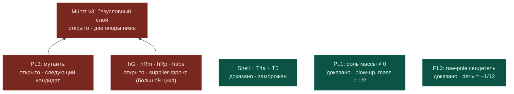

PACKET 2 FOR MYTHOS — Goal 042 closure + queued RULE_NAMING check + DISPATCH REQUEST
Repo: Malaeu/chen_q3 · branch rh_clean · HEAD c2424f24bd5bc67aaf4726df1d3a673888d493a9
Built: 2026-07-31 by conductor-CLI (Linux). Encoding: UTF-8, LF.

COVER NOTE (from owner + conductor):

1. GOAL 042 CLOSED: PL1_MASS_BLOWUP_WITNESS_PROVED. Witness h(u)=1_(0,1](u)·u,
   b=1, K=1; Mellin h s = 1/(s+1); mass = Mellin h 1 = 1/2 ≠ 0; blow-up
   ‖ζ(w)·Mellin h w‖ → atTop along 𝓝[≠] 1 via residue × continuity. Taint 0,
   axioms standard triple, lake build 8031 jobs PASS, frozen files untouched,
   goal consumed by SHA 9a2375c2… with zero mutation (CLOSED_GOAL_IMMUTABLE held).
   Scoring: P042-M1 (yours) CONFIRMED; P042-C1 (conductor) REFUTED — friction was
   witness coercion, not filter bookkeeping. Contrast pair PL1+PL2 complete:
   zero mass certified as exactly the removability mechanism.
   Files 1-3 below are your byte-audit material.

2. YOUR QUEUED CHECK: file 4 is RULE_NAMING_DISAMBIGUATION_2026-07-31.md in its
   current post-repair state (A1 canonical, A2 corollary, biconditional removed
   per Proshka verdict RULE_A_EQUIVALENCE_REJECTED). Its current SHA-256 is in
   the manifest. This closes the last line of your audit ledger.

3. FRONT MAP: file 5 is the post-042 Mermaid map (PL1 green). Convention adopted:
   maps/ on the bus holds immutable dated snapshots (PNG from your canvas +
   Mermaid source); owner relays your canvas renders, conductor materializes.

4. DISPATCH REQUEST (the actual question, per owner):
   a) NEXT MOVE, ranked by K2 kill-power-per-cost, TOWARD RH — that is the goal.
      The plant queue (PL3) is hygiene for the Müntz v3 shell; the supplier front
      hG/hRm/hRp/habs is what turns the conditional shell unconditional. But both
      live inside Route B = CHALLENGER_NOT_RH. So the owner asks the dispatcher
      directly: what is the single most effective next contract — PL3, the first
      supplier theorem (which one exactly), or a move on the H-bridge mainline —
      and WHY, with the registered prediction attached. If the honest answer is
      "supplier front, starting with <X>", name the exact theorem shape for
      Goal 043.
   b) ROUTING TABLE for the next cycle: who throws what to whom (owner is the
      only transport; Proshka reads GitHub herself; you are blind at work — state
      explicitly which files you need packeted next time).
   Constraints unchanged: no status promotion from bookkeeping, one goal - one
   theorem - one interface, LOCAL_FIRST, Aristotle only on exact API gap.

VERIFICATION CONTRACT: each payload lies strictly BETWEEN its BEGIN/END marker
lines (markers excluded); every file ends with a trailing newline (included).
Recompute SHA-256 over exactly those bytes; mismatch = paste leg broke.

MANIFEST (path · bytes · sha256):
  docs/routeB_bus/042_muntz_v3_pl1_mass_blowup_witness.goal.md · 6912 · 9a2375c271f24c4b6cb94d87998811724570f2c8bfb0468b347d0bc0b6d078c9
  docs/routeB_bus/042_muntz_v3_pl1_mass_blowup_witness.answer.md · 6385 · 421f2dc35d6c4327f59d5fb40fc918fb3e3014fcf41c49b99f6eac5c9d767619
  docs/routeB_bus/muntz_v3/RequestProject/MuntzV3PL1MassBlowupWitness.lean · 3974 · 1d1e8689a083867f68c3e5ec56f06bd5a271f4af68b632cc084b450f10bbb943
  docs/routeB_bus/proshka/RULE_NAMING_DISAMBIGUATION_2026-07-31.md · 3643 · 36dc61d2d756a8c94214eb210ddc698d9dee70017f62e66e4713e92b563bc5aa
  docs/routeB_bus/maps/2026-07-31_muntz_v3_plant_front_post042.md · 1453 · 49975f8d895beaef0b065cabb9f2f54d67580c4b1ab8387e1ef56dbb216a50dd

═══ FILE BEGIN: docs/routeB_bus/042_muntz_v3_pl1_mass_blowup_witness.goal.md ═══
# Goal 042 — MuntzV3 PL1 MassBlowupWitness (contrast plant to PL2)

ISSUED: 2026-07-31, Mythos (contour from Mythos dispatch message, "PL1 первым, голом 042";
  transcribed to the bus by conductor-CLI on owner's order)
MODE: LOCAL_FIRST · NO_ARISTOTLE_SUBMISSION_IN_THIS_CYCLE
SCOPE: ABSTRACT (single explicit witness) · VERIFIER TARGET: LEAN
ROUTE_STATE: CHALLENGER_NOT_RH · BUS_010 VOID · no status promotion from this goal
ORIGIN: Mythos K2 fork recommendation after PL2 byte-audit (PL1 cheapest: reuses the
  PL2 quadratic template); post-close guards of Goal 040 apply as reviewer guards
  (041_goal040_postclose_requirements_audit.md, non-normative there, normative HERE
  as explicit fields of this new contract).

## Semantic role (why PL1 matters)

PL2 showed: with mass 0 the raw value ζ(1)·Mellin h 1 is finite junk while the true
limit is d ≠ 0 — finite-vs-finite mismatch. PL1 is the CONTRAST plant: with mass ≠ 0
the pole of ζ is load-bearing — the raw product ‖ζ(w)·Mellin h w‖ BLOWS UP along
𝓝[≠] 1. Together they demonstrate both failure modes of the raw (non-pole-subtracted)
value and certify that zero mass is exactly the removability mechanism. No Route B or
RH consequence; falsifier-obligation layer of the Müntz v3 shell only.

## Standing constraints

- Frozen: muntz_v3/RequestProject/Main.lean and MellinCompactSupportAnalyticity.lean.
  Do not modify either; new work goes in a NEW file inside muntz_v3/RequestProject/.
- Frozen formulations: allowed — T4A_CLOSED_LOCALLY, MUNTZ_V3_T5_MELLIN_HYPOTHESIS_DISCHARGED,
  MUNTZ_V3_CONDITIONAL_SHELL_CONSUMED; forbidden — MUNTZ_V3_UNCONDITIONAL_LAYER_COMPLETE
  (PL1+PL2 do NOT unlock it: hG/hRm/hRp/habs supplier front remains open).
- RULE_INVENTORY_FIRST binding (A1 canonical, see proshka/RULE_NAMING_DISAMBIGUATION_2026-07-31.md):
  inventory own repo + pinned Mathlib BEFORE any cloud thought.
- CLOSED_GOAL_IMMUTABLE: this goal file is immutable once its answer exists.

## Inputs

- Goal 040 answer + PL2 Lean file (witness template: quadratic class on (0,1] via
  hasMellin_cpow_Ioc; generic-lemma assembly pattern residue × slope × uniqueness).
- muntz_v3/RequestProject/Main.lean (project Mellin; riemannZeta_residue_one usage at
  line 85; convention bridge from Goal 017).
- muntz_v3/RequestProject/MellinCompactSupportAnalyticity.lean (T4a: Measurable +
  supp ⊆ Icc 0 b + LipschitzOnWith K on Ico 0 b ⇒ AnalyticOnNhd ⇒ ContinuousAt at 1).
- Pinned Mathlib v4.28.0: riemannZeta_residue_one, Tendsto.mul, tendsto_nhds_unique,
  NormedField norm/atTop filter API (tendsto_atTop of ‖·‖ via nonvanishing limit over
  vanishing denominator), NeBot instances for 𝓝[≠] on ℂ.

## Primary theorem shape

```lean
theorem exists_rawZetaMellin_norm_blowup_at_one :
  ∃ (h : ℝ → ℂ) (b : ℝ) (K : NNReal),
    Measurable h ∧
    (∀ u, u ∉ Set.Icc (0 : ℝ) b → h u = 0) ∧
    LipschitzOnWith K h (Set.Ico (0 : ℝ) b) ∧
    (∫ u in Set.Ioi (0 : ℝ), h u ≠ 0) ∧
    Filter.Tendsto (fun w : ℂ => ‖riemannZeta w * Mellin h w‖)
      (nhdsWithin 1 {(1 : ℂ)}ᶜ) Filter.atTop
```

Mellin convention: same project convention as Goal 040 (Goal 017 bridge); at s = 1 the
identification Mellin h 1 = ∫_{Ioi 0} h must be PROVED (integrability from the T4a
hypothesis package), not assumed definitionally.

## Explicit strictness fields (post-close-guard analogue of A1.1; deleting either must
## break the proof)

```text
bump_mass ≠ 0            (exact closed form required, no numerical integration)
mellin_value_at_one ≠ 0  (via the PROVED identification Mellin h 1 = ∫ h)
```

## Proof route

1. Reuse search FIRST (cheapest decisive test): locate or assemble the generic lemma

```lean
lemma rawZetaMul_norm_tendsto_atTop
    (M : ℂ → ℂ) (m : ℂ)
    (hM : ContinuousAt M 1) (hM1 : M 1 = m) (hm : m ≠ 0) :
    Filter.Tendsto (fun w : ℂ => ‖riemannZeta w * M w‖)
      (nhdsWithin 1 {(1 : ℂ)}ᶜ) Filter.atTop
```

Registered assembly sketch: on 𝓝[≠] 1, (w−1)·ζ(w) → 1 (riemannZeta_residue_one) and
M w → m (continuity), so (w−1)·ζ(w)·M(w) → m ≠ 0; eventually
‖ζ(w)·M(w)‖ = ‖(w−1)ζ(w)M(w)‖ / ‖w−1‖ ≥ (‖m‖/2) / ‖w−1‖ with ‖w−1‖ → 0⁺ on the
punctured filter; conclude Tendsto atTop by comparison.

2. Witness from the PL2 template with the coefficient DETUNED from 3/2: simplest
   admissible choice h(u) = 1_(0,1](u) · u (b = 1, K = 1): Mellin h s = 1/(s+1) via
   hasMellin_cpow_Ioc; mass = Mellin h 1 = 1/2 ≠ 0 by exact rational arithmetic.
   Any coefficient c ≠ 3/2 in u − c·u² is acceptable if friction appears; do NOT
   spend budget optimizing the witness (K2).

3. ContinuousAt (Mellin h) 1 from T4a (AnalyticOnNhd ⇒ ContinuousAt) exactly as in
   the PL2 chain — no new analyticity work.

4. Instantiate the generic lemma with M := Mellin h, m := Mellin h 1.

## Forbidden

- no modification of Goal 040 files, its answer, or the PL2 Lean artifact;
- no rerun of T4a; no rebuild of the v3 shell;
- no numerical integration; mass and Mellin values by exact closed form only;
- no new axiom, sorry, admit, native_decide;
- no bundling with PL3 or the supplier front (one goal — one plant);
- no Route B or RH status promotion;
- no Aristotle submission in this cycle (cloud escalation only per protocol below).

## Validation

```text
lake env lean <touched-file>
lake build
grep taint terms (sorry | admit | axiom | native_decide | exact?)
#print axioms exists_rawZetaMellin_norm_blowup_at_one
axioms must be exactly [propext, Classical.choice, Quot.sound]
```

## Success code

PL1_MASS_BLOWUP_WITNESS_PROVED

## Failure codes (exactly one, fail-closed)

PL1_GENERIC_BLOWUP_API_GAP
PL1_NONZERO_MASS_INTEGRAL_GAP
PL1_MELLIN_VALUE_AT_ONE_GAP
PL1_WITNESS_LIPSCHITZ_GAP
LEAN_BUILD_FAIL

## Cloud escalation

Only after exactly one failure code above is produced; the Aristotle contract targets
only that missing theorem; RULE_INVENTORY_FIRST (A1) audit mandatory before submission;
English-only prompt; SHA-256 on the prompt text.

## Registered predictions (before execution)

P042-M1 (Mythos): PL1 is nearly free after the PL2 template — same quadratic class,
  detuned coefficient; generic blow-up lemma assembles locally (≤ 30 Lean lines);
  no cloud run needed.
P042-C1 (conductor): dominant friction = atTop/filter bookkeeping for the norm
  blow-up (comparison on the punctured filter), not Mellin machinery and not the
  witness.

## Answer requirements

042_muntz_v3_pl1_mass_blowup_witness.answer.md with MYTHOS_PROSHKA_HANDOFF + ACTIONS
LOG (else REJECTED); scope/verifier tags on every claim; explicit scoring of P042-M1
and P042-C1; one Route B state-history row (status not promoted); ROUTE_B_STATE update
as the last step; canon + mirror in one transaction; report — do not repair — any
divergence found on the way.
═══ FILE END: docs/routeB_bus/042_muntz_v3_pl1_mass_blowup_witness.goal.md ═══

═══ FILE BEGIN: docs/routeB_bus/042_muntz_v3_pl1_mass_blowup_witness.answer.md ═══
PL1_MASS_BLOWUP_WITNESS_PROVED

```yaml
PRIMARY: PL1_MASS_BLOWUP_WITNESS_PROVED
PRIMARY_COUNT: 1
SCOPE: ABSTRACT_SINGLE_EXPLICIT_WITNESS
VERIFIER: LEAN
ROUTE_STATE: CHALLENGER_NOT_RH
STATE_PROMOTION: false
BUS_010: VOID
ARISTOTLE_SUBMISSIONS_THIS_CYCLE: 0
FROZEN_FILES_CHANGED: 0

GOAL_VERSION_CONSUMED:
  FILE: 042_muntz_v3_pl1_mass_blowup_witness.goal.md
  SHA256: 9a2375c271f24c4b6cb94d87998811724570f2c8bfb0468b347d0bc0b6d078c9

THEOREM:
  NAME: exists_rawZetaMellin_norm_blowup_at_one
  FILE: muntz_v3/RequestProject/MuntzV3PL1MassBlowupWitness.lean
  FILE_SHA256: 1d1e8689a083867f68c3e5ec56f06bd5a271f4af68b632cc084b450f10bbb943
  LINES: 99
  BYTES: 3974
  ISOLATED_LEAN: PASS
  LAKE_BUILD: PASS_8031_JOBS
  TAINT_MATCHES: 0
  AXIOMS: [propext, Classical.choice, Quot.sound]

WITNESS:
  FORMULA: "h(u) = 1_Ioc(0,1)(u) * u"
  B: 1
  K: 1
  SUPPORT: Ioc_0_1_SUBSET_Icc_0_1
  MELLIN_FORMULA_ON_RE_GT_NEG_ONE: "1/(s+1)"
  MASS: "1/2"
  MELLIN_AT_ONE: "1/2"
  RAW_ZETA_MELLIN_NORM_LIMIT: atTop
```

All theorem and witness claims in the YAML block are
`[ABSTRACT][LEAN]`; source hashes are `[CONTROL][SHA256]`, and route,
submission, frozen-file, and bus fields are `[CONTROL][LOCAL]`.

## Exact Lean result

The exported theorem has exactly the requested existential shape:
`Measurable h`, support in `Icc 0 b`, `LipschitzOnWith K h (Ico 0 b)`,
nonzero mass, and
`Tendsto (fun w => ‖riemannZeta w * Mellin h w‖) (𝓝[≠] 1) atTop`.
`[ABSTRACT][LEAN]`

The witness is

```text
h(u) = 1_Ioc(0,1)(u) * u,   b = 1,   K = 1.
```

On `Ico 0 1`, the witness is the real-to-complex isometric embedding, so
the Lipschitz constant is exactly `1`. It is measurable and vanishes
outside `Icc 0 1`. `[ABSTRACT][LEAN]`

Pinned Mathlib's `hasMellin_cpow_Ioc`, together with the proved
project/Mathlib Mellin convention bridge, gives

```text
Mellin h s = 1/(s+1)    when -1 < re s.
```

At `s = 1`, exact normalization proves `Mellin h 1 = 1/2`; unfolding the
project Mellin definition at that checked identity proves
`∫ u in Ioi 0, h u = 1/2`. Thus both strictness fields
`bump_mass ≠ 0` and `mellin_value_at_one ≠ 0` are discharged by exact
rational arithmetic, with no numerical integration. `[ABSTRACT][LEAN]`

The Goal 039 compact-support theorem gives
`AnalyticOnNhd ℂ (Mellin h) {s | 0 < s.re}`, hence
`ContinuousAt (Mellin h) 1`. `[ABSTRACT][LEAN]`

The generic lemma `rawZetaMul_norm_tendsto_atTop` multiplies
`riemannZeta_residue_one` by the continuous Mellin limit. The numerator
norm tends to `‖m‖ > 0`, while
`‖w - 1‖⁻¹ → atTop` on `𝓝[≠] 1`; exact field cancellation identifies
their product with `‖riemannZeta w * M w‖`. `[ABSTRACT][LEAN]`

This is the required PL1 contrast to Goal 040: PL2's zero mass cancels the
pole and leaves a finite raw-value mismatch, whereas this PL1 witness has
nonzero mass, so the zeta pole is load-bearing and the raw norm diverges.
No Route B or RH consequence follows. `[ABSTRACT][LEAN]`

## Frozen boundary

`Main.lean`, `MellinCompactSupportAnalyticity.lean`, the Goal 040 answer,
and `MuntzV3PL2RawPoleMismatch.lean` have zero source diff. All new Lean
work is confined to `MuntzV3PL1MassBlowupWitness.lean`.
`[CONTROL][GIT]`

No Aristotle command or theorem-proving cloud submission was made.
`[CONTROL][LOCAL]`

## Validation

```text
[ABSTRACT][LEAN] lake env lean RequestProject/MuntzV3PL1MassBlowupWitness.lean  PASS
[ABSTRACT][LEAN] lake build                                                        PASS (8031 jobs)
[ABSTRACT][LEAN] taint scan                                                        0 matches
[ABSTRACT][LEAN] #print axioms exists_rawZetaMellin_norm_blowup_at_one             [propext, Classical.choice, Quot.sound]
[CONTROL][GIT]   frozen source diff                                                 0
[CONTROL][LOCAL] Aristotle submissions                                              0
```

## Prediction score

- `P042-M1`: **CONFIRMED**. The PL2 witness pattern and
  `hasMellin_cpow_Ioc` made the explicit witness cheap; the generic
  residue-times-mass blow-up lemma assembled locally and no cloud run was
  needed. `[ABSTRACT][LEAN]`
- `P042-C1`: **DISCONFIRMED**. The atTop/filter proof compiled on its first
  Lean attempt using `pos_mul_atTop` and
  `inv_tendsto_nhdsGT_zero`; the only proof-level iteration was the
  real-to-complex measurability/Lipschitz coercion for the witness.
  `[ABSTRACT][LEAN]`

## ACTIONS LOG

```text
1. [CONTROL][GIT]   Checked rh_clean and ran git pull --ff-only first.          PASS
2. [CONTROL][SHA256] Locked both Goal 042 copies at 9a2375c2...d078c9.          PASS
3. [CONTROL][LOCAL] Read Route B state/control and ran routeb_status --check.   PASS
4. [CONTROL][LOCAL] Confirmed CHALLENGER / NOT_RH and Bus 010 void.             PASS
5. [ABSTRACT][SOURCE_AUDIT] Inventoried PL2, T4a, and pinned Mathlib APIs.       DONE
6. [CONTROL][LOCAL] Attempted four q3_docs queries; local index stalled.         RECORDED
7. [ABSTRACT][LEAN] Added one new PL1 Lean file; frozen files untouched.         DONE
8. [ABSTRACT][LEAN] Proved witness measurability, support, and K=1 Lipschitz.    PASS
9. [ABSTRACT][LEAN] Proved Mellin formula, mass=1/2, and Mellin(1)=1/2.          PASS
10. [ABSTRACT][LEAN] Proved generic nonzero-mass norm blow-up and instantiated. PASS
11. [ABSTRACT][LEAN] Ran isolated Lean, full build, taint, and axiom checks.     PASS
12. [CONTROL][LOCAL] Emitted no Aristotle submission.                           PASS
13. [CONTROL][MIRROR] Wrote canonical answer and code mirror together.           DONE
14. [CONTROL][STATE] Added one non-promoting Route B history row last.           DONE
```

## MYTHOS_PROSHKA_HANDOFF

```text
PRIMARY: PL1_MASS_BLOWUP_WITNESS_PROVED
GOAL_SHA256: 9a2375c271f24c4b6cb94d87998811724570f2c8bfb0468b347d0bc0b6d078c9
SCOPE: ABSTRACT / one explicit witness
VERIFIER: Lean 4.28.0 + Mathlib v4.28.0
WITNESS: h(u)=1_Ioc(0,1)(u)*u; b=1; K=1
MELLIN_FORMULA: 1/(s+1) on re(s)>-1
MASS: exactly 1/2, nonzero
MELLIN_AT_ONE: exactly 1/2, nonzero
RAW_NORM: tends to atTop along the punctured neighborhood of 1
PL2_CONTRAST: zero mass -> finite mismatch; nonzero mass -> load-bearing pole
TAINT: zero
AXIOMS: exactly [propext, Classical.choice, Quot.sound]
ARISTOTLE: no submission in this cycle
ROUTE: CHALLENGER / NOT_RH
BUS_010: VOID
NEXT: return to the existing supplier front; do not infer any status promotion
```
═══ FILE END: docs/routeB_bus/042_muntz_v3_pl1_mass_blowup_witness.answer.md ═══

═══ FILE BEGIN: docs/routeB_bus/muntz_v3/RequestProject/MuntzV3PL1MassBlowupWitness.lean ═══
import RequestProject.MuntzV3PL2RawPoleMismatch

open Set Filter MeasureTheory Complex Asymptotics
open scoped Topology

namespace EStarMuntzZeroMassContinuation

noncomputable def pl1Witness (u : ℝ) : ℂ :=
  (Set.Ioc (0 : ℝ) 1).indicator (fun t => (t : ℂ) ^ (1 : ℂ)) u

theorem rawZetaMul_norm_tendsto_atTop
    (M : ℂ → ℂ) (m : ℂ)
    (hM : ContinuousAt M 1) (hM1 : M 1 = m) (hm : m ≠ 0) :
    Filter.Tendsto (fun w : ℂ => ‖riemannZeta w * M w‖)
      (nhdsWithin 1 {(1 : ℂ)}ᶜ) Filter.atTop := by
  have hnum :
      Tendsto (fun w : ℂ => ‖((w - 1) * riemannZeta w) * M w‖)
        (𝓝[≠] 1) (𝓝 ‖m‖) := by
    simpa [hM1] using
      (riemannZeta_residue_one.mul (hM.tendsto.mono_left inf_le_left)).norm
  have hden :
      Tendsto (fun w : ℂ => (‖w - 1‖ : ℝ)⁻¹) (𝓝[≠] 1) atTop :=
    (tendsto_norm_sub_self_nhdsNE (1 : ℂ)).inv_tendsto_nhdsGT_zero
  have hblow := hnum.pos_mul_atTop (norm_pos_iff.mpr hm) hden
  apply hblow.congr'
  filter_upwards [self_mem_nhdsWithin] with w hw
  have hw1 : w - 1 ≠ 0 := sub_ne_zero.mpr hw
  rw [← norm_inv, ← norm_mul]
  congr 1
  field_simp

private theorem pl1Witness_on_Ico {u : ℝ} (hu : u ∈ Set.Ico (0 : ℝ) 1) :
    pl1Witness u = (u : ℂ) := by
  by_cases h0 : u = 0
  · simp [pl1Witness, h0]
  · have hu0 : 0 < u := lt_of_le_of_ne hu.1 (Ne.symm h0)
    simp [pl1Witness, Set.mem_Ioc, hu0, hu.2.le, Complex.cpow_one]

private theorem pl1Witness_mellin_eq (s : ℂ) (hs : -1 < s.re) :
    Mellin pl1Witness s = 1 / (s + 1) := by
  have h1 := hasMellin_cpow_Ioc (s := s) (1 : ℂ) (by norm_num; linarith)
  have hbridge : Mellin pl1Witness s = mellin pl1Witness s := by
    unfold Mellin mellin
    apply integral_congr_ae
    filter_upwards with u
    simp only [smul_eq_mul]
    rw [mul_comm]
  rw [hbridge]
  change mellin
      ((Set.Ioc (0 : ℝ) 1).indicator (fun t => (t : ℂ) ^ (1 : ℂ))) s =
    1 / (s + 1)
  exact h1.2

theorem exists_rawZetaMellin_norm_blowup_at_one :
    ∃ (h : ℝ → ℂ) (b : ℝ) (K : NNReal),
      Measurable h ∧
      (∀ u, u ∉ Set.Icc (0 : ℝ) b → h u = 0) ∧
      LipschitzOnWith K h (Set.Ico (0 : ℝ) b) ∧
      (∫ u in Set.Ioi (0 : ℝ), h u ≠ 0) ∧
      Filter.Tendsto (fun w : ℂ => ‖riemannZeta w * Mellin h w‖)
        (nhdsWithin 1 {(1 : ℂ)}ᶜ) Filter.atTop := by
  have hmeas : Measurable pl1Witness := by
    change Measurable
      ((Set.Ioc (0 : ℝ) 1).indicator (fun t => (t : ℂ) ^ (1 : ℂ)))
    simpa only [Complex.cpow_one, pow_one] using
      (Complex.continuous_ofReal.pow 1).measurable.indicator
        (measurableSet_Ioc : MeasurableSet (Set.Ioc (0 : ℝ) 1))
  have hsupp : ∀ u, u ∉ Set.Icc (0 : ℝ) 1 → pl1Witness u = 0 := by
    intro u hu
    simp only [pl1Witness, Set.indicator_apply]
    have hout : u ∉ Set.Ioc (0 : ℝ) 1 := by
      intro hui
      exact hu ⟨hui.1.le, hui.2⟩
    simp [hout]
  have hlip : LipschitzOnWith (1 : NNReal) pl1Witness (Set.Ico (0 : ℝ) 1) := by
    apply LipschitzOnWith.of_dist_le_mul
    intro x hx y hy
    rw [pl1Witness_on_Ico hx, pl1Witness_on_Ico hy]
    simpa using (Complex.isometry_ofReal.dist_eq x y).le
  have hmellin : Mellin pl1Witness 1 = (1 / 2 : ℂ) := by
    have hm := pl1Witness_mellin_eq (1 : ℂ) (by norm_num)
    norm_num at hm
    exact hm
  have hmass : ∫ u in Set.Ioi (0 : ℝ), pl1Witness u = (1 / 2 : ℂ) := by
    simpa [Mellin] using hmellin
  have hana : AnalyticOnNhd ℂ (Mellin pl1Witness) {s : ℂ | 0 < s.re} := by
    simpa [Mellin] using
      (mellin_compactSupport_analyticOnNhd pl1Witness 1 1 hmeas hsupp hlip)
  have hcont : ContinuousAt (Mellin pl1Witness) 1 :=
    (hana 1 (by norm_num)).continuousAt
  refine ⟨pl1Witness, 1, 1, hmeas, hsupp, hlip, ?_, ?_⟩
  · rw [hmass]
    norm_num
  · apply rawZetaMul_norm_tendsto_atTop
      (Mellin pl1Witness) (Mellin pl1Witness 1) hcont rfl
    rw [hmellin]
    norm_num

end EStarMuntzZeroMassContinuation
═══ FILE END: docs/routeB_bus/muntz_v3/RequestProject/MuntzV3PL1MassBlowupWitness.lean ═══

═══ FILE BEGIN: docs/routeB_bus/proshka/RULE_NAMING_DISAMBIGUATION_2026-07-31.md ═══
# RULE NAMING DISAMBIGUATION — label "Rule 0" retired
Date: 2026-07-31 · Author: Mythos (materialized by Codex; Filesystem bridge down)
Trigger: Proshka verdict GOAL_040_CORRECTIONS_RATIFIED_PENDING_PIN exposed a name
collision: the label "Rule 0" pointed at two different rule-objects in two channels.
No formulation was wrong; the LABEL was ambiguous (K3 transfer-audit class).

## Rule A — RULE_INVENTORY_FIRST (Aristotle usage protocol amendment)
Canonical rule: A1.
A2 status: operational corollary and T4a precedent of A1.
Logical relation: A1 ⇒ A2. No claim A2 ⇒ A1.
Canonical texts (quoted unchanged):
A1 (Mythos): Before ANY run — not only deep runs — inventory the own repository and
pinned Mathlib. A run on an already-proved theorem is a protocol failure, not progress.
A2 (Proshka, 2026-07-30): "cloud search stops when an exact local theorem already
closes the interface"; it is forbidden to submit an Aristotle theorem already proved
in canon merely because the contract predates the local search result.
Scope: Aristotle/cloud submissions. Home: proshka/ARISTOTLE_PROTOCOL_MYTHOS_RATIFICATION.md
(its internal heading "Rule 0" is to be read as RULE_INVENTORY_FIRST; file text left
intact as history).

## Rule B — RULE_SEND_DISCIPLINE (control plane, dispatch of prepared texts)
Live formulation (owner channel, as quoted by Proshka 2026-07-31): "по умолчанию
сообщение агенту показывается владельцу, а не отправляется; прямое отправление
разрешено только после явного «отправь»; адресат и канал указываются однозначно."
Ratification criteria (Proshka, verbatim):
R0.1 DEFAULT_SHOW: подготовка текста не является разрешением на отправку.
R0.2 EXPLICIT_SEND_AUTHORITY: отправка разрешена только явной текущей командой
владельца; старое общее "go" или факт готовности goal не считается разрешением.
R0.3 RECIPIENT_AND_CHANNEL_LOCK: перед действием однозначно названы адресат и канал.
Adopted by Mythos immediately; compliance mapping:
- Marker blocks in Mythos chat output are PREPARED TEXTS shown to the owner (R0.1);
  nothing auto-sends.
- Dispatch happens only by the owner's explicit current action: launching Codex on a
  goal file (Codex, CLI), pasting a brief to Proshka (Proshka, browser), submitting an
  Aristotle contract (Aristotle, browser) — recipient and channel named (R0.2, R0.3).
- Goal files on the bus are preparation, not dispatch.

## Non-equivalence statement
Rule A and Rule B are DIFFERENT rules. No equivalence is claimed between them.
Ratification requests are separate:
  Rule A: A1 is canonical; A2 is its cloud-duplication corollary.
  Rule B: live text ≡ R0.1–R0.3.

---
MATERIALIZATION NOTE (deviation, honest provenance): executed by conductor-CLI
(Claude Code, Linux) on the owner's direct order of 2026-07-31, because the owner
chose same-day execution; Codex was not invoked. Text above is verbatim from the
Mythos message; only this note is added.

RELATION REPAIR NOTE (2026-07-31, same day, later): per Proshka verdict
RULE_B_AND_POSTCLOSE_PIN_RATIFIED; RULE_A_EQUIVALENCE_REJECTED, the false
biconditional (A1 claimed equivalent to A2) was replaced by: A1 canonical, A2 operational
corollary / T4a precedent, A1 ⇒ A2, no converse claimed. Quoted A1/A2 texts
and Rule B untouched. Executed by conductor-CLI on owner's order.
═══ FILE END: docs/routeB_bus/proshka/RULE_NAMING_DISAMBIGUATION_2026-07-31.md ═══

═══ FILE BEGIN: docs/routeB_bus/maps/2026-07-31_muntz_v3_plant_front_post042.md ═══
# Front map — Müntz v3 plant layer (2026-07-31, post-042)

Author of layout: Mythos · State update: conductor-CLI after Goal 042 closure.
Supersedes: `2026-07-31_muntz_v3_plant_front.md` (kept immutable).
PNG snapshot: pending next Mythos canvas render (Mermaid below is authoritative
for this state).
State as of: Goal 042 closed, PL1_MASS_BLOWUP_WITNESS_PROVED (byte-audit by
conductor: SHA match, taint 0, canon=mirror; Lean build per answer 8031 jobs PASS).



Legend: green = доказано (байт-аудит) · red = открыто.
Contrast pair complete: PL2 (mass 0 ⇒ finite mismatch) + PL1 (mass ≠ 0 ⇒ blow-up)
certify zero mass as exactly the removability mechanism.
═══ FILE END: docs/routeB_bus/maps/2026-07-31_muntz_v3_plant_front_post042.md ═══

