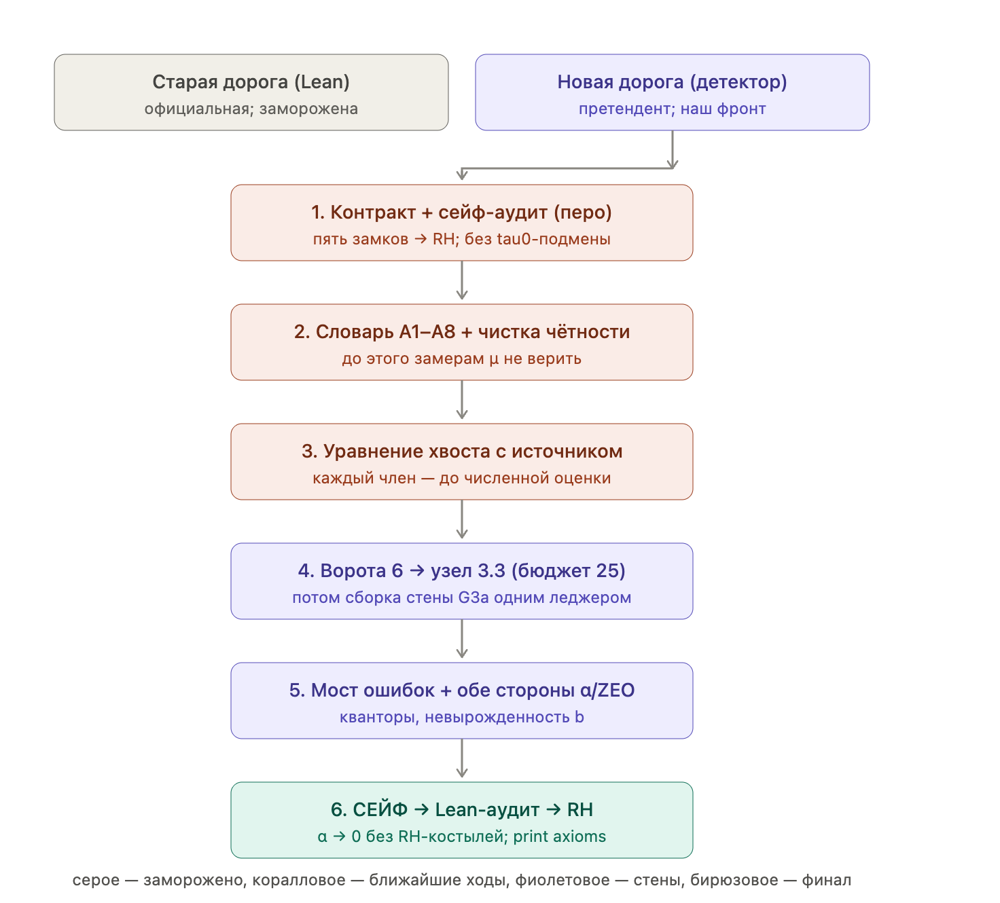

# Route B detector campaign — RH closure map (2026-07-10)

STATUS: `STRATEGIC_MAP / NOT_RH / NON-NORMATIVE`.

This card preserves the user-provided closure map and records its precise
interpretation after `PoissonResidualChannelAudit_v1`.  It is project memory,
not a theorem, goal file, route promotion, or replacement for
`PROJECT_ORCHESTRATOR.md`, Route B execution control, or the theorem contract.
Mythos contract v2 is present and its Bus 008 algebraic crosscheck passed.
`PO-0` remains open because source/ZEO provenance failed with
`ZEO_EXPORT_AMBIGUOUS` and `R13_SOURCE_MISSING`.



Image SHA-256:
`cea38fa539a6a59f4f288b485feedd63d914b8d4b83bbf3e5454c4bccab0cba7`.

## Literal map

The diagram separates two roads:

```text
Old road (Lean): official; frozen
New road (detector): challenger; current front
```

The detector road is displayed as six dependent stages:

```text
1. Contract + SAFE audit (pen)
   five locks -> RH; no tau0 substitution

2. Dictionary A1-A8 + parity cleanup
   freeze mu measurements until this is closed

3. Tail equation with source
   derive every term before numerical evaluation

4. Gate 6 -> node 3.3 (budget 25)
   then assemble G3a with one ledger

5. DetectorBridge + both alpha/ZEO directions
   exact quantifiers and nondegeneracy of b

6. SAFE -> Lean audit -> RH
   alpha tends to zero without RH-conditional shortcuts; print axioms
```

Color legend in the image:

- gray: frozen;
- coral: nearest work;
- violet: proof walls;
- turquoise: terminal export.

## What the map gets right

1. **Contract before long computation.**  The exact implication
   `five locks -> RH` must be written with types, quantifiers, normalization,
   and source classification before closing the analytic supply chain.

2. **SAFE is audited before it is treated as an endgame.**  The central
   noncircularity question is what unconditional mechanism produces a sequence
   `lambda_j -> infinity` with `alpha(lambda_j) -> 0`.

3. **The detector dictionary precedes spectral interpretation.**  Until A1-A8
   and parity separation are exact, the measured `mu_1`, `mu_2`, `mu_3`, gap,
   and `W'` slopes remain diagnostics rather than proof inputs.

4. **The projected prolate equation is inhomogeneous.**  Its commutator,
   boundary, pole, and midpoint sources must be derived before evaluation; a
   homogeneous ODE is not an admissible replacement.

5. **G3a is a single same-unit ledger.**  Bus 007 supplies the operational
   template: exact channel inventory, signed-tail certificate, whole-ledger
   closure, and planted failures.

6. **The final audit is formal.**  A successful analytic argument still needs
   an exact Lean export and an axiom audit; a compiled legacy broad-cone theorem
   is not sufficient.

## Necessary precision corrections

### A. “Old road frozen” is local campaign language

The phrase must not be read as “proved,” “dead,” or “mathematically closed.”
At the global project level, `PROJECT_ORCHESTRATOR.md` still names `H-bridge`
as the official primary route and `PO3-square.2d3` as its live mathematical
wall.  The diagram means only that the detector campaign is the current local
front and does not silently promote itself over the official route.

### B. Bus 007 retired the second-edge explanation

The correct fixed-cell ledger is

```text
D_direct = P_40 + T_40 + C_pole + C_mid,
C_left   = ABSENT_FROM_CURRENT_IDENTITY,
C_right  = ABSENT_FROM_CURRENT_IDENTITY,
R_other  = ZERO_EXACT.
```

The old `SECOND_EDGE_CHANNEL` label is retired.  The mismatch came from the
certified signed tail plus the full-endpoint versus starred half-endpoint
convention, not from a new right-edge Poisson channel.  Therefore the tail
equation remains necessary for Gate 6A, but not as an explanation of the Bus
006 Poisson discrepancy.

### C. SAFE is a theorem, not a final button

The turquoise box abbreviates the hardest new mathematical claim.  Its honest
current status is:

```text
SAFE_MECHANISM_CANDIDATE_IDENTIFIED
SAFE_THEOREM_NOT_PROVED
```

The corrected candidate mechanism is a quantitative two-sided spectral pair on
an exact asymptotic family:

```text
alpha(lambda) <= C_alpha lambda^r_alpha exp(-4*pi*lambda^2),
mu_3(lambda) - mu_1(lambda)
  >= c_delta lambda^r_delta exp(-4*pi*lambda^2),
|b(lambda)| <= C_b lambda^q_b,
r_delta - r_alpha > 2*q_b + 1,
plus sign/nondegeneracy and N(lambda)/continuum control
implies W'(lambda_j) -> 0 along lambda_j^2 in N.
```

These leaves and their assembly remain proof obligations. In particular, an
upper bound for `mu_1` is not a substitute for the required upper bound on the
canonical `alpha`, and `alpha -> 0` alone does not control the vanishing gap.

### D. The quantitative SAFE witness needs an explicit quantifier

The intended target is not an unqualified pointwise limit of `alpha`. Contract
v2 uses the sequence form

```text
exists lambda_j in Lambda,
lambda_j -> infinity,
W'(lambda_j) -> 0
```

and still must prove the exact conversion consumed by ZEO, including the
finite-to-universal and Rouché quantifiers.

### E. `print axioms` is necessary but not sufficient

The terminal check must also verify that:

- the exported theorem consumes the exact classical Weil/detector interface;
- no restricted `Weil_criterion_tau0` cone is substituted for the full target;
- no RH-conditional zero statistics enter the conclusion chain;
- the paper and Lean theorem use the same packet, endpoint convention, and
  normalization.

## Interpretation of Mythos's commentary

Mythos accepts the ordering in the map. Contract v2 makes the SAFE race precise:
it is between `SafeAlphaUpper`, `SafeGapLower`, the growth of `b`, and the
strict margin `r_delta-r_alpha>2*q_b+1`, with an explicit `N=N(lambda)` or
finite-to-continuum bridge. He does not claim these leaves as theorems yet.

Mythos also publicly retracts two earlier diagnoses for the Bus 006 mismatch:

- the mismatch did not disappear merely by extending an ordinary truncated
  sum;
- the commutator source was not the missing Poisson channel.

The exact Bus 007 repair is `T_40 + C_pole + C_mid`, with no `C_right`.

## PO-0 countercheck for contract v2

Bus 008 checked these points. The contract algebra passed, but `PO-0` did not
close because the persisted rGap13 source is missing and historical ZEO status
claims conflict with `OPEN_CRITICAL`:

1. What are the five locks, with exact theorem names and types?
2. Does the contract distinguish the official `H-bridge` route from the
   detector challenger?
3. Is `SafeAlphaUpper` about the chosen canonical `alpha`, not `mu_1`?
4. Is the `+1` in `r_delta-r_alpha>2*q_b+1` preserved everywhere?
5. Are A1-A8 and parity cleanup prerequisites rather than numerical footnotes?
6. Does the tail equation keep every source term explicit?
7. Does Gate 6 feed node 3.3 with the registered budget `B* <= 25`?
8. Does `DetectorBridge` land in `SafeAlphaUpper`, while ZEO receives the
   quantitative `W'` witness with correct quantifiers and nondegenerate `b`?
9. Is the final RH export free of tau0 substitution and RH-conditional input?

## Current weakest justified conclusion

The image is a good execution-order map.  It does not show that RH is close in
proof distance: steps 4, 5, and especially SAFE remain genuine theorem walls.
Its strongest value is organizational: it prevents the team from completing a
long analytic chain before discovering that the final SAFE implication is
circular, under-specified, or attached to the wrong test class.
