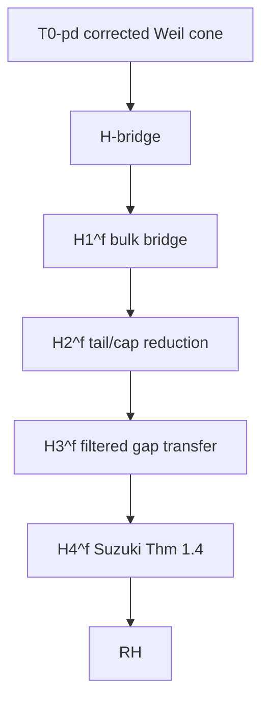

# Proshka prompt: H1 reset and simplification (2026-03-14)

## Mission

We need you to step back from the recent rank/basis diagnostics and recover the
simplest honest mathematical question inside the live Suzuki route.

Please do **not** continue from the current numerics as if the target were
"find the right rank-4/5/6 basis". That was only a diagnostic detour.

We want a reset.

## Current public route



The active route is still:

```text
T0-pd -> H-bridge -> H4 -> RH
```

and inside `H-bridge` the only serious live blocker is `H1^f`.

## What is actually solid

These points are not the problem:

1. The two-sided filtered geometry is the right one.
   The exact metric side is:
   `S_{a,M,N}^* J_a S_{a,M,N} = B_{M,N} = \Delta_{M,N}^* \Delta_{M,N}`.
2. The correct finite Q3 comparison object is the filtered tail compression:
   `\widetilde Q_{M,N} = \Delta_{M,N}^* Q_{M+1} \Delta_{M,N}`.
3. The raw theorem shape
   `w_{rs}(a) = \kappa(a) q_{rs}`
   is structurally false and should stay dead.
4. The filtered route is still the primary live operator route.
5. The `(+,-)` family behaves like the stable anchor much more than `(++ )`.

## What looks misleading now

We think we may have started overfitting the wrong object.

Recent numerics show:

- low-mode defect is dead;
- global shared rank-3 cap-defect is dead;
- pooled in-sample common bases can look good;
- honest prefix holdout across `M` still looks bad.

So the phrases

```text
"shared rank-3 defect"
"try rank 4/5/6"
"find the right basis"
```

are now suspect as *primary mathematical language*.

They may still be useful diagnostics, but they no longer look like the right
front-door theorem shape.

## What we want from you

Please step back and answer the simpler root question:

```text
What is the natural operator-level source of the filtered mismatch in H1^f?
```

Not:

```text
What is the best numerical low-rank fit?
```

More concretely, we want you to classify the defect into one of the following
structural types:

1. exact filtered intertwining after the right reformulation;
2. explicit boundary/cap correction;
3. short-range local correction
   (commutator / Toeplitz-Hankel / banded / near-diagonal strip);
4. genuine bulk mismatch, meaning Branch A should be abandoned.

## Strong preference

Please prefer:

- explicit operator identities;
- commutator or boundary explanations;
- formulas that are stable in `M`;
- theorem shapes that do not depend on numerically guessing a basis.

Please avoid:

- proposing a new rank hunt;
- treating `rank 4/5/6` as if it were already meaningful structure;
- reviving the dead raw identity;
- opening a brand-new RH architecture unless you think the current `H1^f`
  route is fundamentally false.

## Key simplified question

The reset question is really this:

```tex
D_{a,M,N}
:=
S_{a,M,N}^* G_g[a] S_{a,M,N}
- \kappa(a)\,\Delta_{M,N}^* Q_{M+1} \Delta_{M,N}.
```

What kind of object should `D_{a,M,N}` naturally be?

If the right answer is not finite-rank, that is fine.
We would much rather have the correct simpler defect class than another false
small-rank story.

## Deliverables we want

Please return a compact note with four items:

1. A simplified theorem map for `H1^f`, preferably with a tiny diagram.
2. Your best guess for the correct structural class of `D_{a,M,N}`.
3. A concrete algebraic starting point:
   what formula or decomposition should we try to prove first?
4. A kill list:
   which current lines of thought should we stop immediately?

## If you think we went wrong earlier

Say so explicitly.

We are not asking you to rescue the current rank/basis narrative.
We are asking you to tell us whether we should go back to:

- an exact filtered identity,
- an explicit cap/boundary term,
- a local strip/banded defect,
- or a different route entirely.

## Minimal file context

Use these as the current source-of-truth starting points:

- `q3.lean.aristotle/ACTIVE/SESSION_ENTRY.md`
- `q3.lean.aristotle/PROJECT_ORCHESTRATOR.md`
- `q3.lean.aristotle/docs/insights/h1_two_sided_filtered_bridge_2026_03_08.md`
- `q3.lean.aristotle/docs/insights/h1_cap_defect_theorem_shape_2026_03_10.md`
- `q3.lean.aristotle/docs/insights/h1_split_classifier_fixed_kappa_2026_03_11.md`
- `q3.lean.aristotle/docs/insights/h1_family_gram_a_basis_2026_03_12.md`
- `q3.lean.aristotle/docs/insights/h1_family_gram_prefix_holdout_2026_03_12.md`

## One-sentence summary

We need you to help us rewind from a possibly misleading rank/basis hunt back
to the simplest honest operator-theoretic question inside `H1^f`.
