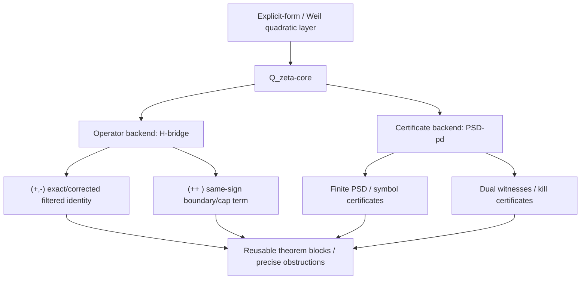

# `Q_\zeta`-core skeleton (2026-03-15)

## Status

This note introduces a thin canonical coordination layer for the live Q3
project.

It is **not** a new RH endgame and **not** a replacement for the public
mainline.

The public route stays

```text
T0-pd -> H-bridge -> H4 -> RH,
```

with `PSD-pd` kept as the explicit fallback constructive route.

## Purpose

The project now needs one capital layer that can absorb existing work instead
of one more local theorem idea.

The right object is a thin `Q_\zeta`-core:

```text
known criteria / live routes / new ideas
-> translators into one canonical explicit-form quadratic-operator layer
-> analytic or certificate outputs
-> reusable lemmas / precise obstructions
```

## What `Q_\zeta`-core is

`Q_\zeta`-core means:

- the canonical explicit-form / Weil quadratic-form layer of the project;
- together with its operator realizations, finite shadows, and certificate
  outputs;
- together with a small interface saying how a route enters this layer and how
  it exits with either a theorem block or a kill certificate.

For the current project, the layer is represented by the existing live objects:

- the generalized form-pair data `G_g[a], J_a`;
- the filtered finite comparison object
  `\widetilde Q_{M,N}=\Delta_{M,N}^*Q_{M+1}\Delta_{M,N}`;
- the filtered defect
  `D_{a,M,N}=S_{a,M,N}^*G_g[a]S_{a,M,N}
   -\kappa(a)\Delta_{M,N}^*Q_{M+1}\Delta_{M,N}`;
- the packet quadratic-form/kernel shadow
  `K_Q(g_i,g_j)=\mathcal Q(g_i*\widetilde{g_j})`;
- the strict finite symbol
  `S_J(\theta)=A_J(\theta)-P_J(\theta)`.

## What `Q_\zeta`-core is not

- not a third RH route;
- not a request to widen the active scope to Li / Nyman--Beurling /
  de Branges right now;
- not a new theorem claim beyond what the current live routes can actually
  support;
- not a license to reopen the dead raw identity
  `w_{rs}(a)=\kappa(a)q_{rs}`.

## Two immediate backends

### 1. Operator backend: `H-bridge`

This is the primary live backend.

Its role inside `Q_\zeta`-core is:

- turn the generalized form-pair data into the filtered defect calculus;
- isolate exact bulk versus boundary/cap/compression terms;
- feed the live theorem ladder
  `H1^\infty -> H1^\partial -> H1^f -> H2^f -> H3^f -> H4^f`.

The first theorem-sized target here stays:

```tex
M^{+-}(a)=\kappa_{+-}(a)\widetilde Q^{+-}+E_a^{+-},
```

with the goal of proving either `E_a^{+-}=0` or an explicit boundary/cap form.

Then the real hard block becomes:

```tex
M^{++}(a)-\kappa_{+-}(a)\widetilde Q^{++}=H_a^{\mathrm{ss}}+C_a^{\mathrm{cap}}.
```

### 2. Certificate backend: `PSD-pd`

This is the explicit fallback constructive backend.

Its role inside `Q_\zeta`-core is:

- provide strict finite shadows of the same quadratic-form layer;
- produce honest positivity certificates on admissible dictionaries;
- produce dual obstructions when a proposed theorem shape is false.

The active certificate objects remain:

- packet kernel `K_Q(g_i,g_j)`;
- finite symbol `S_J(\theta)=A_J(\theta)-P_J(\theta)`;
- coefficient bounds on `\alpha_m,\beta_m`;
- Poisson-regularized finite verification.

## Core interfaces

`Q_\zeta`-core should be treated as a 3-interface object.

### A. Representation interface

What is the canonical object?

- explicit-form quadratic form `\mathcal Q`;
- operator realization `G_g[a], J_a`;
- finite filtered shadows `\widetilde Q_{M,N}`;
- packet-kernel shadows `K_Q(g_i,g_j)`.

### B. Translation interface

How does a live route enter the core?

- `H-bridge` enters through filtered synthesis and defect calculus;
- `PSD-pd` enters through packet-kernel positivity and finite symbols;
- future criteria may enter only after these two backends are explicit.

### C. Certificate interface

What counts as real progress?

- analytic certificate:
  explicit decomposition / positivity / coercivity / spectral barrier;
- finite certificate:
  PSD block / interval certificate / verified finite symbol inequality;
- dual certificate:
  honest witness that kills a false theorem shape.

## First active outputs

The first outputs expected from `Q_\zeta`-core are deliberately narrow:

1. exact-or-explicitly-corrected filtered identity in the `(+,-)` block;
2. explicit same-sign boundary term in the `(++ )` block;
3. a clean split between true cap terms and pure compression bookkeeping;
4. strict finite certificates from `PSD-pd` that either support or kill a
   proposed shadow theorem.

## Kill rule

A proposed line is now considered low-value unless it does at least one of:

- strengthens the canonical object itself;
- improves a translation into `Q_\zeta`-core;
- improves a certificate backend;
- produces a precise obstruction / dual witness.

Otherwise it is probably just another beautiful local detour.

## Working diagram



## Immediate project rule

For now:

- `H-bridge` is the primary live theorem route;
- `PSD-pd` is the explicit fallback certificate route;
- `Q_\zeta`-core is the shared coordination layer above them;
- Li / Nyman--Beurling / de Branges are future adapters, not active frontiers.
